# InstructionX Plugin Development Guide

## Table of Contents

1. [Project Introduction](#1-project-introduction)
2. [Plugin System Overview](#2-plugin-system-overview)
3. [Plugin Directory Structure](#3-plugin-directory-structure)
4. [entrance.py Detailed Guide](#4-entrancepy-detailed-guide)
5. [service.py Detailed Guide](#5-servicepy-detailed-guide)
6. [information.py Detailed Guide](#6-informationpy-detailed-guide)
7. [Core Services Guide](#7-core-services-guide)
8. [UI Development Guide](#8-ui-development-guide)
9. [StyleQSS Theme System](#9-styleqss-theme-system)
10. [Cross-Plugin Communication](#10-cross-plugin-communication)
11. [MCP Protocol Integration](#11-mcp-protocol-integration)
12. [Plugin Publishing and Installation](#12-plugin-publishing-and-installation)
13. [Debugging Tips](#13-debugging-tips)
14. [Complete Examples](#14-complete-examples)
15. [Best Practices](#15-best-practices)
16. [FAQ](#16-faq)

---

## 1. Project Introduction

### 1.1 What is InstructionX

InstructionX is a **plugin-based desktop application framework** built on PySide6, designed to provide users with an all-in-one toolset (Tools Cluster). It supports LLM integration, MCP protocol, multi-session management, and hot-swappable plugin system.

**Core Technology Stack:**
- Python 3.14+
- PySide6 (>=6.10) - Qt GUI Framework
- StyleQSS - Custom Styling System

### 1.2 Core Features Overview

| Feature | Description |
|---------|-------------|
| Hot Plugin Swapping | Supports hot loading and unloading without restarting the app |
| GitHub Plugin Installation | Built-in installer supporting single (IXPlugin.json) and multi-plugin repos (IXRepo.json) |
| LLM Integration | Multi-vendor support (MiniMax, SiliconFlow, GLM, Ollama) |
| MCP Protocol Support | Server/Client bidirectional bridge |
| DataProvider | Data persistence, dual namespaces, pub/sub |
| BackgroundTaskManager | Sync/async/scheduled/long-running tasks |
| StyleQSS | 30+ control styles, 9+ button variants |

### 1.3 Role of Plugin System

The plugin system is the core extension mechanism of InstructionX, allowing users to:
- Freely combine required tool plugins
- Develop custom plugins for special needs
- Let AI call plugin functions through MCP protocol

---

## 2. Plugin System Overview

### 2.1 System Architecture

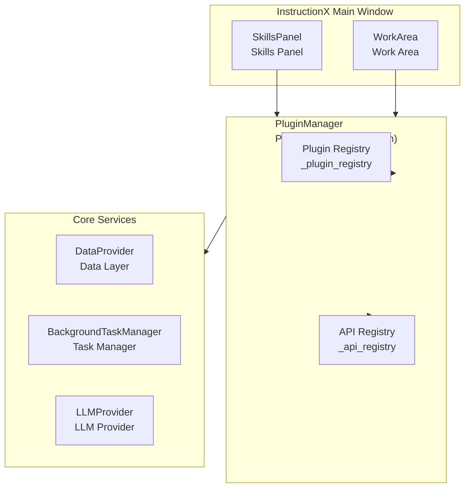

### 2.2 Plugin Lifecycle

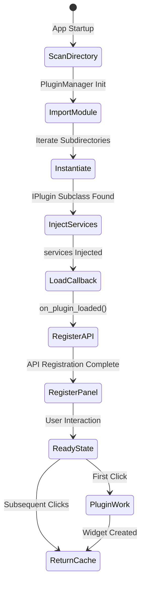

### 2.3 Directory Structure

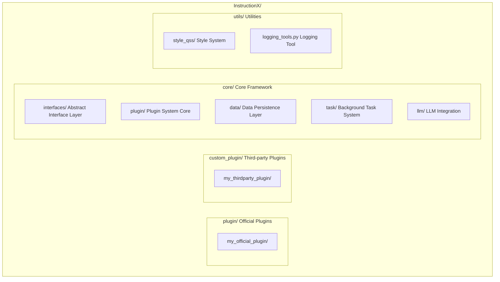

### 2.4 Hot Loading Mechanism

The plugin system supports hot loading:
- **Hot Loading**: Plugins reload automatically when code is modified
- **State Caching**: UI state is cached when switching plugins
- **Atomic Write**: Uses temp file + rename to ensure data safety

---

## 3. Plugin Directory Structure

### 3.1 File Description

| File | Required | Description |
|------|----------|-------------|
| `__init__.py` | Required | Python package marker, can be empty |
| `entrance.py` | Required | Plugin entry, defines IPlugin subclass |
| `service.py` | Optional | Plugin service logic, business code |
| `information.py` | Optional | Plugin metadata (version, icon, API definitions) |
| `assets/` | Optional | Static resource directory |
| `icons/` | Optional | Icon resource directory (under assets) |

### 3.2 Minimal Plugin Structure

```
minimal_plugin/
├── __init__.py          # Empty file
└── entrance.py          # Must contain IPlugin subclass
```

### 3.3 Complete Plugin Structure

```
complete_plugin/
├── __init__.py
├── entrance.py              # Plugin entry class
├── service.py               # Service logic class
├── information.py           # Plugin metadata
└── assets/
    └── icons/
        └── plugin_icon.png   # Plugin icon
```

### 3.4 File Responsibilities

| File | Responsibility |
|------|----------------|
| `entrance.py` | Define plugin main class, UI creation, lifecycle callbacks |
| `service.py` | Encapsulate business logic, separate from entrance.py for maintainability |
| `information.py` | Define plugin metadata, version, icon, API description |

---

## 4. entrance.py Detailed Guide

### 4.1 IPlugin Interface Overview

`entrance.py` is the plugin entry file and must define a class inheriting from `IPlugin`.

**Recommended Import Path:**
```python
from core.interfaces.i_plugin import IPlugin
```

**Backward Compatible Import:**
```python
from core.plugin.plugin_interface import IPlugin
```

### 4.2 Complete Properties and Methods

```python
from core.interfaces.i_plugin import IPlugin
from PySide6.QtWidgets import QWidget
from PySide6.QtGui import QIcon
from typing import Optional, List, Dict, Any

class MyPlugin(IPlugin):
    """My Plugin"""

    # ==================== Properties ====================

    @property
    def plugin_name(self) -> str:
        """Plugin display name (Required)"""
        return "My Plugin"

    @property
    def plugin_id(self) -> Optional[str]:
        """Plugin unique identifier (Auto-set, no need to override)"""
        return self._plugin_id

    @property
    def skill_icon(self) -> Optional[QIcon]:
        """Skill panel button icon (Optional, returns system default if not set)"""
        return None

    @property
    def skill_description(self) -> str:
        """Short description for skill panel button (Optional, defaults to plugin_name)"""
        return self.plugin_name

    @property
    def skill_tooltip(self) -> str:
        """Skill button tooltip (Optional, default format: "name\ndescription")"""
        return f"{self.plugin_name}\n{self.skill_description}"

    @property
    def plugin_info(self) -> Optional['IPluginInfo']:
        """Plugin info object (Optional, loaded from information.py by default)"""
        return self._load_plugin_info()

    @property
    def llm_tools(self) -> List[Dict[str, Any]]:
        """LLM tools exposed by plugin (Optional, returns empty list by default)"""
        return []

    # ==================== Methods ====================

    def _create_widget(self, parent=None, data_provider=None) -> QWidget:
        """Create plugin UI widget (Required)"""
        pass

    def get_widget(self, parent=None, data_provider=None) -> QWidget:
        """Get plugin UI widget (Built-in caching mechanism)"""
        pass

    def on_plugin_loaded(self, plugin_id: Optional[str] = None, **kwargs) -> None:
        """Plugin loaded callback (Optional)"""
        pass
```

### 4.3 plugin_name Property

**Function:** Set the plugin name displayed in the skills panel

**Example:**
```python
@property
def plugin_name(self) -> str:
    """Name displayed in skills panel"""
    return "Text Formatter"
```

**Multi-line name support:**
```python
@property
def plugin_name(self) -> str:
    """Multi-line name with line break"""
    return "Text\nFormatter"
```

### 4.4 _create_widget Method

**Function:** Create the plugin's Qt UI widget

**Signature:**
```python
def _create_widget(self, parent=None, data_provider=None) -> QWidget:
    """
    Create plugin UI widget

    Args:
        parent: Parent widget, passes the center widget of the work area
        data_provider: Data provider instance for data read/write and inter-plugin communication

    Returns:
        Plugin's Qt UI widget
    """
```

**Example:**
```python
from PySide6.QtWidgets import QWidget, QLabel, QVBoxLayout

def _create_widget(self, parent=None, data_provider=None) -> QWidget:
    """Create plugin UI"""
    # Create main widget
    widget = QWidget(parent)

    # Create layout
    layout = QVBoxLayout(widget)

    # Create label
    label = QLabel("Hello from MyPlugin!")
    layout.addWidget(label)

    return widget
```

### 4.5 get_widget Method (Built-in Caching)

**Function:** Get the plugin UI widget with caching to avoid recreation

**Caching Logic:**
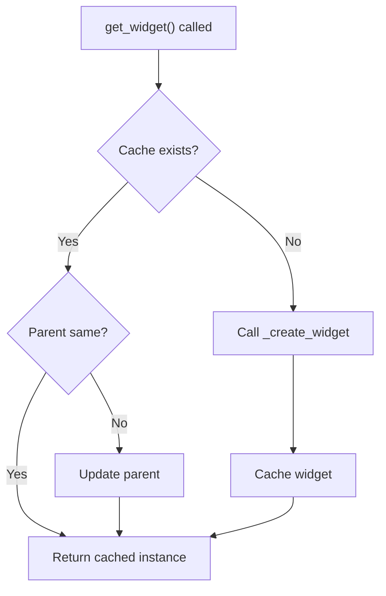

### 4.6 on_plugin_loaded Callback

**Function:** Initialization callback after plugin is loaded

**Timing:** Called after plugin is loaded by framework and `plugin_id` is set

**Typical Uses:**
- Register scheduled task factories
- Initialize background services
- Subscribe to other plugin data
- Register LLM tools

**Example:**
```python
def on_plugin_loaded(self, plugin_id: Optional[str] = None, **kwargs) -> None:
    """Plugin loaded callback"""
    # Access injected services via self._services
    if hasattr(self, '_services'):
        # Register scheduled task factory
        self._services.task_manager.register_scheduled_task_factory(
            plugin_id=self.plugin_id,
            func=self.my_scheduled_task,
            callback=self.on_task_completed
        )

        # Subscribe to other plugin data
        self._services.data_provider.subscribe(
            subscriber_id=self.plugin_id,
            target_plugin_id="other-plugin-id",
            target_key="data_key",
            callback=self.on_data_changed
        )
```

### 4.7 skill_icon Property

**Function:** Get the skills panel button icon

**Return Type:** `Optional[QIcon]`

**Default:** Returns system default file icon

**Loading Flow:**
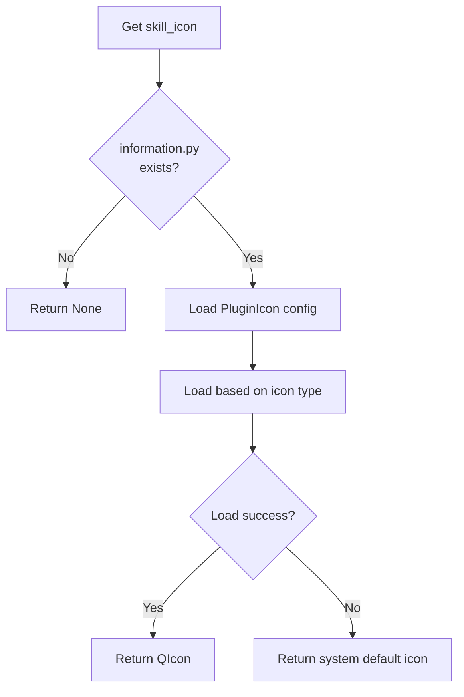

**Example (using information.py):**
```python
# In information.py
from core.plugin.plugin_icon import PluginIcon

class MyPluginInfo(IPluginInfo):
    @property
    def skill_icon(self) -> PluginIcon:
        return PluginIcon.from_file("assets/icons/plugin_icon.png")
```

### 4.8 skill_description Property

**Function:** Get the short description text for the skills panel button

**Default:** Returns `plugin_name`

**Example:**
```python
@property
def skill_description(self) -> str:
    """Short description for skills panel button"""
    return "Text formatting and conversion tools"
```

### 4.9 skill_tooltip Property

**Function:** Get the tooltip text for the skill button

**Default Format:** `"{plugin_name}\n{skill_description}"`

**Example:**
```python
@property
def skill_tooltip(self) -> str:
    """Custom tooltip"""
    return f"📝 {self.plugin_name}\n{self.skill_description}"
```

### 4.10 llm_tools Property

**Function:** Declare the list of tools exposed to LLM

**Return Type:** `List[Dict[str, Any]]`

**Format:** Must comply with OpenAI function calling specification

**Example:**
```python
@property
def llm_tools(self) -> List[Dict[str, Any]]:
    """Tools exposed to LLM"""
    return [
        {
            "type": "function",
            "function": {
                "name": "format_text",
                "description": "Format text to specified type",
                "parameters": {
                    "type": "object",
                    "properties": {
                        "text": {
                            "type": "string",
                            "description": "Text to format"
                        },
                        "format": {
                            "type": "string",
                            "enum": ["upper", "lower", "title"],
                            "description": "Format type"
                        }
                    },
                    "required": ["text", "format"]
                }
            }
        }
    ]
```

### 4.11 plugin_info Property

**Function:** Get the plugin info object

**Return Type:** `Optional['IPluginInfo']`

**Loading Mechanism:**
1. Use `_plugin_dir` to locate `information.py` first
2. Otherwise search in `sys.modules`
3. Use file mtime as cache invalidation basis
4. Automatically reload after file modification

### 4.12 Dependency Injection (services)

**Function:** Access framework-provided core services via `PluginServices`

**Injection Method:**
```python
class MyPlugin(IPlugin):
    def __init__(self, services: PluginServices | None = None):
        super().__init__()
        self._services = services  # Save service container reference
```

**Available Services:**

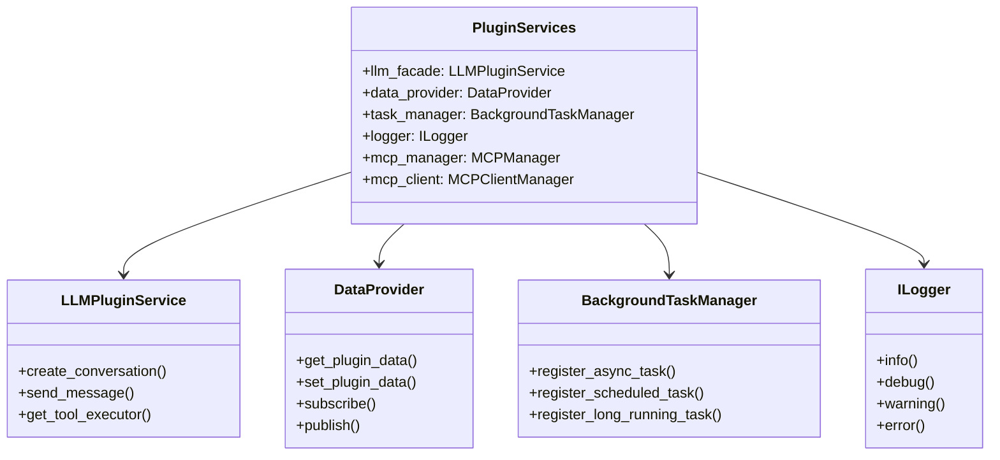

---

## 5. service.py Detailed Guide

### 5.1 Purpose

`service.py` is responsible for encapsulating plugin business logic, separating it from `entrance.py`'s UI responsibilities for better maintainability and testability.

### 5.2 Best Practices

**Non-separated Pattern (Simple Plugins):**
```python
# entrance.py
from core.interfaces.i_plugin import IPlugin

class TextFormatterPlugin(IPlugin):
    @property
    def plugin_name(self) -> str:
        return "Text Formatter"

    def _create_widget(self, parent=None, data_provider=None):
        # Business logic directly in entrance.py
        self.format_text = lambda text, mode: text.upper()
        # ... UI creation
```

**Separated Pattern (Complex Plugins, Recommended):**
```python
# service.py
class TextFormatterService:
    """Text formatting service"""

    def __init__(self, data_provider=None):
        self._data_provider = data_provider

    def format_text(self, text: str, mode: str) -> str:
        """Format text"""
        if mode == "upper":
            return text.upper()
        elif mode == "lower":
            return text.lower()
        elif mode == "title":
            return text.title()
        return text

    def save_format_preference(self, plugin_id: str, mode: str):
        """Save user preference"""
        if self._data_provider:
            self._data_provider.set_plugin_data(
                plugin_id, "preferred_mode", mode
            )
```

```python
# entrance.py
from core.interfaces.i_plugin import IPlugin
from .service import TextFormatterService

class TextFormatterPlugin(IPlugin):
    def __init__(self, services=None):
        super().__init__()
        self._service = TextFormatterService(
            data_provider=services.data_provider if services else None
        )

    def _create_widget(self, parent=None, data_provider=None):
        # Use service for business logic
        formatted = self._service.format_text("hello", "upper")
        # ... UI creation
```

### 5.3 Data Access Pattern

```python
# service.py
class MyService:
    def __init__(self, data_provider):
        self._dp = data_provider

    def save_data(self, plugin_id: str, key: str, value: any):
        """Save data to PRIVATE namespace"""
        self._dp.set_plugin_data(plugin_id, key, value)

    def load_data(self, plugin_id: str, key: str, default=None):
        """Load data from PRIVATE namespace"""
        return self._dp.get_plugin_data(plugin_id, key, default=default)

    def share_data(self, plugin_id: str, key: str, value: any):
        """Publish data to PUBLIC namespace"""
        self._dp.set_plugin_data(
            plugin_id, key, value,
            namespace=DataNamespace.PUBLIC
        )
```

### 5.4 API Method Definition Pattern

```python
# service.py
class MyService:
    """Service class defining plugin's exposed API"""

    def my_api_method(self, param1: str, param2: int) -> dict:
        """
        API method

        Args:
            param1: Description of param1
            param2: Description of param2

        Returns:
            Return value description
        """
        return {"result": f"{param1}_{param2}"}

    def another_method(self) -> bool:
        """Another API method"""
        return True
```

---

## 6. information.py Detailed Guide

### 6.1 IPluginInfo Interface Overview

`information.py` defines plugin metadata and must contain a class inheriting from `IPluginInfo`.

**Recommended Import Path:**
```python
from core.interfaces.i_plugin_info import IPluginInfo
```

**Backward Compatible Import:**
```python
from core.plugin.plugin_info_interface import IPluginInfo
```

### 6.2 Required Properties

```python
from core.interfaces.i_plugin_info import IPluginInfo
from core.plugin.plugin_version import PluginVersion, VersionType
from core.plugin.plugin_icon import PluginIcon

class MyPluginInfo(IPluginInfo):
    """Plugin metadata"""

    @property
    def version(self) -> PluginVersion:
        """Plugin version"""
        return PluginVersion.from_string("release.1.0.0")

    @property
    def developer(self) -> str:
        """Developer name"""
        return "Developer Name"

    @property
    def developer_email(self) -> str:
        """Developer email"""
        return "developer@example.com"

    @property
    def developer_website(self) -> str:
        """Developer website"""
        return "https://example.com"

    @property
    def is_free(self) -> bool:
        """Whether plugin is free"""
        return True

    @property
    def description(self) -> str:
        """Detailed plugin description"""
        return "A powerful text formatting plugin"

    @property
    def service_api(self) -> Dict[str, Any]:
        """Service API documentation"""
        return {}

    @property
    def skill_icon(self) -> PluginIcon:
        """Plugin icon"""
        return PluginIcon.from_file("assets/icons/plugin_icon.png")

    @property
    def skill_description(self) -> str:
        """Short description for UI display"""
        return "Text formatting and conversion tools"

    @property
    def plugin_type_id(self) -> str:
        """Plugin type identifier (lowercase letters, numbers, hyphens)"""
        return "text-formatter"
```

### 6.3 Optional Properties

```python
@property
def dependencies(self) -> Optional[Dict[str, str]]:
    """Plugin dependencies"""
    return {
        "some_package": ">=1.0.0"
    }

@property
def tags(self) -> Optional[list[str]]:
    """Plugin tags"""
    return ["text processing", "formatting", "utility"]
```

### 6.4 PluginVersion Version Number

**Version Format:** `<version_type>.<major>.<minor>.<patch>`

**Version Types:**
| Type | Description | Priority |
|------|-------------|----------|
| `release` | Release version | 5 (Highest) |
| `pre-release` | Pre-release version | 4 |
| `beta` | Beta version | 3 |
| `alpha` | Alpha version | 2 |
| `internal` | Internal version | 1 (Lowest) |

**Usage Example:**
```python
from core.plugin.plugin_version import PluginVersion, VersionType

# Method 1: Using from_string
version = PluginVersion.from_string("release.1.2.3")

# Method 2: Direct construction
version = PluginVersion(
    version_type=VersionType.RELEASE,
    major=1,
    minor=2,
    patch=3
)

# Display version
print(version.get_display_version())  # "Release 1.2.3"
```

### 6.5 PluginIcon Icon

**Icon Types:**

| Type | Description | value Example |
|------|-------------|--------------|
| `BUILTIN` | System built-in icon | `"SP_FileIcon"` |
| `FILE` | Icon file path | `"assets/icons/icon.png"` |
| `RESOURCE` | Qt resource path | `":/icons/icon.png"` |
| `BASE64` | Base64 encoded | `"iVBORw0KG..."` |
| `NONE` | No icon | No value needed |

**Usage Example:**
```python
from core.plugin.plugin_icon import PluginIcon, IconType

# Built-in system icon
icon = PluginIcon.builtin("SP_FileIcon")

# File icon (relative to plugin directory)
icon = PluginIcon.from_file("assets/icons/plugin_icon.png")

# Qt resource icon
icon = PluginIcon.from_resource(":/icons/icon.png")

# Base64 icon
icon = PluginIcon.from_base64("iVBORw0KG...")

# No icon (use default)
icon = PluginIcon.none()
```

### 6.6 service_api Complete Format

**Function:** Define API methods exposed to MCP/LLM

**Complete Format Example:**
```python
@property
def service_api(self) -> Dict[str, Any]:
    """Service API documentation"""
    return {
        "format_text": {
            "description": "Format text to specified type",
            "parameters": {
                "type": "object",
                "properties": {
                    "text": {
                        "type": "string",
                        "description": "Text to format"
                    },
                    "format_type": {
                        "type": "string",
                        "enum": ["upper", "lower", "title", "capitalize"],
                        "description": "Format type"
                    },
                    "options": {
                        "type": "object",
                        "description": "Optional parameters",
                        "properties": {
                            "strip_whitespace": {
                                "type": "boolean",
                                "description": "Whether to strip whitespace"
                            }
                        }
                    }
                },
                "required": ["text", "format_type"]
            },
            "returns": {
                "type": "string",
                "description": "Formatted text"
            },
            "errors": {
                "INVALID_FORMAT": "Unsupported format type",
                "EMPTY_TEXT": "Text cannot be empty"
            }
        },
        "batch_format": {
            "description": "Batch format multiple texts",
            "parameters": {
                "type": "object",
                "properties": {
                    "texts": {
                        "type": "array",
                        "items": {"type": "string"},
                        "description": "List of texts"
                    },
                    "format_type": {
                        "type": "string",
                        "enum": ["upper", "lower", "title"]
                    }
                },
                "required": ["texts", "format_type"]
            },
            "returns": {
                "type": "array",
                "items": {"type": "string"},
                "description": "List of formatted texts"
            }
        }
    }
```

---

## 7. Core Services Guide

### 7.1 DataProvider

**Function:** Data persistence, caching, plugin management, pub/sub communication, and resource management

**Access Methods:**
```python
# Method 1: Via services (Recommended)
data_provider = self._services.data_provider

# Method 2: Direct singleton access
from core.data import DataProvider
data_provider = DataProvider()
```

#### 7.1.1 Data Namespaces

| Namespace | Description | Access Control |
|-----------|-------------|---------------|
| `PRIVATE` | For internal plugin use only | Only the creating plugin can access |
| `PUBLIC` | Allows other plugins to access | All plugins can read, subscribers can sense changes |

#### 7.1.2 Basic Data Operations

```python
from core.interfaces.i_data_provider import DataNamespace

# Save private data (only visible within plugin)
data_provider.set_plugin_data(
    plugin_id,
    key="user_preference",
    value={"theme": "dark", "language": "en-US"},
    namespace=DataNamespace.PRIVATE
)

# Read private data
value = data_provider.get_plugin_data(
    plugin_id,
    key="user_preference",
    namespace=DataNamespace.PRIVATE,
    default={"theme": "light"}  # Default value
)

# Save public data (visible to other plugins)
data_provider.set_plugin_data(
    plugin_id,
    key="shared_status",
    value="processing",
    namespace=DataNamespace.PUBLIC
)

# Read public data
value = data_provider.get_plugin_data(
    plugin_id,
    key="shared_status",
    namespace=DataNamespace.PUBLIC
)

# Get all plugin data
all_data = data_provider.get_all_plugin_data(
    plugin_id,
    namespace=DataNamespace.PRIVATE
)
```

#### 7.1.3 Pub/Sub Mechanism

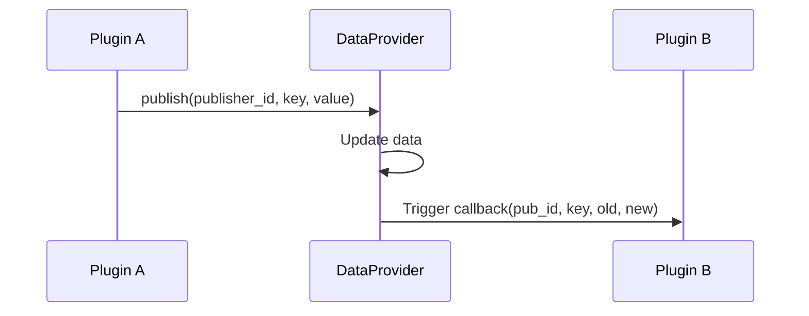

**Code Example:**
```python
def on_status_changed(plugin_id: str, key: str, old_value: Any, new_value: Any):
    """Data change callback function"""
    print(f"Plugin {plugin_id}'s {key} changed from {old_value} to {new_value}")

# Subscribe to another plugin's PUBLIC data
data_provider.subscribe(
    subscriber_id="my-plugin-id",          # Current plugin ID
    target_plugin_id="target-plugin-id",   # Target plugin ID
    target_key="shared_status",            # Data key to subscribe to
    callback=on_status_changed             # Callback function
)

# Unsubscribe (specific target plugin)
data_provider.unsubscribe(
    subscriber_id="my-plugin-id",
    target_plugin_id="target-plugin-id"
)

# Unsubscribe all
data_provider.unsubscribe(
    subscriber_id="my-plugin-id",
    target_plugin_id=None  # None means unsubscribe all
)

# Publish data update
data_provider.publish(
    publisher_id="my-plugin-id",
    key="shared_status",
    value="completed",
    namespace=DataNamespace.PUBLIC
)
```

#### 7.1.4 Resource File Management

```python
# Save resource file
relative_path = data_provider.save_asset(
    plugin_id="my-plugin-id",
    filename="thumbnail.png",
    content=b"image binary data"
)
# Returns: "assets/plugins/my-plugin-id/thumbnail.png"

# Get resource absolute path
absolute_path = data_provider.get_asset_path(relative_path)

# Load resource file
content = data_provider.load_asset(relative_path)

# Get plugin's asset directory
assets_dir = data_provider.get_plugin_assets_dir(plugin_id)
```

#### 7.1.5 Atomic Write Mechanism

DataProvider uses temp file + atomic rename to ensure data writes don't corrupt on crash:

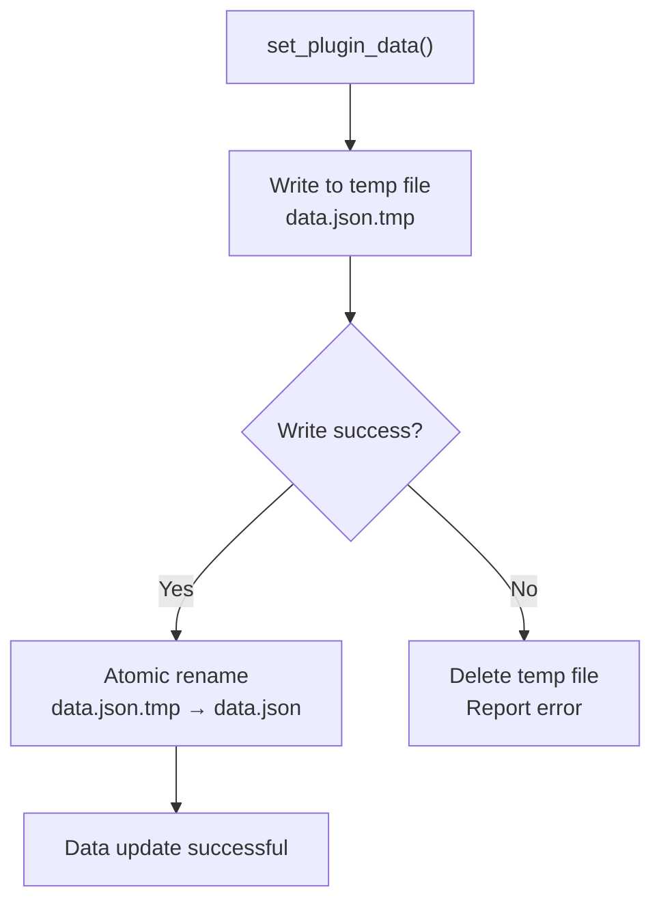

### 7.2 BackgroundTaskManager

**Function:** Manage and schedule background tasks, supporting sync, async, scheduled, and long-running tasks

**Access Methods:**
```python
# Method 1: Via services (Recommended)
task_manager = self._services.task_manager

# Method 2: Direct singleton access
from core.task import BackgroundTaskManager
task_manager = BackgroundTaskManager()
```

#### 7.2.1 Task Types

| Type | Description | Use Case |
|------|-------------|----------|
| `SYNC` | Sync task, executes immediately in main thread | Lightweight operations |
| `ASYNC` | Async task, executes in thread pool | Avoid blocking UI |
| `SCHEDULED` | Scheduled task, repeats at fixed interval | Timed reminders, data sync |
| `LONG_RUNNING` | Long-running task, continues until stopped | Monitoring services, data collection |

#### 7.2.2 Async Task

```python
def my_task(arg1, arg2):
    """Async task function"""
    return f"Result: {arg1} + {arg2}"

def task_callback(task_id, status, result, error):
    """Task completion callback"""
    print(f"Task {task_id}: {status}, Result: {result}")

# Register async task
task_id = task_manager.register_async_task(
    plugin_id=self.plugin_id,
    name="my_async_task",
    func=my_task,
    callback=task_callback,
    args=(1, 2),
    kwargs=None
)
```

#### 7.2.3 Scheduled Task

```python
def scheduled_task():
    """Scheduled task function"""
    print("Scheduled task executing")

# Register scheduled task (every 60 seconds)
task_id = task_manager.register_scheduled_task(
    plugin_id=self.plugin_id,
    name="my_scheduled_task",
    func=scheduled_task,
    interval=60,  # Interval in seconds
    callback=task_callback
)
```

#### 7.2.4 Scheduled Task Factory (Supports Restart Recovery)

```python
def create_scheduled_task():
    """Scheduled task factory function"""
    return {
        "func": my_periodic_task,
        "callback": on_task_done
    }

# Register factory in on_plugin_loaded
def on_plugin_loaded(self, plugin_id=None, **kwargs):
    task_manager = self._services.task_manager
    task_manager.register_scheduled_task_factory(
        plugin_id=self.plugin_id,
        func=my_periodic_task,
        callback=on_task_done
    )
```

#### 7.2.5 Long-Running Task

```python
def long_running_task():
    """Long-running task function (will continue running)"""
    while True:
        # Execute task logic
        print("Task running...")
        import time
        time.sleep(5)

def stop_callback():
    """Stop callback for graceful shutdown"""
    print("Task received stop signal")

# Register long-running task
task_id = task_manager.register_long_running_task(
    plugin_id=self.plugin_id,
    name="my_long_running_task",
    func=long_running_task,
    callback=task_callback,
    stop_callback=stop_callback,
    auto_restart=True  # Auto restart on failure
)
```

#### 7.2.6 Long-Running Task Factory

```python
# Register factory in on_plugin_loaded
def on_plugin_loaded(self, plugin_id=None, **kwargs):
    task_manager = self._services.task_manager
    task_manager.register_long_running_task_factory(
        plugin_id=self.plugin_id,
        func=self.run_background_job,
        callback=self.on_job_done,
        stop_callback=self.on_job_stop,
        status_callback=self.on_status_update,
        restore_callback=self.on_job_restored
    )
```

#### 7.2.7 Task Control

```python
# Cancel task
task_manager.cancel_task(task_id)

# Stop long-running task
task_manager.stop_long_running_task(task_id, delete_from_storage=True)

# Enable/disable scheduled task
task_manager.enable_scheduled_task(task_id)
task_manager.disable_scheduled_task(task_id)

# Query task
task = task_manager.get_task(task_id)
status = task_manager.get_task_status(task_id)
tasks = task_manager.get_tasks_by_plugin(plugin_id)
```

### 7.3 LLM Integration

**Function:** Conversation management, tool calling, multimodal support

**Access Methods:**
```python
# Method 1: Via services (Recommended)
llm_service = self._services.llm_facade

# Method 2: Direct singleton access
from core.llm import get_llm_plugin_service
llm_service = get_llm_plugin_service()
```

#### 7.3.1 Conversation Management

```python
# Create conversation
conv_id = llm_service.create_conversation(
    system_prompt="You are a professional code assistant",
    provider="siliconflow",
    model="default"
)

# Send message (sync)
response = llm_service.send_message(conv_id, "Explain what a closure is")

# Send message (streaming)
def on_chunk(chunk):
    print(chunk.content, end="", flush=True)

response = llm_service.stream_send_message(
    conv_id,
    "Write a quicksort algorithm",
    callback=on_chunk
)

# Get conversation
conversation = llm_service.get_conversation(conv_id)

# List all conversations
conversations = llm_service.list_conversations()

# Delete conversation
llm_service.delete_conversation(conv_id)
```

#### 7.3.2 Direct Chat (Stateless)

```python
response = llm_service.chat([
    {"role": "system", "content": "You are an assistant"},
    {"role": "user", "content": "Hello"}
])
print(response.content)
```

#### 7.3.3 Tool Calling

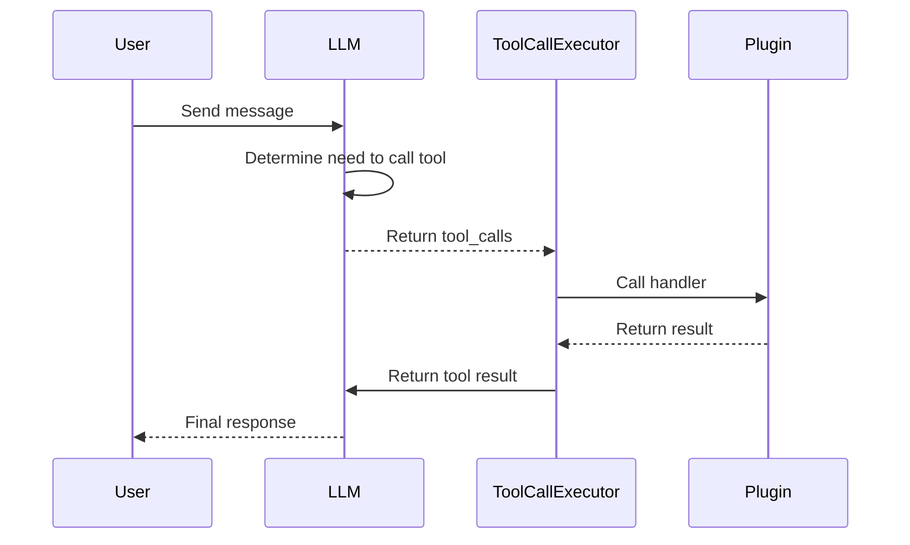

**Code Example:**
```python
# Define tool handler function
def calculate(expression: str) -> str:
    """Execute mathematical calculation"""
    return str(eval(expression))

# Get tool executor and register tool
executor = llm_service.get_tool_executor()
executor.tools.register(
    name="calculate",
    description="Execute mathematical expression",
    parameters={
        "type": "object",
        "properties": {
            "expression": {
                "type": "string",
                "description": "Mathematical expression, e.g., 2+3*4"
            }
        },
        "required": ["expression"]
    },
    handler=calculate
)

# Chat with tool calling
messages = [{"role": "user", "content": "Calculate (2+3)*4"}]
msgs, results, final = executor.chat_with_tools(
    messages,
    max_turns=5
)

# Process results
for r in results:
    print(f"Tool: {r.tool_name}, Result: {r.result}, Duration: {r.duration_ms}ms")
```

#### 7.3.4 Multimodal Support

```python
# Image understanding
b64_image = llm_service.load_image_as_base64("/path/to/image.jpg")
llm_service.send_message(conv_id, "Describe this image", images=[b64_image])

# Image generation
result = llm_service.generate_image(
    prompt="A cute orange cat",
    provider="siliconflow",
    size="1024x1024",
    quality="standard"
)
print(f"Image URL: {result.url}")

# Text-to-speech
audio_result = llm_service.text_to_speech(
    text="Hello, world!",
    provider="siliconflow",
    voice="alloy"
)
print(f"Audio duration: {audio_result.duration_seconds} seconds")
```

### 7.4 Logger

**Function:** Record logs to file and console

**Access Methods:**
```python
# Via services
logger = self._services.logger

# Direct singleton access
from utils.logging_tools import LoggerManager, get_name
logger = LoggerManager()
```

**Log Levels:**
```python
# Log different levels
logger.debug(get_name(), "Debug info")      # DEBUG level
logger.info(get_name(), "General info")     # INFO level
logger.warning(get_name(), "Warning info")  # WARNING level
logger.error(get_name(), "Error info")      # ERROR level
logger.critical(get_name(), "Critical error")  # CRITICAL level
```

**Format:** `[timestamp][module][level][message]`

---

## 8. UI Development Guide

### 8.1 Qt Widget Creation

**Recommended Imports:**
```python
from PySide6.QtWidgets import (
    QWidget, QLabel, QPushButton, QTextEdit, QLineEdit,
    QComboBox, QCheckBox, QRadioButton, QSlider, QSpinBox,
    QProgressBar, QGroupBox, QFrame, QTabWidget, QScrollArea,
    QVBoxLayout, QHBoxLayout, QGridLayout
)
from PySide6.QtCore import Qt, Signal, Slot
from PySide6.QtGui import QIcon, QFont
```

### 8.2 Layout Management

**Vertical Layout:**
```python
from PySide6.QtWidgets import QWidget, QVBoxLayout, QLabel, QPushButton

widget = QWidget(parent)
layout = QVBoxLayout(widget)

layout.addWidget(QLabel("Title"))
layout.addWidget(QPushButton("Button"))
layout.addStretch()  # Add elastic space
```

**Horizontal Layout:**
```python
layout = QHBoxLayout()
layout.addWidget(label1)
layout.addWidget(label2)
layout.addStretch()
```

**Grid Layout:**
```python
layout = QGridLayout()
layout.addWidget(QLabel("Name:"), 0, 0)
layout.addWidget(name_input, 0, 1)
layout.addWidget(QLabel("Email:"), 1, 0)
layout.addWidget(email_input, 1, 1)
```

**Nested Layouts:**
```python
main_layout = QVBoxLayout(widget)

# Top: horizontal layout
top_layout = QHBoxLayout()
top_layout.addWidget(left_panel)
top_layout.addWidget(right_panel)
main_layout.addLayout(top_layout)

# Bottom: button bar
bottom_layout = QHBoxLayout()
bottom_layout.addStretch()
bottom_layout.addWidget(cancel_btn)
bottom_layout.addWidget(ok_btn)
main_layout.addLayout(bottom_layout)
```

### 8.3 Signal and Slot Connections

**Basic Connection:**
```python
button.clicked.connect(self.on_button_clicked)

def on_button_clicked(self):
    print("Button clicked")
```

**Connection with Parameters:**
```python
# Using lambda
button.clicked.connect(lambda: self.handle_click("param"))

# Using functools.partial
from functools import partial
button.clicked.connect(partial(self.handle_click, "param"))

def handle_click(self, param):
    print(f"Handle click: {param}")
```

**Custom Signals:**
```python
from PySide6.QtCore import QObject, Signal

class MyWidget(QWidget):
    # Define signal
    data_changed = Signal(str, int)  # Parameter type declaration

    def __init__(self, parent=None):
        super().__init__(parent)
        self.button.clicked.connect(self.emit_signal)

    def emit_signal(self):
        self.data_changed.emit("test", 42)

    # Connect signal
    widget.data_changed.connect(self.on_data_changed)

    def on_data_changed(self, text, number):
        print(f"Received: {text}, {number}")
```

### 8.4 Common Widget Examples

**QLabel - Label:**
```python
label = QLabel("Normal text")
label.setAlignment(Qt.AlignCenter)  # Center alignment
label.setStyleSheet("color: #333; font-size: 14px;")
```

**QPushButton - Button:**
```python
button = QPushButton("Click me")
button.setProperty("class", "primary")  # Use StyleQSS button class
button.setEnabled(False)  # Disable button
```

**QLineEdit - Single-line Input:**
```python
line_edit = QLineEdit()
line_edit.setPlaceholderText("Please enter...")
line_edit.setMaxLength(100)
text = line_edit.text()
```

**QTextEdit - Multi-line Text:**
```python
text_edit = QTextEdit()
text_edit.setPlaceholderText("Please enter text...")
text_edit.setReadOnly(False)
text = text_edit.toPlainText()
```

**QComboBox - Dropdown:**
```python
combo = QComboBox()
combo.addItem("Option 1", userData=1)  # Second param is data
combo.addItem("Option 2", userData=2)
combo.addItems(["Option 3", "Option 4", "Option 5"])
index = combo.currentIndex()
data = combo.currentData()
```

**QCheckBox - Checkbox:**
```python
checkbox = QCheckBox("Agree to terms")
checkbox.setChecked(True)
is_checked = checkbox.isChecked()
```

**QSlider - Slider:**
```python
slider = QSlider(Qt.Horizontal)
slider.setMinimum(0)
slider.setMaximum(100)
slider.setValue(50)
slider.valueChanged.connect(self.on_value_changed)
```

**QSpinBox - Number Selection:**
```python
spinbox = QSpinBox()
spinbox.setMinimum(0)
spinbox.setMaximum(100)
spinbox.setValue(50)
spinbox.setSuffix(" %")  # Suffix
```

### 8.5 Complete Example

```python
from PySide6.QtWidgets import (
    QWidget, QVBoxLayout, QHBoxLayout, QLabel,
    QPushButton, QLineEdit, QTextEdit, QComboBox
)
from PySide6.QtCore import Qt

class TextFormatterWidget(QWidget):
    """Text formatter plugin UI"""

    def __init__(self, parent=None, data_provider=None):
        super().__init__(parent)
        self._data_provider = data_provider
        self._init_ui()

    def _init_ui(self):
        """Initialize UI"""
        # Main layout
        main_layout = QVBoxLayout(self)

        # Input area
        input_layout = QHBoxLayout()
        input_layout.addWidget(QLabel("Input text:"))
        self._input_edit = QLineEdit()
        self._input_edit.setPlaceholderText("Enter text to format")
        input_layout.addWidget(self._input_edit)
        main_layout.addLayout(input_layout)

        # Format selection
        format_layout = QHBoxLayout()
        format_layout.addWidget(QLabel("Format type:"))
        self._format_combo = QComboBox()
        self._format_combo.addItems(["Uppercase", "Lowercase", "Title Case"])
        format_layout.addWidget(self._format_combo)
        format_layout.addStretch()
        main_layout.addLayout(format_layout)

        # Output area
        main_layout.addWidget(QLabel("Output:"))
        self._output_edit = QTextEdit()
        self._output_edit.setReadOnly(True)
        self._output_edit.setMaximumHeight(150)
        main_layout.addWidget(self._output_edit)

        # Button area
        button_layout = QHBoxLayout()
        self._format_btn = QPushButton("Format")
        self._format_btn.setProperty("class", "primary")
        self._format_btn.clicked.connect(self._on_format)
        self._clear_btn = QPushButton("Clear")
        self._clear_btn.clicked.connect(self._on_clear)
        button_layout.addStretch()
        button_layout.addWidget(self._clear_btn)
        button_layout.addWidget(self._format_btn)
        main_layout.addLayout(button_layout)

    def _on_format(self):
        """Execute formatting"""
        text = self._input_edit.text()
        if not text:
            return

        format_type = self._format_combo.currentIndex()
        if format_type == 0:  # Uppercase
            result = text.upper()
        elif format_type == 1:  # Lowercase
            result = text.lower()
        else:  # Title case
            result = text.title()

        self._output_edit.setPlainText(result)

    def _on_clear(self):
        """Clear input and output"""
        self._input_edit.clear()
        self._output_edit.clear()
```

---

## 9. StyleQSS Theme System

### 9.1 Overview

StyleQSS is InstructionX's UI theme module, providing modern desktop visual experience for PySide6.

**Core Features:**
- Light/dark theme support
- System theme auto-detection
- Modular QSS style files
- Runtime variable replacement
- 30+ QSS style files

### 9.2 Theme Switching

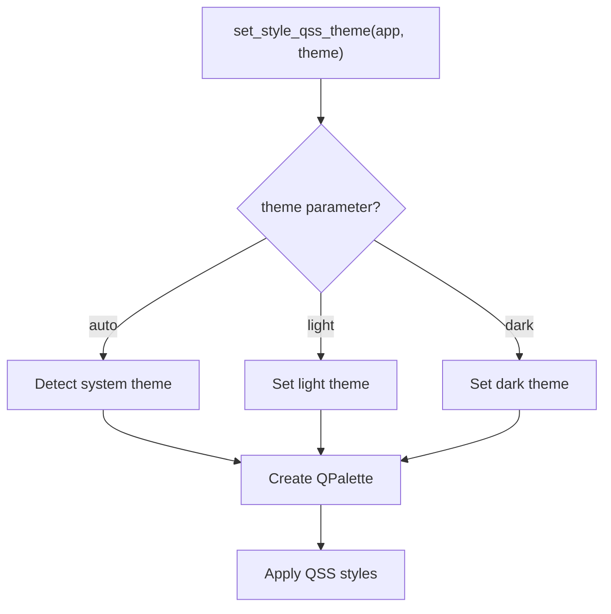

**Code Example:**
```python
from utils.style_qss import set_style_qss_theme

# Auto-detect system theme
set_style_qss_theme(app, "auto")

# Force light theme
set_style_qss_theme(app, "light")

# Force dark theme
set_style_qss_theme(app, "dark")
```

### 9.3 Color Variables

| Variable | Light Theme | Dark Theme | Description |
|----------|-------------|------------|-------------|
| `window` | `#FFFFFF` | `#202020` | Window background |
| `button` | `#F3F3F3` | `#2C2C2C` | Button background |
| `highlight` | `#0078D4` | `#0078D4` | Highlight color |
| `accent` | `#0078D4` | `#0078D4` | Accent color |
| `textPrimary` | `#000000` | `#FFFFFF` | Primary text |
| `textSecondary` | `#666666` | `#999999` | Secondary text |
| `border` | `#898989` | `#646464` | Border color |
| `controlFill` | `rgba(0,0,0,7)` | `rgba(255,255,255,7)` | Control fill |

### 9.4 Button Style Classes

Use button style classes in plugins:

```python
# Primary button (blue)
button = QPushButton("Primary Action")
button.setProperty("class", "primary")

# Danger button (red)
button = QPushButton("Delete")
button.setProperty("class", "danger")

# Success button (green)
button = QPushButton("Success")
button.setProperty("class", "success")

# Outline button
button = QPushButton("Outline")
button.setProperty("class", "outline")

# Subtle button
button = QPushButton("Subtle")
button.setProperty("class", "subtle")

# Accent save button
button = QPushButton("Save")
button.setProperty("class", "accentSave")

# Warning button (orange)
button = QPushButton("Warning")
button.setProperty("class", "warning")
```

### 9.5 Using Styles in Plugins

```python
# entrance.py
from PySide6.QtWidgets import QWidget, QPushButton, QVBoxLayout

class MyPluginWidget(QWidget):
    def __init__(self, parent=None):
        super().__init__(parent)
        self._init_ui()

    def _init_ui(self):
        layout = QVBoxLayout(self)

        # Create buttons with different styles
        btn1 = QPushButton("Primary Button")
        btn1.setProperty("class", "primary")

        btn2 = QPushButton("Danger Button")
        btn2.setProperty("class", "danger")

        btn3 = QPushButton("Success Button")
        btn3.setProperty("class", "success")

        layout.addWidget(btn1)
        layout.addWidget(btn2)
        layout.addWidget(btn3)
```

### 9.6 Border Radius Variables

| Variable | Value | Description |
|----------|-------|-------------|
| `radius` | `3px` | Default radius |
| `radiusLarge` | `6px` | Large radius |
| `radiusSmall` | `2px` | Small radius |

---

## 10. Cross-Plugin Communication

### 10.1 API Registration and Discovery

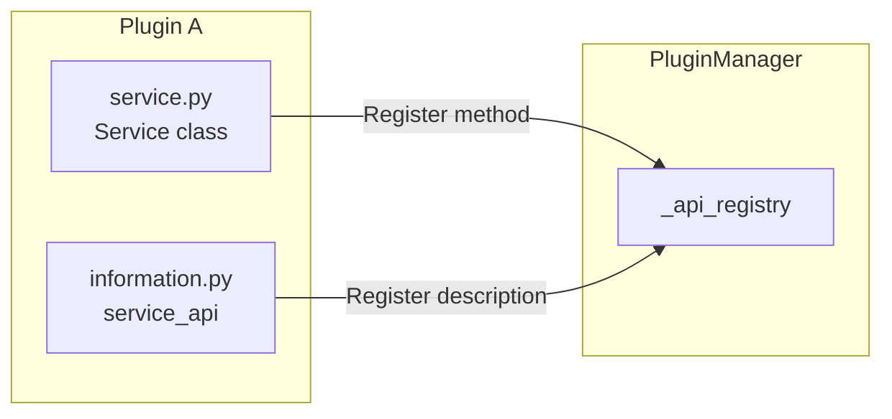

**Code Example:**
```python
# Plugin A defines API in service.py
class PluginAService:
    def my_api_method(self, param: str) -> str:
        return f"Processed: {param}"

# Plugin A registers API in entrance.py
class PluginA(IPlugin):
    def on_plugin_loaded(self, plugin_id=None, **kwargs):
        # Get manager
        from core.plugin.manager import get_plugin_manager
        pm = get_plugin_manager()

        # Register API
        api = pm.PluginAPI(
            plugin_id=self.plugin_id,
            plugin_name=self.plugin_name,
            plugin_type="plugin-a"
        )
        api.api_methods["my_api_method"] = self._service.my_api_method
        api.api_descriptions["my_api_method"] = {
            "description": "My API method",
            "parameters": {"param": "String parameter"}
        }

        pm._api_registry[self.plugin_id] = api
```

### 10.2 Calling Other Plugin APIs

```python
# Plugin B calls plugin A's API
class PluginB(IPlugin):
    def call_plugin_a_api(self):
        from core.plugin.manager import get_plugin_manager
        pm = get_plugin_manager()

        # Get plugin A's API
        api = pm._api_registry.get("plugin-a-id")
        if api and "my_api_method" in api.api_methods:
            result = api.api_methods["my_api_method"]("test")
```

### 10.3 Sharing Data via PUBLIC Namespace

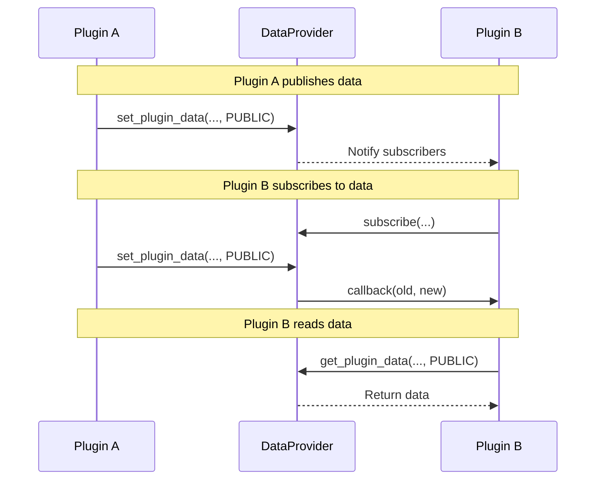

**Code Example:**
```python
# Plugin A publishes data
data_provider.set_plugin_data(
    plugin_id="plugin-a-id",
    key="shared_data",
    value={"status": "ready", "progress": 50},
    namespace=DataNamespace.PUBLIC
)

# Plugin B subscribes to data changes
def on_shared_data_changed(plugin_id, key, old_value, new_value):
    print(f"Plugin A's shared data updated: {new_value}")

data_provider.subscribe(
    subscriber_id="plugin-b-id",
    target_plugin_id="plugin-a-id",
    target_key="shared_data",
    callback=on_shared_data_changed
)

# Plugin B reads data
data = data_provider.get_plugin_data(
    plugin_id="plugin-a-id",
    key="shared_data",
    namespace=DataNamespace.PUBLIC
)
```

---

## 11. MCP Protocol Integration

### 11.1 Overview

MCP (Model Context Protocol) is the protocol InstructionX uses to expose plugin functionality to AI. Through MCP, AI can directly call plugin functions.

### 11.2 How Plugins Become MCP Tools

Define `service_api` in `information.py`, and the framework automatically converts it to MCP tools:

```python
# information.py
class MyPluginInfo(IPluginInfo):
    @property
    def service_api(self) -> Dict[str, Any]:
        return {
            "format_text": {
                "description": "Format text",
                "parameters": {
                    "type": "object",
                    "properties": {
                        "text": {"type": "string"},
                        "format": {"type": "string", "enum": ["upper", "lower"]}
                    },
                    "required": ["text", "format"]
                },
                "returns": {"type": "string"}
            }
        }
```

### 11.3 Tool Name Format

MCP tool name format: `{plugin_type_id}_{method_name}`

Example: `text-formatter_format_text`

### 11.4 MCP Bridge Mechanism

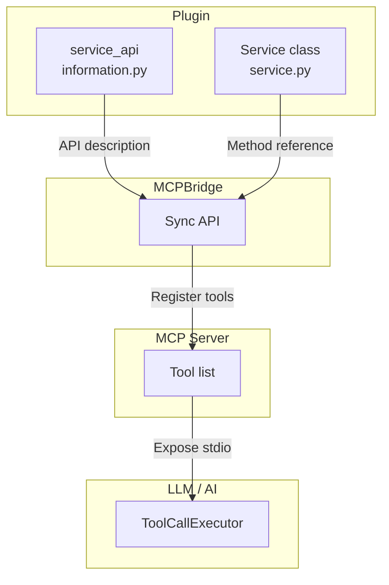

Framework auto-sync:
1. Plugin registers → API registers to MCPBridge
2. MCPBridge → Sync to MCP Server
3. MCP Server → Expose as stdio tools
4. AI calls → ToolCallExecutor processes

---

## 12. Plugin Publishing and Installation

### 12.1 Single Plugin Descriptor (IXPlugin.json)

```json
{
    "id": "text-formatter",
    "name": "Text Formatter Tool",
    "version": "release.1.0.0",
    "main": "entrance.py",
    "description": "Provides text formatting and conversion",
    "author": "Developer Name",
    "author_email": "developer@example.com",
    "homepage": "https://github.com/developer/text-formatter",
    "keywords": ["text", "formatting", "utility"],
    "dependencies": {
        "requests": ">=2.28.0"
    }
}
```

**Required Fields:**
- `id`: Plugin unique identifier (lowercase letters, numbers, hyphens)
- `name`: Plugin display name
- `version`: Version number (format: `<type>.<major>.<minor>.<patch>`)
- `main`: Entry filename (usually `entrance.py`)

### 12.2 Multi-Plugin Repo Descriptor (IXRepo.json)

```json
{
    "name": "My Plugin Collection",
    "description": "Contains multiple utility plugins",
    "plugins": [
        {
            "id": "plugin-a",
            "name": "Plugin A",
            "path": "plugin-a/"
        },
        {
            "id": "plugin-b",
            "name": "Plugin B",
            "path": "plugin-b/"
        }
    ]
}
```

### 12.3 Installation Directory Rules

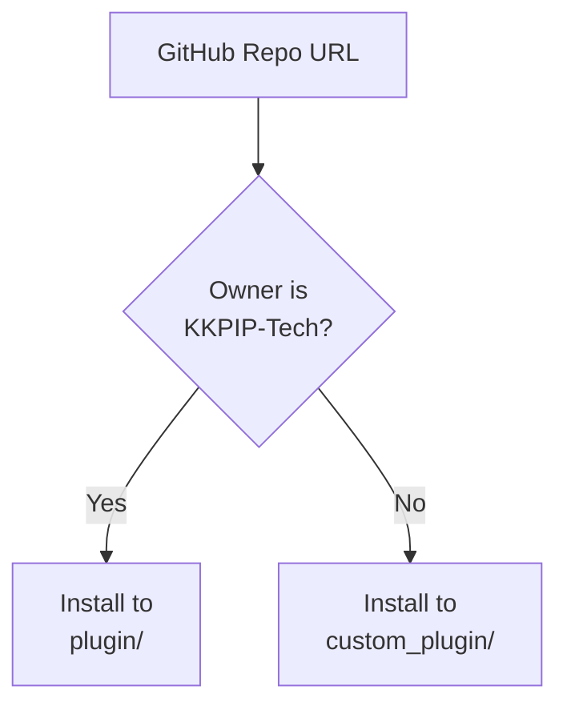

| Organization | Directory | Description |
|--------------|----------|-------------|
| KKPIP-Tech | `plugin/` | Official plugin directory |
| Others | `custom_plugin/` | Third-party plugin directory |

### 12.4 Installing from GitHub

```python
# Using GitHubPluginInstaller
from core.plugin.github_plugin_installer import GitHubPluginInstaller

installer = GitHubPluginInstaller()

# Inspect repository
result = installer.inspect_repository("https://github.com/developer/my-plugin")
# result.repo_type: "single" | "multi" | "invalid"

# Install plugins
install_results = installer.install_from_url(
    github_url="https://github.com/developer/my-plugin",
    selected_plugins=None  # None means install all
)
```

---

## 13. Debugging Tips

### 13.1 Log Debugging

```python
# Using log in plugin
from utils.logging_tools import LoggerManager, get_name

logger = LoggerManager()

def my_method(self):
    logger.info(get_name(), "Method started")
    try:
        # Business logic
        result = do_something()
        logger.debug(get_name(), f"Result: {result}")
        return result
    except Exception as e:
        logger.error(get_name(), f"Error: {e}")
        raise
```

**Log file location:** `logs/application.log`

### 13.2 Testing API Calls

```python
# Test DataProvider in Python script
from core.data import DataProvider, DataNamespace

provider = DataProvider()
provider.register_plugin("test-plugin", "TestPlugin")

# Test data storage
provider.set_plugin_data("test-plugin", "test_key", "test_value")
value = provider.get_plugin_data("test-plugin", "test_key")
print(f"Read value: {value}")

# Test pub/sub
def callback(pid, key, old, new):
    print(f"Change: {old} -> {new}")

provider.subscribe("test-plugin-2", "test-plugin", "test_key", callback)
provider.set_plugin_data("test-plugin", "test_key", "new_value", DataNamespace.PUBLIC)
```

### 13.3 Widget Debugging

```python
def _create_widget(self, parent=None, data_provider=None):
    widget = QWidget(parent)

    # Print widget info
    print(f"Widget created: {widget}")
    print(f"Widget size: {widget.size()}")
    print(f"Widget children: {widget.children()}")

    return widget
```

### 13.4 Common Errors and Solutions

| Error | Cause | Solution |
|-------|-------|----------|
| `No IPlugin subclass found` | No IPlugin subclass defined in entrance.py | Ensure inheritance from IPlugin and implementation of required properties/methods |
| `No entrance.py found` | Plugin directory missing entrance.py | Create entrance.py in plugin root directory |
| `Plugin not found` | Trying to access unregistered plugin | Call `register_plugin()` first |
| `Data file corrupted` | JSON parsing failed | Check data/data.json format correctness |
| `Icon not found` | Icon file path error | Check assets/icons/ directory and paths |

---

## 14. Complete Examples

### 14.1 Minimal Plugin

```python
# minimal_plugin/entrance.py
from core.interfaces.i_plugin import IPlugin
from PySide6.QtWidgets import QWidget, QLabel, QVBoxLayout

class MinimalPlugin(IPlugin):
    """Minimal plugin example"""

    @property
    def plugin_name(self) -> str:
        return "Minimal Plugin"

    def _create_widget(self, parent=None, data_provider=None) -> QWidget:
        widget = QWidget(parent)
        layout = QVBoxLayout(widget)
        layout.addWidget(QLabel("This is a minimal plugin!"))
        return widget
```

### 14.2 Text Formatter Plugin

```python
# text_formatter/entrance.py
from core.interfaces.i_plugin import IPlugin
from core.interfaces.plugin_services import PluginServices
from PySide6.QtWidgets import (
    QWidget, QVBoxLayout, QHBoxLayout, QLabel,
    QLineEdit, QComboBox, QPushButton, QTextEdit
)
from typing import Optional

class TextFormatterPlugin(IPlugin):
    """Text formatter plugin"""

    def __init__(self, services: PluginServices | None = None):
        super().__init__()
        self._services = services
        self._current_result = ""

    @property
    def plugin_name(self) -> str:
        return "Text Formatter"

    @property
    def skill_description(self) -> str:
        return "Text case conversion and formatting tools"

    def _create_widget(self, parent=None, data_provider=None) -> QWidget:
        widget = QWidget(parent)
        layout = QVBoxLayout(widget)

        # Input area
        input_layout = QHBoxLayout()
        input_layout.addWidget(QLabel("Input:"))
        self._input = QLineEdit()
        self._input.setPlaceholderText("Enter text")
        input_layout.addWidget(self._input)
        layout.addLayout(input_layout)

        # Format selection
        format_layout = QHBoxLayout()
        format_layout.addWidget(QLabel("Format:"))
        self._format_combo = QComboBox()
        self._format_combo.addItems(["Uppercase", "Lowercase", "Title Case", "Reverse"])
        format_layout.addWidget(self._format_combo)
        format_layout.addStretch()
        layout.addLayout(format_layout)

        # Execute button
        self._execute_btn = QPushButton("Format")
        self._execute_btn.setProperty("class", "primary")
        self._execute_btn.clicked.connect(self._on_format)
        layout.addWidget(self._execute_btn)

        # Output area
        layout.addWidget(QLabel("Output:"))
        self._output = QTextEdit()
        self._output.setReadOnly(True)
        self._output.setMaximumHeight(100)
        layout.addWidget(self._output)

        return widget

    def _on_format(self):
        """Execute formatting"""
        text = self._input.text()
        if not text:
            self._output.setPlainText("Please enter text")
            return

        format_type = self._format_combo.currentIndex()
        if format_type == 0:
            result = text.upper()
        elif format_type == 1:
            result = text.lower()
        elif format_type == 2:
            result = text.title()
        else:
            result = text[::-1]

        self._current_result = result
        self._output.setPlainText(result)

        # Save to data provider
        if self._services and self.plugin_id:
            self._services.data_provider.set_plugin_data(
                self.plugin_id,
                "last_result",
                result
            )

    def on_plugin_loaded(self, plugin_id: Optional[str] = None, **kwargs):
        """Plugin loaded callback"""
        pass
```

### 14.3 Plugin with DataProvider

```python
# data_plugin/entrance.py
from core.interfaces.i_plugin import IPlugin
from core.interfaces.plugin_services import PluginServices
from core.interfaces.i_data_provider import DataNamespace
from PySide6.QtWidgets import (
    QWidget, QVBoxLayout, QLabel, QPushButton, QTextEdit
)
from typing import Optional

class DataPlugin(IPlugin):
    """Demonstrates DataProvider"""

    def __init__(self, services: PluginServices | None = None):
        super().__init__()
        self._services = services

    @property
    def plugin_name(self) -> str:
        return "Data Management"

    def _create_widget(self, parent=None, data_provider=None) -> QWidget:
        widget = QWidget(parent)
        layout = QVBoxLayout(widget)

        # Status display
        self._status_label = QLabel("Status: Not saved")
        layout.addWidget(self._status_label)

        # Text input
        self._text_edit = QTextEdit()
        self._text_edit.setPlaceholderText("Enter content here...")
        layout.addWidget(self._text_edit)

        # Buttons
        btn_layout = QVBoxLayout()

        save_btn = QPushButton("Save to PRIVATE")
        save_btn.setProperty("class", "primary")
        save_btn.clicked.connect(self._save_private)
        btn_layout.addWidget(save_btn)

        share_btn = QPushButton("Publish to PUBLIC")
        share_btn.setProperty("class", "success")
        share_btn.clicked.connect(self._share_public)
        btn_layout.addWidget(share_btn)

        load_btn = QPushButton("Load last data")
        load_btn.clicked.connect(self._load_data)
        btn_layout.addWidget(load_btn)

        layout.addLayout(btn_layout)

        return widget

    def _save_private(self):
        """Save to PRIVATE namespace"""
        if not self._services or not self.plugin_id:
            return

        text = self._text_edit.toPlainText()
        self._services.data_provider.set_plugin_data(
            self.plugin_id,
            "my_data",
            text,
            namespace=DataNamespace.PRIVATE
        )
        self._status_label.setText("Status: Saved to PRIVATE")

    def _share_public(self):
        """Publish to PUBLIC namespace"""
        if not self._services or not self.plugin_id:
            return

        text = self._text_edit.toPlainText()
        self._services.data_provider.publish(
            self.plugin_id,
            "shared_data",
            text
        )
        self._status_label.setText("Status: Published to PUBLIC")

    def _load_data(self):
        """Load last saved data"""
        if not self._services or not self.plugin_id:
            return

        text = self._services.data_provider.get_plugin_data(
            self.plugin_id,
            "my_data",
            namespace=DataNamespace.PRIVATE,
            default=""
        )
        self._text_edit.setPlainText(text)
        self._status_label.setText("Status: Loaded")

    def on_plugin_loaded(self, plugin_id: Optional[str] = None, **kwargs):
        """Subscribe to other plugin data"""
        if not self._services:
            return

        # Subscribe to shared_data changes
        def on_data_changed(pub_id, key, old, new):
            self._status_label.setText(f"Received update: {key} = {new}")
```

### 14.4 Plugin with BackgroundTaskManager

```python
# task_plugin/entrance.py
from core.interfaces.i_plugin import IPlugin
from core.interfaces.plugin_services import PluginServices
from PySide6.QtWidgets import (
    QWidget, QVBoxLayout, QLabel, QPushButton, QProgressBar, QTextEdit
)
from typing import Optional

class TaskPlugin(IPlugin):
    """Demonstrates BackgroundTaskManager"""

    def __init__(self, services: PluginServices | None = None):
        super().__init__()
        self._services = services
        self._task_id = None

    @property
    def plugin_name(self) -> str:
        return "Background Task"

    def _create_widget(self, parent=None, data_provider=None) -> QWidget:
        widget = QWidget(parent)
        layout = QVBoxLayout(widget)

        # Status display
        self._status_label = QLabel("Status: Idle")
        layout.addWidget(self._status_label)

        # Progress bar
        self._progress = QProgressBar()
        self._progress.setValue(0)
        layout.addWidget(self._progress)

        # Log output
        self._log = QTextEdit()
        self._log.setReadOnly(True)
        self._log.setMaximumHeight(150)
        layout.addWidget(self._log)

        # Buttons
        btn_layout = QVBoxLayout()

        start_btn = QPushButton("Start Task")
        start_btn.setProperty("class", "primary")
        start_btn.clicked.connect(self._start_task)
        btn_layout.addWidget(start_btn)

        stop_btn = QPushButton("Stop Task")
        stop_btn.setProperty("class", "danger")
        stop_btn.clicked.connect(self._stop_task)
        btn_layout.addWidget(stop_btn)

        layout.addLayout(btn_layout)

        return widget

    def _long_running_operation(self):
        """Simulate long-running operation"""
        import time
        for i in range(100):
            time.sleep(0.1)
            if self._services and self._task_id:
                self._services.task_manager.update_long_running_task_status(
                    self._task_id,
                    f"Progress: {i+1}%"
                )

    def _on_task_callback(self, task_id, status, result, error):
        """Task callback"""
        self._status_label.setText(f"Task completed: {status}")
        self._log.append(f"Task {task_id} completed")

    def _start_task(self):
        """Start task"""
        if not self._services:
            return

        self._task_id = self._services.task_manager.register_long_running_task(
            plugin_id=self.plugin_id,
            name="my_long_task",
            func=self._long_running_operation,
            callback=self._on_task_callback,
            auto_restart=False
        )
        self._status_label.setText(f"Task started: {self._task_id}")
        self._log.append(f"Started task: {self._task_id}")

    def _stop_task(self):
        """Stop task"""
        if not self._services or not self._task_id:
            return

        self._services.task_manager.stop_long_running_task(self._task_id)
        self._status_label.setText("Task stopped")
        self._log.append(f"Stopped task: {self._task_id}")

    def on_plugin_loaded(self, plugin_id: Optional[str] = None, **kwargs):
        """Register task factory for restart recovery"""
        if not self._services:
            return

        self._services.task_manager.register_long_running_task_factory(
            plugin_id=self.plugin_id,
            func=self._long_running_operation,
            callback=self._on_task_callback,
            auto_restart=False
        )
```

### 14.5 Plugin with LLM Integration

```python
# llm_plugin/entrance.py
from core.interfaces.i_plugin import IPlugin
from core.interfaces.plugin_services import PluginServices
from PySide6.QtWidgets import (
    QWidget, QVBoxLayout, QLabel, QPushButton, QTextEdit, QLineEdit
)
from typing import Optional

class LLMPlugin(IPlugin):
    """Demonstrates LLM integration"""

    def __init__(self, services: PluginServices | None = None):
        super().__init__()
        self._services = services
        self._conv_id = None

    @property
    def plugin_name(self) -> str:
        return "LLM Chat"

    def _create_widget(self, parent=None, data_provider=None) -> QWidget:
        widget = QWidget(parent)
        layout = QVBoxLayout(widget)

        # Conversation ID
        layout.addWidget(QLabel("Session ID:"))
        self._conv_label = QLabel("Not created")
        layout.addWidget(self._conv_label)

        # Input field
        self._input = QLineEdit()
        self._input.setPlaceholderText("Enter message...")
        layout.addWidget(self._input)

        # Send button
        send_btn = QPushButton("Send")
        send_btn.setProperty("class", "primary")
        send_btn.clicked.connect(self._on_send)
        layout.addWidget(send_btn)

        # New session button
        new_btn = QPushButton("New Session")
        new_btn.clicked.connect(self._on_new_conversation)
        layout.addWidget(new_btn)

        # Output area
        layout.addWidget(QLabel("AI Response:"))
        self._output = QTextEdit()
        self._output.setReadOnly(True)
        layout.addWidget(self._output)

        return widget

    def _on_new_conversation(self):
        """Create new conversation"""
        if not self._services:
            return

        self._conv_id = self._services.llm_facade.create_conversation(
            system_prompt="You are a friendly assistant, answer concisely.",
            provider="siliconflow"
        )
        self._conv_label.setText(self._conv_id[:8] + "...")
        self._output.setPlainText("New session created")

    def _on_send(self):
        """Send message"""
        if not self._services or not self._conv_id:
            self._output.setPlainText("Please create a session first")
            return

        message = self._input.text()
        if not message:
            return

        self._input.clear()
        self._output.setPlainText("AI thinking...")

        try:
            response = self._services.llm_facade.send_message(
                self._conv_id,
                message
            )
            self._output.setPlainText(response)
        except Exception as e:
            self._output.setPlainText(f"Error: {e}")

    def on_plugin_loaded(self, plugin_id: Optional[str] = None, **kwargs):
        """Auto-create session when plugin loads"""
        if self._services:
            self._conv_id = self._services.llm_facade.create_conversation(
                system_prompt="You are a friendly assistant.",
                provider="siliconflow"
            )
```

---

## 15. Best Practices

### 15.1 Code Organization

**Recommended project structure:**
```
my_plugin/
├── __init__.py              # Empty file
├── entrance.py              # Plugin entry, UI creation
├── service.py               # Business logic
├── information.py           # Metadata
└── assets/
    ├── icons/               # Icon resources
    └── data/                # Static data files
```

**Separation Principle:**
- `entrance.py`: UI creation, lifecycle callbacks
- `service.py`: Business logic, data processing
- `information.py`: Metadata definitions

### 15.2 Error Handling

```python
def my_method(self):
    """Method with complete error handling"""
    try:
        result = risky_operation()
        return result
    except ValueError as e:
        # Handle expected errors
        self._logger.warning(get_name(), f"Business error: {e}")
        return None
    except Exception as e:
        # Handle unknown errors
        self._logger.error(get_name(), f"Unknown error: {e}")
        raise  # Re-throw for upper layer handling
    finally:
        # Cleanup
        self._cleanup()
```

### 15.3 Performance Considerations

1. **Avoid recreating widgets**: Use `get_widget()`'s caching mechanism
2. **Use background tasks for long operations:**
```python
# Avoid executing time-consuming operations in UI thread
self._services.task_manager.register_async_task(
    plugin_id=self.plugin_id,
    name="heavy_task",
    func=self._do_heavy_work
)
```
3. **Reduce unnecessary data subscriptions:**
```python
# Only subscribe to needed data changes
data_provider.subscribe(
    subscriber_id=self.plugin_id,
    target_plugin_id="specific-plugin",
    target_key="relevant-key",
    callback=self.on_change
)
```

### 15.4 Security Notes

1. **Don't hardcode sensitive information in plugins**
2. **Use framework-provided secure storage mechanisms**
3. **Validate user input:**
```python
def process_input(self, user_input: str):
    if not user_input:
        raise ValueError("Input cannot be empty")
    if len(user_input) > 1000:
        raise ValueError("Input too long")
```

### 15.5 Plugin ID and Type ID

**plugin_id vs plugin_type_id:**
- `plugin_id`: Unique identifier for plugin instance (UUID), different for each instance
- `plugin_type_id`: Plugin type identifier (lowercase letters, numbers, hyphens), shared by same type plugins

```python
@property
def plugin_type_id(self) -> str:
    """Plugin type identifier, same value for same type plugins"""
    return "text-formatter"  # All text formatter plugins use this
```

---

## 16. FAQ

### Q1: How to create my first plugin?

1. Create plugin folder in `custom_plugin/`
2. Create empty `__init__.py`
3. Create `entrance.py` with class inheriting from `IPlugin`
4. Implement `plugin_name` property and `_create_widget` method
5. Restart app, plugin will load automatically

### Q2: How to troubleshoot when plugin doesn't load?

1. Check if `entrance.py` exists and syntax is correct
2. Ensure class inherits from `IPlugin`
3. Check log file `logs/application.log`
4. Confirm plugin directory has `__init__.py`

### Q3: How to let AI call my plugin functions?

Define `service_api` in `information.py`, framework will automatically expose it as MCP tools.

### Q4: How to implement cross-plugin communication?

Use `DataProvider`'s `PUBLIC` namespace and pub/sub mechanism.

### Q5: Will scheduled tasks recover after app restart?

Need to use **task factory** mechanism:
```python
def on_plugin_loaded(self, plugin_id=None, **kwargs):
    self._services.task_manager.register_scheduled_task_factory(
        plugin_id=self.plugin_id,
        func=self.my_task_func,
        callback=self.on_task_done
    )
```

### Q6: How to handle plugin dependencies?

Define in `information.py`:
```python
@property
def dependencies(self) -> Optional[Dict[str, str]]:
    return {"requests": ">=2.28.0"}
```

### Q7: How to publish plugin to GitHub?

1. Create GitHub repo
2. Add `IXPlugin.json` (single plugin) or `IXRepo.json` (multi-plugin)
3. Install via GitHub URL in app

### Q8: StyleQSS styles not working?

1. Ensure correct button class property: `button.setProperty("class", "primary")`
2. Check if theme is set correctly
3. Styles need to be re-polished after setting property

### Q9: How to get plugin's unique identifier?

```python
def on_plugin_loaded(self, plugin_id=None, **kwargs):
    actual_id = self.plugin_id  # Access via property
    # plugin_id parameter also passed
```

### Q10: What to do if data persistence fails?

```python
try:
    data_provider.set_plugin_data(plugin_id, key, value)
except DataProviderError as e:
    logger.error(get_name(), f"Save failed: {e}")
    # Can retry or prompt user
```

---

## Appendix

### A. Key File Path Reference

| File | Path | Description |
|------|------|-------------|
| IPlugin interface | `core/interfaces/i_plugin.py` | Plugin main interface |
| IPluginInfo interface | `core/interfaces/i_plugin_info.py` | Metadata interface |
| PluginServices | `core/interfaces/plugin_services.py` | Service container |
| DataProvider | `core/data/data_provider.py` | Data layer |
| BackgroundTaskManager | `core/task/background_task.py` | Task management |
| LLMPluginService | `core/llm/plugin_service.py` | LLM service |
| StyleQSS | `utils/style_qss/__init__.py` | Style system |

### B. Import Cheat Sheet

```python
# Plugin interfaces
from core.interfaces.i_plugin import IPlugin
from core.interfaces.i_plugin_info import IPluginInfo

# Service container
from core.interfaces.plugin_services import PluginServices

# Data layer
from core.interfaces.i_data_provider import DataProvider, DataNamespace

# Task management
from core.interfaces.i_task_manager import BackgroundTaskManager, TaskType, TaskStatus

# LLM
from core.llm import get_llm_plugin_service

# Utilities
from utils.logging_tools import LoggerManager, get_name
from utils.style_qss import set_style_qss_theme

# Version and icon
from core.plugin.plugin_version import PluginVersion, VersionType
from core.plugin.plugin_icon import PluginIcon
```

### C. Plugin Checklist

#### Required Items (Basic requirements for plugin to load and run)

- [ ] `__init__.py` exists in plugin root directory
- [ ] `entrance.py` file exists
- [ ] `entrance.py` defines a class inheriting from `IPlugin`
- [ ] `plugin_name` property implemented and returns non-empty string
- [ ] `_create_widget` method implemented and returns `QWidget` instance
- [ ] Returned widget has correct parent set

#### Recommended Items (Improve plugin quality and user experience)

- [ ] Plugin directory structure complete with `__init__.py`
- [ ] `information.py` exists and correctly defines `IPluginInfo` subclass
- [ ] `information.py` `version` property returns correct `PluginVersion`
- [ ] `information.py` `developer` property filled in
- [ ] `information.py` `plugin_type_id` defined (lowercase letters, numbers, hyphens)
- [ ] `information.py` `skill_description` defined (displayed in skills panel)
- [ ] `information.py` `skill_icon` correctly defined
- [ ] `service.py` exists and `Service` class methods use type annotations
- [ ] `service.py` defines API methods callable externally
- [ ] If using `services`, correctly received and saved in `__init__`
- [ ] If using DataProvider, correctly initialized in `_create_widget` or `on_plugin_loaded`

#### Optional Items (Advanced features, implement when needed)

- [ ] `on_plugin_loaded` implemented for initialization logic
- [ ] `on_plugin_loaded` registers scheduled task factory (if using scheduled tasks)
- [ ] `on_plugin_loaded` registers long-running task factory (if using long-running tasks)
- [ ] Uses `DataProvider`'s `PUBLIC` namespace for cross-plugin communication
- [ ] Uses `subscribe` to subscribe to other plugin data changes
- [ ] `information.py` correctly defines `service_api` for MCP/LLM tool exposure
- [ ] `service_api` each method's `parameters` comply with OpenAI format
- [ ] `service_api` each method's `required` array matches parameters
- [ ] `information.py` defines `dependencies` (if Python dependencies exist)
- [ ] `information.py` defines `tags` (for plugin classification)
- [ ] Uses StyleQSS button classes (`primary`, `danger`, `success`, etc.)
- [ ] Properly handles exceptions with `try/except` to avoid crashes
- [ ] Uses Logger to record key operations and errors

#### Publishing Checklist (Must meet before publishing to GitHub)

- [ ] `IXPlugin.json` file exists and format is correct
- [ ] `IXPlugin.json` `id` is lowercase letters, numbers, hyphens
- [ ] `IXPlugin.json` `version` format is correct (e.g., `release.1.0.0`)
- [ ] `IXPlugin.json` `main` points to correct entry file
- [ ] All resource file paths are correct (icon correctly referenced)
- [ ] Plugin code has no syntax errors
- [ ] Tested loading and basic functionality locally

---

*This guide was automatically generated by Claude Code based on InstructionX source code*
*Corresponding version: InstructionX CE 1.0*
*Last updated: 2026/04/11*
