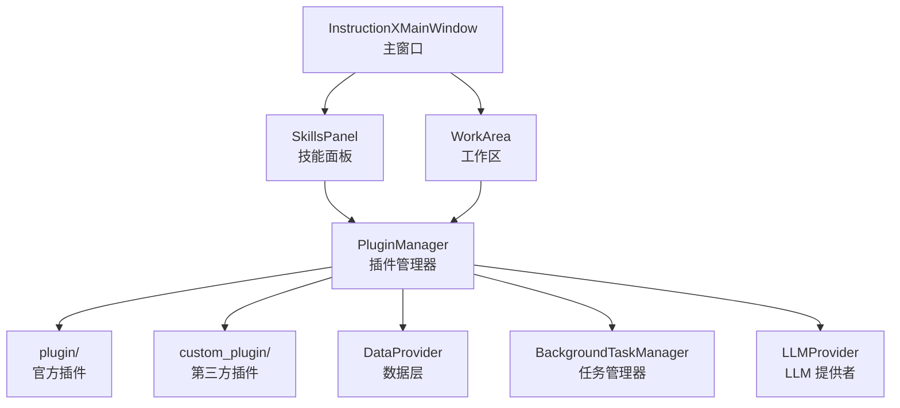

<div align="center">


[English Version](README_EN.md) | 中文版

[](https://www.python.org/)
[](https://doc.qt.io/qtforpython/)
[](#)
[](LICENSE)
[](#)

<p>基于 PySide6 的插件式桌面应用框架，支持 LLM 集成、MCP 协议（Server/Client）、多会话管理与热插拔插件系统</p>

</div>


---

## 简介

InstructionX 是一个功能强大的**插件集成框架**，允许你根据实际使用需求，将各种实用工具整合到一个统一的桌面应用中。无论你是开发者、设计师还是普通用户，都可以根据自己的工作流程，创建属于你自己的**一站式工具集（Tools Cluster）**。

通过 InstructionX，你可以：
- 自由组合所需的工具插件
- 与多个 LLM 提供商进行智能对话
- 使用 MCP Function Calling 让 AI 调用插件功能
- 快速切换不同的工作场景
- 保存和同步你的工具配置
- 开发自定义插件满足特殊需求

---

## 核心特性

### 🔌 插件热插拔

插件系统支持**热加载**和**热卸载**，无需重启应用即可添加、移除或更新插件。你可以在运行时动态管理插件，构建个性化的工具集合。

### 📦 GitHub 插件安装

内置 GitHub 插件安装器，支持从任意 GitHub URL 安装插件：

- **URL 安装**：输入 GitHub 仓库 URL 即可安装
- **单/多插件支持**：支持单插件仓库（IXPlugin.json）和多插件仓库（IXRepo.json）
- **后台安装**：安装过程在后台执行，有进度显示
- **自动分类**：KKPIP-Tech 组织下的插件自动归类为官方插件

### 🤖 LLM 集成与对话管理

内置多厂商 LLM 对接能力，通过 `LLMPluginService` 提供完整的对话管理和工具调用自动化：

- **多 Provider 支持**：MiniMax、SiliconFlow、智谱 GLM、Ollama 等
- **对话管理**：多会话创建、切换、历史自动管理、上下文自动截断
- **ToolCallExecutor**：自动处理工具调用两轮循环，插件只需注册工具
- **多模态支持**：图片理解（Vision）、图片生成、TTS 语音合成
- **用量统计**：按对话和全局统计 Token 消耗、费用估算
- **Embedding**：向量嵌入支持
- **模型缓存**：启动时自动拉取模型列表并缓存到本地

### 🔗 MCP 协议支持

通过官方 MCP SDK 实现完整的 Model Context Protocol 支持：

- **MCP Server**：将所有插件 API 自动暴露为 MCP 工具，支持 stdio 和 HTTP 传输
- **MCP Client**：连接外部 MCP Server，将它们的工具注册到本地 ToolRegistry
- **双向桥接**：MCPBridge 自动同步插件 API 注册到 MCP Server
- **外部调用**：Claude Code 等 MCP Client 可直接调用 InstructionX 插件功能

### 💾 灵活的数据层

**DataProvider** 提供健壮的数据持久化能力：
- **原子写入**：使用临时文件 + 重命名机制，确保数据写入不会因意外中断而损坏
- **双命名空间**：PRIVATE 空间仅插件内部可用，PUBLIC 空间支持跨插件访问
- **发布/订阅**：插件可以订阅数据变化，实现响应式交互
- **内存缓存**：减少频繁磁盘 I/O，提升性能

### ⚙️ 后台任务系统

**BackgroundTaskManager** 支持多种任务类型：
- **同步任务**：在主线程立即执行，适用于轻量操作
- **异步任务**：在线程池中执行（4 个工作线程），避免阻塞 UI
- **定时任务**：支持固定间隔重复执行，适用于定时提醒、数据同步等场景
- **长期任务**：支持持续运行、优雅停止和自动重启
- **任务持久化**：任务状态在应用重启后依然保留
- **任务工厂**：支持任务恢复机制，重启后自动重建任务

### 📊 用量查询面板

内置 LLM 使用量统计和可视化面板：

- **统计卡片**：多维度数据卡片（Token 消耗、费用、请求次数等）
- **趋势图表**：按时间维度展示 LLM 使用量变化
- **过滤查询**：按 Provider、Model、对话 ID 过滤记录
- **分页表格**：详细用量记录表格

### 🔗 跨插件通信

插件之间可以互相调用 API，实现功能协作：
- **API 注册与发现**：插件可以向管理器注册自己的 API
- **跨插件调用**：一个插件可以调用另一个插件的功能
- **数据共享**：通过 PUBLIC 命名空间共享数据

### 🎨 StyleQSS 主题系统

内置完整的 StyleQSS 样式系统，提供现代化界面外观：
- **手动切换**：支持 light/dark/auto 三种主题模式，可通过菜单或快捷键切换
- **自动主题检测**：根据操作系统设置自动切换深色/浅色模式
- **30+ 控件样式**：覆盖按钮、输入框、菜单、对话框等常用 Qt 控件
- **9+ 按钮变体**：primary、danger、success、outline、subtle 等
- **动态加载**：通过样式注册表动态加载和应用 QSS 样式

### 🅰️ 多字体支持

内置 FontMap 字体映射系统：

- **5 字体家族**：阿里巴巴普惠体 3.0、阿里妈妈方圆体、阿里妈妈东方大楷、ZenDots、得意黑
- **22 字体文件**：涵盖标准字重、意大利体等
- **状态机查询**：FontMap.get_path() 避免硬编码路径

### 💾 UI 状态缓存

切换插件时，插件的 UI 状态会被自动缓存。当你返回之前使用的插件时，界面状态会完整保留，提供流畅的使用体验。

---

## 快速开始

### 环境要求

- Python 3.14 或更高版本
- Windows 10/11

### 安装依赖

```bash
pip install -r requirements.txt
```

主要依赖：
- `PySide6` (>=6.10) - Qt GUI 框架
- `requests` - HTTP 请求
- `aiohttp` - 异步 HTTP 客户端
- `opencv-python` - 图像处理
- `numpy` - 数值计算

### 运行应用

```bash
python main.py
```

---

## 插件生态

InstructionX 是一个**插件框架**，本身不内置插件。用户可以通过以下方式获取插件：

- **GitHub 安装**：通过内置的 GitHub 插件安装器，输入插件仓库 URL 即可一键安装
- **第三方开发者**：从其他开发者处获取插件，复制到 `custom_plugin/` 目录

### 安装插件

```bash
# 通过 GitHub URL 安装插件
# 菜单路径：编辑 → 安装 GitHub 插件
```

### 开发插件

如果你希望开发自己的插件，请参考 [插件开发](docs/core/plugin-system/plugin-development.md) 文档。

---

## 架构概览

### 核心组件

InstructionX 采用**单例模式**设计核心组件，确保全局唯一性：



### 核心模块

| 模块 | 路径 | 说明 |
|------|------|------|
| core/interfaces | `core/interfaces/` | 抽象接口层（IPlugin、IDataProvider 等） |
| core/plugin | `core/plugin/` | 插件系统核心 |
| core/data | `core/data/` | 数据持久化层 |
| core/task | `core/task/` | 后台任务系统 |
| core/llm | `core/llm/` | LLM 提供者框架 |
| ui | `ui/` | 用户界面组件 |
| utils | `utils/` | 工具类（日志、主题） |
| utils/style_qss | `utils/style_qss/` | StyleQSS 样式系统 |
| plugin | `plugin/` | 官方插件目录 |
| custom_plugin | `custom_plugin/` | 自定义插件目录 |
| workers | `workers/` | 工作线程（预留扩展） |
| docs | `docs/` | 技术文档 |
| core/mcp | `core/mcp/` | MCP 协议核心（Server/Client/Bridge） |
| core/llm/plugin_service | `core/llm/plugin_service.py` | LLM 插件服务层（对话管理、工具调用） |
| core/llm/types | `core/llm/types.py` | LLM 数据类型（Conversation、UsageStats 等） |
| core/plugin/github_plugin_installer | `core/plugin/github_plugin_installer.py` | GitHub 插件安装器 |
| ui/usage_panel | `ui/usage_panel.py` | 用量查询面板 |
| utils/font_map | `utils/font_map.py` | 字体映射系统 |

### 详细文档

- [系统架构概述](docs/architecture/overview.md)
- [模块依赖关系](docs/architecture/module-dependencies.md)
- [插件系统详解](docs/core/plugin-system/overview.md)
- [DataProvider 概述](docs/core/data-provider/overview.md)
- [后台任务概述](docs/core/background-task/overview.md)
- [LLM 提供者概述](docs/core/llm-provider/overview.md)
- [StyleQSS 样式系统](docs/utils/style-qss.md)

---

## 插件开发

### 插件结构

每个插件可以包含以下文件：

```
my_plugin/
├── entrance.py      # 必需：插件入口，定义 IPlugin 子类
├── service.py       # 可选：插件服务逻辑
├── information.py   # 可选：插件元信息（版本、图标、API 定义等）
└── assets/          # 可选：静态资源目录
```

### 简单示例

```python
from core import IPlugin
from PySide6.QtWidgets import QWidget, QLabel, QVBoxLayout

class MyPlugin(IPlugin):
    @property
    def plugin_name(self) -> str:
        """显示在技能面板的名称"""
        return "我的\n插件"

    @property
    def skill_description(self) -> str:
        return "这是一个示例插件"

    def _create_widget(self, parent=None, data_provider=None):
        """创建插件界面"""
        widget = QWidget(parent)
        layout = QVBoxLayout(widget)
        layout.addWidget(QLabel("Hello from MyPlugin!"))
        return widget
```

### MCP Function Calling 集成

在 `information.py` 中定义 `service_api`，框架会自动将其转换为 LLM 可调用的工具：

```python
from core.interfaces import IPluginInfo  # 推荐导入路径

class MyPluginInfo(IPluginInfo):
    @property
    def service_api(self) -> dict:
        return {
            "my_method": {
                "description": "方法描述",
                "parameters": {
                    "param1": {
                        "type": "string",
                        "description": "参数说明",
                        "required": True
                    }
                },
                "returns": {
                    "type": "string",
                    "description": "返回值说明"
                }
            }
        }
```

### 开发文档

- [插件开发指南](docs/core/plugin-system/plugin-development.md)
- [IPlugin 接口详解](docs/core/plugin-system/iplugin.md)
- [PluginManager API](docs/core/plugin-system/plugin-manager.md)

---

## 配置文件

| 配置文件 | 路径 | 用途 |
|----------|------|------|
| 插件顺序 | `config/plugin_order.json` | 插件显示顺序配置 |
| LLM 配置 | `config/llm_providers.json` | Provider API Key、Base URL 等 |
| 模型缓存 | `config/llm_models_cache.json` | LLM 模型列表缓存 |
| 插件数据 | `data/data.json` | 插件数据持久化存储 |
| 任务状态 | `data/tasks.json` | 后台任务状态持久化 |
| 资源文件 | `data/assets/` | 插件资源文件存储 |
| MCP 配置 | `config/mcp_config.json` | MCP Server/Client 连接配置 |
| 用量记录 | `data/llm_usage.json` | LLM API 使用量记录 |

---

## 许可证

InstructionX 采用**修改版 Apache License 2.0** 许可证：

- ✅ **个人使用**：免费使用
- ✅ **教育用途**：需书面授权
- ❌ **企业使用**：禁止未经授权使用
- ❌ **商业用途**：需书面授权

详见 [LICENSE](LICENSE) 文件了解完整条款。

---

## 贡献与支持

### 问题反馈

如果你遇到问题或有功能建议，欢迎提交 Issue。

### 文档

项目包含完整的中文技术文档，位于 `docs/` 目录下，涵盖：
- 架构设计
- 核心模块详解
- API 参考
- 插件开发指南

---

## 技术栈

| 技术 | 用途 | 版本 |
|------|------|------|
| InstructionX CE | 应用版本 | 0.1.0 |
| PySide6 | Qt GUI 框架 | >= 6.10 |
| Python | 编程语言 | >= 3.14 |
| requests | HTTP 请求 | - |
| aiohttp | 异步 HTTP | - |
| opencv-python | 图像处理 | - |
| numpy | 数值计算 | - |
| StyleQSS | 界面主题 | 内置 |

---

## 注意事项

- 当前仅支持 **Windows** 平台
- 建议使用 **Python 3.14+**
- 首次运行时会自动创建 `data/` 和 `config/` 目录

---

*使用 InstructionX，打造你的专属智能工具集！*