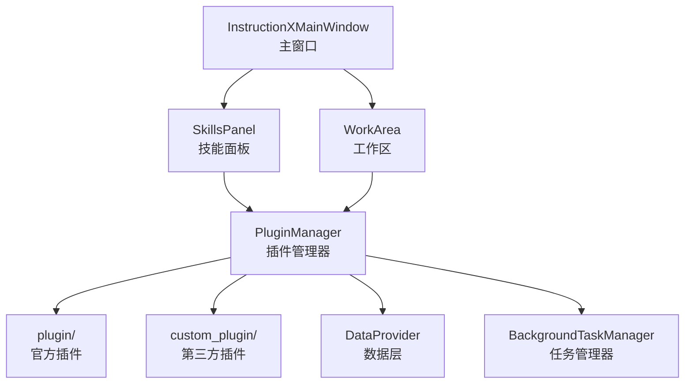

# InstructionX

[English Version](README_EN.md) | 中文版

[](https://www.python.org/)
[](https://doc.qt.io/qtforpython/)
[](#)

> 基于 PySide6 的插件式桌面应用框架，帮助你构建一站式工具集（Tools Cluster）

---

## 简介

InstructionX 是一个功能强大的**插件集成框架**，它允许你根据实际使用需求，将各种实用工具整合到一个统一的桌面应用中。无论你是开发者、设计师还是普通用户，都可以根据自己的工作流程，创建属于你自己的**一站式工具集（Tools Cluster）**。

通过 InstructionX，你可以：
- 自由组合所需的工具插件
- 快速切换不同的工作场景
- 保存和同步你的工具配置
- 开发自定义插件满足特殊需求

---

## 核心特性

### 插件热插拔

插件系统支持**热加载**和**热卸载**，无需重启应用即可添加、移除或更新插件。你可以在运行时动态管理插件，构建个性化的工具集合。

### 灵活的数据层

**DataProvider** 提供健壮的数据持久化能力：
- **原子写入**：使用临时文件 + 重命名机制，确保数据写入不会因意外中断而损坏
- **双命名空间**：PRIVATE 空间仅插件内部可用，PUBLIC 空间支持跨插件访问
- **发布/订阅**：插件可以订阅数据变化，实现响应式交互
- **内存缓存**：减少频繁磁盘 I/O，提升性能

### 后台任务系统

**BackgroundTaskManager** 支持多种任务类型：
- **同步任务**：在主线程立即执行，适用于轻量操作
- **异步任务**：在线程池中执行（4 个工作线程），避免阻塞 UI
- **定时任务**：支持固定间隔重复执行，适用于定时提醒、数据同步等场景
- **任务持久化**：任务状态在应用重启后依然保留

### 跨插件通信

插件之间可以互相调用API，实现功能协作：
- **API 注册与发现**：插件可以向管理器注册自己的 API
- **跨插件调用**：一个插件可以调用另一个插件的功能
- **数据共享**：通过 PUBLIC 命名空间共享数据

### UI 状态缓存

切换插件时，插件的 UI 状态会被自动缓存。当你返回之前使用的插件时，界面状态会完整保留，提供流畅的使用体验。

---

## 快速开始

### 环境要求

- Python 3.14 或更高版本
- Windows 10/11

### 安装依赖

```bash
pip install -r requirements.txt
```

主要依赖：
- `PySide6` - Qt GUI 框架
- `opencv-python` - 图像处理
- `numpy` - 数值计算

### 运行应用

```bash
python main.py
```

---

## 插件生态

### 官方插件

| 插件 | 功能描述 |
|------|----------|
| text_formatting | 文本格式化：大小写转换、空白处理 |
| code_formatter | 代码格式化工具 |
| image_compressor | 图片压缩：支持批量处理 |
| string_tools | 字符串工具：编码转换、哈希计算 |
| task_manager | 任务管理：查看和管理后台任务 |
| task_reporter | 任务报告：生成任务执行报告 |

### 示例插件

| 插件 | 功能描述 |
|------|----------|
| api_demo | 展示如何调用其他插件的 API |
| color_converter | 颜色格式转换：HEX、RGB、HSL |
| unit_converter | 单位转换：长度、重量、温度等 |

---

## 架构概览

### 核心组件

InstructionX 采用**单例模式**设计核心组件，确保全局唯一性：



### 核心模块

| 模块 | 路径 | 说明 |
|------|------|------|
| core/plugin | `core/plugin/` | 插件系统核心 |
| core/data | `core/data/` | 数据持久化层 |
| core/task | `core/task/` | 后台任务系统 |
| ui | `ui/` | 用户界面组件 |
| plugin | `plugin/` | 官方插件目录 |
| custom_plugin | `custom_plugin/` | 自定义插件目录 |
| docs | `docs/` | 技术文档 |

### 详细文档

- [系统架构概述](docs/architecture/overview.md)
- [模块依赖关系](docs/architecture/module-dependencies.md)
- [插件系统详解](docs/core/plugin-system/overview.md)
- [DataProvider 概述](docs/core/data-provider/overview.md)
- [后台任务概述](docs/core/background-task/overview.md)

---

## 插件开发

### 插件结构

每个插件可以包含以下文件：

```
my_plugin/
├── entrance.py      # 必需：插件入口，定义 IPlugin 子类
├── service.py       # 可选：插件服务逻辑
├── information.py   # 可选：插件元信息
└── assets/          # 可选：静态资源目录
```

### 简单示例

```python
from core import IPlugin
from PySide6.QtWidgets import QWidget, QLabel, QVBoxLayout

class MyPlugin(IPlugin):
    @property
    def plugin_name(self) -> str:
        """显示在技能面板的名称"""
        return "我的\n插件"

    @property
    def skill_description(self) -> str:
        return "这是一个示例插件"

    def _create_widget(self, parent=None, data_provider=None):
        """创建插件界面"""
        widget = QWidget(parent)
        layout = QVBoxLayout(widget)
        layout.addWidget(QLabel("Hello from MyPlugin!"))
        return widget
```

### 开发文档

- [插件开发指南](docs/core/plugin-system/plugin-development.md)
- [IPlugin 接口详解](docs/core/plugin-system/iplugin.md)
- [PluginManager API](docs/core/plugin-system/plugin-manager.md)

---

## 贡献与支持

### 问题反馈

如果你遇到问题或有功能建议，欢迎提交 Issue。

### 文档

项目包含完整的中文技术文档，位于 `docs/` 目录下，涵盖：
- 架构设计
- 核心模块详解
- API 参考
- 插件开发指南

---

## 注意事项

- **许可证**：暂未添加（私有项目）
- 当前仅支持 Windows 平台
- 建议使用 Python 3.14+

---

*使用 InstructionX，打造你的专属工具集！*
