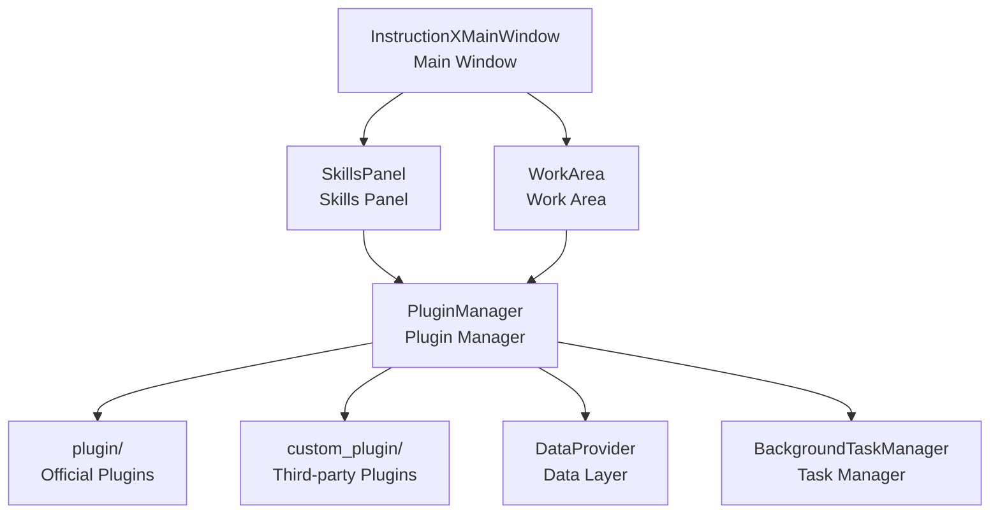

# InstructionX

[中文版](README.md) | English Version

[](https://www.python.org/)
[](https://doc.qt.io/qtforpython/)
[](#)

> A PySide6-based plugin desktop application framework for building your personalized Tools Cluster

---

## Introduction

InstructionX is a powerful **plugin integration framework** that allows you to combine various utility tools into a unified desktop application based on your actual needs. Whether you're a developer, designer, or regular user, you can create your own **Tools Cluster** tailored to your workflow.

With InstructionX, you can:
- Freely combine the tool plugins you need
- Quickly switch between different work scenarios
- Save and sync your tool configurations
- Develop custom plugins to meet special requirements

---

## Core Features

### Plugin Hot-Swapping

The plugin system supports **hot-loading** and **hot-unloading**, allowing you to add, remove, or update plugins without restarting the application. You can dynamically manage plugins at runtime to build a personalized tool collection.

### Flexible Data Layer

**DataProvider** provides robust data persistence capabilities:
- **Atomic Writes**: Uses temporary file + rename mechanism to ensure data isn't corrupted by unexpected interruptions
- **Dual Namespaces**: PRIVATE space is only accessible within a plugin, PUBLIC space supports cross-plugin access
- **Pub/Sub**: Plugins can subscribe to data changes for reactive interactions
- **Memory Cache**: Reduces frequent disk I/O for better performance

### Background Task System

**BackgroundTaskManager** supports multiple task types:
- **Sync Tasks**: Execute immediately in the main thread, suitable for lightweight operations
- **Async Tasks**: Execute in a thread pool (4 worker threads), avoiding UI blocking
- **Scheduled Tasks**: Support fixed-interval recurring execution, suitable for timed reminders, data synchronization, etc.
- **Task Persistence**: Task states persist across application restarts

### Cross-Plugin Communication

Plugins can call each other's APIs to achieve functional collaboration:
- **API Registration & Discovery**: Plugins can register their APIs with the manager
- **Cross-Plugin Calls**: One plugin can call another plugin's functionality
- **Data Sharing**: Share data through the PUBLIC namespace

### UI State Caching

When switching plugins, the plugin's UI state is automatically cached. When you return to a previously used plugin, the interface state is fully preserved, providing a smooth user experience.

---

## Quick Start

### Requirements

- Python 3.14 or higher
- Windows 10/11

### Install Dependencies

```bash
pip install -r requirements.txt
```

Main dependencies:
- `PySide6` - Qt GUI framework
- `opencv-python` - Image processing
- `numpy` - Numerical computation

### Run the Application

```bash
python main.py
```

---

## Plugin Ecosystem

### Official Plugins

| Plugin | Description |
|--------|-------------|
| text_formatting | Text formatting: case conversion, whitespace handling |
| code_formatter | Code formatting utilities |
| image_compressor | Image compression with batch processing support |
| string_tools | String tools: encoding conversion, hash calculation |
| task_manager | Task management: view and manage background tasks |
| task_reporter | Task reporting: generate task execution reports |

### Example Plugins

| Plugin | Description |
|--------|-------------|
| api_demo | Demonstrates how to call other plugins' APIs |
| color_converter | Color format conversion: HEX, RGB, HSL |
| unit_converter | Unit conversion: length, weight, temperature, etc. |

---

## Architecture Overview

### Core Components

InstructionX uses **singleton pattern** for core components, ensuring global uniqueness:



### Core Modules

| Module | Path | Description |
|--------|------|-------------|
| core/plugin | `core/plugin/` | Plugin system core |
| core/data | `core/data/` | Data persistence layer |
| core/task | `core/task/` | Background task system |
| ui | `ui/` | User interface components |
| plugin | `plugin/` | Official plugin directory |
| custom_plugin | `custom_plugin/` | Custom plugin directory |
| docs | `docs/` | Technical documentation |

### Detailed Documentation

- [System Architecture Overview](docs/architecture/overview.md)
- [Module Dependencies](docs/architecture/module-dependencies.md)
- [Plugin System Overview](docs/core/plugin-system/overview.md)
- [DataProvider Overview](docs/core/data-provider/overview.md)
- [Background Task Overview](docs/core/background-task/overview.md)

---

## Plugin Development

### Plugin Structure

Each plugin can contain the following files:

```
my_plugin/
├── entrance.py      # Required: Plugin entry, defines IPlugin subclass
├── service.py       # Optional: Plugin service logic
├── information.py   # Optional: Plugin metadata
└── assets/         # Optional: Static assets directory
```

### Simple Example

```python
from core import IPlugin
from PySide6.QtWidgets import QWidget, QLabel, QVBoxLayout

class MyPlugin(IPlugin):
    @property
    def plugin_name(self) -> str:
        """Name displayed in the skills panel"""
        return "My\nPlugin"

    @property
    def skill_description(self) -> str:
        return "This is a sample plugin"

    def _create_widget(self, parent=None, data_provider=None):
        """Create the plugin UI"""
        widget = QWidget(parent)
        layout = QVBoxLayout(widget)
        layout.addWidget(QLabel("Hello from MyPlugin!"))
        return widget
```

### Development Documentation

- [Plugin Development Guide](docs/core/plugin-system/plugin-development.md)
- [IPlugin Interface Details](docs/core/plugin-system/iplugin.md)
- [PluginManager API](docs/core/plugin-system/plugin-manager.md)

---

## Contribution & Support

### Issue Reporting

If you encounter problems or have feature suggestions, please feel free to submit an Issue.

### Documentation

The project includes complete technical documentation (in Chinese) located in the `docs/` directory, covering:
- Architecture design
- Core module details
- API reference
- Plugin development guide

---

## Notes

- **License**: Not yet added (private project)
- Currently only supports Windows platform
- Python 3.14+ recommended

---

*Use InstructionX to build your personalized Tools Cluster!*
