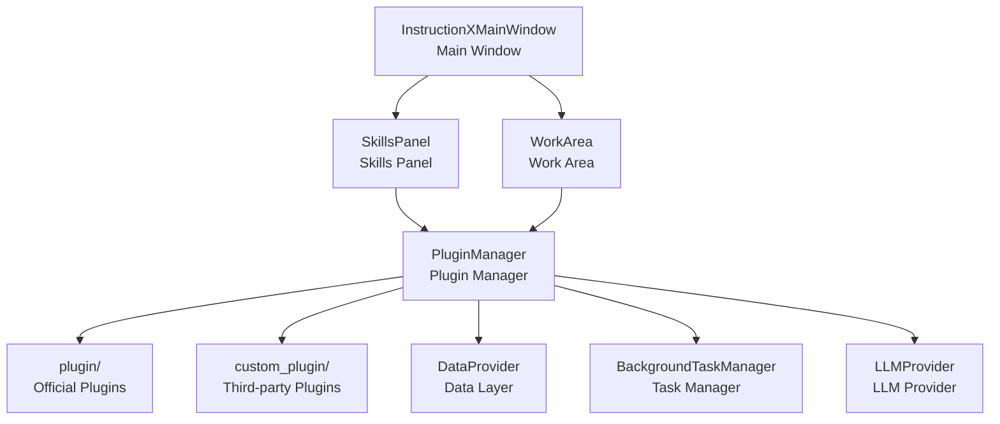

<div align="center">


[English Version](README_EN.md) | 中文版

[](https://www.python.org/)
[](https://doc.qt.io/qtforpython/)
[](#)
[](LICENSE)
[](#)

> A PySide6-based plugin desktop application framework with LLM integration, MCP Protocol (Server/Client), multi-conversation management, and hot-swappable plugin system

</div>

---

## Introduction

InstructionX is a powerful **plugin integration framework** that allows you to combine various utility tools into a unified desktop application based on your actual needs. Whether you're a developer, designer, or regular user, you can create your own **Tools Cluster** tailored to your workflow.

With InstructionX, you can:
- Freely combine the tool plugins you need
- Engage in intelligent conversations with multiple LLM providers
- Use MCP Function Calling to let AI invoke plugin capabilities
- Quickly switch between different work scenarios
- Save and sync your tool configurations
- Develop custom plugins to meet special requirements

---

## Core Features

### 🔌 Plugin Hot-Swapping

The plugin system supports **hot-loading** and **hot-unloading**, allowing you to add, remove, or update plugins without restarting the application. You can dynamically manage plugins at runtime to build a personalized tool collection.

### 📦 GitHub Plugin Installer

Built-in GitHub plugin installer for installing plugins from any GitHub URL:

- **URL Installation**: Install plugins by entering a GitHub repository URL
- **Single/Multi-Plugin Support**: Supports single-plugin repos (IXPlugin.json) and multi-plugin repos (IXRepo.json)
- **Background Installation**: Installation runs in the background with progress display
- **Auto-Classification**: Plugins from KKPIP-Tech organization are automatically classified as official plugins

### 🤖 LLM Integration & Conversation Management

Built-in multi-provider LLM integration with `LLMPluginService` providing complete conversation management and automated tool calling:

- **Multi-Provider Support**: MiniMax, SiliconFlow, Zhipu GLM, Ollama, OpenAI, and more
- **Conversation Management**: Multi-session creation, switching, automatic history management (context auto-truncation is not currently implemented)
- **ToolCallExecutor**: Automatic multi-turn tool calling loop (default max_turns=5), plugins only need to register tools
- **Multimodal Support**: Image understanding (Vision), image generation, TTS voice synthesis
- **Usage Statistics**: Per-conversation and global Token consumption and cost estimation
- **Embedding**: Vector embedding support
- **Model Caching**: Automatic model list fetching and caching at startup

### 🔗 MCP Protocol Support

Full Model Context Protocol support through the official MCP SDK:

- **MCP Server**: Expose all plugin APIs as MCP tools, supporting stdio and HTTP transport
- **MCP Client**: Connect to external MCP Servers, registering their tools in the local ToolRegistry
- **Bidirectional Bridge**: MCPBridge automatically syncs plugin API registrations to MCP Server
- **External Invocation**: Claude Code and other MCP Clients can directly call InstructionX plugin functionality

### 💾 Flexible Data Layer

**DataProvider** provides robust data persistence capabilities:
- **SQLite WAL + Explicit Transactions**: Uses SQLite WAL mode and explicit transactions by default to ensure data isn't corrupted by unexpected interruptions; set the environment variable `INSTRUCTIONX_DATAPROVIDER_BACKEND=json` to fall back to the JSON backend
- **Dual Namespaces**: PRIVATE space is only accessible within a plugin, PUBLIC space supports cross-plugin access
- **Pub/Sub**: Plugins can subscribe to data changes for reactive interactions
- **Memory Cache**: Reduces frequent disk I/O for better performance

### ⚙️ Background Task System

**BackgroundTaskManager** supports multiple task types:
- **Sync Tasks**: Execute immediately in the main thread, suitable for lightweight operations
- **Async Tasks**: Execute in a thread pool (4 worker threads), avoiding UI blocking
- **Scheduled Tasks**: Support fixed-interval recurring execution, suitable for timed reminders, data synchronization, etc.
- **Long-Running Tasks**: Support continuous operation, graceful shutdown, and auto-restart
- **Task Persistence**: Task states persist across application restarts
- **Task Factory**: Supports task recovery mechanism, automatically rebuilds tasks after restart

### 📊 Usage Panel

Built-in LLM usage statistics and visualization panel:

- **Statistics Cards**: Multi-dimensional data cards (Token consumption, cost, request count, etc.)
- **Trend Charts**: Display LLM usage changes over time
- **Filter & Query**: Filter records by Provider, Model, conversation ID
- **Paginated Table**: Detailed usage records table

### 🔗 Cross-Plugin Communication

Plugins can call each other's APIs to achieve functional collaboration:
- **API Registration & Discovery**: Plugins can register their APIs with the manager
- **Cross-Plugin Calls**: One plugin can call another plugin's functionality
- **Data Sharing**: Share data through the PUBLIC namespace

### 🎨 InstructionX_UIKit Theme & Component System

Built-in InstructionX_UIKit component library providing a unified modern interface appearance:
- **Global Theme**: Support for light/dark/auto theme modes, switchable via menu or shortcuts, with automatic OS-level theme following
- **Design Tokens**: Unified color, font, spacing, and radius tokens that restyle in real time with theme switching
- **57+ Components**: Covering buttons, inputs, menus, dialogs, charts, and other common UI elements, ready for plugin development reuse

### 🅰️ Multi-Font Support

Built-in FontMap font mapping system:

- **5 Font Families**: Alibaba PuHuiTi 3.0, Alimama FangYuanTi, Alimama DongFang DaKai, ZenDots, SmileySans
- **22 Font Files**: Covering standard weights, italics, etc.
- **State Machine Lookup**: FontMap.get_path() avoids hardcoded paths

### 💾 UI State Caching

When switching plugins, the plugin's UI state is automatically cached. When you return to a previously used plugin, the interface state is fully preserved, providing a smooth user experience.

---

## Quick Start

### Environment Requirements

- Python 3.14 or higher
- Windows 10/11

### Install Dependencies

```bash
pip install -r requirements.txt
```

Main dependencies:
- `PySide6` (>=6.10) - Qt GUI framework
- `requests` (>=2.32) - HTTP requests
- `aiohttp` (>=3.11) - Asynchronous HTTP client
- `mcp` (>=1.0.0) - MCP protocol (Model Context Protocol)
- `orjson` (>=3.11.0,<4) - High-performance JSON serialization
- `matplotlib` (>=3.10) - Usage statistics charts
- `packaging` (>=23.0) - Plugin dependency version checking

### Run the Application

```bash
python main.py
```

---

## Plugin Ecosystem

InstructionX is a **plugin framework** and does not include built-in plugins. Users can obtain plugins through:

- **GitHub Installation**: Use the built-in GitHub plugin installer, enter the plugin repository URL to install with one click
- **Third-party Developers**: Get plugins from other developers, copy to the `custom_plugin/` directory

### Install Plugins

```bash
# Install plugins via GitHub URL
# Menu path: Edit → Install GitHub Plugin
```

### Develop Plugins

If you want to develop your own plugins, please refer to the [Plugin Development](docs/core/plugin-system/plugin-development.md) documentation.

---

## Architecture Overview

### Core Components

InstructionX uses **singleton pattern** for core components, ensuring global uniqueness:



### Core Modules

| Module | Path | Description |
|--------|------|-------------|
| core/plugin | `core/plugin/` | Plugin system core |
| core/data | `core/data/` | Data persistence layer |
| core/task | `core/task/` | Background task system |
| core/llm | `core/llm/` | LLM provider framework |
| ui | `ui/` | User interface components |
| utils | `utils/` | Utility classes (logging, themes) |
| utils/style_qss | `utils/style_qss/` | Compatibility QSS appendix (title bar / skills panel and other theme exclusion zones) |
| plugin | `plugin/` | Official plugin directory |
| custom_plugin | `custom_plugin/` | Custom plugin directory |
| workers | `workers/` | Worker threads (reserved for extension) |
| docs | `docs/` | Technical documentation |
| core/interfaces | `core/interfaces/` | Abstract interface layer (IPlugin, IDataProvider, etc.) |
| core/mcp | `core/mcp/` | MCP protocol core (Server/Client/Bridge) |
| core/llm/plugin_service | `core/llm/plugin_service.py` | LLM plugin service layer (conversation management, tool calling) |
| core/llm/types | `core/llm/types.py` | LLM data types (Conversation, UsageStats, etc.) |
| core/plugin/github_plugin_installer | `core/plugin/github_plugin_installer.py` | GitHub plugin installer |
| ui/usage_panel | `ui/usage_panel.py` | Usage query panel |
| utils/font_map | `utils/font_map.py` | Font mapping system |

### Detailed Documentation

- [System Architecture Overview](docs/architecture/overview.md)
- [Module Dependencies](docs/architecture/module-dependencies.md)
- [Plugin System Overview](docs/core/plugin-system/overview.md)
- [DataProvider Overview](docs/core/data-provider/overview.md)
- [Background Task Overview](docs/core/background-task/overview.md)
- [LLM Provider Overview](docs/core/llm-provider/overview.md)
- [UIKit Theme System](docs/utils/uikit-theme.md)

---

## Plugin Development

### Plugin Structure

Each plugin can contain the following files:

```
my_plugin/
├── entrance.py      # Required: Plugin entry, defines IPlugin subclass
├── service.py       # Required: Plugin service logic / interface layer
├── information.py   # Required: Plugin metadata (version, icon, API definitions, etc.)
├── config/          # Required: Plugin configuration directory
└── assets/          # Optional: Static assets directory
```

### Simple Example

```python
from core import IPlugin
from PySide6.QtWidgets import QWidget, QLabel, QVBoxLayout

class MyPlugin(IPlugin):
    @property
    def plugin_name(self) -> str:
        """Name displayed in the skills panel"""
        return "My\nPlugin"

    @property
    def skill_description(self) -> str:
        return "This is a sample plugin"

    def _create_widget(self, parent=None, data_provider=None):
        """Create the plugin UI"""
        widget = QWidget(parent)
        layout = QVBoxLayout(widget)
        layout.addWidget(QLabel("Hello from MyPlugin!"))
        return widget
```

### MCP Function Calling Integration

Define `service_api` in `information.py`, and the framework will automatically convert it to LLM-callable tools:

```python
from core.plugin.plugin_info_interface import IPluginInfo

class MyPluginInfo(IPluginInfo):
    @property
    def service_api(self) -> dict:
        return {
            "my_method": {
                "description": "Method description",
                "parameters": {
                    "param1": {
                        "type": "string",
                        "description": "Parameter description",
                        "required": True
                    }
                },
                "returns": {
                    "type": "string",
                    "description": "Return value description"
                }
            }
        }
```

### Development Documentation

- [Plugin Development Guide](docs/core/plugin-system/plugin-development.md)
- [IPlugin Interface Details](docs/core/plugin-system/iplugin.md)
- [PluginManager API](docs/core/plugin-system/plugin-manager.md)

---

## Configuration Files

| Config File | Path | Purpose |
|-------------|------|---------|
| Plugin Order | `config/plugin_order.json` | Plugin display order configuration |
| LLM Config | `config/llm_providers.json` | Provider API Key, Base URL, etc. |
| Model Cache | `config/llm_models_cache.json` | LLM model list cache |
| Plugin Data | `data/data.db` | Plugin data persistent storage (SQLite + WAL; fallback to `data/data.json` via `INSTRUCTIONX_DATAPROVIDER_BACKEND=json`) |
| Task Status | `data/tasks.json` | Background task state persistence |
| Assets | `data/assets/` | Plugin asset file storage |
| MCP Config | `config/mcp_config.json` | MCP Server/Client connection configuration |
| Usage Records | `data/llm_usage.json` | LLM API usage records |

---

## License

InstructionX is licensed under the **InstructionX Commercial Source License** (this is not an open-source license):

- ✅ **Personal, non-commercial use**: Free to use
- ⚠️ **Organizational use**: Organizations with more than 100 global employees require written authorization
- ⚠️ **Deployment scale**: More than 30 installed instances require written authorization
- ❌ **SaaS / multi-tenant service**: Prohibited without authorization
- ❌ **Redistribution**: Requires written authorization

See [LICENSE](LICENSE) file for complete terms.

---

## Contribution & Support

### Issue Reporting

If you encounter problems or have feature suggestions, please feel free to submit an Issue.

### Documentation

The project includes complete technical documentation (in Chinese) located in the `docs/` directory, covering:
- Architecture design
- Core module details
- API reference
- Plugin development guide

---

## Tech Stack

| Technology | Purpose | Version |
|------------|---------|---------|
| InstructionX CE | Application version | Alpha 1.0.3 |
| PySide6 | Qt GUI framework | >= 6.10 |
| Python | Programming language | >= 3.14 |
| requests | HTTP requests | >= 2.32 |
| aiohttp | Asynchronous HTTP | >= 3.11 |
| mcp | MCP protocol | >= 1.0.0 |
| orjson | High-performance JSON serialization | >= 3.11.0,<4 |
| matplotlib | Usage statistics charts | >= 3.10 |
| packaging | Plugin dependency version checking | >= 23.0 |
| InstructionX_UIKit | UI theme & component library | Built-in |

---

## Notes

- Currently only supports **Windows** platform
- **Python 3.14+** recommended
- `data/` and `config/` directories will be automatically created on first run

---

*Use InstructionX to build your personalized intelligent Tools Cluster!*