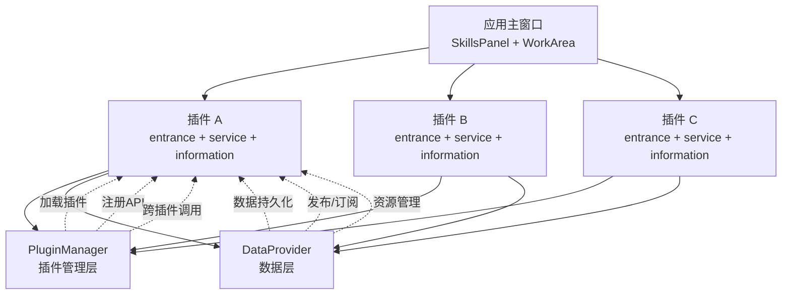

# InstructionX 技术文档

> InstructionX 插件式桌面应用程序完整技术文档

---

## 文档导航

本文档为 InstructionX 项目提供完整的技术参考，包含架构设计、模块详解和 API 参考。

---

## 文档结构

```
documents/
├── README.md                      # 本文档 - 文档索引和导航
│
├── architecture/                  # 架构文档
│   ├── overview.md               # 系统架构概述
│   └── module-dependencies.md   # 模块依赖关系
│
├── core/                         # 核心模块文档
│   ├── plugin-system/           # 插件系统
│   │   ├── overview.md          # 插件系统概述
│   │   ├── iplugin.md          # IPlugin 接口
│   │   ├── plugin-manager.md   # PluginManager
│   │   └── plugin-development.md # 插件开发指南
│   │
│   ├── data-provider/           # 数据层
│   │   ├── overview.md         # DataProvider 概述
│   │   └── api-reference.md    # DataProvider API 参考
│   │
│   ├── background-task/         # 后台任务
│   │   ├── overview.md        # 后台任务概述
│   │   └── api-reference.md    # 后台任务 API 参考
│   │
│   └── llm-provider/            # LLM 提供者
│       ├── overview.md         # LLM Provider 概述
│       └── api-reference.md    # LLM Provider API 参考
│
├── ui/                          # UI 模块文档
│   ├── main-window.md           # 主窗口
│   ├── skills-panel.md          # 技能面板
│   └── work-area.md            # 工作区
│
├── utils/                       # 工具模块文档
│   ├── logging-tools.md         # 日志工具
│   └── fluent-style.md          # FluentUI3 样式系统
│
└── api/                         # API 参考
    └── full-reference.md        # 完整 API 参考
```

---

## 学习路径

### 入门路径（推荐）

1. **[系统架构概述](architecture/overview.md)** - 了解项目整体架构
2. **[模块依赖关系](architecture/module-dependencies.md)** - 理解模块间关系
3. **[插件系统概述](core/plugin-system/overview.md)** - 理解插件机制
4. **[插件开发指南](core/plugin-system/plugin-development.md)** - 开发自己的插件

### 进阶路径

5. **[DataProvider 概述](core/data-provider/overview.md)** - 理解数据层
6. **[DataProvider API 参考](core/data-provider/api-reference.md)** - 掌握数据 API
7. **[PluginManager](core/plugin-system/plugin-manager.md)** - 理解插件管理
8. **[IPlugin 接口](core/plugin-system/iplugin.md)** - 深入插件接口

### 高级路径

9. **[后台任务概述](core/background-task/overview.md)** - 后台任务系统
10. **[后台任务 API 参考](core/background-task/api-reference.md)** - 任务 API
11. **[LLM Provider 概述](core/llm-provider/overview.md)** - LLM 提供者框架
12. **[LLM Provider API 参考](core/llm-provider/api-reference.md)** - LLM API
13. **[UI 模块文档](ui/)** - 界面组件详解
14. **[完整 API 参考](api/full-reference.md)** - 所有 API 索引

---

## 核心概念

### 单例模式

项目核心组件均采用单例模式，确保全局唯一性：

- **PluginManager** - 插件管理器
- **DataProvider** - 数据提供者
- **BackgroundTaskManager** - 后台任务管理器
- **LLMProvider** - LLM 提供者

### 插件系统



### 命名空间

DataProvider 使用两种数据命名空间：

- **PRIVATE** - 仅插件内部使用
- **PUBLIC** - 可被其他插件访问和订阅

---

## 快速参考

### 核心类导入

```python
# 插件系统
from core import PluginManager, IPlugin, IPluginInfo

# 数据层
from core import DataProvider, DataNamespace

# 后台任务
from core import BackgroundTaskManager, TaskType, TaskStatus

# LLM 提供者
from core.llm import get_llm_provider
```

### 获取单例实例

```python
# 插件管理器
plugin_manager = PluginManager()

# 数据提供者
data_provider = DataProvider()

# 后台任务管理器
task_manager = BackgroundTaskManager()

# LLM 提供者
llm_provider = get_llm_provider()
```

---

## 相关文档

- [插件开发指南](core/plugin-system/plugin-development.md)
- [DataProvider API 参考](core/data-provider/api-reference.md)
- [日志工具](utils/logging-tools.md)
- [FluentUI3 样式系统](utils/fluent-style.md)
- [完整 API 参考](api/full-reference.md)

---

## 版本

本文档对应 InstructionX 项目最新版本。

---

*本文档由 Claude Code 自动生成*
