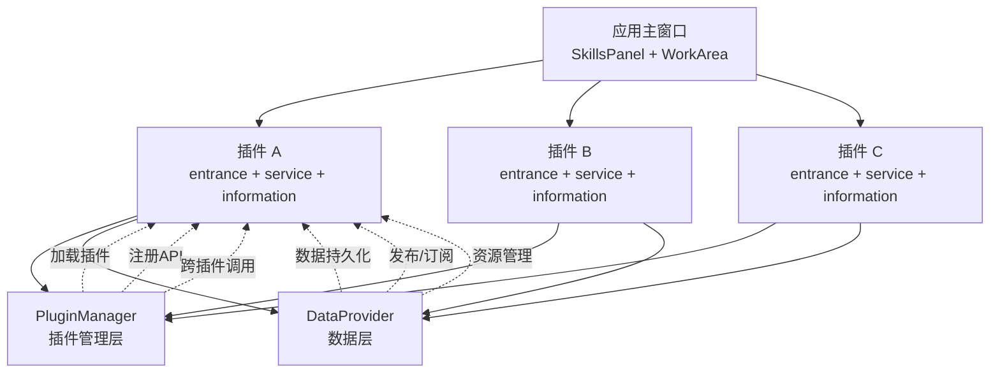

# InstructionX 技术文档

> InstructionX 插件式桌面应用程序完整技术文档

---

## 文档导航

本文档为 InstructionX 项目提供完整的技术参考，包含架构设计、模块详解和 API 参考。

---

## 文档结构

```
docs/
├── README.md                         # 本文档 - 文档索引和导航
│
├── architecture/                     # 架构文档
│   ├── overview.md                  # 系统架构概述
│   ├── module-dependencies.md      # 模块依赖关系
│   └── full-analysis.md            # 完整架构分析
│
├── core/                            # 核心模块文档
│   ├── interfaces/                  # 抽象接口层
│   │   ├── overview.md              # 接口层概述（含各接口详细说明）
│   │   └── ilogger.md              # ILogger 接口文档
│   │   # 注：IPlugin/IPluginInfo 详见 plugin-system/iplugin.md
│   │   # 注：IDataProvider/ITaskManager/ILLMFacade 在 overview.md 中详解
│   │
│   ├── plugin-system/               # 插件系统
│   │   ├── overview.md              # 插件系统概述
│   │   ├── iplugin.md               # IPlugin 接口
│   │   ├── plugin-manager.md        # PluginManager
│   │   ├── plugin-development.md    # 插件开发指南
│   │   ├── plugin-version.md        # PluginVersion 版本管理
│   │   ├── plugin-icon.md          # PluginIcon 图标管理
│   │   ├── plugin-identity.md       # PluginIdentity 身份标识
│   │   ├── plugin-config-manager.md # PluginConfigManager 配置管理
│   │   ├── plugin-dependency-manager.md # PluginDependencyManager 依赖管理
│   │   └── plugin-installer.md      # PluginInstaller 安装器
│   │
│   ├── data-provider/               # 数据层
│   │   ├── overview.md              # DataProvider 概述
│   │   └── api-reference.md         # DataProvider API 参考
│   │
│   ├── background-task/             # 后台任务
│   │   ├── overview.md             # 后台任务概述
│   │   ├── api-reference.md         # 后台任务 API 参考
│   │   └── task-storage.md         # TaskStorage 持久化存储
│   │
│   ├── llm-provider/                # LLM 提供者
│   │   ├── overview.md              # LLM Provider 概述
│   │   ├── api-reference.md         # LLM Provider API 参考
│   │   └── provider-config.md       # ProviderConfig/LLMConfig 配置
│   │
│   └── mcp/                         # MCP 协议支持
        └── overview.md              # MCP 模块概述

├── api/                             # API 参考文档
│   └── full-reference.md            # 完整 API 参考

├── ui/                              # UI 组件文档
│   ├── main-window.md               # 主窗口
│   ├── skills-panel.md              # 技能面板
│   ├── skill-button.md              # SkillButton 技能按钮
│   ├── work-area.md                 # 工作区
│   └── dialogs.md                   # 对话框组件
│       # 注：UsagePanel（用量查询面板）源码位于 ui/usage_panel/ 包

├── utils/                           # 工具模块文档
│   ├── logging-tools.md             # 日志工具
│   ├── style-qss.md                 # StyleQSS 样式系统
│   └── font-map.md                  # 字体映射模块

└── plugins/                         # 插件文档
    ├── index.md                     # 插件索引
    ├── thirdparty-plugins.md        # 第三方插件文档
    └── llm-integration-guide.md     # LLM 集成开发指南
```

---

## 学习路径

### 入门路径（推荐）

1. **[系统架构概述](architecture/overview.md)** - 了解项目整体架构
2. **[模块依赖关系](architecture/module-dependencies.md)** - 理解模块间关系
3. **[插件系统概述](core/plugin-system/overview.md)** - 理解插件机制
4. **[插件开发指南](core/plugin-system/plugin-development.md)** - 开发自己的插件

### 进阶路径

5. **[接口层概述](core/interfaces/overview.md)** - 理解抽象接口设计
6. **[DataProvider 数据层](core/data-provider/overview.md)** - 理解数据层
7. **[DataProvider API 参考](core/data-provider/api-reference.md)** - 掌握数据 API
8. **[PluginManager](core/plugin-system/plugin-manager.md)** - 理解插件管理
9. **[IPlugin 接口](core/plugin-system/iplugin.md)** - 深入插件接口

### 高级路径

10. **[后台任务系统概述](core/background-task/overview.md)** - 后台任务系统
11. **[后台任务 API 参考](core/background-task/api-reference.md)** - 任务 API
12. **[LLM Provider 数据层](core/llm-provider/overview.md)** - LLM 提供者框架
13. **[LLM Provider API 参考](core/llm-provider/api-reference.md)** - LLM API
14. **[MCP 协议模块](core/mcp/overview.md)** - MCP 协议支持（Server + Client）
15. **[LLM 集成指南](plugins/llm-integration-guide.md)** - 在插件中使用 LLM 服务
16. **[主窗口](ui/main-window.md)** - 界面组件详解
17. **[API 完整参考](api/full-reference.md)** - 所有 API 索引

### 插件参考

18. **[插件文档](plugins/index.md)** - 所有插件总览
19. **[第三方插件](plugins/thirdparty-plugins.md)** - 第三方插件说明

---

## 核心概念

### 单例模式

项目核心组件均采用单例模式，确保全局唯一性：

- **PluginManager** - 插件管理器（插件的加载、注册、排序）
- **DataProvider** - 数据提供者（数据持久化、发布/订阅、插件间通信）
- **BackgroundTaskManager** - 后台任务管理器（同步/异步任务、定时任务、长期任务）
- **LLMProvider** - LLM 核心层（多厂商 LLM 底层管理，通过 get_llm_provider() 获取）
- **LLMPluginService** - LLM 插件服务层（对话管理、工具调用、多模态，插件开发者入口）
- **MCPManager** - MCP 协议协调器（Server 模式暴露插件工具，Client 模式消费外部 MCP Server 工具）

### 插件系统



### 命名空间

DataProvider 使用两种数据命名空间：

- **PRIVATE** - 仅插件内部使用
- **PUBLIC** - 可被其他插件访问和订阅

---

## 快速参考

### 核心类导入

```python
# 插件系统
from core import PluginManager, IPlugin, IPluginInfo

# 数据层
from core import DataProvider, DataNamespace

# 后台任务
from core import BackgroundTaskManager, TaskType, TaskStatus

# LLM 提供者
from core.llm import get_llm_provider

# LLM 插件服务层（推荐插件开发者使用）
from core.llm import get_llm_plugin_service, LLMPluginService
from core.llm import Conversation, ToolResult, UsageStats

# MCP 协议
from core.mcp import get_mcp_manager, MCPManager

# 抽象接口层（推荐通过接口而非直接依赖实现）
from core.interfaces import (
    IDataProvider, DataNamespace,
    ITaskManager, TaskType, TaskStatus,
    ILLMFacade, PluginServices, ILogger
)
```

### 获取单例实例

```python
# 插件管理器
plugin_manager = PluginManager()
# 或
plugin_manager = get_plugin_manager()

# 数据提供者
data_provider = DataProvider()

# 后台任务管理器
task_manager = BackgroundTaskManager()

# LLM 提供者
llm_provider = get_llm_provider()

# LLM 插件服务层（推荐）
llm_service = get_llm_plugin_service()

# MCP 管理器
mcp_manager = get_mcp_manager()
```

---

## 相关文档

- [插件开发指南](core/plugin-system/plugin-development.md)
- [DataProvider API 参考](core/data-provider/api-reference.md)
- [MCP 协议模块概述](core/mcp/overview.md)
- [日志工具](utils/logging-tools.md)
- [StyleQSS 样式系统](utils/style-qss.md)
- [完整 API 参考](api/full-reference.md)

---

## 版本

本文档对应 InstructionX 项目最新版本。

---

*本文档由 Claude Code 自动生成*
