# InstructionX 技术架构分析文档

> 深入分析 InstructionX 项目各模块的职责边界、模块间有机结合、数据流转与调用链路。
> **以代码为准**：若文档描述与代码实现不一致，以代码为准。

---

## 目录

1. [概述](#1-概述)
2. [系统架构总览](#2-系统架构总览)
3. [接口层详解](#3-接口层详解)
4. [插件系统](#4-插件系统)
5. [数据层](#5-数据层)
6. [后台任务系统](#6-后台任务系统)
7. [LLM 框架](#7-llm-框架)
8. [UI 层](#8-ui-层)
9. [样式系统](#9-样式系统)
10. [通信模式与调用链](#10-通信模式与调用链)
11. [设计模式分析](#11-设计模式分析)
12. [代码与文档不一致问题](#12-代码与文档不一致问题)
13. [插件开发指南](#13-插件开发指南)
14. [附录](#14-附录)

---

## 1. 概述

### 1.1 项目背景与定位

**InstructionX** 是一个基于 **PySide6** 的插件式桌面应用程序框架，定位为"AI 助手桌面客户端"。它将 LLM 对话、工具插件、后台任务统一整合在一个 Qt 界面中，支持热插拔插件和 MCP（Model Context Protocol）函数调用。

### 1.2 技术栈

| 技术 | 版本 | 角色 |
|------|------|------|
| Python | 3.14 | 编程语言 |
| PySide6 | 6.10.2 | Qt for Python，UI 框架 |
| opencv-python | 4.13.0 | 图像处理（截图等） |
| numpy | 2.4.2 | 数值计算 |
| JSON | — | 所有持久化存储格式 |
| Windows | 11 | 目标平台 |

### 1.3 核心设计原则

- **单例模式**：5 个核心服务（PluginManager、DataProvider、BackgroundTaskManager、LLMProvider、LLMPluginService）全部以单例形式运行
  - `DataProvider`、`BackgroundTaskManager`、`LLMProvider`、`LLMPluginService` 使用 `__new__` + `threading.Lock` 双重检查锁定
  - `PluginManager` 使用 `__new__` + `_initialized` 标志简化模式（无独立 `_lock`）
- **LLM 双重入口**：`LLMProvider` 为底层核心，`LLMPluginService` 为插件开发者入口，两者通过 `get_llm_provider()` / `get_llm_plugin_service()` 获取
- **接口契约优于实现**：`core/interfaces/` 定义所有核心接口，插件通过接口与框架交互
- **Widget 缓存复用**：IPlugin 的 `get_widget()` 实现控件缓存，避免重复创建
- **原子写入**：所有 JSON 持久化使用 temp-file + `os.replace()` 保证数据不损坏
- **MCP 导出能力**：所有插件 API 可通过 `get_all_function_tools()` 导出为 OpenAI 风格的 function calling 工具

### 1.4 术语表

| 术语 | 含义 |
|------|------|
| IPlugin | 插件抽象基类，定义插件必须实现的契约 |
| Widget 缓存 | IPlugin.get_widget() 的控件复用机制 |
| Provider | LLM 提供商实现（MiniMax/GLM/SiliconFlow/Ollama） |
| MCP | Model Context Protocol，函数调用规范 |
| QSS | Qt Style Sheets，Qt 样式表 |
| 单例 | 全局唯一实例设计模式 |
| Pub/Sub | 发布-订阅通信模式 |

---

## 2. 系统架构总览

### 2.1 整体架构图

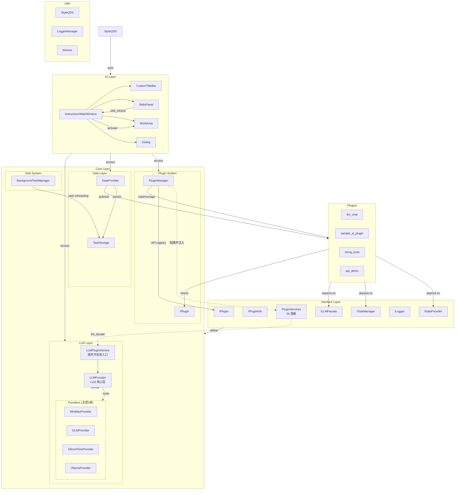

### 2.2 四大核心子系统关系

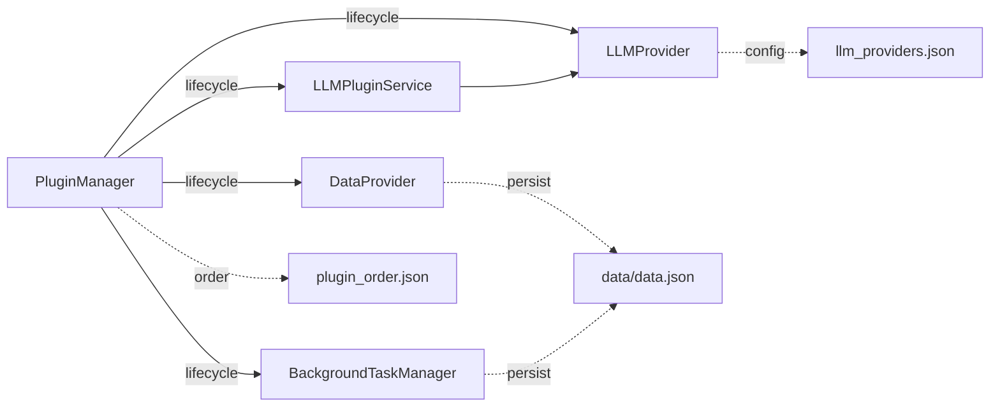

| 核心服务 | 职责 | 单例获取方式 |
|----------|------|-------------|
| PluginManager | 插件加载/注册/排序/API | `PluginManager()` |
| DataProvider | 数据持久化/PubSub | `DataProvider()` |
| BackgroundTaskManager | 任务调度/执行 | `BackgroundTaskManager()` |
| LLMProvider | LLM 多提供商门面 | `get_llm_provider()` |

### 2.3 单例实例一览

| 单例 | 文件 | 用途 |
|------|------|------|
| PluginManager | `core/plugin/manager.py` | 插件生命周期管理 |
| DataProvider | `core/data/data_provider.py` | 数据中枢与通信 |
| TaskStorage | `core/task/task_storage.py` | 任务状态持久化 |
| BackgroundTaskManager | `core/task/background_task.py` | 任务调度执行 |
| LLMProvider | `core/llm/llm_provider.py` | LLM 核心层（底层） |
| LLMPluginService | `core/llm/plugin_service.py` | LLM 插件服务层（开发者入口） |
| LoggerManager | `utils/logging_tools.py` | 日志记录 |
| StyleQSS | `utils/style_qss/__init__.py` | 样式管理 |

---

## 3. 接口层详解

### 3.1 接口层设计理念

接口层（`core/interfaces/`）定义了所有核心服务与插件之间的契约。框架通过接口实现了**依赖倒置**：插件依赖抽象接口而非具体实现，从而实现了插件的热插拔能力。

### 3.2 IPlugin 接口

**文件**：`core/interfaces/i_plugin.py`（纯接口）与 `core/plugin/plugin_interface.py`（带缓存实现）

**重要**：存在**两套 IPlugin**：
- `core/interfaces/i_plugin.py` —— 纯抽象基类，无实现。docstring 注明"已迁移至此"
- `core/plugin/plugin_interface.py` —— 带 Widget 缓存实现的版本，是**实际被插件继承**的类。docstring 注明"保留作为向后兼容"

**核心方法**：

| 方法 | 用途 |
|------|------|
| `plugin_name` (property) | 插件显示名称 |
| `_create_widget(parent, data_provider)` | 创建 Qt 控件（抽象方法） |
| `get_widget(parent, data_provider)` | 获取控件（含缓存复用逻辑） |
| `skill_icon` (property) | 技能面板图标 |
| `skill_description` (property) | 技能描述 |
| `skill_tooltip` (property) | 悬浮提示 |
| `plugin_id` (property) | UUID 标识符 |
| `on_plugin_loaded(plugin_id=None, **kwargs)` | 加载完成回调（可重写，services 通过 self._services 访问） |
| `plugin_info` (property) | 获取 IPluginInfo 实例 |

**我依赖谁**：
- `core/plugin/plugin_interface.py` 的 `IPlugin` 依赖 `core/plugin/plugin_info_interface.py` 的 `IPluginInfo`

**谁依赖我**：
- `core/plugin/manager.py` 的 `PluginManager` 依赖 `IPlugin`（`isinstance` 检查）
- 所有插件继承 `IPlugin`

### 3.3 IPluginInfo 接口

**文件**：`core/interfaces/i_plugin_info.py` 与 `core/plugin/plugin_info_interface.py`

定义插件元数据：

| 属性 | 用途 |
|------|------|
| `version` | PluginVersion 版本对象 |
| `developer` | 开发者名称 |
| `service_api` | API 方法描述字典（格式：`{method_name: {description, parameters, returns}}`） |
| `skill_icon` | PluginIcon 图标对象 |
| `skill_description` | 技能描述 |
| `plugin_type_id` | 插件类型标识符 |

### 3.4 IDataProvider 接口

**文件**：`core/interfaces/i_data_provider.py`

```python
class IDataProvider(ABC):
    # 插件管理
    def register_plugin(instance_id, plugin_type) -> None
    def unregister_plugin(instance_id) -> None
    def set_active_instance(instance_id) -> None
    def get_active_instance(plugin_type) -> str

    # 数据读写
    def get_plugin_data(instance_id, key, namespace=PRIVATE, default=None) -> Any
    def set_plugin_data(instance_id, key, value, namespace=PRIVATE, notify=True) -> None
    def get_all_plugin_data(instance_id, namespace=PRIVATE) -> Dict

    # 发布/订阅
    def subscribe(subscriber_id, target_plugin_id, target_key, callback) -> None
    def unsubscribe(subscriber_id, target_plugin_id=None) -> None
    def publish(publisher_id, key, value) -> None

    # 资源管理
    def save_asset(plugin_id, filename, content) -> str
    def get_asset_path(relative_path) -> str
    def load_asset(relative_path) -> bytes
```

### 3.5 ITaskManager 接口

**文件**：`core/interfaces/i_task_manager.py`

定义 4 类任务类型（`TaskType`）：`SYNC`、`ASYNC`、`SCHEDULED`、`LONG_RUNNING`。

### 3.6 ILLMFacade 接口

**文件**：`core/interfaces/i_llm_facade.py`

定义 LLM 统一访问契约，对应 `LLMPluginService` 实现类（通过 Duck Typing 对齐）。

**注意**：`ILLMFacade` 接口本身仅定义核心契约方法，以下方法签名均以代码为准：

```python
def chat(messages, provider="default", ...) -> ChatResponse          # core/interfaces/i_llm_facade.py:30
def stream_chat(messages, provider="default", callback=None, ...)     # core/interfaces/i_llm_facade.py:43
def embed(texts, provider="default", ...) -> List[EmbeddingResponse] # core/interfaces/i_llm_facade.py:57
def get_models(provider=None) -> Dict[str, List[ModelInfo]]         # core/interfaces/i_llm_facade.py:68
def get_provider(name) -> Optional[Any]                             # core/interfaces/i_llm_facade.py:73
def get_all_providers() -> Dict[str, Any]                           # core/interfaces/i_llm_facade.py:78
def get_cached_models(provider_name) -> List[ModelInfo]             # core/interfaces/i_llm_facade.py:83
def get_conversation(conv_id) -> Optional[Any]                     # core/interfaces/i_llm_facade.py:126
def list_conversations() -> List[Any]                               # core/interfaces/i_llm_facade.py:131
def delete_conversation(conv_id) -> bool                           # core/interfaces/i_llm_facade.py:136
def get_tool_executor() -> Any                                      # core/interfaces/i_llm_facade.py:143
def get_shared_tool_registry() -> Any                              # core/interfaces/i_llm_facade.py:148
def chat_with_tools(messages, provider="default", ...)             # core/interfaces/i_llm_facade.py:153
def get_available_providers() -> List[Any]                          # core/interfaces/i_llm_facade.py:167
def load_image_as_base64(file_path) -> str                         # core/interfaces/i_llm_facade.py:182
```

**扩展方法**（仅在 `LLMPluginService` 实现类中可用，不在接口层定义）：
- `validate_provider(provider)` — `core/llm/plugin_service.py:465`
- `create_conversation(...)` — `core/llm/plugin_service.py:93`
- `send_message(...)` — `core/llm/plugin_service.py:118`
- `stream_send_message(...)` — `core/llm/plugin_service.py:147`
- `get_usage_stats(conv_id)` — `core/llm/plugin_service.py:454`
- `get_raw_provider(provider)` — `core/llm/plugin_service.py:480`
- `generate_image(...)` — `core/llm/plugin_service.py:346`
- `text_to_speech(...)` — `core/llm/plugin_service.py:381`

### 3.7 PluginServices（依赖注入容器）

**文件**：`core/interfaces/plugin_services.py`

```python
@dataclass
class PluginServices:
    data_provider: 'IDataProvider' = None
    task_manager: 'ITaskManager' = None
    llm_facade: 'ILLMFacade' = None
    logger: 'ILogger' = None
```

**使用方式**：PluginManager 通过 `_create_plugin_services()` 创建容器实例，在加载插件时通过 `services` 参数注入。详见 [PluginManager](docs/core/plugin-system/plugin-manager.md#39-依赖注入pluginservices)。

---

## 4. 插件系统

### 4.1 PluginManager 单例架构

**文件**：`core/plugin/manager.py`

**核心职责**：动态加载插件、管理插件注册表、提供跨插件 API 调用能力。

**关键属性**：

| 属性 | 类型 | 用途 |
|------|------|------|
| `_official_plugins` | `List[IPlugin]` | 官方插件实例列表 |
| `_thirdparty_plugins` | `List[IPlugin]` | 第三方插件实例列表 |
| `_plugin_registry` | `Dict[str, IPlugin]` | UUID → 插件实例映射 |
| `_plugin_name_to_id` | `Dict[str, str]` | 插件名 → UUID 映射 |
| `_api_registry` | `Dict[str, PluginAPI]` | UUID → API 容器映射 |

**我依赖谁**：
- `core/plugin/plugin_interface.py` 的 `IPlugin`
- `core/plugin/config_manager.py` 的 `PluginConfigManager`
- `core/plugin/plugin_identity.py` 的 `PluginIdentity`

**谁依赖我**：
- `ui/main_window.py` 的 `InstructionXMainWindow` —— 加载插件
- `ui/skills_panel/panel.py` 的 `SkillsPanel` —— 获取插件列表
- 所有通过 `call_plugin_method()` 发起跨插件调用的插件

### 4.2 插件发现与加载流程

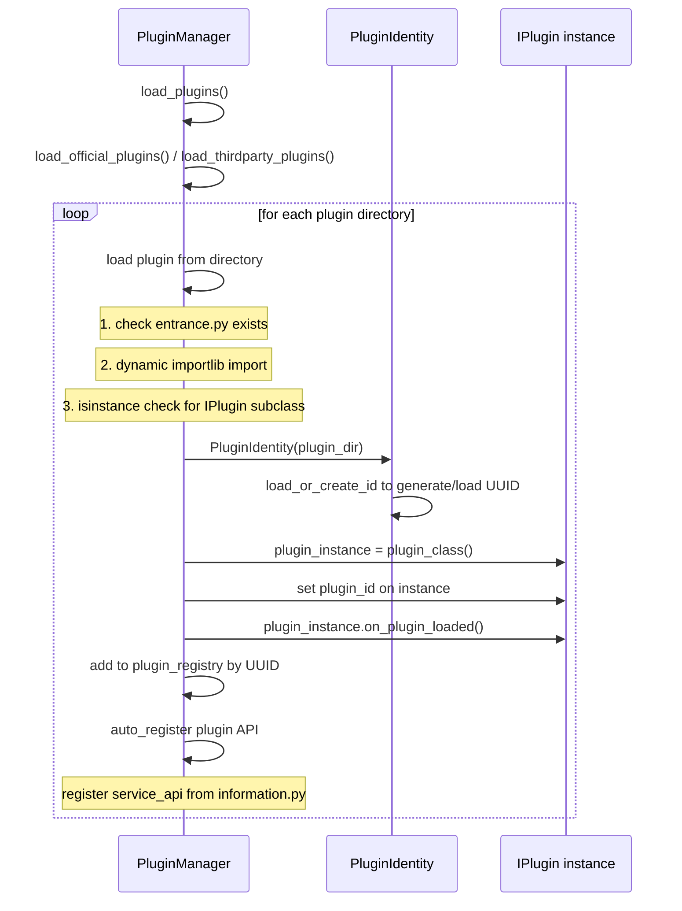

### 4.3 Widget 缓存复用机制

**文件**：`core/plugin/plugin_interface.py:80-108`

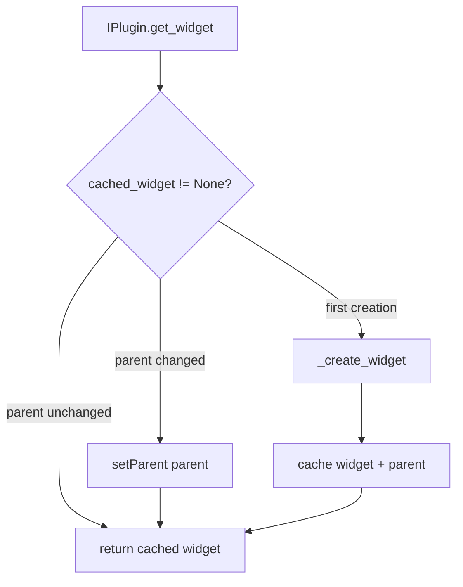

### 4.4 插件 API 注册与跨插件 RPC

**文件**：`core/plugin/manager.py:408-713`

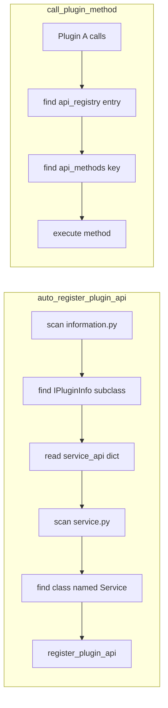

**⚠️ API 注册硬编码限制**：`service.py` 中 Service 类必须**严格命名为 `Service`**（`manager.py:532` 的 `attr.__name__ == 'Service'` 判断）。

### 4.5 MCP 函数工具导出

**文件**：`core/plugin/manager.py:671-712`

```python
def get_all_function_tools(self) -> List[Dict[str, Any]]:
    # 格式: {type: "function", function: {name: "uuid.method", description, parameters}}
```

---

## 5. 数据层

### 5.1 DataProvider 单例架构

**文件**：`core/data/data_provider.py`

**核心职责**：插件数据的持久化、内存缓存、命名空间隔离、发布/订阅通信。

**数据文件结构**：
```json
{
  "plugins": {
    "<instance_id>": {
      "type": "VideoEditor",
      "active": false,
      "private": {"key": "value"},
      "public": {"key": "value"}
    }
  },
  "active_instances": {"VideoEditor": "<instance_id>"}
}
```

**持久化路径**：`data/data.json`（由 `core/data/data_provider.py:62` 的 `Path(__file__).parent.parent.parent / "data"` 确定）

### 5.2 原子写入机制

```python
# data_provider.py:122-144
def _write_to_disk(self, data):
    with open(self.temp_file, 'w') as f:   # 写入 data.json.tmp
        json.dump(data, f, ...)
    os.replace(self.temp_file, self.data_file)  # 原子重命名
```

**我依赖谁**：
- `core/interfaces/i_data_provider.py` 的 `IDataProvider`（实现该接口）

**谁依赖我**：
- 所有插件通过 `DataProvider()` 单例访问
- `core/task/task_storage.py` 的 `TaskStorage` 使用类似模式（独立持久化）

### 5.3 发布/订阅通信模型

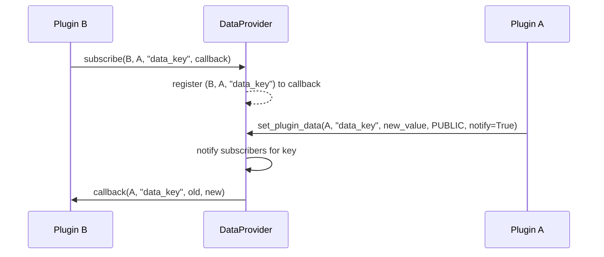

---

## 6. 后台任务系统

### 6.1 BackgroundTaskManager 单例架构

**文件**：`core/task/background_task.py`

**核心职责**：管理 SYNC/ASYNC/SCHEDULED/LONG_RUNNING 四类任务的注册、执行、调度和持久化。

**线程模型**：
- 主线程：任务注册/控制
- `ThreadPoolExecutor`：4 个 worker 线程执行 ASYNC/SCHEDULED/LONG_RUNNING 任务
- daemon 线程 `_schedule_check_thread`：每秒检查 SCHEDULED 任务是否到期

### 6.2 三类任务模型

| 模型 | 文件 | 持久化 | 用途 |
|------|------|--------|------|
| `BackgroundTask` | `task_model.py:33` | ✅ `data/tasks.json` 的 `tasks` 段 | 一次性同步/异步任务 |
| `ScheduledTask` | `task_model.py:166` | ✅ `data/tasks.json` 的 `scheduled_tasks` 段 | 定时循环任务 |
| `LongRunningTask` | `task_model.py:264` | ✅ `data/tasks.json` 的 `long_running_tasks` 段 | 长期驻留任务 |

**⚠️ 重要限制**：持久化时 `func` 和 `callback` 不序列化（`repr=False`），仅存储 args/kwargs。任务重启后必须通过**工厂注册机制**重新注入函数引用。

### 6.3 任务工厂恢复机制

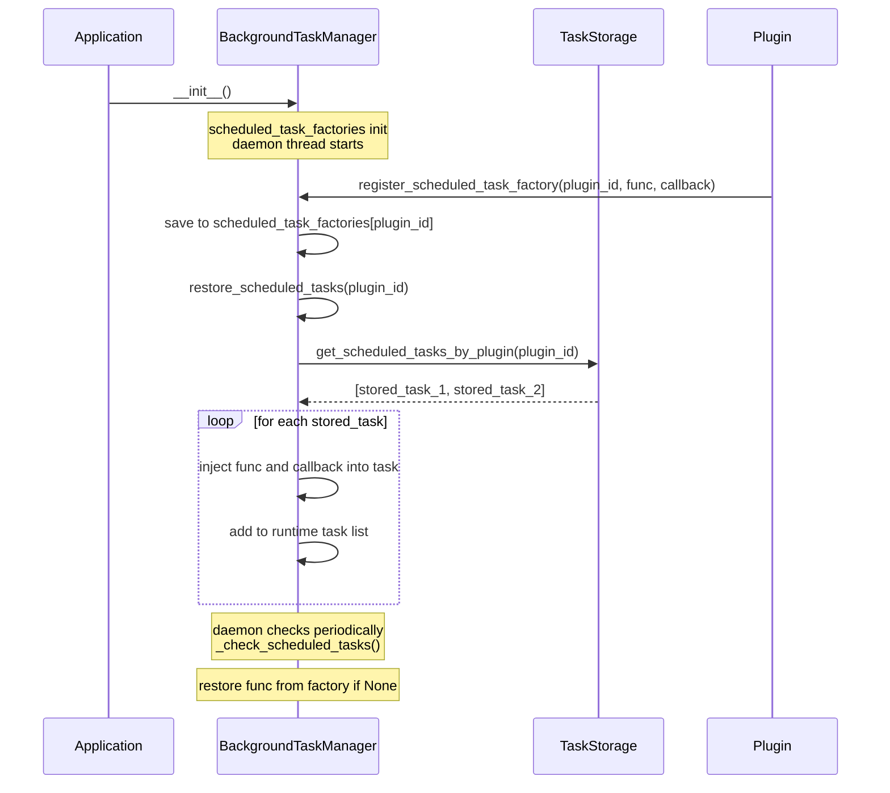

### 6.4 任务状态机

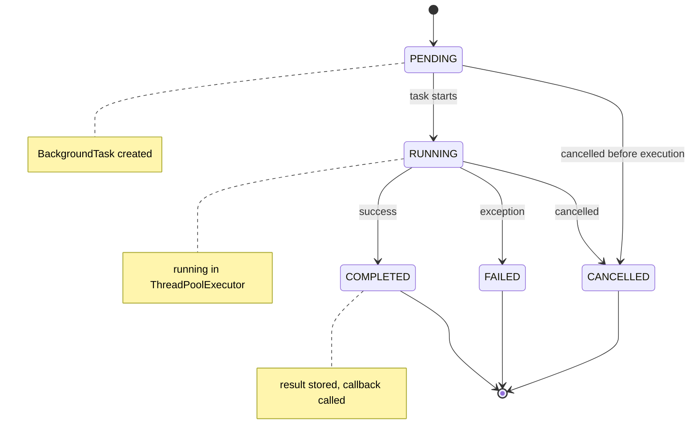

### 6.5 TaskScheduler 死代码问题

**文件**：`core/task/scheduler.py` vs `core/task/background_task.py:391-420`

`TaskScheduler` 在 `background_task.py:91` 被实例化为 `self._scheduler`，`104` 行调用 `self._scheduler.start()`。但 `scheduler.py:67-71` 的 `_check_and_run_tasks()` 方法体为空（只有 `pass`）。

**实际定时任务检查**由 `background_task.py:391` 的 `_check_scheduled_tasks()` daemon 线程承担，它使用 `SchedulerCallback` 类（`scheduler.py:74-150`）执行任务。

**结论**：`TaskScheduler` 是一个**空壳类**，`SchedulerCallback` 是实际工作的组件。

---

## 7. LLM 框架

### 7.1 LLMProvider 多提供商门面

**文件**：`core/llm/llm_provider.py`

**核心职责**：作为多提供商统一门面，路由 chat/stream_chat/embed 请求到具体 Provider。

**初始化流程**：
```
__init__() → LLMConfig() → _init_providers() → _fetch_all_models()
```

**我依赖谁**：
- `core/llm/config.py` 的 `LLMConfig`
- `core/llm/providers/__init__.py` 的 `get_provider_class()` + `PROVIDER_REGISTRY`

**谁依赖我**：
- `ui/dialog/llm_settings_dialog.py` 的 `LLMSettingsDialog`
- `plugin/llm_chat/service.py` 的 `LLMChatService`
- 所有需要 LLM 能力的插件

### 7.2 Provider 注册机制

**文件**：`core/llm/providers/__init__.py`

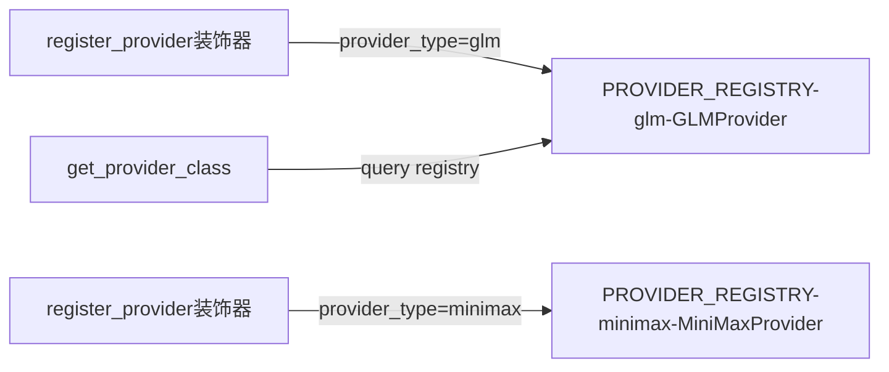

模块导入时（`providers/__init__.py:89-92`）通过装饰器自动注册所有 Provider。

### 7.3 四家提供商对比

| 提供商 | 配置文件键 | 模型获取方式 | 特殊处理 |
|--------|-----------|------------|---------|
| MiniMax | `minimax` | 预设列表（5 个 chat + 1 个 embedding） | 图片需 base64 前缀 |
| GLM | `glm` | 预设列表（7 类模型，含视频/音频） | 支持 function calling |
| SiliconFlow | `siliconflow` | API `/models` 动态获取 | 模型类型从 ID 推断 |
| Ollama | `ollama` | API `/api/tags` 动态获取 | 不需要 api_key |

### 7.4 BaseProvider 模板方法

**文件**：`core/llm/providers/base.py`

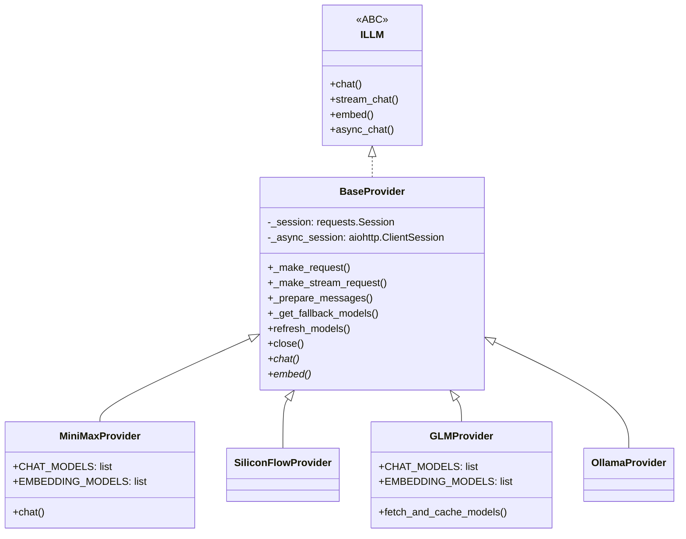

---

## 8. UI 层

### 8.1 无边框窗口设计

**文件**：`ui/main_window.py:65-66`

```python
self.setWindowFlags(Qt.WindowType.FramelessWindowHint)
self.setAttribute(Qt.WidgetAttribute.WA_TranslucentBackground)
```

配合 `CustomTitleBar` 实现自定义窗口控制按钮（最小化/最大化/关闭）。

### 8.2 SkillsPanel 信号链

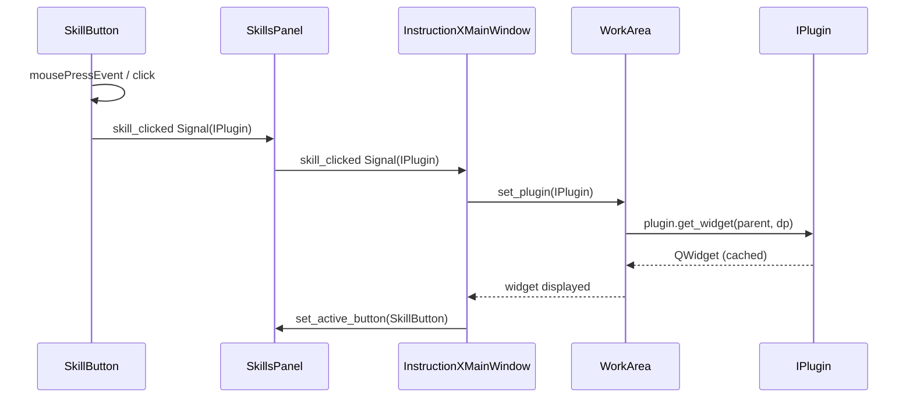

### 8.3 WorkArea Widget 缓存策略

**文件**：`ui/work_area/work_area.py`

| 方法 | 行为 | 用途 |
|------|------|------|
| `clear()` | `deleteLater()` 删除控件 | 强制重建 |
| `clear_keep_highlight()` | `hide()` 隐藏控件 | 复用缓存，保留激活高亮 |

此设计配合 `IPlugin.get_widget()` 的缓存机制，实现**真正的 Widget 复用**。

---

## 9. 样式系统

### 9.1 StyleQSS 架构

**文件**：`utils/style_qss/__init__.py`

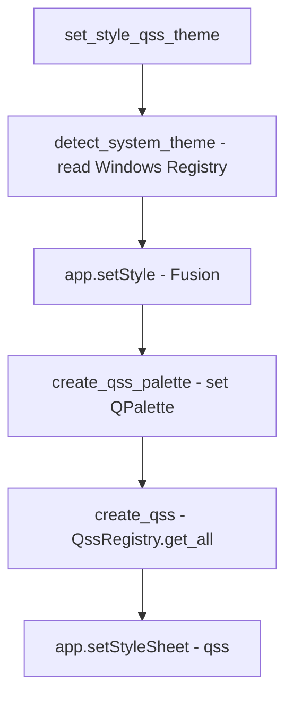

### 9.2 QssRegistry 优先级管理

**文件**：`utils/style_qss/registry.py`

`QssRegistry` 管理 26 个 QSS 片段文件，按优先级合并。变量替换机制：`{accent}`、`{window}` 等占位符在运行时替换为实际颜色值（来自 `colors.py`）。

---

## 10. 通信模式与调用链

### 10.1 四种通信模式对比

| 模式 | 适用场景 | 特点 |
|------|---------|------|
| **Qt Signals/Slots** | UI 内通信 | 线程安全（需QueuedConnection跨线程），同步 |
| **DataProvider Pub/Sub** | 插件间响应式通信 | 同线程同步执行，跨插件数据变化通知 |
| **PluginManager API Registry** | 插件间同步调用 | 同步 RPC，基于 UUID + 方法名查找 |
| **Task Callbacks** | 后台任务完成通知 | 线程池回调，可能跨线程 |

### 10.2 典型调用链：LLM 聊天请求

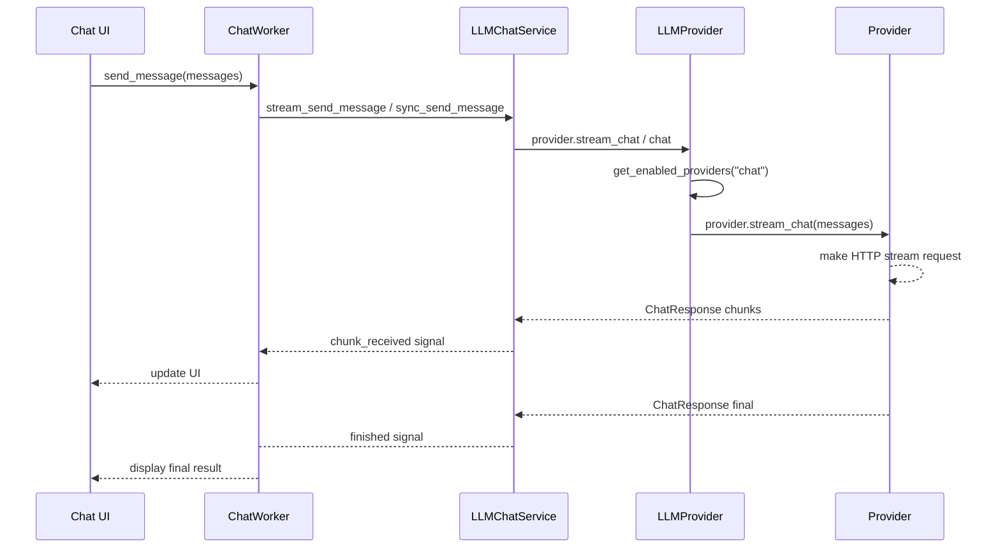

### 10.3 典型调用链：定时任务注册与执行

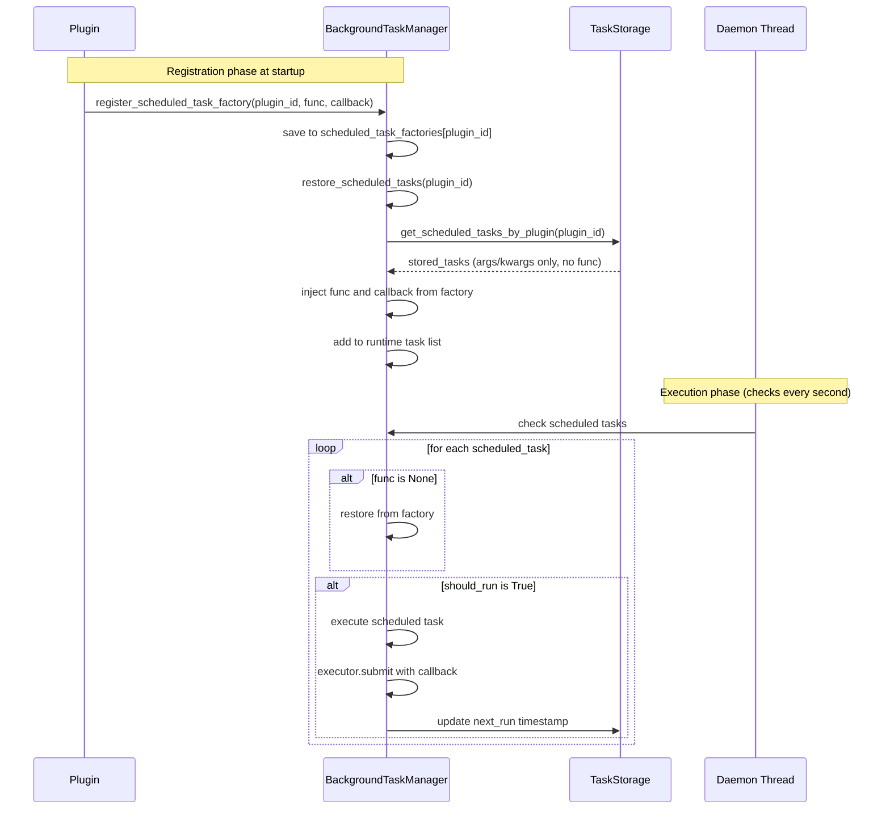

---

## 11. 设计模式分析

| 模式 | 应用位置 | 实现方式 |
|------|---------|---------|
| **单例** | 4 个核心服务 | `__new__` + `_lock` 双重检查锁定 |
| **模板方法** | `BaseProvider` | 基类提供 HTTP 骨架，子类实现 API 端点/响应解析 |
| **观察者/Pub-Sub** | `DataProvider` | `_subscriptions` 字典 + 回调分发 |
| **门面/Facade** | `LLMProvider` | 路由到具体 Provider，隐藏复杂度 |
| **工厂方法** | 任务恢复 | `_scheduled_task_factories[plugin_id]` 注册函数引用 |
| **装饰器** | `@register_provider` | `PROVIDER_REGISTRY` 全局注册表 |
| **Widget 缓存** | `IPlugin.get_widget()` | `_cached_widget` + `_cached_parent` 判断 |

---

## 12. 代码与文档不一致问题

### 12.1 TaskStatus.STOPPED 枚举（已修复）

| 位置 | 内容 |
|------|------|
| `core/interfaces/i_task_manager.py:27` | `STOPPED = "stopped"`（存在于接口枚举中） |
| `core/task/task_model.py:31` | `STOPPED = "stopped"`（实现层枚举已添加） |
| `core/task/background_task.py:568` | 使用字符串比较 `if task.current_status in ("completed", "failed", "stopped")` |

**判断**：`STOPPED` 状态枚举已在 `task_model.py:31` 添加，与接口层保持一致。附录 B 中已标记为"已修复"。`LongRunningTask.current_status` 仍使用字符串比较而非枚举，但这是局部实现细节，不影响枚举本身的可用性。

### 12.2 TaskScheduler 死代码

`core/task/scheduler.py` 的 `TaskScheduler` 类：
- 在 `background_task.py:91` 被实例化为 `self._scheduler`
- `background_task.py:104` 调用 `self._scheduler.start()`
- 但 `_check_and_run_tasks()` 方法体为空（只有 `pass`）

**实际工作者**：`background_task.py:391` 的 `_check_scheduled_tasks()` daemon 线程 + `scheduler.py:74` 的 `SchedulerCallback` 类。

### 12.3 _restore_all_scheduled_tasks() 未被调用

`background_task.py:114` 定义了 `_restore_all_scheduled_tasks()` 方法，但 `__init__` 中从未调用。定时任务恢复通过 `register_scheduled_task_factory()` 自动触发（`background_task.py:312`）。

### 12.4 PluginServices DI 容器

PluginManager 通过 `_create_plugin_services()` 创建 `PluginServices` 容器，并通过构造器参数注入到各插件中。新版插件通过 `self._services` 访问服务，旧版插件可通过直接导入单例兼容访问。

### 12.5 API 注册硬编码类名

`core/plugin/manager.py:532`：
```python
if isinstance(attr, type) and attr.__name__ == 'Service':
```
必须严格命名为 `Service`，不支持自定义类名。

---

## 13. 插件开发指南

### 13.1 插件目录结构

```
plugin_name/
├── __init__.py          # 空文件，Python 包标识
├── entrance.py          # 必需：定义 IPlugin 子类
├── information.py       # 可选：定义 IPluginInfo 子类 + service_api
├── service.py           # 可选：定义 Service 类（类名必须为 Service）
└── assets/              # 可选：静态资源文件
```

### 13.2 entrance.py 编写规范

```python
from core.plugin.plugin_interface import IPlugin

class MyPlugin(IPlugin):
    @property
    def plugin_name(self) -> str:
        return "我的插件"

    def _create_widget(self, parent=None, data_provider=None) -> QWidget:
        widget = QWidget(parent)
        # ... 构建 UI ...
        return widget

    def on_plugin_loaded(self) -> None:
        # 注册定时任务工厂
        from core.task import BackgroundTaskManager
        BackgroundTaskManager().register_scheduled_task_factory(
            self.plugin_id, self.my_task_func, self.on_task_done
        )
```

### 13.3 information.py service_api 定义

```python
from core.plugin.plugin_info_interface import IPluginInfo
from core.plugin.plugin_version import PluginVersion
from core.plugin.plugin_icon import PluginIcon

class MyPluginInfo(IPluginInfo):
    @property
    def version(self) -> PluginVersion:
        return PluginVersion.from_string("release.1.0.0")

    @property
    def service_api(self) -> dict:
        return {
            "do_something": {
                "description": "执行某个操作",
                "parameters": {
                    "input": {"type": "string", "description": "输入内容", "required": True}
                },
                "returns": {"type": "string"}
            }
        }
```

### 13.4 service.py 编写规范

```python
# 类名必须严格为 "Service"
class Service:
    def __init__(self):
        pass

    def do_something(self, input: str) -> str:
        return f"处理结果: {input}"
```

---

## 14. 附录

### 附录 A：文件清单

#### 核心接口层 (`core/interfaces/`)

| 文件 | 核心职责 |
|------|---------|
| `i_plugin.py` | IPlugin 纯接口定义 |
| `i_plugin_info.py` | IPluginInfo 接口定义 |
| `i_data_provider.py` | IDataProvider 接口 + DataNamespace 枚举 |
| `i_task_manager.py` | ITaskManager 接口 + TaskType/TaskStatus 枚举 |
| `i_llm_facade.py` | ILLMFacade 接口 + Message/ChatResponse 等 DTO |
| `i_logger.py` | ILogger 接口 |
| `plugin_services.py` | PluginServices DI 容器 |

#### 插件系统 (`core/plugin/`)

| 文件 | 核心职责 |
|------|---------|
| `manager.py` | PluginManager 单例，插件加载/API 注册 |
| `plugin_interface.py` | IPlugin 带缓存实现 |
| `plugin_info_interface.py` | IPluginInfo 实现（向后兼容导出） |
| `config_manager.py` | PluginConfigManager，插件排序持久化 |
| `plugin_identity.py` | PluginIdentity，UUID 生成/持久化 |
| `plugin_version.py` | PluginVersion 版本解析与比较 |
| `plugin_icon.py` | PluginIcon 图标处理（5 种来源） |

#### 数据层 (`core/data/`)

| 文件 | 核心职责 |
|------|---------|
| `data_provider.py` | DataProvider 单例，pub/sub/原子写入 |
| `task_storage.py` | TaskStorage 单例，任务 JSON 持久化 |
| `dao.py` | **占位桩**，待 SQLite 迁移 |
| `database_connection.py` | **占位桩** |
| `database_manager.py` | **占位桩** |
| `sql_map.py` | **预留框架**（`SQLMap` 类骨架，待 SQLite 迁移） |

#### 任务系统 (`core/task/`)

| 文件 | 核心职责 |
|------|---------|
| `background_task.py` | BackgroundTaskManager 单例，调度核心 |
| `task_model.py` | BackgroundTask/ScheduledTask/LongRunningTask 模型 |
| `scheduler.py` | TaskScheduler **死代码** + SchedulerCallback |
| `__init__.py` | 模块导出 |

#### LLM 层 (`core/llm/`)

| 文件 | 核心职责 |
|------|---------|
| `llm_provider.py` | LLMProvider 单例，多提供商门面 |
| `provider_interface.py` | ILLM 抽象基类 + 数据类型（Message、ChatResponse 等） |
| `config.py` | LLMConfig / ProviderConfig 配置管理 |
| `exceptions.py` | LLM 异常体系（9 类） |
| `types.py` | LLM 服务层数据类型（Conversation、ToolResult、UsageStats、UsageRecord 等） |
| `pricing.py` | DEFAULT_PRICING 定价表 |
| `conversation_manager.py` | ConversationManager 对话生命周期管理 |
| `tool_call_executor.py` | ToolCallExecutor / ToolRegistry 工具调用自动化 |
| `plugin_service.py` | LLMPluginService 插件开发者主入口 |
| `types_cache.py` | CacheInfo / CacheType 缓存信息类型 |
| `cache_adapter.py` | CacheAdapter 缓存适配器 + DEFAULT_CACHE_CONFIG |
| `usage_record_store.py` | UsageRecordStore 用量记录持久化（data/llm_usage.json） |
| `providers/__init__.py` | PROVIDER_REGISTRY + 装饰器注册 |
| `providers/base.py` | BaseProvider 模板方法基类 |
| `providers/minimax.py` | MiniMaxProvider 实现 |
| `providers/glm.py` | GLMProvider 实现 |
| `providers/siliconflow.py` | SiliconFlowProvider 实现 |
| `providers/ollama.py` | OllamaProvider 实现 |

#### UI 层 (`ui/`)

| 文件 | 核心职责 |
|------|---------|
| `main_window.py` | InstructionXMainWindow 主窗口 |
| `title_bar.py` | CustomTitleBar 自定义标题栏 |
| `skills_panel/panel.py` | SkillsPanel 技能面板 |
| `skills_panel/skill_button.py` | SkillButton 技能按钮 |
| `work_area/work_area.py` | WorkArea 工作区 |
| `dialog/llm_settings_dialog.py` | LLM 设置对话框 |
| `dialog/plugin_order_dialog.py` | 插件排序对话框（拖拽） |
| `dialog/about_dialog.py` | 关于对话框 |

#### 工具层 (`utils/`)

| 文件 | 核心职责 |
|------|---------|
| `logging_tools.py` | LoggerManager 单例，旋转日志 |
| `i_logger.py` | ILogger 接口 |
| `themes.py` | 主题切换工具 |
| `style_qss/__init__.py` | StyleQSS 主入口 |
| `style_qss/colors.py` | 颜色变量定义 |
| `style_qss/palette.py` | QPalette 创建 |
| `style_qss/registry.py` | QssRegistry QSS 片段管理 |
| `style_qss/styles/` | 26 个 QSS 片段文件 |

#### 配置文件结构

| 文件 | 结构 |
|------|------|
| `config/plugin_order.json` | `{official_plugins: [uuid], thirdparty_plugins: [uuid]}` |
| `config/llm_providers.json` | `{providers: {name: {api_key, base_url, chat_model, ...}}}` |
| `config/llm_models_cache.json` | `{provider_name: [ModelInfo]}` |
| `data/data.json` | `{plugins: {id: {type, active, private, public}}, active_instances: {}}` |
| `data/tasks.json` | `{tasks: {}, scheduled_tasks: {}, long_running_tasks: {}}` |

### 附录 B：已知问题汇总

| # | 问题 | 严重程度 | 位置 | 状态 |
|---|------|---------|------|------|
| 1 | ~~TaskStatus.STOPPED 存在于接口但不在实现枚举~~ | ~~已修复~~ | `task_model.py` 已添加 STOPPED 枚举 | ✅ 已修复 |
| 2 | TaskScheduler 是死代码 | 低 | `scheduler.py` 含空方法，实际由 daemon 线程执行 | 📝 已文档化 |
| 3 | _restore_all_scheduled_tasks() 从未被调用 | 低 | 恢复由工厂注册自动触发，非全局恢复 | 📝 已文档化 |
| 4 | PluginServices DI 已启用 | 低 | PluginManager._create_plugin_services() 已实现 DI 注入 | 📝 已完成 |
| 5 | API 注册必须使用 'Service' 硬编码类名 | 低 | `manager.py:482` 含注释说明 | 📝 已文档化 |
| 6 | DAO/database 模块为占位桩 | 低 | 预留待 SQLite 迁移 | 📝 已知限制 |

---

## 15. 相关文档

- [模块依赖关系](module-dependencies.md)
- [完整 API 参考](../api/full-reference.md)
- [后台任务概述](../core/background-task/overview.md)
- [后台任务 API 参考](../core/background-task/api-reference.md)
- [后台任务存储](../core/background-task/task-storage.md)
- [插件系统概述](../core/plugin-system/overview.md)
- [插件开发指南](../core/plugin-system/plugin-development.md)
- [接口层概述](../core/interfaces/overview.md)
- [DataProvider 概述](../core/data-provider/overview.md)
- [LLM Provider 概述](../core/llm-provider/overview.md)

---

*文档生成时间：2026-03-30*
*基于代码版本：5da4584 (docs: 新增 UI 组件及架构文档)*
