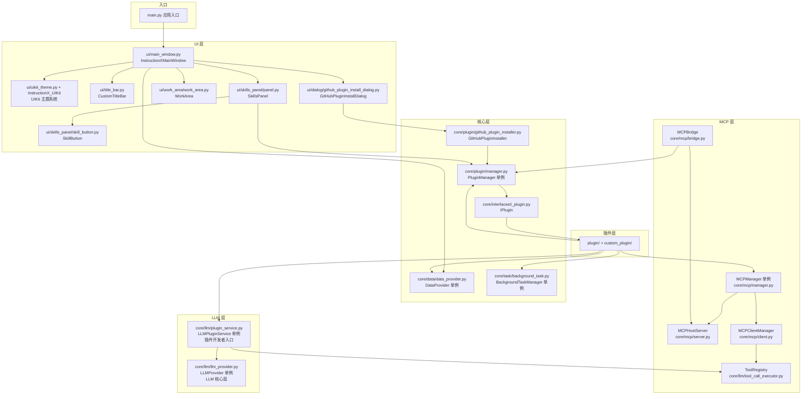
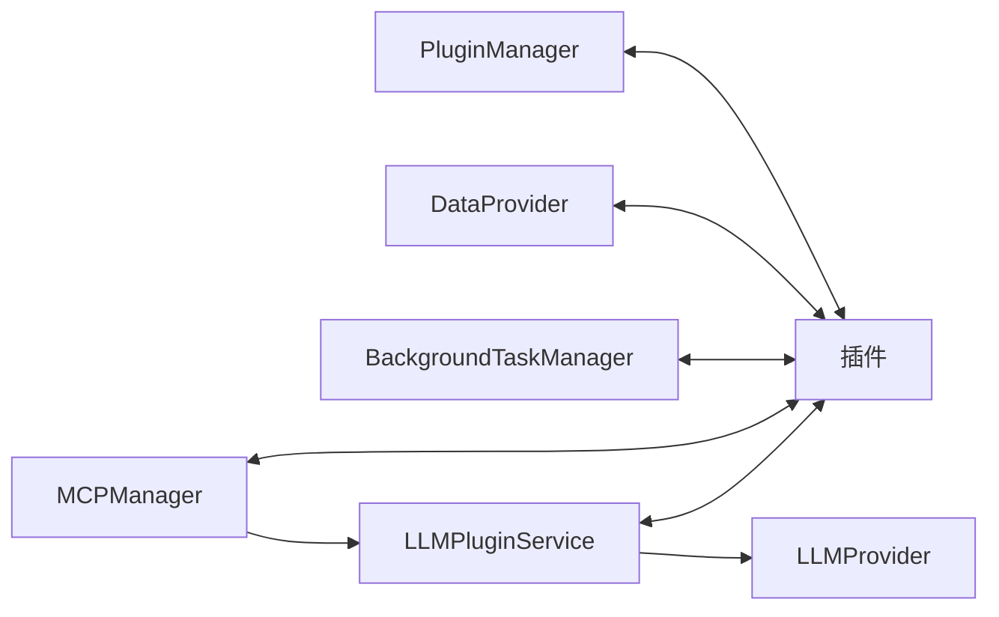
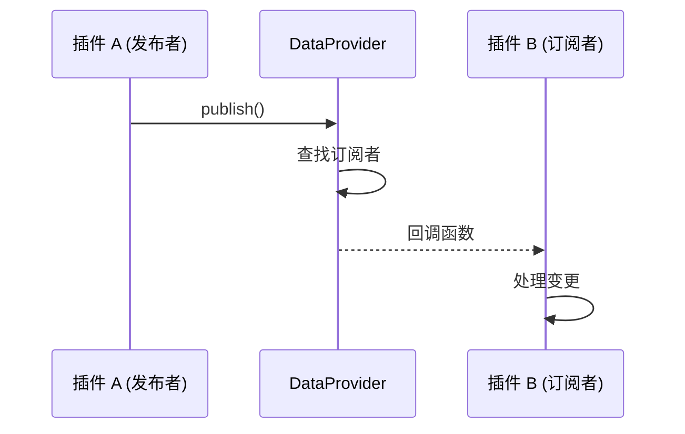
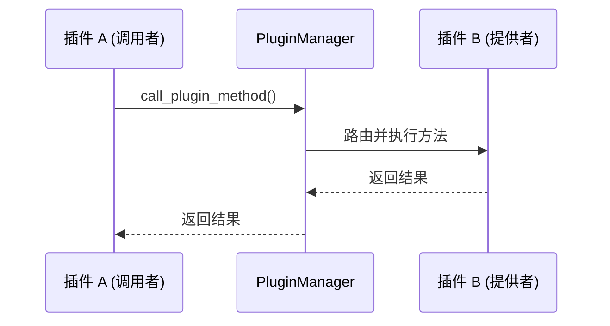
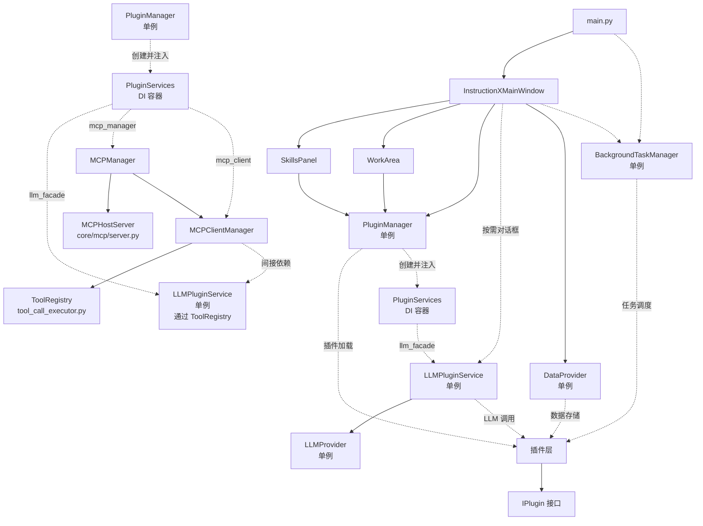

# 模块依赖关系

> InstructionX 项目各模块之间的依赖关系和职责说明

---

## 1. 模块依赖图



---

## 2. 核心模块职责

### 2.1 PluginManager

**文件**: `core/plugin/manager.py`

**职责**:
| 功能 | 说明 |
|------|------|
| 插件加载 | 扫描 `plugin/` 和 `custom_plugin/` 目录 |
| 实例管理 | 维护插件实例注册表 |
| API 注册 | 自动扫描 `information.py` 获取方法描述，再扫描 `service.py` 获取实现，注册为可调用 API |
| 跨插件调用 | `call_plugin_method()` 方法路由 |
| 顺序管理 | 支持自定义插件显示顺序 |
| MCP 工具同步 | `_notify_mcp_new_tools()` / `_notify_mcp_remove_tools()` 自动同步插件 API 到 MCP 层 |

**关键属性**:
```python
self._official_plugins: List[IPlugin]      # 官方插件列表
self._thirdparty_plugins: List[IPlugin]    # 第三方插件列表
self._plugin_registry: Dict[str, IPlugin]   # UUID -> 插件实例
self._plugin_name_to_id: Dict[str, str]    # 插件名 -> UUID 映射
self._api_registry: Dict[str, PluginAPI]   # UUID -> API 信息
self.config_manager: PluginConfigManager  # 插件顺序配置管理器
```

### 2.2 DataProvider

**文件**: `core/data/data_provider.py`

**职责**:
| 功能 | 说明 |
|------|------|
| 数据持久化 | SQLite（WAL）默认后端（`data/data.db`）；JSON 应急回退（`INSTRUCTIONX_DATAPROVIDER_BACKEND=json`，原子写入） |
| 插件注册 | 插件实例 ID 管理 |
| 命名空间 | PRIVATE / PUBLIC 数据隔离 |
| 发布/订阅 | 插件间数据变更通知 |
| 资源管理 | 插件资源文件存储 |

**关键属性**:
```python
self.data_dir: Path              # 数据目录
self._cache: Dict                # 内存缓存
self._subscriptions: Dict        # 订阅表
self.assets_dir: Path            # 资源目录
self.temp_file: Path             # 原子写入临时文件路径（仅 JSON 应急后端使用）
```

### 2.3 BackgroundTaskManager

**文件**: `core/task/background_task.py`

**职责**:
| 功能 | 说明 |
|------|------|
| 同步任务 | `register_sync_task()` 立即执行 |
| 异步任务 | `register_async_task()` 线程池执行 |
| 定时任务 | `register_scheduled_task()` 定时调度 |
| 任务恢复 | 应用重启后恢复定时任务 |
| 长期任务 | `register_long_running_task()` 持续运行，支持自动重启 |
| 状态更新 | `update_long_running_task_status()` 更新长期任务状态 |
| 优雅关闭 | `shutdown()` 安全关闭任务管理器 |

**关键属性**:
```python
self._executor: ThreadPoolExecutor           # 线程池
self._running_tasks: Dict                    # 运行中的任务
self._scheduled_task_factories: Dict         # 定时任务工厂
self._long_running_task_factories: Dict      # 长期任务工厂
self._storage: TaskStorage                   # 任务持久化存储
self._scheduler: TaskScheduler              # 任务调度器（轻量生命周期占位，实际调度由 _check_scheduled_tasks() daemon 线程 + SchedulerCallback 完成）
self._stop_event: threading.Event           # 优雅关闭事件
self._is_shutdown: bool                     # 关闭标志
```

**关键方法**:
```python
register_long_running_task()       # 注册长期任务
update_long_running_task_status()  # 更新长期任务状态
shutdown()                         # 安全关闭任务管理器
```

---

## 3. 单例模式使用

### 3.1 单例列表

项目中有 **8 个核心单例**（含 2 个内部单例）：

| 类名 | 文件 | 用途 |
|------|------|------|
| **PluginManager** | `core/plugin/manager.py` | 插件管理 |
| **DataProvider** | `core/data/data_provider.py` | 数据管理 |
| **BackgroundTaskManager** | `core/task/background_task.py` | 任务调度 |
| **LLMProvider** | `core/llm/llm_provider.py` | 大语言模型核心层（底层） |
| **LLMPluginService** | `core/llm/plugin_service.py` | LLM 插件服务层（插件开发者入口） |
| **MCPManager** | `core/mcp/manager.py` | MCP 协议协调器（Server + Client 管理） |
| **TaskStorage** | `core/task/task_storage.py` | 任务数据持久化（BackgroundTaskManager 内部使用，内部单例） |
| **LoggerManager** | `utils/logging_tools.py` | 日志管理（框架内部使用，内部单例） |

### 3.2 单例实现模式

```python
class PluginManager:
    _instance = None
    _initialized = False

    def __new__(cls):
        """确保只有一个实例"""
        if cls._instance is None:
            cls._instance = super().__new__(cls)
        return cls._instance

    def __init__(self):
        """只初始化一次"""
        if PluginManager._initialized:
            return

        # 初始化代码...
        PluginManager._initialized = True
```

### 3.3 使用方式

```python
# 无需传入参数，直接获取实例
manager = PluginManager()           # 返回全局唯一实例
provider = DataProvider()          # 返回全局唯一实例
task_mgr = BackgroundTaskManager() # 返回全局唯一实例
llm_provider = get_llm_provider() # 返回 LLMProvider 全局唯一实例
llm_svc = get_llm_plugin_service() # 返回 LLMPluginService 全局唯一实例（推荐插件使用）
```

---

## 4. 模块间通信

### 4.1 直接调用



### 4.2 发布/订阅



### 4.3 API 调用



### 4.4 依赖注入（PluginServices）

`core/interfaces/plugin_services.py` 中定义了 `PluginServices` 数据类，PluginManager 通过 `_create_plugin_services()` 创建并通过构造器参数注入到各插件中：

```python
@dataclass
class PluginServices:
    llm_facade: "ILLMService"                       # LLM 服务（必需字段，实际注入 LLMPluginService 单例）
    data_provider: "DataProvider"               # 数据服务（必需字段）
    task_manager: "BackgroundTaskManager"       # 任务服务（必需字段）
    logger: "ILogger"                           # 日志服务（必需字段）
    mcp_manager: "MCPManager" = field(default=None)       # MCP Server 管理器
    mcp_client: "MCPClientManager" = field(default=None)  # MCP Client 管理器
```

新版插件通过 `self._services` 访问服务，旧版插件可通过直接导入单例兼容访问。

---

## 5. 数据存储结构

> 注意：DataProvider 默认使用 SQLite（`data/data.db` + WAL）持久化插件数据。以下 `data.json` 格式仅在使用环境变量 `INSTRUCTIONX_DATAPROVIDER_BACKEND=json` 切换到 JSON 应急后端时生效。

### 5.1 data.json（JSON 应急后端格式）

```json
{
    "plugins": {
        "plugin-uuid-1": {
            "type": "TaskManager",
            "active": true,
            "private": {
                "internal_config": {}
            },
            "public": {
                "shared_data": {}
            }
        }
    },
    "active_instances": {
        "TaskManager": "plugin-uuid-1"
    }
}
```

### 5.2 tasks.json

```json
{
    "tasks": {
        "task-uuid-1": {
            "task_id": "task-uuid-1",
            "plugin_id": "plugin-uuid",
            "name": "任务名称",
            "status": "completed",
            "result": {},
            "created_at": "2026-01-01T00:00:00",
            "finished_at": "2026-01-01T00:01:00"
        }
    },
    "scheduled_tasks": {
        "scheduled-uuid-1": {
            "task_id": "scheduled-uuid-1",
            "plugin_id": "plugin-uuid",
            "name": "定时任务",
            "func_name": "MyService.my_scheduled_func",
            "interval": 60,
            "enabled": true,
            "last_run": "2026-01-01T00:00:00",
            "next_run": "2026-01-01T00:01:00"
        }
    },
    "long_running_tasks": {
        "long-running-uuid-1": {
            "task_id": "long-running-uuid-1",
            "plugin_id": "plugin-uuid",
            "name": "Web服务",
            "func_name": "MyService.my_long_running_func",
            "enabled": true,
            "auto_restart": true,
            "current_status": "running",
            "error": null,
            "created_at": "2026-01-01T10:00:00",
            "last_started_at": "2026-01-01T10:00:05",
            "restart_count": 0
        }
    }
}
```

---

## 6. 依赖方向



**依赖规则**:
- 入口层（main.py）直接持有 BackgroundTaskManager 的生命周期管理（初始化 + shutdown）
- UI 层依赖核心层
- 核心层尽量减少相互依赖，但部分核心模块存在直接依赖关系（如 BackgroundTaskManager 依赖 TaskStorage，PluginManager 依赖 PluginConfigManager）
- 插件依赖核心层（通过接口、直接调用单例或通过 PluginServices DI 容器）
- LLM 层：插件通过 `LLMPluginService` 访问 LLM 能力（推荐），`LLMPluginService` 内部委托 `LLMProvider`
- 数据通过 DataProvider 存储

---

## 相关文档

- [系统架构概述](overview.md)
- [完整架构分析](full-analysis.md)
- [插件系统概述](../core/plugin-system/overview.md)
- [GitHub 插件安装器](../core/plugin-system/plugin-installer.md)
- [DataProvider 概述](../core/data-provider/overview.md)
- [LLM Provider 概述](../core/llm-provider/overview.md)
- [后台任务概述](../core/background-task/overview.md)
- [后台任务 API 参考](../core/background-task/api-reference.md)
- [后台任务存储](../core/background-task/task-storage.md)
- [MCP 协议模块概述](../core/mcp/overview.md)
- [完整 API 参考](../api/full-reference.md)
