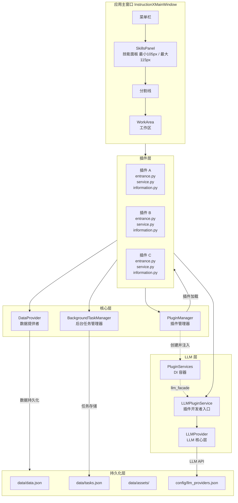
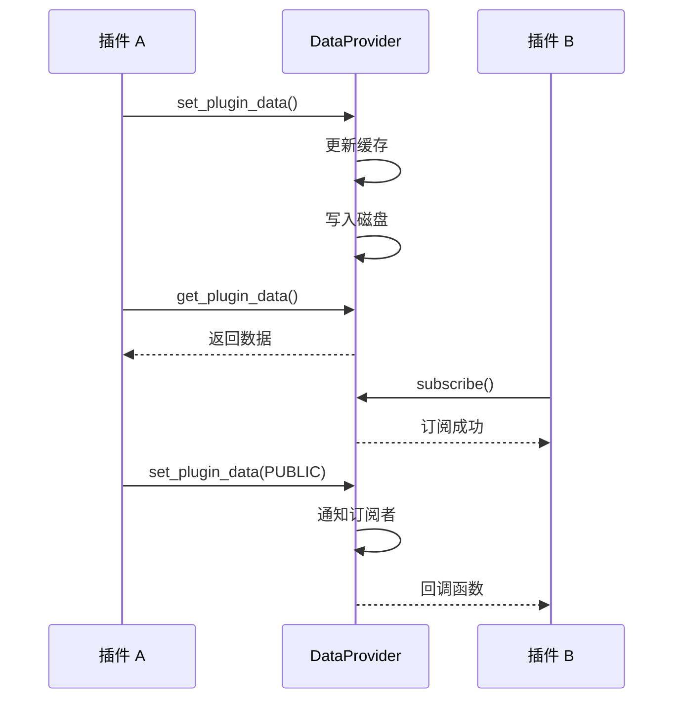
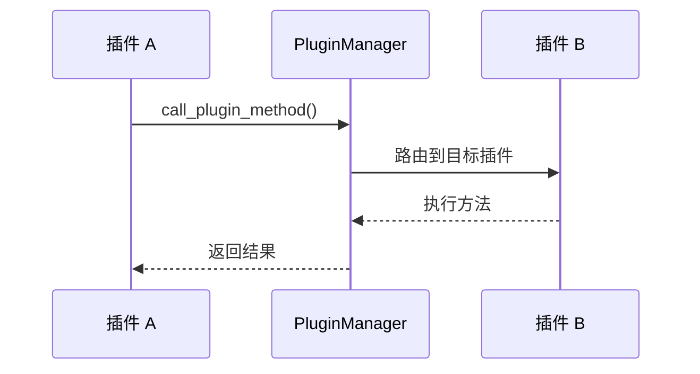
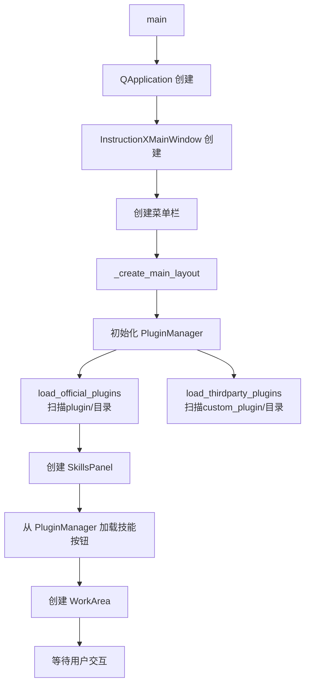

# 系统架构概述

> InstructionX 项目的整体架构设计介绍

---

## 1. 项目简介

**InstructionX** 是一个基于 **PySide6** 构建的插件式桌面应用程序框架。它采用模块化设计，支持插件热插拔、数据持久化、任务调度和跨插件 API 调用。

### 技术栈

| 技术 | 用途 |
|------|------|
| **PySide6** | Qt 图形界面框架 |
| **Python 3.14** | 编程语言 |
| **JSON** | 数据持久化 |
| **Threading** | 多线程支持 |

---

## 2. 整体架构图



---

## 3. 核心组件

### 3.1 PluginManager（插件管理器）

**文件位置**: `core/plugin/manager.py`

**职责**:
- 扫描并加载官方插件（`plugin/` 目录）
- 扫描并加载第三方插件（`custom_plugin/` 目录）
- 管理插件实例和 API 注册
- 提供跨插件方法调用

**单例模式**: 整个应用只有一个 PluginManager 实例

### 3.2 DataProvider（数据提供者）

**文件位置**: `core/data/data_provider.py`

**职责**:
- 插件数据持久化（JSON 文件 + 原子写入）
- 内存缓存管理
- 命名空间隔离（PRIVATE / PUBLIC）
- 发布/订阅通信机制
- 资源文件管理

**单例模式**: 全局唯一的数据访问入口

### 3.3 BackgroundTaskManager（后台任务管理器）

**文件位置**: `core/task/background_task.py`

**职责**:
- 同步任务执行
- 异步任务调度
- 定时任务管理
- 任务状态持久化

**单例模式**: 全局任务调度中心

### 3.4 LLM 层（LLMProvider + LLMPluginService）

**文件位置**:
- `core/llm/llm_provider.py` — LLM 核心层（底层）
- `core/llm/plugin_service.py` — LLM 插件服务层（插件开发者入口）

**LLMProvider（核心层）**:
- 多提供商管理（MiniMax、SiliconFlow、GLM、Ollama）
- 统一 API 接口（chat、stream_chat、embed）
- 模型列表获取与缓存
- Function Calling 支持

**LLMPluginService（插件服务层）**:
- 插件开发者唯一入口（推荐使用 `get_llm_plugin_service()`）
- 对话管理（创建/发送/流式/统计）
- 工具调用自动化（ToolCallExecutor）
- 多模态（图片/TTS）

**DI 注入**: `PluginManager` 通过 `PluginServices.llm_facade` 注入到各插件

#### 3.4.1 ConversationManager

**文件位置**: `core/llm/conversation_manager.py`

**职责**:
- 对话生命周期管理（创建、更新、查询）
- 自动上下文截断（保留 system + 最近 2/3 消息，超阈值 80% 自动截断）
- Token 估算（中文字符按 1:1 计，英文按 4:1 估算）
- 费用计算（基于 `DEFAULT_PRICING` 定价表）

#### 3.4.2 ToolCallExecutor / ToolRegistry

**文件位置**: `core/llm/tool_call_executor.py`

**职责**:
- `ToolRegistry`: 集中管理所有可用工具（`register_tool()` / `unregister_tool()` / `get_tool()`）
- `ToolCallExecutor`: 自动工具调用循环（`chat_with_tools()`），支持流式版本

**数据文件**:
- `core/llm/types.py` — 集中管理 LLMPluginService 相关数据类型（Conversation、ToolResult、UsageStats 等）
- `core/llm/pricing.py` — 提供 `DEFAULT_PRICING` 定价表
- `core/llm/types_cache.py` — 统一缓存信息类型（CacheInfo、CacheType）
- `core/llm/cache_adapter.py` — 各 Provider 缓存适配器
- `core/llm/usage_record_store.py` — 用量记录持久化（`data/llm_usage.json`）

### 3.5 PluginVersion（版本管理）

**文件位置**: `core/plugin/plugin_version.py`

**职责**: 语义化版本管理，支持类型前缀（release/beta/alpha/internal）和中文显示。

### 3.6 PluginIcon（图标管理）

**文件位置**: `core/plugin/plugin_icon.py`

**职责**: 支持多种图标加载策略（BUILTIN、FILE、RESOURCE、BASE64、NONE）。

### 3.7 PluginIdentity（身份标识）

**文件位置**: `core/plugin/plugin_identity.py`

**职责**: 为每个插件生成和管理唯一 UUID，持久化到 `.plugin_info.json`。

### 3.8 PluginConfigManager（配置管理）

**文件位置**: `core/plugin/config_manager.py`

**职责**: 管理插件显示顺序配置，持久化到 `config/plugin_order.json`。

### 3.9 TaskStorage（任务持久化）

**文件位置**: `core/task/task_storage.py`

**职责**: 任务数据持久化层，管理 `data/tasks.json`，支持原子写入和缓存。

### 3.10 抽象接口层

**文件位置**: `core/interfaces/`

**职责**: 定义框架的抽象接口层，将插件开发 API 与内部实现解耦。这是框架设计的核心层，确保插件只依赖接口而非具体实现。

**设计目标**:
- **解耦**: 插件通过接口与核心服务交互，不依赖具体实现类
- **契约**: 明确每个服务的能力边界和使用方式
- **测试**: 可以为接口创建 mock 实现进行单元测试
- **扩展**: 未来可以替换实现而无需修改插件代码

**接口清单**:

| 接口 | 文件 | 说明 | 对应实现 |
|------|------|------|---------|
| `IPlugin` | `i_plugin.py` | 插件抽象基类 | `core/plugin/plugin_interface.py` |
| `IPluginInfo` | `i_plugin_info.py` | 插件信息抽象基类 | `core/plugin/plugin_info_interface.py` |
| `IDataProvider` | `i_data_provider.py` | 数据提供者接口 | `core/data/data_provider.py` |
| `ITaskManager` | `i_task_manager.py` | 任务管理器接口 | `core/task/background_task.py` |
| `ILLMFacade` | `i_llm_facade.py` | LLM 外观接口（方法签名兼容，非继承） | `core/llm/llm_provider.py`（Duck Typing 实现） |
| `ILogger` | `i_logger.py`（`core/interfaces/` 重导出） | 日志接口 | `utils/logging_tools.py`（LoggerManager） |
| `PluginServices` | `plugin_services.py` | 服务封装（依赖注入容器） | — |

**导入指南**:
```python
# 从 core.interfaces 导入所有接口（推荐）
from core.interfaces import (
    IPlugin,
    IPluginInfo,
    IDataProvider,
    ITaskManager,
    ILLMFacade,
    ILogger,
    PluginServices,
    TaskType,
    TaskStatus,
    DataNamespace
)
```

**详细文档**: [接口层概述](../core/interfaces/overview.md)

---

## 4. 数据流

### 4.1 插件数据流



### 4.2 插件调用流



---

## 5. 目录结构

```
InstructionX/
├── main.py                    # 应用入口
│
├── core/                      # 核心模块
│   ├── interfaces/           # 抽象接口定义
│   │   ├── __init__.py      # 导出所有接口（含 ILogger 重导出）
│   │   ├── i_plugin.py       # IPlugin 抽象基类
│   │   ├── i_plugin_info.py  # IPluginInfo 抽象基类
│   │   ├── i_data_provider.py    # IDataProvider 抽象接口
│   │   ├── i_task_manager.py      # ITaskManager 抽象接口
│   │   ├── i_llm_facade.py       # ILLMFacade 抽象接口
│   │   └── plugin_services.py    # PluginServices 服务封装
│   ├── plugin/               # 插件系统实现
│   │   ├── manager.py       # PluginManager
│   │   ├── plugin_interface.py  # IPlugin（向后兼容导入路径）
│   │   ├── plugin_info_interface.py  # IPluginInfo（向后兼容导入路径）
│   │   ├── plugin_version.py
│   │   ├── plugin_icon.py
│   │   ├── plugin_identity.py
│   │   └── config_manager.py
│   ├── data/                 # 数据层实现
│   │   ├── data_provider.py # DataProvider（核心）
│   │   ├── dao.py           # 预留：DAO 扩展
│   │   ├── database_connection.py  # 预留：数据库连接
│   │   ├── database_manager.py     # 预留：数据库管理
│   │   └── sql_map.py       # 预留：SQL 映射
│   ├── task/                 # 后台任务实现
│   │   ├── background_task.py
│   │   ├── task_model.py
│   │   ├── task_storage.py
│   │   └── scheduler.py
│   └── llm/                  # LLM 提供者实现
│       ├── llm_provider.py  # LLMProvider 核心层
│       ├── provider_interface.py
│       ├── plugin_service.py # LLMPluginService 插件服务层
│       ├── conversation_manager.py  # 对话管理
│       ├── tool_call_executor.py   # 工具调用自动化
│       ├── types.py        # 数据类型
│       ├── pricing.py      # 定价表
│       ├── config.py
│       ├── exceptions.py
│       └── providers/       # Provider 实现
│           ├── base.py
│           ├── minimax.py
│           ├── siliconflow.py
│           ├── glm.py
│           └── ollama.py
│
├── ui/                       # UI 模块
│   ├── main_window.py       # 主窗口
│   ├── title_bar.py        # 自定义标题栏
│   ├── plugin_order_dialog.py  # 插件排序对话框（主文件）
│   ├── skills_panel/        # 技能面板
│   │   ├── panel.py        # SkillsPanel 面板
│   │   └── skill_button.py  # SkillButton 按钮组件
│   ├── work_area/           # 工作区
│   │   └── work_area.py
│   └── dialog/              # 对话框
│       ├── __init__.py
│       ├── about_dialog.py      # 关于对话框
│       ├── llm_settings_dialog.py  # LLM 设置对话框（两栏）
│       └── llm_model_service_dialog.py  # 模型服务对话框（三栏）
│
├── workers/                  # 预留：多进程工作池
│
├── plugin/                   # 官方插件
│   ├── llm_chat/
│   ├── sample_ai_plugin/   # LLM 集成示例
│   ├── text_formatting/
│   ├── code_formatter/
│   └── ...
│
├── custom_plugin/            # 第三方插件
│   ├── api_demo/
│   └── ...
│
├── data/                     # 数据存储
│   ├── data.json
│   ├── tasks.json
│   └── assets/
│
├── config/                   # 配置目录
│   ├── plugin_order.json
│   ├── llm_providers.json
│   └── llm_models_cache.json
│
├── utils/                    # 工具类
│   ├── logging_tools.py     # 日志管理
│   ├── i_logger.py         # ILogger 接口
│   ├── themes.py           # 主题检测与切换
│   └── style_qss/          # StyleQSS 样式系统（QSS 片段注册 + 主题变量）
│
└── docs/                     # 技术文档
```

---

## 6. 启动流程



---

## 7. 关键技术特性

### 7.1 单例模式

所有核心组件采用单例模式：

```python
class PluginManager:
    _instance = None

    def __new__(cls):
        if cls._instance is None:
            cls._instance = super().__new__(cls)
        return cls._instance
```

### 7.2 线程安全

- DataProvider 使用 `Lock`（文件写入锁）和 `RLock`（订阅管理锁）双重锁机制（`core/data/data_provider.py:75-76`）
- BackgroundTaskManager 使用线程池

### 7.3 原子写入

数据持久化采用临时文件 + 原子重命名：

```python
# 写入临时文件
with open(temp_file, 'w') as f:
    json.dump(data, f)

# 原子重命名
os.replace(temp_file, data_file)
```

---

## 相关文档

- [模块依赖关系](module-dependencies.md)
- [插件系统概述](../core/plugin-system/overview.md)
- [DataProvider 概述](../core/data-provider/overview.md)
- [后台任务概述](../core/background-task/overview.md)
- [LLM Provider 概述](../core/llm-provider/overview.md)

---

