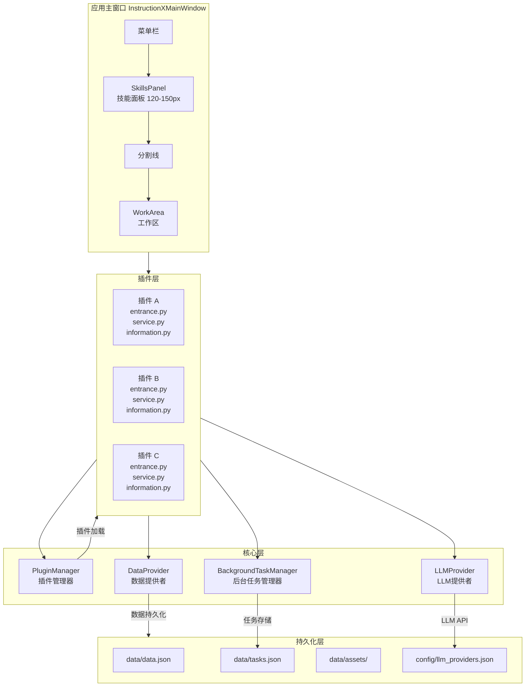
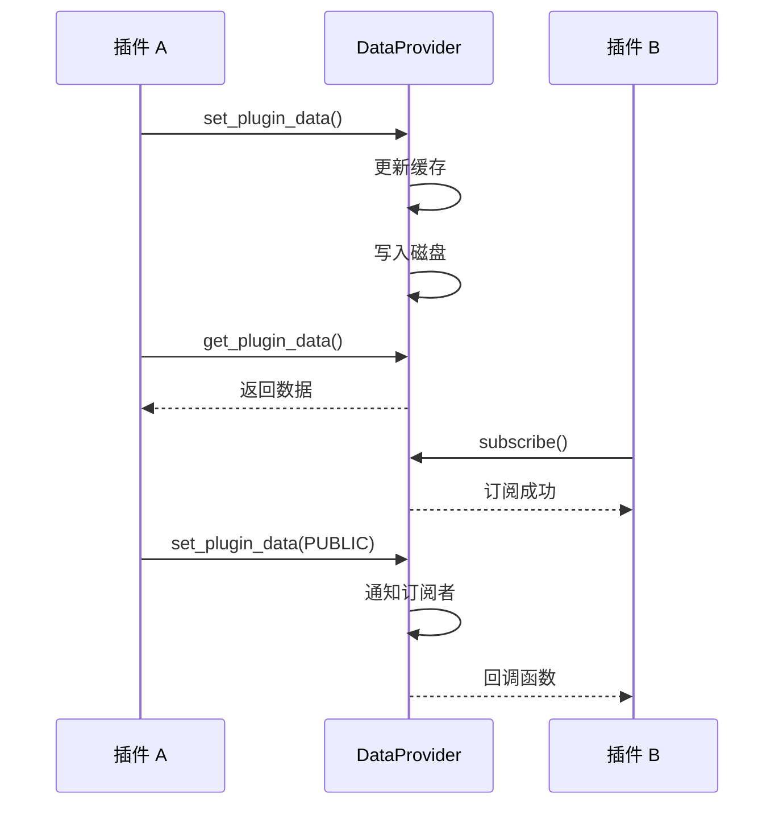
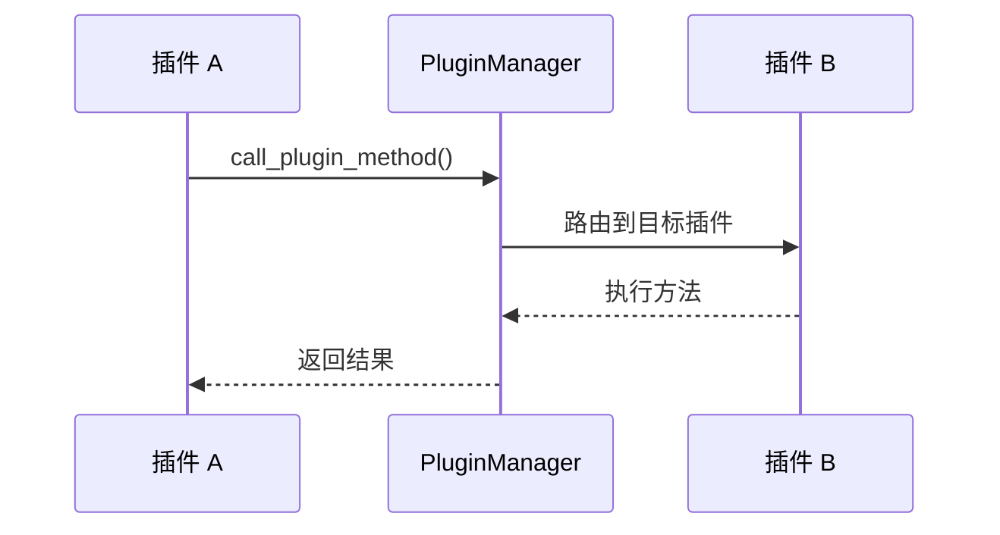
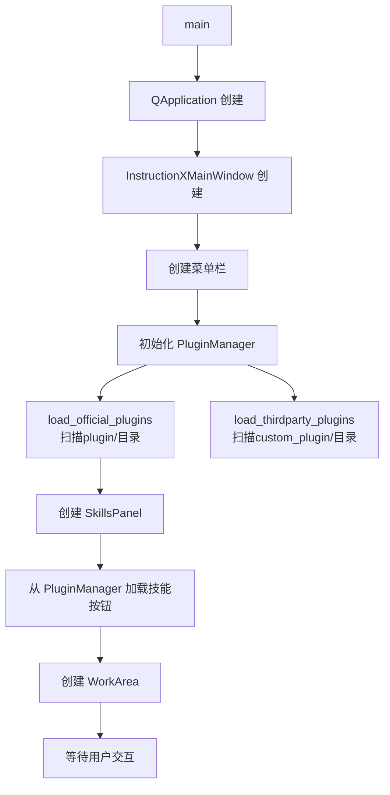

# 系统架构概述

> InstructionX 项目的整体架构设计介绍

---

## 1. 项目简介

**InstructionX** 是一个基于 **PySide6** 构建的插件式桌面应用程序框架。它采用模块化设计，支持插件热插拔、数据持久化、任务调度和跨插件 API 调用。

### 技术栈

| 技术 | 用途 |
|------|------|
| **PySide6** | Qt 图形界面框架 |
| **Python 3.14+** | 编程语言 |
| **JSON** | 数据持久化 |
| **Threading** | 多线程支持 |

---

## 2. 整体架构图



---

## 3. 核心组件

### 3.1 PluginManager（插件管理器）

**文件位置**: `core/plugin/manager.py`

**职责**:
- 扫描并加载官方插件（`plugin/` 目录）
- 扫描并加载第三方插件（`custom_plugin/` 目录）
- 管理插件实例和 API 注册
- 提供跨插件方法调用

**单例模式**: 整个应用只有一个 PluginManager 实例

### 3.2 DataProvider（数据提供者）

**文件位置**: `core/data/data_provider.py`

**职责**:
- 插件数据持久化（JSON 文件 + 原子写入）
- 内存缓存管理
- 命名空间隔离（PRIVATE / PUBLIC）
- 发布/订阅通信机制
- 资源文件管理

**单例模式**: 全局唯一的数据访问入口

### 3.3 BackgroundTaskManager（后台任务管理器）

**文件位置**: `core/task/background_task.py`

**职责**:
- 同步任务执行
- 异步任务调度
- 定时任务管理
- 任务状态持久化

**单例模式**: 全局任务调度中心

### 3.4 LLMProvider（LLM 提供者）

**文件位置**: `core/llm/llm_provider.py`

**职责**:
- 多提供商管理（MiniMax、SiliconFlow、GLM、Ollama）
- 统一 API 接口（chat、stream_chat、embed）
- 模型列表获取与缓存
- Function Calling 支持

**单例模式**: 全局 LLM 服务入口

---

## 4. 数据流

### 4.1 插件数据流



### 4.2 插件调用流



---

## 5. 目录结构

```
InstructionX/
├── main.py                    # 应用入口
│
├── core/                      # 核心模块
│   ├── __init__.py          # 导出核心 API
│   ├── plugin/               # 插件系统
│   │   ├── manager.py       # PluginManager
│   │   ├── plugin_interface.py  # IPlugin
│   │   ├── plugin_info_interface.py
│   │   ├── plugin_version.py
│   │   ├── plugin_icon.py
│   │   ├── plugin_identity.py
│   │   └── config_manager.py
│   ├── data/                 # 数据层
│   │   ├── data_provider.py # DataProvider（核心）
│   │   ├── dao.py           # 预留：DAO 扩展
│   │   ├── database_connection.py  # 预留：数据库连接
│   │   ├── database_manager.py     # 预留：数据库管理
│   │   └── sql_map.py       # 预留：SQL 映射
│   ├── task/                 # 后台任务
│   │   ├── background_task.py
│   │   ├── task_model.py
│   │   ├── task_storage.py
│   │   └── scheduler.py
│   └── llm/                  # LLM 提供者
│       ├── llm_provider.py  # LLMProvider
│       ├── provider_interface.py
│       ├── config.py
│       ├── exceptions.py
│       └── providers/       # Provider 实现
│           ├── base.py
│           ├── minimax.py
│           ├── siliconflow.py
│           ├── glm.py
│           └── ollama.py
│
├── ui/                       # UI 模块
│   ├── main_window.py       # 主窗口
│   ├── skills_panel/        # 技能面板
│   │   └── panel.py
│   ├── work_area/           # 工作区
│   │   └── work_area.py
│   └── dialog/              # 对话框
│       ├── llm_settings_dialog.py
│       └── plugin_order_dialog.py
│
├── workers/                  # 预留：多进程工作池
│
├── plugin/                   # 官方插件
│   ├── text_formatting/
│   ├── code_formatter/
│   └── ...
│
├── custom_plugin/            # 第三方插件
│   ├── api_demo/
│   └── ...
│
├── data/                     # 数据存储
│   ├── data.json
│   ├── tasks.json
│   └── assets/
│
├── config/                   # 配置目录
│   ├── plugin_order.json
│   ├── llm_providers.json
│   └── llm_models_cache.json
│
├── utils/                    # 工具类
│   ├── logging_tools.py
│   ├── themes.py
│   └── fluent_style/        # FluentUI3 样式系统
│
└── docs/                     # 技术文档
```

---

## 6. 启动流程



---

## 7. 关键技术特性

### 7.1 单例模式

所有核心组件采用单例模式：

```python
class PluginManager:
    _instance = None

    def __new__(cls):
        if cls._instance is None:
            cls._instance = super().__new__(cls)
        return cls._instance
```

### 7.2 线程安全

- DataProvider 使用 `RLock`（可重入锁）
- BackgroundTaskManager 使用线程池

### 7.3 原子写入

数据持久化采用临时文件 + 原子重命名：

```python
# 写入临时文件
with open(temp_file, 'w') as f:
    json.dump(data, f)

# 原子重命名
os.replace(temp_file, data_file)
```

---

## 相关文档

- [模块依赖关系](module-dependencies.md)
- [插件系统概述](../core/plugin-system/overview.md)
- [DataProvider 概述](../core/data-provider/overview.md)
- [后台任务概述](../core/background-task/overview.md)
- [LLM Provider 概述](../core/llm-provider/overview.md)

---

*本文档由 Claude Code 自动生成*
