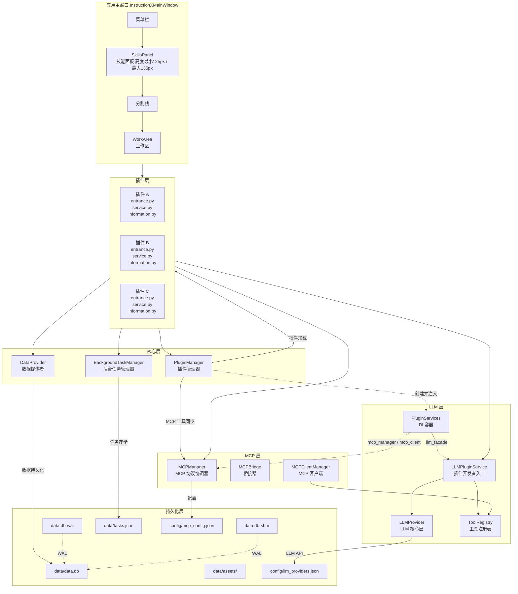
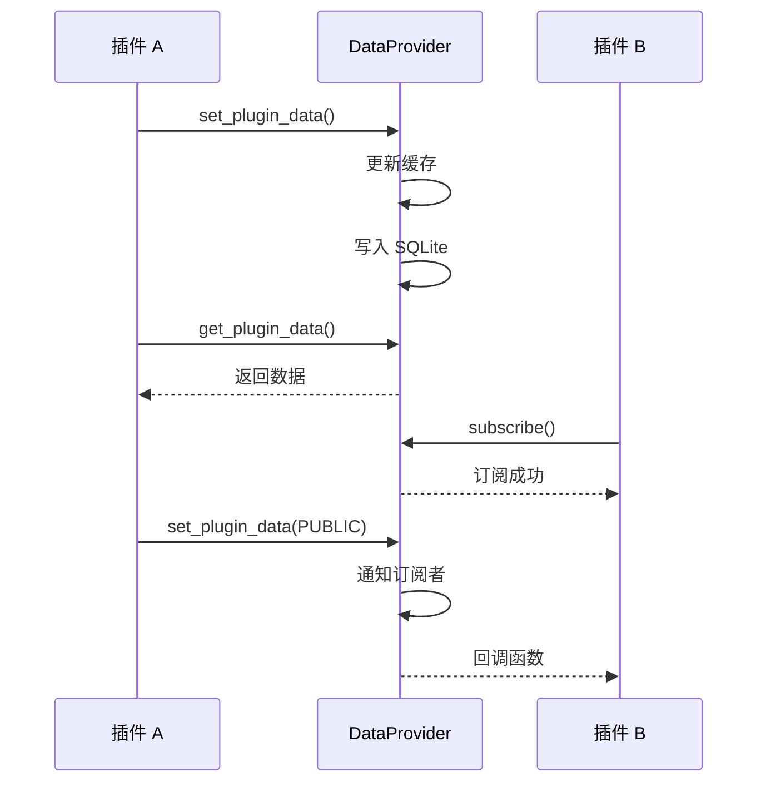
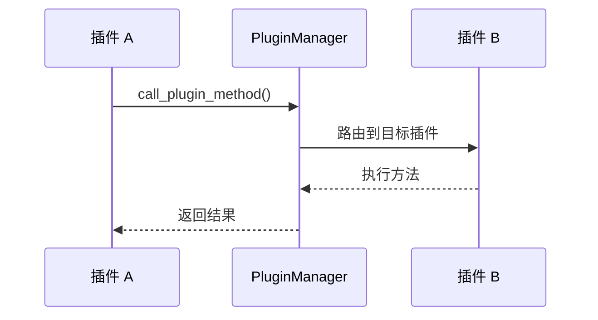
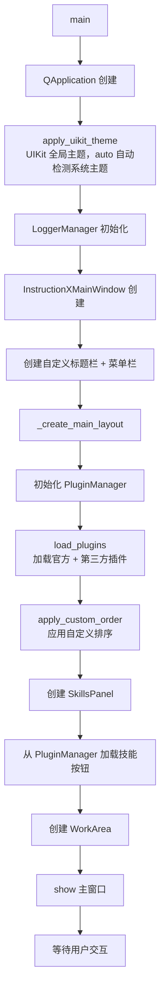

# 系统架构概述

> InstructionX 项目的整体架构设计介绍

---

## 1. 项目简介

**InstructionX** 是一个基于 **PySide6** 构建的插件式桌面应用程序框架。它采用模块化设计，支持插件热插拔、数据持久化、任务调度和跨插件 API 调用。

### 技术栈

| 技术 | 用途 |
|------|------|
| **PySide6** | Qt 图形界面框架 |
| **Python 3.14** | 编程语言 |
| **SQLite** | 数据持久化（默认 SQLite + WAL；JSON 仅应急回退） |
| **Threading** | 多线程支持 |

---

## 2. 整体架构图



---

## 3. 核心组件

### 3.1 PluginManager（插件管理器）

**文件位置**: `core/plugin/manager.py`

**职责**:
- 扫描并加载官方插件（`plugin/` 目录）
- 扫描并加载第三方插件（`custom_plugin/` 目录）
- 管理插件实例和 API 注册
- 提供跨插件方法调用
- MCP 工具同步（注册/注销插件 API 时自动通知 MCP 层）

**单例模式**: 整个应用只有一个 PluginManager 实例

### 3.2 DataProvider（数据提供者）

**文件位置**: `core/data/data_provider.py`

**职责**:
- 插件数据持久化（SQLite + WAL，保留 JSON 应急开关）
- 内存缓存管理
- 命名空间隔离（PRIVATE / PUBLIC）
- 发布/订阅通信机制
- 资源文件管理

**单例模式**: 全局唯一的数据访问入口

### 3.3 BackgroundTaskManager（后台任务管理器）

**文件位置**: `core/task/background_task.py`

**职责**:
- 同步任务执行
- 异步任务调度
- 定时任务管理
- 任务状态持久化

**单例模式**: 全局任务调度中心

### 3.4 LLM 层（LLMProvider + LLMPluginService）

**文件位置**:
- `core/llm/llm_provider.py` — LLM 核心层（底层）
- `core/llm/plugin_service.py` — LLM 插件服务层（插件开发者入口）

**LLMProvider（核心层）**:
- 多提供商实例管理（内置预设：MiniMax、SiliconFlow、GLM、Ollama、OpenAI；自定义 OpenAI 兼容实例）
- 按实例 `adapter` 查询适配器注册表创建实例（注册表键为适配器家族）
- 统一 API 接口（chat、stream_chat、embed）
- 模型列表获取与缓存（缓存键为实例 id）
- 连通性检查（`check_provider` / `check_model`）与健康跟踪
- 配置版本比对惰性刷新（无需手动 `reload_config()`）
- Function Calling 支持

**LLMPluginService（插件服务层）**:
- 插件开发者唯一入口（推荐使用 `get_llm_plugin_service()`），显式继承 `ILLMService`
- 对话管理（创建/发送/流式/统计）
- 工具调用自动化（ToolCallExecutor，返回 ToolChatResult）
- 多模态（图片/TTS）
- 实例与模型查询（`list_providers` / `get_models` / `get_default_provider_id`），不泄漏底层实例与 api_key

**DI 注入**: `PluginManager` 通过 `PluginServices.llm_facade` 注入到各插件

#### 3.4.1 ConversationManager

**文件位置**: `core/llm/conversation_manager.py`

**职责**:
- 对话生命周期管理（创建、更新、查询）
- 上下文截断（超出 `max_context_tokens`（默认 120000）时自动从最早的用户/助手消息开始截断，system prompt 与最近消息保留；旧参数名 `max_context` 为废弃兼容参数）
- Token 估算（中文字符按 1:1 计，英文按 4:1 估算）
- 费用计算（基于 `DEFAULT_PRICING` 定价表，随配置变更热更新）

#### 3.4.2 ToolCallExecutor / ToolRegistry

**文件位置**: `core/llm/tool_call_executor.py`

**职责**:
- `ToolRegistry`: 集中管理所有可用工具（`register()` / `register_typed()` / `unregister()` / `get_handler()`）
- `ToolCallExecutor`: 自动工具调用循环（`chat_with_tools()`，返回 `ToolChatResult`），支持流式版本

**数据文件**:
- `core/llm/types.py` — 集中管理 LLMPluginService 相关数据类型（Conversation、ProviderInfo、ToolChatResult、ToolDefinition、UsageStats 等）
- `core/llm/model_schema.py` — 统一模型 schema（capabilities 闭集、normalize、三路合并、分组推断）
- `core/llm/catalog/` — 提供商预设目录（ProviderPreset / PROVIDER_PRESETS / PRESET_MODELS / logos/，随程序发布只读）
- `core/llm/pricing.py` — 提供 `DEFAULT_PRICING` 定价表
- `core/llm/types_cache.py` — 统一缓存信息类型（CacheInfo、CacheType）
- `core/llm/cache_adapter.py` — 各 Provider 缓存适配器
- `core/llm/usage_record_store.py` — 用量记录持久化（`data/llm_usage.json`）

### 3.5 PluginVersion（版本管理）

**文件位置**: `core/plugin/plugin_version.py`

**职责**: 语义化版本管理，支持类型前缀（release/beta/alpha/internal）和中文显示。

### 3.6 PluginIcon（图标管理）

**文件位置**: `core/plugin/plugin_icon.py`

**职责**: 支持多种图标加载策略（BUILTIN、FILE、RESOURCE、BASE64、NONE）。

### 3.7 PluginIdentity（身份标识）

**文件位置**: `core/plugin/plugin_identity.py`

**职责**: 为每个插件生成和管理唯一 UUID，持久化到 `.plugin_info.json`。

### 3.8 PluginConfigManager（配置管理）

**文件位置**: `core/plugin/config_manager.py`

**职责**: 管理插件显示顺序配置，持久化到 `config/plugin_order.json`。

### 3.9 TaskStorage（任务持久化）

**文件位置**: `core/task/task_storage.py`

**职责**: 任务数据持久化层，管理 `data/tasks.json`，支持原子写入和缓存。

### 3.10 GitHubPluginInstaller（GitHub 插件安装器）

**文件位置**: `core/plugin/github_plugin_installer.py`

**职责**: 从 GitHub 仓库远程安装插件，支持单插件和多插件仓库。

**功能特性**:
- 检测仓库类型（单插件 `IXPlugin.json` / 多插件 `IXRepo.json`）
- 解析 GitHub URL 支持多种格式
- 自动判定安装目录（KKPIP-Tech → plugin/，其他 → custom_plugin/）
- 后台下载，不阻塞 UI

**详细文档**: [GitHub 插件安装器](../core/plugin-system/plugin-installer.md)

### 3.11 抽象接口层

**文件位置**: `core/interfaces/`

**职责**: 定义框架的抽象接口层，将插件开发 API 与内部实现解耦。这是框架设计的核心层，确保插件只依赖接口而非具体实现。

**设计目标**:
- **解耦**: 插件通过接口与核心服务交互，不依赖具体实现类
- **契约**: 明确每个服务的能力边界和使用方式
- **测试**: 可以为接口创建 mock 实现进行单元测试
- **扩展**: 未来可以替换实现而无需修改插件代码

**接口清单**:

| 接口 | 文件 | 说明 | 对应实现 |
|------|------|------|---------|
| `IPlugin` | `i_plugin.py` | 插件抽象基类 | `core/plugin/plugin_interface.py` |
| `IPluginInfo` | `i_plugin_info.py` | 插件信息抽象基类 | `core/plugin/plugin_info_interface.py` |
| `IDataProvider` | `i_data_provider.py` | 数据提供者接口 | `core/data/data_provider.py` |
| `ITaskManager` | `i_task_manager.py` | 任务管理器接口 | `core/task/background_task.py` |
| `ILLMService` | `i_llm_service.py` | LLM 插件服务接口 | `core/llm/plugin_service.py`（`LLMPluginService` 显式继承） |
| `ILogger` | `i_logger.py`（`core/interfaces/` 重导出） | 日志接口 | `utils/logging_tools.py`（LoggerManager） |
| `PluginServices` | `plugin_services.py` | 服务封装（依赖注入容器） | — |

**导入指南**:
```python
# 从 core.interfaces 导入所有接口（推荐）
from core.interfaces import (
    IPlugin,
    IPluginInfo,
    IDataProvider,
    ITaskManager,
    ILLMService,
    ILogger,
    PluginServices,
    TaskType,
    TaskStatus,
    DataNamespace
)
```

**详细文档**: [接口层概述](../core/interfaces/overview.md)

---

## 4. 数据流

### 4.1 插件数据流



### 4.2 插件调用流



---

## 5. 目录结构

```
InstructionX/
├── main.py                    # 应用入口
│
├── core/                      # 核心模块
│   ├── interfaces/           # 抽象接口定义
│   │   ├── __init__.py      # 导出所有接口（含 ILogger 重导出）
│   │   ├── i_plugin.py       # IPlugin 抽象基类
│   │   ├── i_plugin_info.py  # IPluginInfo 抽象基类
│   │   ├── i_data_provider.py    # IDataProvider 抽象接口
│   │   ├── i_task_manager.py      # ITaskManager 抽象接口
│   │   ├── i_llm_service.py      # ILLMService 抽象接口（LLM 插件服务契约）
│   │   ├── i_logger.py           # ILogger 接口重导出（向后兼容）
│   │   └── plugin_services.py    # PluginServices 服务封装
│   ├── plugin/               # 插件系统实现
│   │   ├── manager.py       # PluginManager
│   │   ├── plugin_interface.py  # IPlugin（向后兼容导入路径）
│   │   ├── plugin_info_interface.py  # IPluginInfo（向后兼容导入路径）
│   │   ├── plugin_version.py
│   │   ├── plugin_icon.py
│   │   ├── plugin_identity.py
│   │   ├── config_manager.py
│   │   ├── plugin_groups.py   # 用户自定义分组存储（config/plugin_groups.json）
│   │   ├── plugin_registry.py # 已安装插件注册表（config/plugin_registry.json）
│   │   ├── tool_name.py       # 工具命名/清洗工具
│   │   ├── dependency_manager.py  # 插件依赖管理
│   │   └── github_plugin_installer.py  # GitHub 插件安装器
│   ├── data/                 # 数据层实现
│   │   ├── data_provider.py # DataProvider（核心）
│   │   ├── sqlite_backend.py # SQLite 后端（连接、DDL、事务、CRUD）
│   │   ├── sql_map.py       # SQL 语句映射
│   │   ├── schema_migrations.py # Schema 版本与迁移脚本
│   │   └── __init__.py
│   ├── task/                 # 后台任务实现
│   │   ├── background_task.py
│   │   ├── task_model.py
│   │   ├── task_storage.py
│   │   └── scheduler.py
│   ├── mcp/                  # MCP 协议模块
│   │   ├── __init__.py
│   │   ├── client.py         # MCPClientManager（MCP 客户端）
│   │   ├── server.py         # MCPHostServer（MCP 主机）
│   │   ├── manager.py        # MCPManager（单例协调器）
│   │   ├── bridge.py         # MCPBridge（桥接器）
│   │   ├── config.py         # MCP 配置
│   │   └── plugin_interface.py  # MCP 插件接口
│   ├── font/                 # 字体子系统（框架不自带字体）
│   │   ├── manager.py        # FontManager 单例（安装/卸载/注册表持久化/系统回退）
│   │   ├── font_record.py    # FontRecord 字体注册记录
│   │   └── exceptions.py     # FontInstallError
│   └── llm/                  # LLM 提供者实现
│       ├── llm_provider.py  # LLMProvider 核心层（adapter 分发、check_*、惰性刷新）
│       ├── provider_interface.py  # ILLM + Message/ChatResponse/ToolCall/ModelInfo/ModelCheckResult
│       ├── model_schema.py  # 统一模型 schema（capabilities 闭集/normalize/三路合并）
│       ├── catalog/         # 提供商预设目录（ProviderPreset/PROVIDER_PRESETS/PRESET_MODELS/logos）
│       ├── plugin_service.py # LLMPluginService 插件服务层（ILLMService 实现）
│       ├── conversation_manager.py  # 对话管理
│       ├── tool_call_executor.py   # 工具调用自动化（ToolChatResult / register_typed）
│       ├── types.py        # 数据类型（DEFAULT_PROVIDER/ProviderInfo/ToolChatResult 等）
│       ├── types_cache.py  # 类型缓存
│       ├── cache_adapter.py # 缓存适配器
│       ├── pricing.py      # 定价表
│       ├── config.py       # ProviderConfig / LLMConfig 单例（schema v2 + 迁移 + 订阅）
│       ├── secure_keys.py  # API Key 混淆存储
│       ├── usage_record_store.py # 用量记录存储
│       ├── exceptions.py
│       └── providers/       # 适配器注册表 + 各 Provider 实现
│           ├── __init__.py  # PROVIDER_REGISTRY（adapter→类）+ register_adapter 等
│           ├── base.py
│           ├── minimax.py
│           ├── siliconflow.py
│           ├── glm.py
│           ├── ollama.py
│           ├── openai.py
│           └── openai_compatible.py  # 自定义 OpenAI 兼容兜底适配器
│
├── ui/                       # UI 模块
│   ├── InstructionX_UIKit/  # UIKit 组件库（设计令牌 + ThemeManager + 57 组件/布局/图表，同步副本不修改）
│   ├── uikit_bootstrap.py   # sys.path 引导（使 UIKit 以顶层包可导入，main.py 第一个业务 import）
│   ├── uikit_theme.py       # 全局主题入口（apply_uikit_theme 三模式 + 排除区兼容附录）
│   ├── main_window.py       # 主窗口
│   ├── title_bar.py        # 自定义标题栏
│   ├── usage_panel/         # 用量查询面板（包：panel/kpi_card/trend_chart/history_table/formatting）
│   ├── tray/                # 系统托盘子系统（TrayIconManager 门面 + TrayBackend 后端注册表）
│   ├── skills_panel/        # 技能面板
│   │   ├── panel.py        # SkillsPanel 面板
│   │   ├── plugin_group_widget.py  # 分组折叠控件
│   │   └── skill_button.py  # SkillButton 按钮组件
│   ├── work_area/           # 工作区
│   │   └── work_area.py
│   └── dialog/              # 对话框
│       ├── __init__.py
│       ├── about_dialog.py      # 关于对话框
│       ├── license_dialog.py    # 开源许可对话框
│       ├── close_confirm_dialog.py  # 关闭确认对话框（退出/最小化到托盘/取消）
│       ├── llm_settings/        # LLM 设置对话框包（两栏：列表 + 详情，自动保存语义）
│       ├── plugin_management_dialog.py  # 插件管理对话框（安装/升级/降级/卸载 + 分组与排序）
│       ├── plugin_order_dialog.py  # 插件排序对话框
│       └── github_plugin_install_dialog.py  # GitHub 插件安装对话框
│
├── workers/                  # 预留：多进程工作池
│
├── plugin/                   # 官方插件安装目录（.gitignore 忽略 plugin/*/，git 仅跟踪 __init__.py；
│                             #   插件内容经 GitHub 安装器获取，本地开发副本中另有若干官方/示例插件）
│
├── custom_plugin/            # 第三方插件（通过 GitHub 安装器获取，不再捆绑）
│
├── data/                     # 数据存储
│   ├── data.db               # SQLite 主数据库
│   ├── data.db-wal           # WAL 日志（运行时自动生成）
│   ├── data.db-shm           # WAL 共享内存索引（运行时自动生成）
│   ├── tasks.json
│   ├── llm_usage.json
│   ├── conversations.json    # LLM 会话持久化
│   └── assets/
│       └── plugins/          # 插件资源文件
│
├── config/                   # 配置目录
│   ├── plugin_order.json
│   ├── plugin_groups.json    # 用户自定义插件分组
│   ├── plugin_registry.json  # 已安装插件注册表（版本/来源/安装时间）
│   ├── llm_providers.json
│   ├── llm_models_cache.json
│   └── mcp_config.json      # MCP 协议配置
│
├── utils/                    # 工具类
│   ├── logging_tools.py     # 日志管理
│   ├── i_logger.py         # ILogger 接口
│   ├── image_utils.py      # 图片工具（load_image_as_base64）
│   └── thread_utils.py     # 工作线程 → UI 线程封送
│
└── docs/                     # 技术文档
```

---

## 6. 启动流程



> **托盘与退出**：`main.py` 通过 `setQuitOnLastWindowClosed(False)` 切断「最后一个窗口关闭即退出」的隐式链路，退出时机完全由代码显式控制。主窗口 `closeEvent` 拦截全部关闭路径（自绘叉号 / Alt+F4 / 任务栏关闭），每次弹出 `CloseConfirmDialog` 询问「退出程序 / 最小化到托盘 / 取消」；托盘菜单「退出」与 Windows 注销/关机（`commitDataRequest` 守卫置 `_force_quit`）静默直退。`application.exec()` 返回后依次执行 `BackgroundTaskManager.shutdown()` 与 LLM 用量记录冲刷（`UsageRecordStore.flush()`）。详见 [系统托盘](../ui/system-tray.md)。

---

## 7. 关键技术特性

### 7.1 单例模式

核心组件采用单例模式，实现方式分为两类：

**类型 A：`__new__` + `_initialized` 标志（PluginManager）**

```python
class PluginManager:
    _instance = None
    _initialized = False

    def __new__(cls):
        if cls._instance is None:
            cls._instance = super().__new__(cls)
        return cls._instance

    def __init__(self):
        if PluginManager._initialized:
            return
        # 初始化代码...
        PluginManager._initialized = True
```

**类型 B：`__new__` + `threading.Lock` 双重检查锁定（DataProvider、BackgroundTaskManager、LLMProvider、LLMConfig、UsageRecordStore、TaskStorage、LoggerManager）**

```python
class DataProvider:
    _instance = None
    _lock = threading.Lock()

    def __new__(cls, *args, **kwargs):
        if cls._instance is None:
            with cls._lock:
                if cls._instance is None:
                    cls._instance = super().__new__(cls)
        return cls._instance
```

**类型 C：模块级锁 + 全局变量（MCPManager、LLMPluginService）**

```python
_module_lock = threading.Lock()
_module_instance = None

def get_mcp_manager() -> "MCPManager":
    global _module_instance
    if _module_instance is None:
        with _module_lock:
            if _module_instance is None:
                _module_instance = MCPManager()
    return _module_instance
```

### 7.2 线程安全

- DataProvider 使用 `_file_lock`（`RLock`）保护数据库访问与缓存 + `_subscription_lock`（`Lock`）保护订阅表（`core/data/data_provider.py:83-84`）
- BackgroundTaskManager 使用线程池

### 7.3 原子写入

`DataProvider` 默认使用 SQLite 事务保证原子性：

- 单条写入（`set_plugin_data`）由 SQLite 语句级原子性（UPSERT）保证。
- 全量写入（`save_data` / `reset_all_data`）与活跃实例切换（`set_active_instance`）使用 `BEGIN IMMEDIATE` 显式事务，异常时自动回滚。

临时文件 + 原子重命名机制仍保留在 `TaskStorage` 等以 JSON 为后端的组件中使用。

---

## 相关文档

- [模块依赖关系](module-dependencies.md)
- [完整架构分析](full-analysis.md)
- [插件系统概述](../core/plugin-system/overview.md)
- [DataProvider 概述](../core/data-provider/overview.md)
- [后台任务概述](../core/background-task/overview.md)
- [LLM Provider 概述](../core/llm-provider/overview.md)
- [MCP 协议模块概述](../core/mcp/overview.md)
