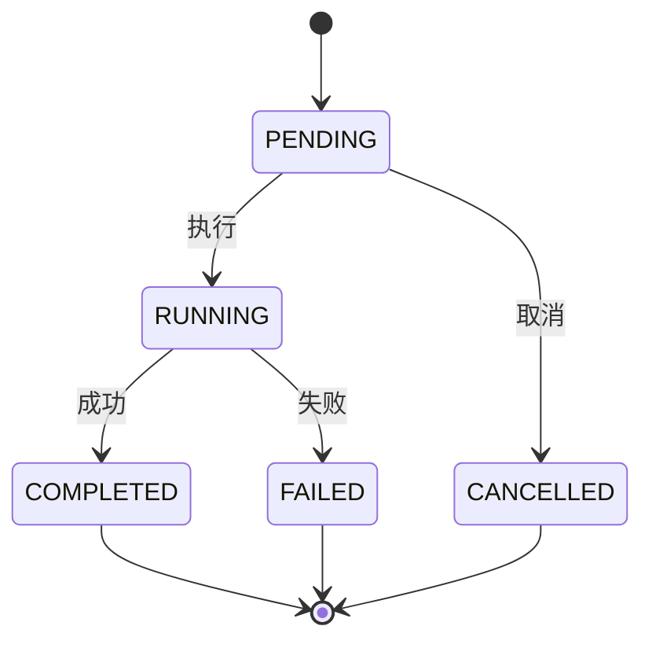
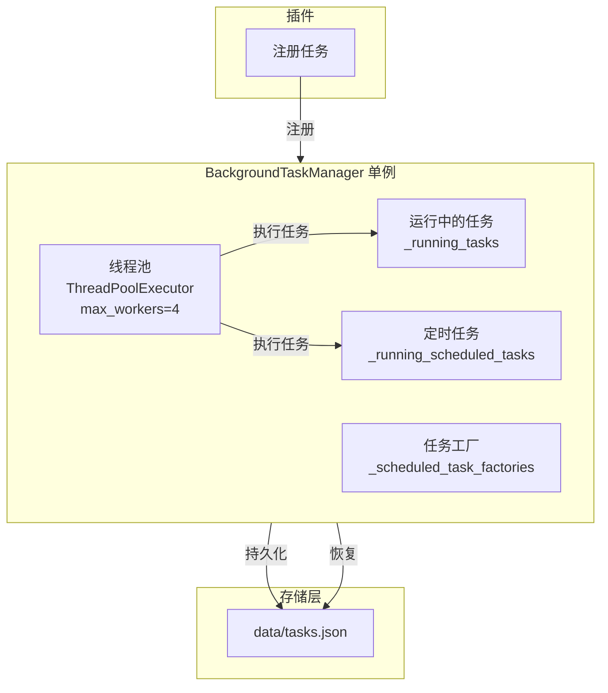
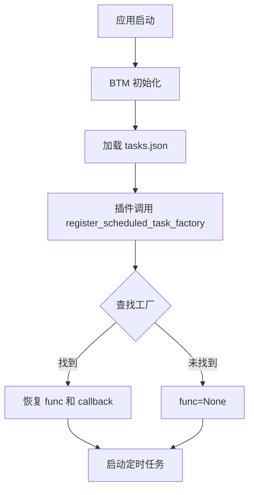

# 后台任务系统概述

> BackgroundTaskManager 的架构设计和核心概念

---

## 1. 概述

`BackgroundTaskManager` 是 InstructionX 项目的后台任务调度组件，负责管理插件提交的后台任务和定时任务。

**文件位置**: `core/task/background_task.py`

**模式**: 单例模式（全局唯一实例）

**核心功能**:
- 同步任务执行
- 异步任务调度
- 定时任务管理
- 任务状态持久化

---

## 2. 任务类型

### 2.1 任务类型枚举

```python
class TaskType(Enum):
    """任务类型枚举"""
    SYNC = "sync"        # 同步任务
    ASYNC = "async"      # 异步任务
    SCHEDULED = "scheduled"  # 定时任务
```

### 2.2 同步任务 (SYNC)

- **特点**: 立即执行，在主线程中运行
- **适用场景**: 快速完成的小任务
- **示例**:
  ```python
  task_id = manager.register_sync_task(
      plugin_id="my-plugin",
      name="同步任务",
      func=my_function,
      callback=my_callback
  )
  ```

### 2.3 异步任务 (ASYNC)

- **特点**: 提交到线程池执行，不阻塞主线程
- **适用场景**: 耗时较长的操作
- **示例**:
  ```python
  task_id = manager.register_async_task(
      plugin_id="my-plugin",
      name="异步任务",
      func=heavy_function,
      callback=my_callback
  )
  ```

### 2.4 定时任务 (SCHEDULED)

- **特点**: 按固定间隔重复执行
- **适用场景**: 定期备份、自动同步等
- **示例**:
  ```python
  task_id = manager.register_scheduled_task(
      plugin_id="my-plugin",
      name="定时任务",
      func=periodic_function,
      interval=60,  # 每 60 秒执行一次
      callback=my_callback
  )
  ```

---

## 3. 任务状态

### 3.1 状态枚举

```python
class TaskStatus(Enum):
    """任务状态枚举"""
    PENDING = "pending"      # 待执行
    RUNNING = "running"      # 执行中
    COMPLETED = "completed"  # 已完成
    FAILED = "failed"        # 执行失败
    CANCELLED = "cancelled"  # 已取消
```

### 3.2 状态转换图



---

## 4. 架构图



---

## 5. 任务数据模型

### 5.1 BackgroundTask

```python
class BackgroundTask:
    """后台任务"""
    task_id: str              # 任务唯一 ID
    plugin_id: str            # 插件 ID
    name: str                 # 任务名称
    task_type: TaskType       # 任务类型
    status: TaskStatus        # 任务状态
    func: Callable            # 执行函数
    callback: Optional[Callable]  # 回调函数
    args: tuple               # 函数参数
    kwargs: dict              # 关键字参数
    result: Any               # 执行结果
    error: str                # 错误信息
    created_at: datetime      # 创建时间
    started_at: Optional[datetime]  # 开始时间
    completed_at: Optional[datetime]  # 完成时间
```

### 5.2 ScheduledTask

```python
class ScheduledTask:
    """定时任务"""
    task_id: str              # 任务唯一 ID
    plugin_id: str            # 插件 ID
    name: str                 # 任务名称
    interval: int             # 执行间隔（秒）
    enabled: bool              # 是否启用
    last_run: Optional[datetime]  # 上次执行时间
    next_run: Optional[datetime]  # 下次执行时间
    func: Optional[Callable]   # 执行函数
    callback: Optional[Callable]  # 回调函数
```

---

## 6. 任务工厂机制

### 6.1 问题背景

定时任务需要持久化存储（保存到 `tasks.json`），但函数和回调无法序列化。

### 6.2 解决方案

使用**任务工厂**机制：

```python
# 1. 插件加载时注册工厂
manager.register_scheduled_task_factory(
    plugin_id,
    func=periodic_task_func,
    callback=periodic_callback
)

# 2. 应用重启时恢复任务
# BackgroundTaskManager 会在启动时自动恢复
```

### 6.3 恢复流程



---

## 7. 回调函数

### 7.1 回调签名

```python
def task_callback(
    task_id: str,
    status: TaskStatus,
    result: Any,
    error: Optional[str]
):
    """
    任务完成回调

    Args:
        task_id: 任务 ID
        status: 最终状态 (COMPLETED / FAILED / CANCELLED)
        result: 任务返回值（如果成功）
        error: 错误信息（如果失败）
    """
    pass
```

### 7.2 使用示例

```python
def on_task_complete(task_id, status, result, error):
    if status == TaskStatus.COMPLETED:
        print(f"任务 {task_id} 完成，结果: {result}")
    elif status == TaskStatus.FAILED:
        print(f"任务 {task_id} 失败: {error}")

# 注册任务
task_id = manager.register_async_task(
    plugin_id="my-plugin",
    name="后台任务",
    func=my_function,
    callback=on_task_complete,
    args=(arg1, arg2),
    kwargs={"key": "value"}
)
```

---

## 8. 持久化存储

### 8.1 tasks.json 结构

```json
{
    "tasks": {
        "task-uuid-1": {
            "task_id": "task-uuid-1",
            "plugin_id": "plugin-uuid",
            "name": "异步任务",
            "task_type": "async",
            "status": "completed",
            "result": {},
            "error": null,
            "created_at": "2026-01-01T10:00:00",
            "completed_at": "2026-01-01T10:00:05"
        }
    },
    "scheduled_tasks": {
        "scheduled-uuid-1": {
            "task_id": "scheduled-uuid-1",
            "plugin_id": "plugin-uuid",
            "name": "定时备份",
            "interval": 3600,
            "enabled": true,
            "last_run": "2026-01-01T10:00:00",
            "next_run": "2026-01-01T11:00:00"
        }
    }
}
```

---

## 9. 相关文档

- [后台任务 API 参考](api-reference.md)
- [插件开发指南](../plugin-system/plugin-development.md)

---

*本文档由 Claude Code 自动生成*
