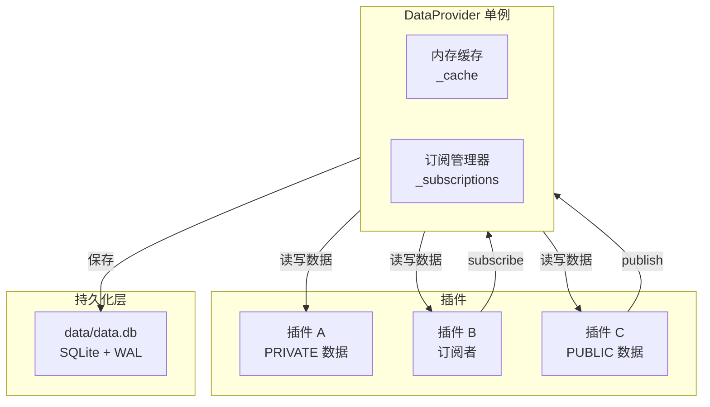
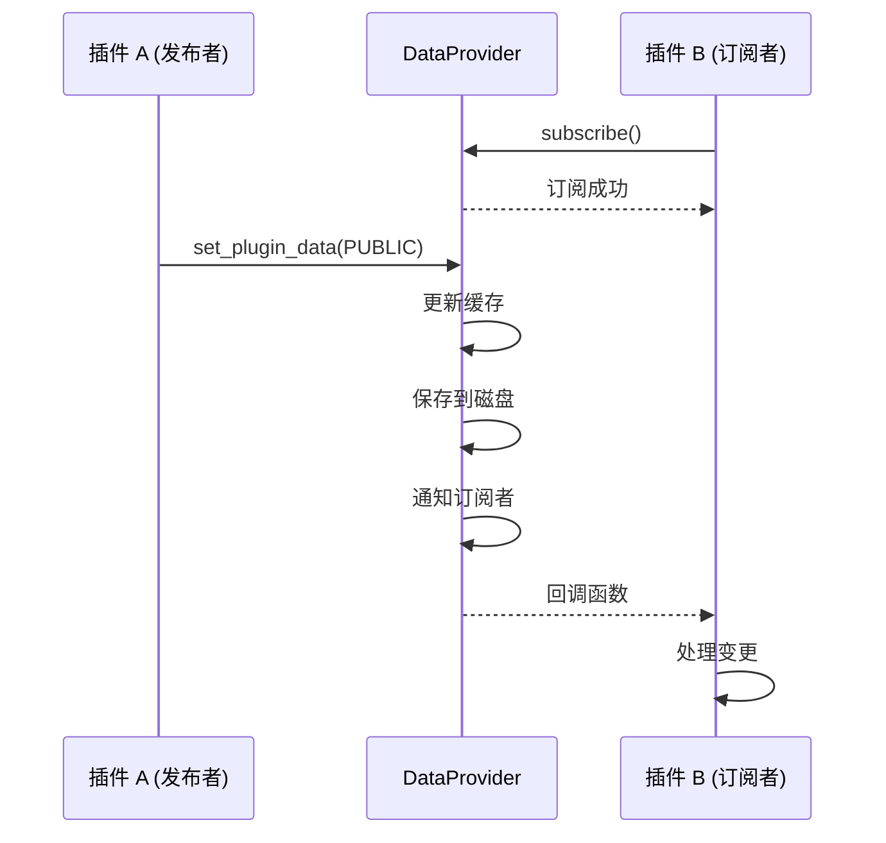
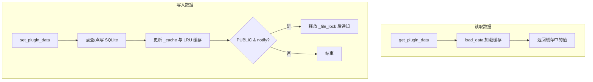

# DataProvider 数据层

> 数据提供者的架构设计和核心概念

---

## 1. 概述

`DataProvider` 是 InstructionX 项目的核心数据组件，负责插件数据的持久化、缓存管理、插件注册、发布/订阅通信和资源文件管理。

**文件位置**: `core/data/data_provider.py`

**模式**: 单例模式（全局唯一实例）

---

## 2. 核心特性

| 特性 | 说明 |
|------|------|
| **单例模式** | 全局唯一实例，确保数据一致性 |
| **线程安全** | 使用 `_file_lock`（RLock）保护数据库访问 + `_subscription_lock`（Lock）保护订阅表 |
| **原子写入** | SQLite WAL + 语句级/显式事务，保证数据一致性 |
| **内存缓存** | 全量字典缓存 + 按 key 的 LRU 反序列化缓存，减少 I/O 与重复解析 |
| **命名空间隔离** | 严格区分私有数据和公共数据 |
| **发布/订阅** | 支持插件间的实时数据通信 |
| **资源管理** | 统一的插件资源文件存储 |
| **插件实例管理** | 支持多实例注册、活跃实例切换、插件注销 |
| **重置机制** | `reset_all_data()` 支持清空所有数据（属于 `IDataProvider` 接口契约） |

---

## 3. 架构图



---

## 4. 数据命名空间

### 4.1 命名空间类型

```python
class DataNamespace(Enum):
    """数据命名空间枚举"""
    PRIVATE = "private"  # 仅插件内部使用
    PUBLIC = "public"    # 允许其他插件访问
```

### 4.2 PRIVATE（私有数据）

- **用途**: 插件内部配置、临时数据、状态信息
- **访问**: 仅插件自身可以读写
- **示例**:
  ```python
  # 保存私有配置
  provider.set_plugin_data(
      plugin_id,
      "internal_config",
      {"theme": "dark"},
      DataNamespace.PRIVATE
  )
  ```

### 4.3 PUBLIC（公共数据）

- **用途**: 需要与其他插件共享的数据、事件、状态变化
- **访问**: 所有插件可以读取
- **订阅**: 其他插件可以订阅数据变化
- **示例**:
  ```python
  # 保存公共数据
  provider.set_plugin_data(
      plugin_id,
      "current_status",
      "ready",
      DataNamespace.PUBLIC
  )
  ```

---

## 5. 发布/订阅模式

### 5.1 原理



### 5.2 使用场景

| 场景 | 推荐方式 |
|------|---------|
| 事件通知 | 发布/订阅 |
| 状态变化 | 发布/订阅 |
| 功能调用 | API 调用 |

### 5.3 示例代码

**订阅者（插件 B）**:

```python
class SubscriberService:
    def __init__(self, plugin_id, data_provider):
        self.plugin_id = plugin_id
        self.data_provider = data_provider

    def subscribe_to_publisher(self, publisher_id):
        """订阅发布者的数据变化"""
        self.data_provider.subscribe(
            subscriber_id=self.plugin_id,
            target_plugin_id=publisher_id,
            target_key="status",
            callback=self._on_status_change
        )

    def _on_status_change(self, plugin_id, key, old_value, new_value):
        print(f"状态从 {old_value} 变为 {new_value}")
```

**发布者（插件 A）**:

```python
class PublisherService:
    def __init__(self, plugin_id, data_provider):
        self.plugin_id = plugin_id
        self.data_provider = data_provider

    def update_status(self, new_status):
        """更新状态（会自动通知订阅者）"""
        self.data_provider.set_plugin_data(
            self.plugin_id,
            "status",
            new_status,
            DataNamespace.PUBLIC
        )
```

---

## 6. 资源管理

### 6.1 资源目录结构

```
data/
├── data.db                 # SQLite 主数据库
├── data.db-wal             # WAL 日志（正常运行时自动生成）
├── data.db-shm             # WAL 共享内存索引（正常运行时自动生成）
└── assets/
    └── plugins/
        ├── plugin_uuid_1/
        │   ├── thumbnail.png
        │   └── config.json
        └── plugin_uuid_2/
            └── ...
```

### 6.2 资源 API

> **异常说明**: 资源操作失败时抛出 `DataProviderError`（定义在 `core/data/data_provider.py`）。

```python
# 保存资源
relative_path = provider.save_asset(
    plugin_id="plugin-uuid",
    filename="thumbnail.png",
    content=b"图片二进制数据"
)

# 获取绝对路径
absolute_path = provider.get_asset_path(relative_path)

# 加载资源
content = provider.load_asset(relative_path)

# 获取插件资源目录
assets_dir = provider.get_plugin_assets_dir("plugin-uuid")
```

---

## 7. 核心流程

### 7.1 数据读写流程



### 7.2 SQLite 持久化机制

迁移后，`DataProvider` 默认使用 SQLite 作为持久化后端：

- 数据库文件：`data/data.db`
- WAL 模式：`PRAGMA journal_mode = WAL;`
- 外键约束：`PRAGMA foreign_keys = ON;`
- 同步级别：`PRAGMA synchronous = NORMAL;`

`set_plugin_data` 等单条写入使用 SQLite 语句级原子性（UPSERT）保证，不依赖显式事务。`save_data` / `reset_all_data` / `set_active_instance` 使用 `BEGIN IMMEDIATE` 显式事务，异常时自动回滚。

```python
def _write_to_disk(self, data):
    """将完整字典结构写回 SQLite"""
    with self._backend.transaction():
        # 1. 先清空子表
        txn.execute("DELETE FROM plugin_data;")
        txn.execute("DELETE FROM active_instances;")
        # 2. 再清空父表
        txn.execute("DELETE FROM plugins;")
        # 3. 重新插入 plugins、plugin_data、active_instances
        ...
```

### 7.3 JSON 应急回退

设置环境变量 `INSTRUCTIONX_DATAPROVIDER_BACKEND=json` 可强制 `DataProvider` 回退到旧 JSON 后端（临时文件 + 原子重命名），主要用于应急排查。

### 7.4 从 JSON 自动迁移

首次启动时，如果检测到旧的 `data/data.json` 且 `data/data.db` 尚未初始化，`SQLiteBackend` 会自动将 JSON 数据导入 `data/data.db`。迁移成功后，原 `data.json` 会被重命名为 `data.json.migrated-<timestamp>.bak`；若迁移失败，不完整的数据库文件会被删除，下次启动仍可重试。

---

## 8. 数据结构

迁移后，数据持久化在 `data/data.db` 的以下表中。`DataProvider` 仍通过 `load_data()` / `save_data()` 暴露与旧 JSON 结构一致的字典视图。

### 8.1 SQLite 表结构

```sql
-- 插件实例主表
CREATE TABLE plugins (
    instance_id TEXT PRIMARY KEY,
    plugin_type TEXT NOT NULL,
    active      INTEGER NOT NULL DEFAULT 0 CHECK (active IN (0, 1))
);

-- 插件键值数据表
CREATE TABLE plugin_data (
    id          INTEGER PRIMARY KEY AUTOINCREMENT,
    instance_id TEXT NOT NULL,
    namespace   TEXT NOT NULL CHECK (namespace IN ('private', 'public')),
    key         TEXT NOT NULL,
    value_json  TEXT NOT NULL,
    updated_at  INTEGER NOT NULL DEFAULT (strftime('%s', 'now')),
    FOREIGN KEY (instance_id) REFERENCES plugins(instance_id) ON DELETE CASCADE,
    UNIQUE (instance_id, namespace, key)
);

-- 活跃实例映射表
CREATE TABLE active_instances (
    plugin_type TEXT PRIMARY KEY,
    instance_id TEXT NOT NULL,
    FOREIGN KEY (instance_id) REFERENCES plugins(instance_id) ON DELETE CASCADE
);

-- 数据库元数据表
CREATE TABLE db_metadata (
    key   TEXT PRIMARY KEY,
    value TEXT NOT NULL
);
```

---

## 9. 线程安全

### 9.1 锁的使用

```python
class DataProvider:
    def __init__(self):
        # 可重入锁 - 保护 SQLite 连接与缓存
        self._file_lock = threading.RLock()
        # 普通锁 - 订阅表操作不得与 _file_lock 同时持有
        self._subscription_lock = threading.Lock()
```

### 9.2 注意事项

- 避免在回调函数中持有 DataProvider 锁
- 长时间运行的操作应在回调外执行
- 注意潜在的死锁风险

---

## 10. 相关文档

- [DataProvider API 参考](api-reference.md)
- [插件开发指南](../plugin-system/plugin-development.md)
- [系统架构概述](../../architecture/overview.md)
