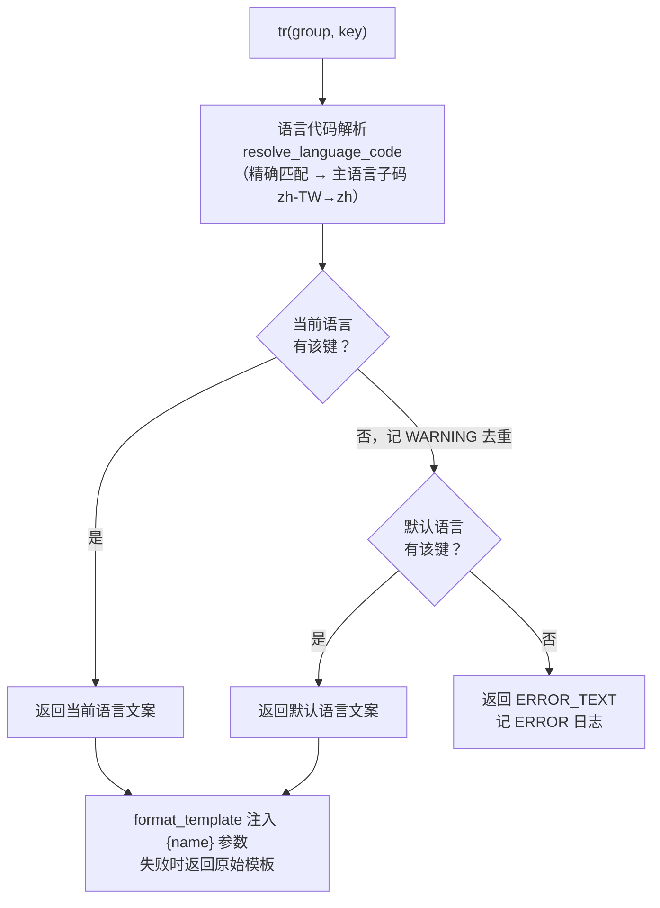
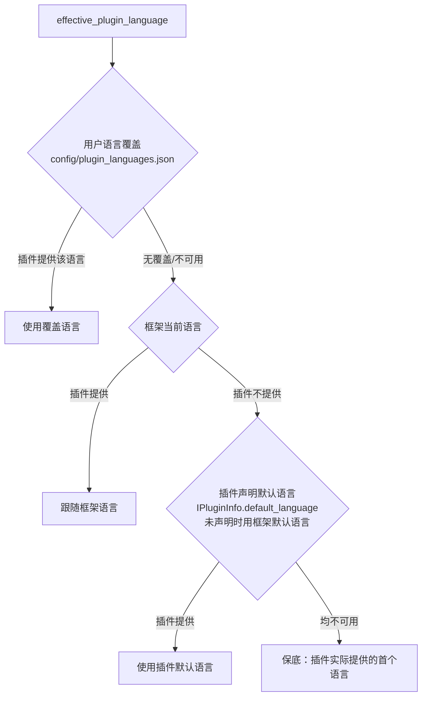

# 多语言（i18n）子系统概述

> LanguageManager 的架构设计、语言文件约定、回退机制与插件集成方式

---

## 1. 概述

`LanguageManager` 是 InstructionX 的框架级多语言（i18n）子系统，负责框架与插件文案的统一取词、当前语言状态管理、语言变更通知与每插件语言覆盖。语言文件采用 **XML** 格式——一个语言一个文件（`text/<语言代码>.xml`），文件内以 `<group>` 划分分组；取词走「当前语言 → 默认语言 → ERROR_TEXT」回退链，任何缺失都不静默、不抛异常。

**模块位置**: `core/i18n/`

**模式**: 单例模式（`LanguageManager._instance` + `get_language_manager()` 访问器 + 模块级 `tr()` 便捷函数）

**核心功能**:
- 框架文案取词 `tr(group, key, **params)`（命名占位符 `str.format` 注入）
- 语言切换实时生效（`set_language()` 持久化 + `language_changed` 信号，各界面经 `_retranslate_ui()` 模式重取词）
- 语言设置持久化（`config/i18n.json`，原子写，损坏备份重建）
- 插件语言包自动注册（扫描 `<插件目录>/text/*.xml`，无需插件登记代码）
- 每插件语言覆盖（`config/plugin_languages.json`，三级有效语言解析）
- IXPlugin.json / IXRepo.json 的 `name`/`description` 多语言字段解析（`resolve_i18n_field`）

**设计决策**（已确认）：
- 语言切换**实时生效**，无需重启；
- 语言代码为 ISO 639-1，允许可选区域子标签（`zh-CN`/`zh-TW`），支持主语言回退（`zh-TW` → `zh`）；
- 默认语言 `zh` 为**开发者设定，用户不可修改**（常量 `DEFAULT_LANGUAGE`，`core/i18n/settings_store.py`）；
- **日志文案保持中文，不国际化**；
- UIKit 组件库（`ui/InstructionX_UIKit/`）不在 i18n 改造范围内；
- 插件 Widget 在语言切换后**自行 connect 信号刷新**（框架不替插件重绘插件 UI）。

---

## 2. 模块结构

```
core/i18n/
├── __init__.py          # 纯数据模块直接导出；LanguageManager/get_language_manager/tr
│                        #   按 PEP-562 惰性导出（避免 import core.i18n 时拉起 PySide6）
├── catalog.py           # TextCatalog（frozen dataclass）：单语言文案目录数据模型
├── loader.py            # load_catalog() 解析 XML + CatalogCache 目录级惰性加载缓存（含负缓存）
├── fallback.py          # ERROR_TEXT 常量 + resolve_language_code / lookup_template / format_template
├── settings_store.py    # I18nSettingsStore：config/i18n.json 与 config/plugin_languages.json 读写
├── plugin_registry.py   # PluginTextRegistry：插件语言包注册表（plugin_id -> PluginTextEntry）
├── facade.py            # PluginI18nFacade：绑定插件 UUID 的取词门面（实现 ILocalizationFacade）
├── ixplugin_i18n.py     # resolve_i18n_field：安装元数据多语言字段解析（纯 Python，无 Qt 依赖）
├── exceptions.py        # I18nError：异常基类（仅保留给编程错误；正常路径一律走回退链）
└── language_manager.py  # LanguageManager 单例（QObject）+ get_language_manager() + tr()
```

框架语言文件位于 `ui/text/`（`zh.xml` 为默认语言文件，必须完整；另有 `en.xml`）；插件语言文件位于各插件的 `text/` 目录。

---

## 3. 语言文件约定与数据模型

### 3.1 XML 语言文件格式

一个语言一个文件，文件名（不含扩展名）即语言代码：

```xml
<?xml version="1.0" encoding="UTF-8"?>
<texts language="zh">
  <group name="common">
    <text key="ok">确定</text>
    <text key="language.self_name">简体中文</text>
  </group>
  <group name="main_window">
    <text key="menu.edit">编辑</text>
    <text key="status.plugin_count">共 {count} 个插件</text>
  </group>
</texts>
```

**结构规则**（`core/i18n/loader.py`）：

- 根元素必须是 `<texts>`，其 `language` 属性应与文件名一致——不一致时记 WARNING 并**以文件名为准**；
- `<group name="...">` 划分分组；`<text key="...">` 为分组内的文案条目，键名约定为点分形式（如 `menu.edit.language`）；
- 分组重名 / 键重复时记 WARNING，**先出现者生效**；
- 文案首尾空白统一剥离（XML 排版缩进不混入文案），文案内部换行保留；
- 单个语言文件缺失或解析失败不抛异常——记 ERROR 日志并整体回退默认语言；
- `common/language.self_name` 键为该语言的自称（如 zh 的「简体中文」），供语言选择对话框显示。

**占位符约定**：仅支持命名式 `{name}`（`str.format` 兼容），**禁止使用 `{0}` 位置式**。

### 3.2 TextCatalog 数据模型

`TextCatalog` 是单个语言文件解析后的内存表示（`core/i18n/catalog.py`，frozen dataclass）：

```python
@dataclass(frozen=True)
class TextCatalog:
    language: str                          # 语言代码（= 文件名）
    groups: Dict[str, Dict[str, str]]      # {分组名: {键: 文案模板}}
```

| 方法 | 说明 |
|------|------|
| `has(group, key) -> bool` | 判断分组内是否存在指定键 |
| `get(group, key) -> Optional[str]` | 取文案模板（可能含 `{name}` 占位符），不存在返回 None |
| `group_names() -> List[str]` | 全部分组名（按文件中出现的顺序） |
| `key_count() -> int` | 全部键总数（供校验脚本统计） |

查找失败（回退）逻辑不在 `TextCatalog`，由 `fallback.py` 负责。

---

## 4. LanguageManager 公开 API

单例访问：`get_language_manager()` 或直接 `LanguageManager()`。`main.py` 在 `apply_uikit_theme()` 之后、主窗口构造之前调用 `get_language_manager()` 完成初始化，保证主窗口构造期间全部 `tr()` 取词就绪。

### 4.1 tr(group, key, /, **params) -> str

框架文案取词：按当前语言查找，缺失自动回退默认语言。

| 参数 | 类型 | 说明 |
|------|------|------|
| `group` | `str` | 分组名（语言文件内 `<group name="...">`） |
| `key` | `str` | 分组内的点分键名 |
| `**params` | `object` | 命名占位符参数（对应模板中的 `{name}`） |

**返回**: 最终文案；默认语言也缺失时返回 `ERROR_TEXT` 常量（值为 `"ERROR_TEXT"`）并记 ERROR 日志。键级回退记 WARNING（每 语言+键 去重一次，避免刷屏）。

模块级便捷函数 `from core.i18n import tr` 等价于 `get_language_manager().tr(...)`。

### 4.2 语言状态

| 方法 | 说明 | 返回值 |
|------|------|--------|
| `current_language()` | 当前生效的语言代码（用户选择，未经区域子标签解析） | str |
| `default_language()` | 开发者设定的默认语言（回退终点，用户不可修改） | str |
| `available_languages()` | 框架可用语言代码列表（扫描 `ui/text/*.xml` 文件名） | List[str] |
| `language_display_name(code)` | 语言显示名（该语言文件 `common/language.self_name`；缺失时返回代码本身） | str |
| `set_language(code)` | 切换当前语言：实时生效、持久化、发射 `language_changed`；不可用语言拒绝并记 WARNING | bool |

### 4.3 插件语言包

| 方法 | 说明 | 返回值 |
|------|------|--------|
| `register_plugin_texts(plugin_id, plugin_dir, declared_default=None)` | 扫描并注册插件语言包（由 PluginManager 加载插件时调用，插件自身不感知） | bool（提供了 text/ 目录返回 True） |
| `unregister_plugin_texts(plugin_id)` | 注销插件语言包（热卸载时调用，同时清理目录缓存） | None |
| `plugin_available_languages(plugin_id)` | 插件提供的语言代码列表；未提供语言包返回空表 | List[str] |
| `plugin_has_catalog(plugin_id)` | 插件是否提供了语言包（text/ 目录且含至少一个语言文件） | bool |
| `plugin_language_override(plugin_id)` | 插件当前的语言覆盖；未设置返回 None（跟随框架） | Optional[str] |
| `set_plugin_language(plugin_id, code)` | 设置/清除语言覆盖（code 为 None 清除）；插件不提供该语言时拒绝；成功时持久化并发射 `plugin_language_changed` | bool |
| `effective_plugin_language(plugin_id)` | 解析插件有效语言（三级优先级，见 §6.2）；插件无语言包时返回框架当前语言 | str |
| `set_plugin_declared_default(plugin_id, language)` | 登记插件声明的默认语言（IPluginInfo.default_language），由 PluginManager 调用 | None |
| `plugin_tr(plugin_id, group, key, /, **params)` | 插件文案取词（供 PluginI18nFacade 调用）；插件无语言包时优雅降级返回键名本身并记 DEBUG | str |

### 4.4 信号

```python
language_changed = Signal(str)           # 框架当前语言变化（参数为新语言代码）
plugin_language_changed = Signal(str, str)  # 某插件有效语言变化（插件 UUID, 新语言）
```

框架各界面（主窗口/标题栏/技能面板/工作区/用量面板/托盘）采用 `_retranslate_ui()` 模式：集中一个方法重设全部用户可见文案，`language_changed` 触发重调。**插件 Widget 不自动刷新**——插件需自行 connect 信号后重取词（见 §7.5）。

### 4.5 底层组件（框架内部/工具脚本使用）

| 符号 | 位置 | 说明 |
|------|------|------|
| `load_catalog(path)` | `loader.py` | 解析单个语言文件为 `TextCatalog`；文件缺失/解析失败返回 None（记 ERROR） |
| `CatalogCache(text_dir)` | `loader.py` | 目录级惰性加载缓存：`available_languages()` 扫 `*.xml` 文件名、`get()` 含负缓存、`invalidate()` 清缓存；框架侧与每个插件各持有一个实例 |
| `resolve_language_code(requested, available)` | `fallback.py` | 语言代码解析：精确匹配 → 主语言子码回退（`zh-TW` → `zh`）→ None |
| `lookup_template(chain, group, key)` | `fallback.py` | 按 `(语言, catalog)` 优先级链查找模板，返回 `(模板, 命中语言)` |
| `format_template(template, params, context)` | `fallback.py` | `str.format` 容错注入；参数不匹配时记 ERROR 并返回原始模板（不抛异常） |
| `resolve_i18n_field(value, language, default_language=DEFAULT_LANGUAGE)` | `ixplugin_i18n.py` | IXPlugin.json 多语言字段解析（见 §7.4） |
| `I18nSettingsStore` | `settings_store.py` | 两个配置文件的读写封装（原子写、损坏备份重建），见 §5 |
| `PluginTextRegistry` | `plugin_registry.py` | 插件语言包注册表（`register`/`unregister`/`has_catalog`/`is_registered`/`languages_of`/`declared_default_of`/`set_declared_default`/`catalog_of`） |
| `DEFAULT_LANGUAGE = "zh"` | `settings_store.py` | 开发者设定的默认语言常量 |

---

## 5. 存储与持久化

### 5.1 框架语言设置（config/i18n.json，schema v1）

```json
{
  "version": 1,
  "default_language": "zh",
  "current_language": "en"
}
```

- `default_language`：开发者设定的默认语言（随程序发布为 `zh`，用户界面不可修改）；
- `current_language`：用户选择的当前语言（`set_language()` 时原子写入）。

### 5.2 每插件语言覆盖（config/plugin_languages.json，schema v1）

```json
{
  "version": 1,
  "overrides": {
    "f47ac10b-58cc-4372-a567-0e02b2c3d479": "en"
  }
}
```

- `overrides`：`{插件UUID: 语言代码}`；键不存在表示该插件跟随框架语言；
- 插件卸载（`PluginManager.uninstall_plugin`）时自动清除对应覆盖项。

### 5.3 写入与容错

两个文件均由 `I18nSettingsStore` 管理，遵循项目既有惯例：**原子写**（临时文件 `.json.tmp` + `os.replace`）；文件缺失按默认值运行；**损坏时备份为 `.json.corrupt.bak` 并按空配置重建**，不阻断启动（记 ERROR 日志）。读取发生在启动早期（主窗口构造前），不依赖 Qt 与 DataProvider。

---

## 6. 回退机制

### 6.1 框架取词回退链



语言文件本身缺失/损坏时该语言条目从链中剔除（负缓存，WARNING 每语言一次），等价于整语言回退。

### 6.2 插件有效语言三级优先级



插件取词（`plugin_tr`）的回退链为：**插件有效语言 → 插件默认语言 → ERROR_TEXT**；插件未提供语言包（无 `text/` 目录或无语言文件）时优雅降级，直接返回键名（DEBUG 日志），保证旧插件行为完全不变。

---

## 7. 插件用法

### 7.1 语言包目录约定（可选）

插件在自身目录下提供 `text/<语言代码>.xml`（结构同 §3.1），框架加载插件时由 `PluginManager` 自动扫描注册，**插件无需任何登记代码**；热卸载时自动注销。无 `text/` 目录的插件行为与旧版本完全一致。

```
my-plugin/
├── entrance.py
├── information.py
├── service.py
└── text/              # 可选：插件语言包
    ├── zh.xml         # 各语言文件的分组与键命名必须一致
    └── en.xml
```

**默认语言完整性要求**：插件默认语言文件（`IPluginInfo.default_language` 声明的语言，未声明时为框架默认语言 `zh`）必须覆盖全部键——它是回退终点，缺失时界面直接显示 `ERROR_TEXT`（不静默）。其他语言允许缺键（运行时回退）。可用 `scripts/check_i18n_completeness.py` 校验。

### 7.2 通过 PluginServices.localization 取词（推荐）

`PluginServices` 末尾追加 `localization` 字段（`core/interfaces/plugin_services.py`，与 `font_manager` 同款先例），由 `PluginManager._create_plugin_services()` 注入绑定本插件 UUID 的 `PluginI18nFacade` 实例（实现 `ILocalizationFacade`），**无降级保护、始终注入**：

```python
from core.interfaces import PluginServices
from core.plugin.plugin_interface import IPlugin


class MyPlugin(IPlugin):
    def __init__(self, services: PluginServices | None = None):
        super().__init__()
        self._i18n = services.localization if services else None

    def _create_widget(self, parent=None, data_provider=None):
        label = QLabel(self._i18n.tr("main", "title"))
        # 命名占位符
        hint = self._i18n.tr("main", "welcome", name="User")
        return label
```

`ILocalizationFacade` 接口（`core/interfaces/i_localization.py`）：

| 方法 | 说明 |
|------|------|
| `tr(group, key, /, **params) -> str` | 取插件文案；无语言包时返回键名本身 |
| `current_language() -> str` | 本插件当前有效语言代码 |
| `available_languages() -> List[str]` | 本插件提供的语言代码列表 |
| `has_catalog() -> bool` | 本插件是否提供了语言包 |

### 7.3 IPluginInfo.default_language（可选声明）

`IPluginInfo` 新增具体 property `default_language`（默认实现返回 `None`）：

```python
class MyPluginInfo(IPluginInfo):
    @property
    def default_language(self) -> Optional[str]:
        """插件默认语言：有效语言缺失的键回退到本语言。
        None（默认）表示跟随框架默认语言。"""
        return "en"
```

声明了默认语言但未提供对应语言文件时，按框架默认语言回退。

### 7.4 IXPlugin.json 的 name / description 多语言字段

发布描述文件中 `name` 与 `description` 支持两种形式：

```json
{
  "id": "my-plugin",
  "name": {"zh": "我的插件", "en": "My Plugin"},
  "description": {"zh": "一个强大的插件", "en": "A powerful plugin"}
}
```

- **纯字符串**（旧形式）：视为所有语言同一文案，原样使用（完全向后兼容）；
- **字典形式** `{"<语言代码>": "..."}`：展示/安装时经 `resolve_i18n_field()` 按 **目标语言（键集合先做区域子标签解析）→ 默认语言 → 字典第一个值** 的顺序解析；空字典或非法类型按兜底处理并记 WARNING。

框架侧链路：`github_plugin_installer.PluginInfo` 保留字段原始形式（str 或 dict），安装注册表/安装结果处按**当前语言**解析（`_install_plugin_dir`），`PluginRegistry` 回填路径按**默认语言**解析，安装对话框展示层按当前语言解析。

### 7.5 语言切换后的 UI 刷新约定

框架**不替插件重绘 UI**。插件 Widget 需要跟随语言切换时，自行 connect 信号并重取词：

```python
from core.i18n import get_language_manager


class MyPlugin(IPlugin):
    def _create_widget(self, parent=None, data_provider=None):
        ...
        # 框架语言变化，或本插件语言覆盖变化时刷新
        get_language_manager().language_changed.connect(self._retranslate_ui)
        get_language_manager().plugin_language_changed.connect(self._on_language_changed)
        return widget

    def _on_language_changed(self, plugin_id: str, _language: str):
        if plugin_id == self.plugin_id:
            self._retranslate_ui()
```

用户在「插件管理」对话框中可为单个插件设置语言覆盖（见 §8.2），变更经 `plugin_language_changed` 信号实时生效并持久化。

---

## 8. UI 入口

### 8.1 LanguageDialog 界面语言对话框

`ui/dialog/language_dialog.py`，主窗口「编辑 → 界面语言...」打开（菜单项位于「切换主题」之后）。列出框架全部可用语言（`LanguageManager.available_languages()`），每行显示「语言自称 (语言代码)」，当前语言默认选中；确定后经 `set_language()` **实时切换**（触发 `language_changed`，各界面重取词），无需重启；取消不改动当前语言。

### 8.2 PluginLanguageDialog 插件语言对话框

`ui/dialog/plugin_language_dialog.py`，由插件管理对话框（`PluginManagementDialog`）详情面板的「语言…」按钮打开。选项为「跟随框架（默认）」+ 该插件 `text/` 目录实际提供的语言；确定后经 `set_plugin_language()` 持久化覆盖并触发 `plugin_language_changed`。插件无语言包时「语言…」按钮置灰（tooltip 说明「该插件未提供多语言支持」），语言状态行显示「未提供多语言」。

详见 [对话框组件文档](../../ui/dialogs.md)。

---

## 9. 冒烟与校验

### 9.1 冒烟脚本

`scripts/smoke_i18n.py` 为无网冒烟脚本（临时目录 `temp/i18n_smoke/`，用完清理），验证链路：XML 解析容错 → 语言代码解析（区域子标签回退）→ 框架取词（命中/键级回退/组级回退/ERROR_TEXT/占位符）→ 语言切换与持久化 → 插件语言包注册、有效语言三级优先级、覆盖持久化、热卸载注销 → 插件取词门面（PluginI18nFacade）与声明默认语言登记 → 损坏配置备份重建。

```powershell
.venv\Scripts\python.exe scripts/smoke_i18n.py
```

> 注意：`LanguageManager` 依赖 `QObject`，脚本内创建了 `QCoreApplication` 实例。

### 9.2 完整性校验脚本

`scripts/check_i18n_completeness.py` 机器化保证「默认语言必须完整」：

1. 静态扫描 `ui/` 源码中全部 `tr(group, key)` 字面量调用（排除同步的 `InstructionX_UIKit` 目录），校验默认语言文件全部覆盖——**缺失即校验失败（exit 1）**；
2. 其他语言相对默认语言缺分组/缺键 → 警告（运行时可回退，exit 0）；
3. 各语言文件 `language` 属性与文件名一致性；
4. 插件语言文件（`plugin/` 与 `custom_plugin/`）：以各自 `zh.xml`（或首个语言文件）为参照，报告其余语言的缺失。

```powershell
.venv\Scripts\python.exe scripts/check_i18n_completeness.py
# 测试可用 --text-dir / --src-dir / --plugin-root 指向临时目录
```

---

## 10. 相关文档

- [接口层概述](../interfaces/overview.md)（PluginServices 字段清单、ILocalizationFacade）
- [插件开发指南](../plugin-system/plugin-development.md)（插件多语言一节）
- [对话框组件](../../ui/dialogs.md)（LanguageDialog / PluginLanguageDialog）
- [主窗口](../../ui/main-window.md)（菜单入口与 `_retranslate_ui()` 模式）
- [字体子系统概述](../font-manager/overview.md)（PluginServices 注入字段的同款先例）
