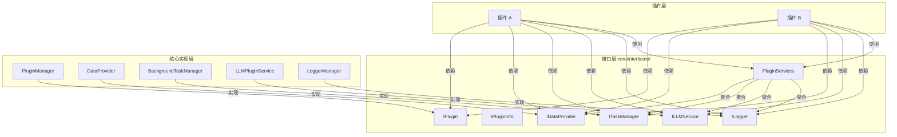

# 接口层概述

> InstructionX 抽象接口层的设计理念和完整说明

---

## 1. 接口层设计理念

### 1.1 设计目标

接口层（`core/interfaces/`）是框架的核心抽象层，旨在：

- **解耦插件与实现**：插件通过接口与核心服务交互，不依赖具体实现类
- **定义契约**：明确每个服务的能力边界和使用方式
- **便于测试**：可以为接口创建 mock 实现进行单元测试
- **支持扩展**：未来可以替换实现而无需修改插件代码

### 1.2 架构位置



---

## 2. 接口清单

### 2.1 核心接口

| 接口 | 文件 | 说明 | 实现类 |
|------|------|------|--------|
| **IPlugin** | `i_plugin.py` | 插件抽象基类 | `core/plugin/plugin_interface.py` |
| **IPluginInfo** | `i_plugin_info.py` | 插件信息抽象基类 | `core/plugin/plugin_info_interface.py` |
| **IDataProvider** | `i_data_provider.py` | 数据提供者接口 | `core/data/data_provider.py` |
| **ITaskManager** | `i_task_manager.py` | 后台任务管理器接口 | `core/task/background_task.py` |
| **ILLMService** | `i_llm_service.py` | LLM 插件服务接口 | `core/llm/plugin_service.py`（`LLMPluginService` **显式继承** `ILLMService`） |
| **ILogger** | `utils/i_logger.py`（原始定义）/ `core/interfaces/__init__.py`（重导出）| 日志接口 | `utils/logging_tools.py`（`LoggerManager` 实现）|

### 2.2 辅助类

| 类 | 文件 | 说明 |
|------|------|------|
| **PluginServices** | `plugin_services.py` | 服务封装类，聚合所有接口用于依赖注入 |
| **TaskType** | `i_task_manager.py` | 任务类型枚举（SYNC/ASYNC/SCHEDULED/LONG_RUNNING） |
| **TaskStatus** | `i_task_manager.py` | 任务状态枚举（PENDING/RUNNING/COMPLETED/FAILED/CANCELLED/STOPPED） |
| **DataNamespace** | `i_data_provider.py` | 数据命名空间枚举（PRIVATE/PUBLIC） |
| **DataProviderError** | `core/data/data_provider.py` | 数据提供者异常类 |

---

## 3. 接口详解

### 3.1 IPlugin（插件接口）

**文件**: `core/interfaces/i_plugin.py`

**作用**: 定义所有插件必须实现的标准接口

**核心属性**:
- `plugin_name`: 插件名称（抽象属性，必须实现）
- `plugin_id`: 插件唯一标识符 UUID（由框架设置）
- `skill_icon`: 技能按钮图标（默认返回 None，具体实现可带缓存）
- `skill_description`: 技能描述（默认返回 `plugin_name`，具体实现可带缓存）
- `skill_tooltip`: 工具提示（默认格式为"名称\n描述"）
- `plugin_info`: 插件信息对象（默认返回 None，具体实现可从 `information.py` 加载并带缓存）
- `llm_tools`: 插件暴露给 LLM 的工具列表（返回符合 OpenAI function calling 规范的字典列表）

**核心方法**:
- `_create_widget(parent, data_provider)`: 创建 UI（抽象方法，必须实现）
- `get_widget(parent, data_provider)`: 获取 Widget（默认直接调用 `_create_widget`，具体实现可添加缓存）
- `on_plugin_loaded(plugin_id=None, **kwargs)`: 加载完成回调（PluginManager 调用时不传任何参数，可通过 `self._services` 访问注入的服务容器）

**使用示例**:
```python
from core.plugin.plugin_interface import IPlugin

class MyPlugin(IPlugin):
    @property
    def plugin_name(self) -> str:
        return "我的插件"

    def _create_widget(self, parent=None, data_provider=None):
        widget = QWidget(parent)
        layout = QVBoxLayout(widget)
        layout.addWidget(QLabel("Hello Plugin"))
        return widget
```

**详细文档**: [IPlugin 接口](../plugin-system/iplugin.md)

---

### 3.2 IPluginInfo（插件信息接口）

**文件**: `core/interfaces/i_plugin_info.py`

**作用**: 定义插件元数据的标准接口

**核心属性**:
- `version`: 插件版本（PluginVersion 类型）
- `developer`: 开发者名称
- `developer_email`: 开发者邮箱
- `developer_website`: 开发者网站
- `is_free`: 是否免费
- `description`: 详细描述
- `service_api`: API 定义字典
- `skill_icon`: 技能图标（PluginIcon 类型）
- `skill_description`: 技能描述
- `plugin_type_id`: 插件类型标识符（必选）
- `tags`: 标签列表（可选）
- `dependencies`: 插件依赖项（可选）

**使用示例**:
```python
from core.interfaces import IPluginInfo
from core.plugin.plugin_version import PluginVersion
from core.plugin.plugin_icon import PluginIcon

class MyPluginInfo(IPluginInfo):
    @property
    def version(self) -> PluginVersion:
        return PluginVersion(VersionType.RELEASE, 1, 0, 0)

    @property
    def developer(self) -> str:
        return "MyCompany"

    @property
    def plugin_type_id(self) -> str:
        return "my-plugin"

    @property
    def service_api(self) -> Dict[str, Any]:
        return {
            "method_name": {
                "description": "方法描述",
                "parameters": {...},
                "returns": {...}
            }
        }
```

---

### 3.3 IDataProvider（数据提供者接口）

**文件**: `core/interfaces/i_data_provider.py`

**作用**: 定义数据持久化和管理的标准接口

**核心功能**:
- 插件注册/注销
- 数据读写（支持命名空间）
- 发布/订阅模式
- 资源文件管理

**核心方法**:
- `register_plugin(instance_id, plugin_type)`: 注册插件
- `unregister_plugin(instance_id)`: 注销插件
- `get_active_instance(plugin_type)`: 获取活跃插件实例
- `set_active_instance(instance_id)`: 设置活跃插件实例
- `get_plugin_data(instance_id, key, namespace, default)`: 获取数据
- `set_plugin_data(instance_id, key, value, namespace, notify)`: 设置数据
- `get_all_plugin_data(instance_id, namespace)`: 获取所有数据
- `subscribe(subscriber_id, target_plugin_id, target_key, callback)`: 订阅数据
- `unsubscribe(subscriber_id, target_plugin_id)`: 取消订阅
- `publish(publisher_id, key, value, namespace)`: 发布数据
- `save_asset(plugin_id, filename, content)`: 保存资源文件
- `get_asset_path(relative_path)`: 获取资源文件的绝对路径
- `load_asset(relative_path)`: 加载资源文件内容（返回 bytes）
- `get_plugin_assets_dir(plugin_id)`: 获取插件资源目录路径
- `get_plugin_info(instance_id)`: 获取插件信息
- `get_all_plugins()`: 获取所有插件信息
- `clear_cache()`: 清除缓存，下次读取时将重新从磁盘加载
- `load_data(force_reload=False)`: 从磁盘加载数据到缓存
- `save_data()`: 将当前缓存数据保存到磁盘
- `reset_all_data()`: 重置所有数据（慎用）

**使用示例**:
```python
from core.interfaces import IDataProvider, DataNamespace

class MyPlugin(IPlugin):
    def __init__(self):
        self.data_provider = DataProvider()

    def _create_widget(self, parent=None, data_provider=None):
        # 注册插件
        data_provider.register_plugin(
            self.plugin_id,
            "MyPlugin"
        )

        # 保存数据
        data_provider.set_plugin_data(
            self.plugin_id,
            "my_key",
            "my_value",
            DataNamespace.PRIVATE
        )

        # 读取数据
        value = data_provider.get_plugin_data(
            self.plugin_id,
            "my_key",
            DataNamespace.PRIVATE,
            default="default"
        )
```

**详细文档**: [DataProvider 概述](../data-provider/overview.md)

---

### 3.4 ITaskManager（任务管理器接口）

**文件**: `core/interfaces/i_task_manager.py`

**作用**: 定义后台任务管理的标准接口

**核心功能**:
- 同步/异步任务注册
- 定时任务管理
- 长期任务管理
- 任务状态查询

**核心方法**:

*同步/异步任务*:
- `register_sync_task(plugin_id, name, func, callback, args, kwargs)`: 注册并立即执行同步任务
- `register_async_task(plugin_id, name, func, callback, args, kwargs)`: 注册异步任务
- `cancel_task(task_id)`: 取消任务（仅限普通任务），返回是否成功
- `clear_completed_tasks(plugin_id=None)`: 清理已完成的任务，返回清理数量

*定时任务*:
- `register_scheduled_task(plugin_id, name, func, interval, callback, args, kwargs)`: 注册定时任务
- `register_scheduled_task_factory(plugin_id, func, callback)`: 注册定时任务工厂（用于重启后恢复）
- `restore_scheduled_tasks(plugin_id)`: 恢复指定插件的定时任务
- `unregister_scheduled_task(task_id)`: 注销定时任务
- `enable_scheduled_task(task_id)`: 启用定时任务
- `disable_scheduled_task(task_id)`: 禁用定时任务
- `get_scheduled_tasks(plugin_id=None)`: 获取定时任务列表

*长期任务*:
- `register_long_running_task(plugin_id, name, func, callback, stop_callback, status_callback, auto_restart, args, kwargs)`: 注册长期任务
- `register_long_running_task_factory(plugin_id, func, callback, stop_callback, status_callback, restore_callback)`: 注册长期任务工厂
- `restore_long_running_tasks(plugin_id)`: 恢复指定插件的长期任务
- `stop_long_running_task(task_id, delete_from_storage)`: 停止长期任务
- `get_long_running_tasks(plugin_id)`: 获取长期任务列表
- `update_long_running_task_status(task_id, status)`: 更新长期任务的状态

*任务查询*:
- `get_task(task_id)`: 获取指定任务
- `get_tasks_by_plugin(plugin_id)`: 获取插件所有普通任务
- `get_all_tasks()`: 获取所有任务
- `get_task_status(task_id)`: 获取任务状态

**任务类型**:
- `TaskType.SYNC`: 同步任务（在主线程执行）
- `TaskType.ASYNC`: 异步任务（在线程池执行）
- `TaskType.SCHEDULED`: 定时任务（周期性执行）
- `TaskType.LONG_RUNNING`: 长期任务（可停止、恢复、监控）

**使用示例**:
```python
from core.interfaces import ITaskManager, TaskType

class MyPlugin(IPlugin):
    def on_plugin_loaded(self):
        task_manager = BackgroundTaskManager()

        # 注册定时任务
        task_manager.register_scheduled_task(
            plugin_id=self.plugin_id,
            name="每小时检查",
            func=self._check_status,
            interval=3600,  # 1小时
            callback=self._on_task_complete
        )

    def _check_status(self):
        # 任务逻辑
        pass

    def _on_task_complete(self, result):
        # 完成回调
        pass
```

**详细文档**: [后台任务概述](../background-task/overview.md)

---

### 3.5 ILLMService（LLM 插件服务接口）

**文件**: `core/interfaces/i_llm_service.py`（取代已删除的 `i_llm_facade.py`）

**作用**: 定义插件访问 LLM 能力的唯一抽象契约。`LLMPluginService`（`core/llm/plugin_service.py`）**显式继承**该接口（接口即契约）。所有 `provider` 参数语义为**实例 id**，取 `"default"`（`DEFAULT_PROVIDER`）时由底层按功能维度（chat/embedding）解析为默认实例；`model` 参数取 `"default"`（`DEFAULT_MODEL`）时使用实例配置中的默认模型。

**核心功能**:
- 同步聊天 / 流式输出
- 文本嵌入
- 对话管理（创建、发送、列表、删除）
- 工具调用（Function Calling，返回 `ToolChatResult`）
- 实例与模型查询（`list_providers` / `get_models`）
- Provider 配置验证

> **注意**：实际注入到插件的是 `LLMPluginService`（通过 `PluginServices.llm_facade`，字段类型标注为 `ILLMService`），插件开发者应通过 `services.llm_facade` 访问所有 LLM 能力。

**核心方法**:

*底层 LLM 代理*:
- `chat(messages, provider, model, temperature, max_tokens, tools)`: 同步聊天，返回 `ChatResponse`
- `stream_chat(messages, callback, provider, model, ...)`: 流式聊天，`callback` 签名为 `(chunk: str, done: bool) -> None`，返回完整文本 `str`
- `embed(texts, provider, model)`: 文本嵌入，返回 `List[EmbeddingResponse]`

*对话管理*:
- `create_conversation(system_prompt, provider, model, metadata)`: 创建新对话，返回对话 ID
- `send_message(conversation_id, content, images, temperature, max_tokens, model, provider)`: 同步发送消息（model/provider 为临时覆盖，不修改会话绑定）
- `stream_send_message(conversation_id, content, images, callback, ...)`: 流式发送消息
- `get_conversation(conversation_id)`: 获取对话对象
- `list_conversations()`: 列出所有对话
- `delete_conversation(conversation_id)`: 删除对话

*工具调用*:
- `chat_with_tools(messages, provider, model, max_turns, temperature)`: 带工具调用的对话，返回 `ToolChatResult`
- `chat_with_tools_stream(messages, callback, ...)`: 流式版本，返回 `ToolChatResult`
- `get_tool_executor()`: 获取工具调用执行器
- `get_shared_tool_registry()`: 获取共享工具注册表

*实例与模型查询*:
- `list_providers()`: 列出所有 Provider 实例信息（`List[ProviderInfo]`，不含 api_key）
- `get_models(provider="default")`: 获取单实例模型列表（`List[ModelInfo]`）
- `resolve_provider_id(provider)`: 解析实例引用为实际实例 id
- `get_default_provider_id(feature="chat")`: 默认实例解析结果（不抛异常，无可用实例返回 `None`）

*统计与校验*:
- `get_usage_stats(conversation_id)`: 获取用量统计
- `validate_provider(provider)`: 验证 Provider 配置是否有效
- `last_stream_response`（property）: 最近一次流式请求的聚合响应

> **已移除的旧方法**：`get_provider` / `get_all_providers` / `get_raw_provider` / `get_cached_models` / `get_available_providers`（底层泄漏）；`load_image_as_base64` 迁至 `utils/image_utils.py`（纯文件工具）。迁移对照见 `temp/llm-api-v2-migration.md`。

**使用示例**:
```python
from core.interfaces import ILLMService, Message

class MyPlugin(IPlugin):
    def __init__(self, services=None):
        self._services = services
        # 推荐：通过 services 访问
        # 或直接使用单例：from core.llm import get_llm_plugin_service
        # self.llm = get_llm_plugin_service()

    def ask_question(self, question: str) -> str:
        llm = self._services.llm_facade
        response = llm.chat(
            messages=[Message(role="user", content=question)],
            provider="minimax",  # 实例 id
            temperature=0.7
        )
        return response.content

    def use_conversation(self) -> str:
        llm = self._services.llm_facade
        conv_id = llm.create_conversation(
            system_prompt="你是一个代码助手",
            provider="minimax",
        )
        return llm.send_message(conv_id, "解释这段代码")
```

**详细文档**: [LLM Provider 概述](../llm-provider/overview.md)

---

#### 3.5.1 LLMPluginService（ILLMService 实现）

**文件**: `core/llm/plugin_service.py`

**作用**: `ILLMService` 的唯一实现（显式继承），是插件开发者使用 LLM 能力的唯一入口。整合了对话管理、工具调用自动化、向量嵌入、多模态和用量统计。

> **注意**：`LLMPluginService` 显式继承 `ILLMService` 抽象基类（接口即契约）。插件开发者通过 `PluginServices.llm_facade` 获取的实例即为该实现，可直接调用 `ILLMService` 定义的所有方法。

**核心组件**:
- `ConversationManager`: 对话生命周期管理
- `ToolCallExecutor` / `ToolRegistry`: 工具调用自动化
- `LLMProvider`: 底层 LLM 调用

**获取方式**:

```python
# 推荐：通过 DI 注入（插件构造器参数）
def __init__(self, services: PluginServices | None = None):
    self._llm = services.llm_facade if services else get_llm_plugin_service()

# 备选：直接导入单例
from core.llm import get_llm_plugin_service
svc = get_llm_plugin_service()
```

**主要方法**:

| 方法 | 说明 |
|------|------|
| `create_conversation(system_prompt?, provider?, model?)` | 创建对话，返回 conv_id |
| `send_message(conv_id, content, images?, model?, provider?, ...)` | 同步发送消息（model/provider 临时覆盖） |
| `stream_send_message(conv_id, content, ...)` | 流式发送消息 |
| `chat(messages, ...)` | 直接 chat（无对话状态） |
| `stream_chat(messages, callback, ...)` | 流式 chat（无对话状态），返回完整文本 |
| `chat_with_tools(messages, max_turns=5)` | 工具调用循环，返回 `ToolChatResult` |
| `chat_with_tools_stream(messages, callback, ...)` | 流式工具调用，返回 `ToolChatResult` |
| `get_tool_executor()` | 获取 `ToolCallExecutor` 实例 |
| `get_shared_tool_registry()` | 获取共享 `ToolRegistry`（所有插件的工具） |
| `embed(texts, provider?, model?)` | 向量嵌入，返回 `List[EmbeddingResponse]` |
| `generate_image(prompt, provider?)` | 图像生成 |
| `text_to_speech(text, provider?)` | 文本转语音 |
| `list_providers()` | 列出所有 Provider 实例信息 |
| `get_models(provider="default")` | 获取单实例模型列表 |
| `resolve_provider_id(provider)` | 解析实例引用为实际实例 id |
| `get_default_provider_id(feature?)` | 默认实例解析结果 |
| `get_usage_stats(conv_id?)` | 获取用量统计 |
| `validate_provider(provider)` | 验证 Provider 配置 |

**详细文档**: [LLM Provider API 参考](../llm-provider/api-reference.md)

---

### 3.6 ILogger（日志接口）

**文件**: `utils/i_logger.py`（通过 `core/interfaces/__init__.py` 重导出）

**作用**: 定义日志记录的标准接口

**核心方法**:
- `debug(name, message)`: 记录调试日志
- `info(name, message)`: 记录信息日志
- `warning(name, message)`: 记录警告日志
- `error(name, message)`: 记录错误日志
- `critical(name, message)`: 记录严重错误日志

**使用示例**:
```python
from core.interfaces import ILogger
from utils.logging_tools import LoggerManager

class MyPlugin(IPlugin):
    def _create_widget(self, parent=None, data_provider=None):
        # 通过 data_provider 获取 logger（由框架注入）
        # 或者直接实例化
        self.logger = LoggerManager()

    def _do_something(self):
        try:
            # 业务逻辑
            result = self._risky_operation()
            self.logger.info("MyPlugin", "操作成功")
        except Exception as e:
            self.logger.error("MyPlugin", f"操作失败: {e}")
```

**详细文档**: [日志工具](../../utils/logging-tools.md)

---

### 3.7 PluginServices（服务封装类）

**文件**: `core/interfaces/plugin_services.py`

**作用**: 将插件所需的核心服务聚合到一个对象中，通过依赖注入传递给插件

**属性**:
- `data_provider`: `DataProvider` - 数据提供者实例
- `task_manager`: `BackgroundTaskManager` - 后台任务管理器实例
- `llm_facade`: `ILLMService` - LLM 插件服务（实际为 `LLMPluginService` 单例，显式继承 `ILLMService`）
- `logger`: `ILogger` - 日志接口
- `mcp_manager`: `MCPManager` - MCP Server 管理器实例（可为空，用于管理内置 MCP Server）
- `mcp_client`: `MCPClientManager` - 外部 MCP Client 管理器实例（可为空，用于连接外部 MCP Server）

**设计模式**: 依赖注入（Dependency Injection）

> `PluginServices` 通过 `PluginManager._create_plugin_services()` 创建，并在插件加载时通过构造器参数注入。新版插件通过 `self._services` 访问，旧版插件可通过直接导入单例兼容访问。

**推荐 IPlugin 基类**: 使用 `from core.plugin.plugin_interface import IPlugin`（含控件缓存等框架实现），而非 `core.interfaces` 中的纯抽象接口。

**使用示例**:
```python
from PySide6.QtWidgets import QWidget
from core.plugin.plugin_interface import IPlugin
from core.interfaces.plugin_services import PluginServices
from core.llm import get_llm_plugin_service

class MyPlugin(IPlugin):
    def __init__(self, services: PluginServices | None = None):
        super().__init__()
        self._services = services
        # 推荐：通过 services 访问（DI 模式）
        # 旧插件兼容：直接使用单例
        self._llm = (services.llm_facade
                     if services
                     else get_llm_plugin_service())

    def _create_widget(self, parent=None, data_provider=None):
        # 通过 data_provider 参数接收可选的注入数据提供者
        dp = data_provider if data_provider else (self._services.data_provider if self._services else None)

        if dp:
            dp.set_plugin_data(
                self.plugin_id,
                "initialized",
                True
            )

        # 注册任务（通过 services 或直接使用单例）
        if self._services and self._services.task_manager:
            tm = self._services.task_manager
        else:
            from core.task import BackgroundTaskManager
            tm = BackgroundTaskManager()
        tm.register_async_task(
            self.plugin_id,
            "初始化任务",
            self._init_data,
            None
        )

        # 返回插件的 UI 控件
        widget = QWidget(parent)
        return widget
```

---

## 4. 接口层导入指南

### 4.1 推荐导入方式

```python
# 从 core.interfaces 导入所有接口（推荐）
from core.interfaces import (
    IPlugin,
    IPluginInfo,
    IDataProvider,
    ITaskManager,
    ILLMService,
    ILogger,
    PluginServices,
    TaskType,
    TaskStatus,
    DataNamespace,
    Message,
    ChatResponse,
    EmbeddingResponse,
    ModelInfo,
)
# 注意：UsageInfo 未通过 core.interfaces 导出，如需使用请从 core.llm.provider_interface 导入

# 从 core.llm 导入 LLMPluginService（ILLMService 的唯一实现）
from core.llm import get_llm_plugin_service, LLMPluginService
```

### 4.2 向后兼容的导入路径

```python
# 以下导入路径仍然有效（向后兼容）
from core.plugin.plugin_interface import IPlugin
from core.plugin.plugin_info_interface import IPluginInfo

# 但推荐使用新的导入路径
from core.interfaces import IPlugin, IPluginInfo
```

---

## 5. 接口与实现的关系

### 5.1 实现映射表

| 接口 | 实现类 | 文件位置 |
|------|---------|-----------|
| `IPlugin` | `IPlugin` | `core/plugin/plugin_interface.py` |
| `IPluginInfo` | `IPluginInfo` | `core/plugin/plugin_info_interface.py` |
| `IDataProvider` | `DataProvider` | `core/data/data_provider.py` |
| `ITaskManager` | `BackgroundTaskManager` | `core/task/background_task.py` |
| `ILLMService` | `LLMPluginService` | `core/llm/plugin_service.py`（显式继承 `ILLMService`，经 `PluginServices.llm_facade` 注入） |
| `ILogger` | `LoggerManager` | `utils/logging_tools.py` |

### 5.2 访问单例实例

```python
# 插件管理器（通过 PluginManager 类直接访问）
from core.plugin.manager import PluginManager
manager = PluginManager()

# 数据提供者（通过 DataProvider 类直接访问）
from core.data.data_provider import DataProvider
provider = DataProvider()

# 后台任务管理器（通过 BackgroundTaskManager 类直接访问）
from core.task.background_task import BackgroundTaskManager
task_manager = BackgroundTaskManager()

# LLM 提供者（通过工厂函数访问）
# 推荐：通过 PluginServices.llm_facade 访问（由框架注入）
# 或使用插件服务层（推荐）
from core.llm import get_llm_plugin_service
llm = get_llm_plugin_service()

# 日志管理器（通过 LoggerManager 类直接访问）
from utils.logging_tools import LoggerManager
logger = LoggerManager()
```

---

## 6. 最佳实践

### 6.1 使用接口而非实现

```python
# ✅ 推荐：使用接口
def my_function(data_provider: IDataProvider):
    data_provider.set_plugin_data(...)

# ❌ 不推荐：直接依赖实现
def my_function(data_provider: DataProvider):
    data_provider.set_plugin_data(...)
```

### 6.2 依赖注入模式

`PluginServices` 描述了插件可以通过依赖注入获取哪些服务。PluginManager 在加载插件时创建服务容器，并通过构造器参数注入：

```python
class MyPlugin(IPlugin):
    def __init__(self, services: PluginServices | None = None):
        # 通过 services 参数接收注入的服务容器
        self._services = services
        self._llm = services.llm_facade if services else None

    def on_plugin_loaded(self, plugin_id=None, **kwargs):
        # 通过 self._services 访问 llm_facade、data_provider 等
        pass
```

### 6.3 错误处理

```python
# 使用接口时，注意处理可能的异常
try:
    result = self.data_provider.get_plugin_data(
        self.plugin_id,
        "key",
        DataNamespace.PRIVATE
    )
except Exception as e:
    logger = LoggerManager()
    logger.error("MyPlugin", f"读取数据失败: {e}")
```

---

## 7. 相关文档

- [系统架构概述](../../architecture/overview.md)
- [插件系统概述](../plugin-system/overview.md)
- [IPlugin 接口](../plugin-system/iplugin.md)
- [DataProvider 概述](../data-provider/overview.md)
- [后台任务概述](../background-task/overview.md)
- [LLM Provider 概述](../llm-provider/overview.md)
- [MCP 协议模块概述](../mcp/overview.md)
- [完整 API 参考](../../api/full-reference.md)

---

*本文档由 Claude Code 自动生成*