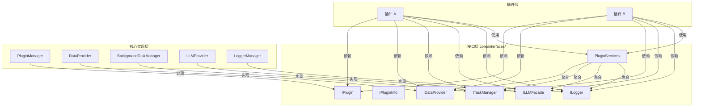

# 接口层概述

> InstructionX 抽象接口层的设计理念和完整说明

---

## 1. 接口层设计理念

### 1.1 设计目标

接口层（`core/interfaces/`）是框架的核心抽象层，旨在：

- **解耦插件与实现**：插件通过接口与核心服务交互，不依赖具体实现类
- **定义契约**：明确每个服务的能力边界和使用方式
- **便于测试**：可以为接口创建 mock 实现进行单元测试
- **支持扩展**：未来可以替换实现而无需修改插件代码

### 1.2 架构位置



---

## 2. 接口清单

### 2.1 核心接口

| 接口 | 文件 | 说明 | 实现类 |
|------|------|------|--------|
| **IPlugin** | `i_plugin.py` | 插件抽象基类 | `core/plugin/plugin_interface.py` |
| **IPluginInfo** | `i_plugin_info.py` | 插件信息抽象基类 | `core/plugin/plugin_info_interface.py` |
| **IDataProvider** | `i_data_provider.py` | 数据提供者接口 | `core/data/data_provider.py` |
| **ITaskManager** | `i_task_manager.py` | 后台任务管理器接口 | `core/task/background_task.py` |
| **ILLMFacade** | `i_llm_facade.py` | LLM 外观接口 | `core/llm/llm_provider.py` |
| **ILogger** | `i_logger.py` | 日志接口 | `utils/logging_tools.py` |

### 2.2 辅助类

| 类 | 文件 | 说明 |
|------|------|------|
| **PluginServices** | `plugin_services.py` | 服务封装类，聚合所有接口用于依赖注入 |
| **TaskType** | `i_task_manager.py` | 任务类型枚举（SYNC/ASYNC/SCHEDULED/LONG_RUNNING） |
| **TaskStatus** | `i_task_manager.py` | 任务状态枚举（PENDING/RUNNING/COMPLETED/FAILED/CANCELLED/STOPPED） |
| **DataNamespace** | `i_data_provider.py` | 数据命名空间枚举（PRIVATE/PUBLIC） |
| **DataProviderError** | `core/data/data_provider.py` | 数据提供者异常类 |

---

## 3. 接口详解

### 3.1 IPlugin（插件接口）

**文件**: `core/interfaces/i_plugin.py`

**作用**: 定义所有插件必须实现的标准接口

**核心属性**:
- `plugin_name`: 插件名称（抽象属性）
- `plugin_id`: 插件 UUID
- `skill_icon`: 技能按钮图标
- `skill_description`: 技能描述
- `skill_tooltip`: 工具提示
- `plugin_info`: 插件信息对象

**核心方法**:
- `_create_widget(parent, data_provider)`: 创建 UI（抽象方法）
- `get_widget(parent, data_provider)`: 获取 Widget（带缓存，自动复用已创建的控件实例）
- `on_plugin_loaded()`: 加载完成回调

**使用示例**:
```python
from core.interfaces import IPlugin

class MyPlugin(IPlugin):
    @property
    def plugin_name(self) -> str:
        return "我的插件"

    def _create_widget(self, parent=None, data_provider=None):
        widget = QWidget(parent)
        layout = QVBoxLayout(widget)
        layout.addWidget(QLabel("Hello Plugin"))
        return widget
```

**详细文档**: [IPlugin 接口](../plugin-system/iplugin.md)

---

### 3.2 IPluginInfo（插件信息接口）

**文件**: `core/interfaces/i_plugin_info.py`

**作用**: 定义插件元数据的标准接口

**核心属性**:
- `version`: 插件版本（PluginVersion 类型）
- `developer`: 开发者名称
- `developer_email`: 开发者邮箱
- `developer_website`: 开发者网站
- `is_free`: 是否免费
- `description`: 详细描述
- `service_api`: API 定义字典
- `skill_icon`: 技能图标（PluginIcon 类型）
- `skill_description`: 技能描述
- `plugin_type_id`: 插件类型标识符（必选）
- `tags`: 标签列表（可选）
- `dependencies`: 插件依赖项（可选）

**使用示例**:
```python
from core.interfaces import IPluginInfo
from core.plugin.plugin_version import PluginVersion
from core.plugin.plugin_icon import PluginIcon

class MyPluginInfo(IPluginInfo):
    @property
    def version(self) -> PluginVersion:
        return PluginVersion(1, 0, 0)

    @property
    def developer(self) -> str:
        return "MyCompany"

    @property
    def plugin_type_id(self) -> str:
        return "my-plugin"

    @property
    def service_api(self) -> Dict[str, Any]:
        return {
            "method_name": {
                "description": "方法描述",
                "parameters": {...},
                "returns": {...}
            }
        }
```

---

### 3.3 IDataProvider（数据提供者接口）

**文件**: `core/interfaces/i_data_provider.py`

**作用**: 定义数据持久化和管理的标准接口

**核心功能**:
- 插件注册/注销
- 数据读写（支持命名空间）
- 发布/订阅模式
- 资源文件管理

**核心方法**:
- `register_plugin(instance_id, plugin_type)`: 注册插件
- `unregister_plugin(instance_id)`: 注销插件
- `get_active_instance(plugin_type)`: 获取活跃插件实例
- `set_active_instance(instance_id)`: 设置活跃插件实例
- `get_plugin_data(instance_id, key, namespace, default)`: 获取数据
- `set_plugin_data(instance_id, key, value, namespace, notify)`: 设置数据
- `get_all_plugin_data(instance_id, namespace)`: 获取所有数据
- `subscribe(subscriber_id, target_plugin_id, target_key, callback)`: 订阅数据
- `unsubscribe(subscriber_id, target_plugin_id)`: 取消订阅
- `publish(publisher_id, key, value, namespace)`: 发布数据
- `save_asset(plugin_id, filename, content)`: 保存资源文件
- `get_plugin_info(instance_id)`: 获取插件信息
- `reset_all_data()`: 重置所有数据
- `get_asset_path(relative_path)`: 获取资源路径

**使用示例**:
```python
from core.interfaces import IDataProvider, DataNamespace

class MyPlugin(IPlugin):
    def __init__(self):
        self.data_provider = DataProvider()

    def _create_widget(self, parent=None, data_provider=None):
        # 注册插件
        data_provider.register_plugin(
            self.plugin_id,
            "MyPlugin"
        )

        # 保存数据
        data_provider.set_plugin_data(
            self.plugin_id,
            "my_key",
            "my_value",
            DataNamespace.PRIVATE
        )

        # 读取数据
        value = data_provider.get_plugin_data(
            self.plugin_id,
            "my_key",
            DataNamespace.PRIVATE,
            default="default"
        )
```

**详细文档**: [DataProvider 概述](../data-provider/overview.md)

---

### 3.4 ITaskManager（任务管理器接口）

**文件**: `core/interfaces/i_task_manager.py`

**作用**: 定义后台任务管理的标准接口

**核心功能**:
- 同步/异步任务注册
- 定时任务管理
- 长期任务管理
- 任务状态查询

**核心方法**:
- `register_sync_task(plugin_id, name, func, callback, args, kwargs)`: 注册同步任务
- `register_async_task(plugin_id, name, func, callback, args, kwargs)`: 注册异步任务
- `register_scheduled_task(plugin_id, name, func, interval, callback, args, kwargs)`: 注册定时任务
- `register_long_running_task(plugin_id, name, func, callback, stop_callback, status_callback, auto_restart, args, kwargs)`: 注册长期任务
- `get_task(task_id)`: 获取任务
- `get_tasks_by_plugin(plugin_id)`: 获取插件任务
- `get_task_status(task_id)`: 获取任务状态
- `cancel_task(task_id)`: 取消任务
- `update_long_running_task_status(task_id, status)`: 更新长期任务的状态

**任务类型**:
- `TaskType.SYNC`: 同步任务（在主线程执行）
- `TaskType.ASYNC`: 异步任务（在线程池执行）
- `TaskType.SCHEDULED`: 定时任务（周期性执行）
- `TaskType.LONG_RUNNING`: 长期任务（可停止、恢复、监控）

**使用示例**:
```python
from core.interfaces import ITaskManager, TaskType

class MyPlugin(IPlugin):
    def on_plugin_loaded(self):
        task_manager = BackgroundTaskManager()

        # 注册定时任务
        task_manager.register_scheduled_task(
            plugin_id=self.plugin_id,
            name="每小时检查",
            func=self._check_status,
            interval=3600,  # 1小时
            callback=self._on_task_complete
        )

    def _check_status(self):
        # 任务逻辑
        pass

    def _on_task_complete(self, result):
        # 完成回调
        pass
```

**详细文档**: [后台任务概述](../background-task/overview.md)

---

### 3.5 ILLMFacade（LLM 外观接口）

**文件**: `core/interfaces/i_llm_facade.py`

**作用**: 定义大语言模型统一访问的抽象接口

**核心功能**:
- 同步/异步聊天
- 流式输出
- 文本嵌入
- 模型列表查询

**核心方法**:
- `chat(messages, provider, model, temperature, max_tokens, **kwargs)`: 同步聊天
- `stream_chat(messages, provider, model, temperature, max_tokens, callback, **kwargs)`: 流式聊天
- `embed(texts, provider, model, **kwargs)`: 文本嵌入
- `get_models(provider)`: 获取模型列表
- `get_provider(name)`: 获取 Provider 实例
- `get_all_providers()`: 获取所有 Provider
- `get_cached_models(provider_name)`: 获取缓存模型

> **注意**：`ILLMFacade` 接口定义的是**同步 API**。异步方法（如 `async_chat`、`async_stream_chat`）存在于 `LLM` 基类（`core/llm/provider_interface.py`）和 `LLMProvider` 实现中，但未在 `ILLMFacade` 接口层面声明。插件应使用 `ILLMFacade` 接口进行类型标注。

**使用示例**:
```python
from core.interfaces import ILLMFacade, Message

class MyPlugin(IPlugin):
    def __init__(self):
        self.llm = get_llm_provider()

    def ask_question(self, question: str) -> str:
        response = self.llm.chat(
            messages=[Message(role="user", content=question)],
            provider="minimax",
            temperature=0.7
        )
        return response.content
```

**补充说明**：`LLMProvider` 实现类还支持以下异步方法和配置管理方法：
- `async_chat(...)`: 异步聊天
- `async_stream_chat(...)`: 异步流式聊天
- `async_embed(...)`: 异步嵌入
- `refresh_all_models(force)`: 刷新所有模型
- `get_enabled_providers(feature)`: 获取已启用的提供商

**详细文档**: [LLM Provider 概述](../llm-provider/overview.md)

---

### 3.6 ILogger（日志接口）

**文件**: `utils/i_logger.py`（通过 `core/interfaces/__init__.py` 重导出）

**作用**: 定义日志记录的标准接口

**核心方法**:
- `debug(name, message)`: 记录调试日志
- `info(name, message)`: 记录信息日志
- `warning(name, message)`: 记录警告日志
- `error(name, message)`: 记录错误日志
- `critical(name, message)`: 记录严重错误日志

**使用示例**:
```python
from core.interfaces import ILogger

class MyPlugin(IPlugin):
    def _create_widget(self, parent=None, data_provider=None):
        # 通过 data_provider 获取 logger（由框架注入）
        # 或者直接实例化
        self.logger = LoggerManager()

    def _do_something(self):
        try:
            # 业务逻辑
            result = self._risky_operation()
            self.logger.info("MyPlugin", "操作成功")
        except Exception as e:
            self.logger.error("MyPlugin", f"操作失败: {e}")
```

**详细文档**: [日志工具](../../utils/logging-tools.md)

---

### 3.7 PluginServices（服务封装类）

**文件**: `core/interfaces/plugin_services.py`

**作用**: 将插件所需的核心服务聚合到一个对象中，通过依赖注入传递给插件

**属性**:
- `data_provider`: `IDataProvider` - 数据提供者实例
- `task_manager`: `ITaskManager` - 后台任务管理器实例
- `llm_facade`: `ILLMFacade` - LLM 外观接口（可选）
- `logger`: `ILogger` - 日志接口（可选）

**设计模式**: 依赖注入（Dependency Injection）

> **预留设计**: `PluginServices` 是框架预留的依赖注入设计。**当前所有插件均直接导入单例**（`DataProvider()`、`BackgroundTaskManager()`、`get_llm_provider()` 等），而非通过 `PluginServices` 注入。此设计为未来插件隔离和测试提供基础，尚未实际启用。

**推荐 IPlugin 基类**: 使用 `from core.plugin.plugin_interface import IPlugin`（含控件缓存等框架实现），而非 `core.interfaces` 中的纯抽象接口。

**使用示例**:
```python
from core.plugin.plugin_interface import IPlugin
from core.data.data_provider import DataProvider, DataNamespace
from core.task.background_task import BackgroundTaskManager
from core.llm.llm_provider import get_llm_provider
from utils.logging_tools import LoggerManager

class MyPlugin(IPlugin):
    def __init__(self):
        # 直接访问单例（当前所有插件的实际做法）
        self.data_provider = DataProvider()
        self.task_manager = BackgroundTaskManager()
        self.llm = get_llm_provider()
        self.logger = LoggerManager()

    def _create_widget(self, parent=None, data_provider=None):
        # 通过 data_provider 参数接收可选的注入数据提供者
        dp = data_provider if data_provider else DataProvider()

        widget = QWidget(parent)
        dp.set_plugin_data(
            self.plugin_id,
            "initialized",
            True
        )

        # 注册任务
        self.task_manager.register_async_task(
            self.plugin_id,
            "初始化任务",
            self._init_data,
            None
        )

        return widget
```

---

## 4. 接口层导入指南

### 4.1 推荐导入方式

```python
# 从 core.interfaces 导入所有接口（推荐）
from core.interfaces import (
    IPlugin,
    IPluginInfo,
    IDataProvider,
    ITaskManager,
    ILLMFacade,
    ILogger,
    PluginServices,
    TaskType,
    TaskStatus,
    DataNamespace
)

# 从 core.interfaces 导入 LLM 数据类型
from core.interfaces import Message, ChatResponse, EmbeddingResponse, ModelInfo
```

### 4.2 向后兼容的导入路径

```python
# 以下导入路径仍然有效（向后兼容）
from core.plugin.plugin_interface import IPlugin
from core.plugin.plugin_info_interface import IPluginInfo

# 但推荐使用新的导入路径
from core.interfaces import IPlugin, IPluginInfo
```

---

## 5. 接口与实现的关系

### 5.1 实现映射表

| 接口 | 实现类 | 文件位置 |
|------|---------|-----------|
| `IPlugin` | `IPlugin` | `core/plugin/plugin_interface.py` |
| `IPluginInfo` | `IPluginInfo` | `core/plugin/plugin_info_interface.py` |
| `IDataProvider` | `DataProvider` | `core/data/data_provider.py` |
| `ITaskManager` | `BackgroundTaskManager` | `core/task/background_task.py` |
| `ILLMFacade` | `LLMProvider` | `core/llm/llm_provider.py` |（通过方法签名实现，避免循环导入）|
| `ILogger` | `LoggerManager` | `utils/logging_tools.py` |

### 5.2 访问单例实例

```python
# 插件管理器（通过 PluginManager 类直接访问）
from core.plugin.manager import PluginManager
manager = PluginManager()

# 数据提供者（通过 DataProvider 类直接访问）
from core.data.data_provider import DataProvider
provider = DataProvider()

# 后台任务管理器（通过 BackgroundTaskManager 类直接访问）
from core.task.background_task import BackgroundTaskManager
task_manager = BackgroundTaskManager()

# LLM 提供者（通过工厂函数访问）
from core.llm import get_llm_provider
llm = get_llm_provider()

# 日志管理器（通过 LoggerManager 类直接访问）
from utils.logging_tools import LoggerManager
logger = LoggerManager()
```

---

## 6. 最佳实践

### 6.1 使用接口而非实现

```python
# ✅ 推荐：使用接口
def my_function(data_provider: IDataProvider):
    data_provider.set_plugin_data(...)

# ❌ 不推荐：直接依赖实现
def my_function(data_provider: DataProvider):
    data_provider.set_plugin_data(...)
```

### 6.2 依赖注入模式

`PluginServices` 描述了插件可以通过依赖注入获取哪些服务。在实际使用中，`data_provider` 等服务通过 `_create_widget(parent, data_provider)` 参数传入：

```python
class MyPlugin(IPlugin):
    def __init__(self):
        # 插件初始化（无参数，PluginManager 负责实例化）
        self.data_provider = None
        self.task_manager = None

    def _create_widget(self, parent=None, data_provider=None):
        # 通过 data_provider 参数接收注入的服务
        self.data_provider = data_provider
        if data_provider:
            self.data_provider.register_plugin(self.plugin_id, "MyPlugin")

        # 使用注入的服务构建 UI
        widget = QWidget(parent)
        # ...
        return widget
```

### 6.3 错误处理

```python
# 使用接口时，注意处理可能的异常
try:
    result = self.data_provider.get_plugin_data(
        self.plugin_id,
        "key",
        DataNamespace.PRIVATE
    )
except Exception as e:
    logger = LoggerManager()
    logger.error("MyPlugin", f"读取数据失败: {e}")
```

---

## 7. 相关文档

- [系统架构概述](../../architecture/overview.md)
- [插件系统概述](../plugin-system/overview.md)
- [IPlugin 接口](../plugin-system/iplugin.md)
- [DataProvider 概述](../data-provider/overview.md)
- [后台任务概述](../background-task/overview.md)
- [LLM Provider 概述](../llm-provider/overview.md)
- [完整 API 参考](../../api/full-reference.md)

---

*本文档由 Claude Code 自动生成*