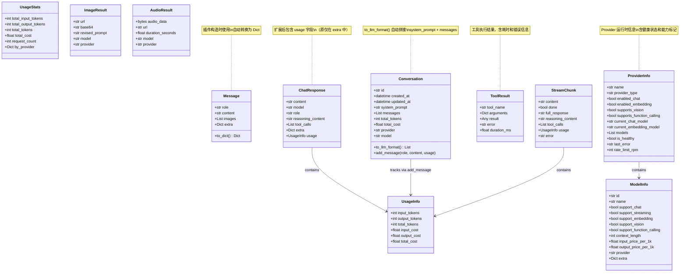
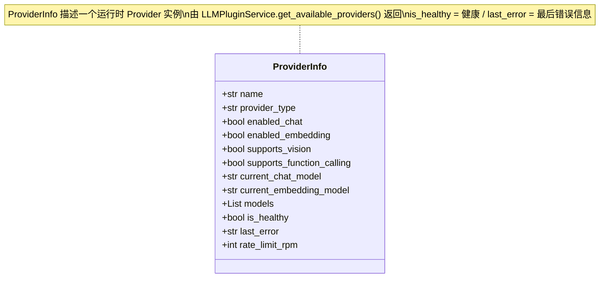
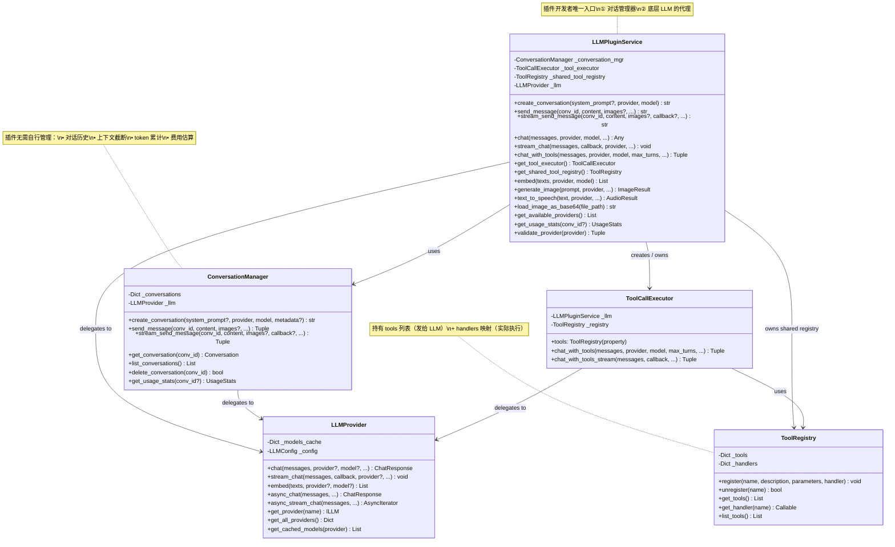
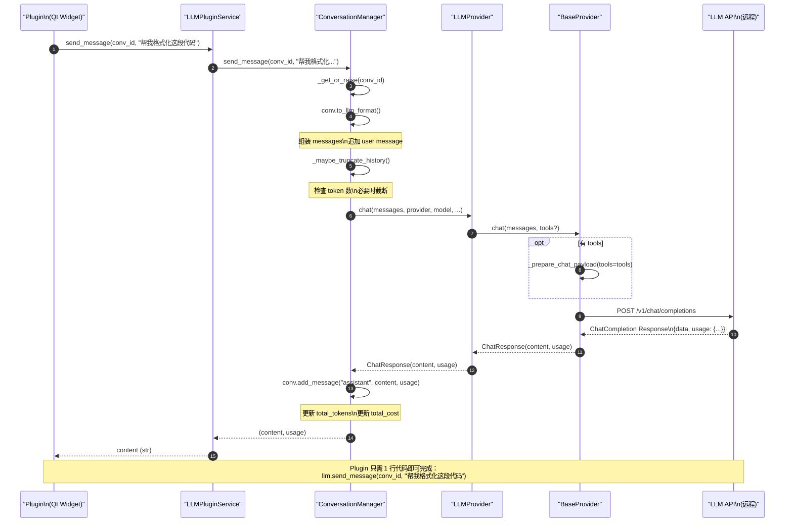
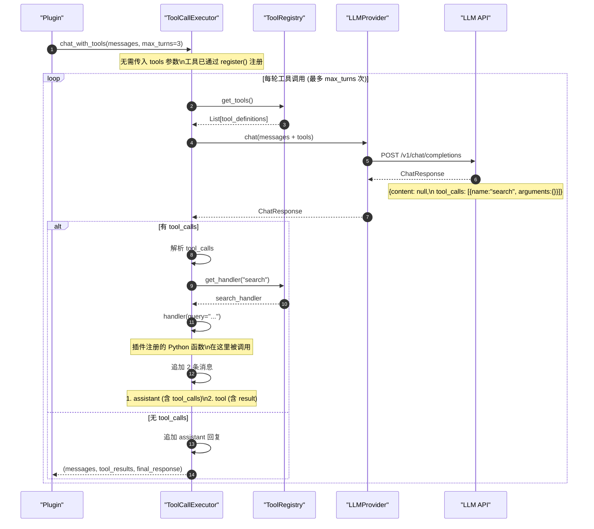
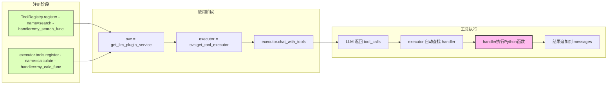
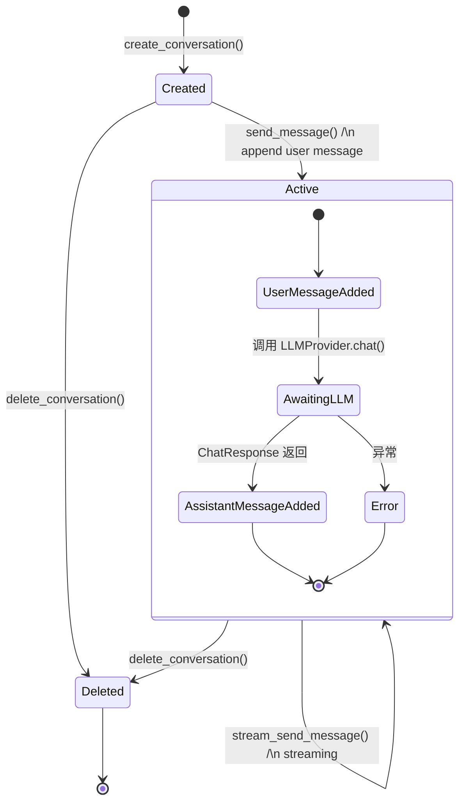

# LLM Provider API 参考

> LLM Provider 的完整 API 列表和详细说明

---

## 1. 类定义

### 1.1 LLMProvider (单例)

```python
from core.llm import get_llm_provider

# 获取单例实例
provider = get_llm_provider()
```

### 1.2 异常类

```python
from core.llm.exceptions import (
    LLMException,
    ConfigurationError,
    AuthenticationError,
    APIError,
    RateLimitError,
    InvalidRequestError,
    ModelNotSupportedError,
    ConnectionError,
    TimeoutError,
    StreamingError
)
```

### 1.3 插件服务层新增类型

```python
from core.llm.types import (
    Conversation,
    ToolResult,
    UsageStats,
    ImageResult,
    AudioResult,
    ProviderInfo,
    StreamChunk,
    UsageRecord,           # 新增
)
from core.llm.types_cache import (
    CacheInfo,             # 新增
    CacheType,             # 新增
)
from core.llm.cache_adapter import (
    CacheAdapter,          # 新增
    get_cache_adapter,     # 新增
    DEFAULT_CACHE_CONFIG,  # 新增
)
from core.llm.usage_record_store import (
    UsageRecordStore,      # 新增
    get_usage_record_store, # 新增
)
```

### 1.4 插件服务层类

```python
from core.llm import (
    LLMPluginService,
    get_llm_plugin_service,
    ConversationManager,
    ToolCallExecutor,
    ToolRegistry,
)
```

---

## 2. 数据类型

### 2.1 Message

```python
from core.llm.provider_interface import Message

# 创建消息
msg = Message(
    role="user",           # "user", "assistant", "system"
    content="你好",
    images=None,          # 可选，图片 base64 列表（用于 Vision）
    **extra               # 其他额外参数
)

# 转换为字典
msg.to_dict()
```

### 2.2 UsageInfo

```python
from core.llm.provider_interface import UsageInfo

# 属性
usage.input_tokens   # int | None: 输入 token 数
usage.output_tokens  # int | None: 输出 token 数
usage.total_tokens   # int | None: 总 token 数
usage.input_cost     # float | None: 输入费用（元）
usage.output_cost    # float | None: 输出费用（元）
usage.total_cost     # float | None: 总费用（元）
```

> **注意**: `UsageInfo` 通常作为 `ChatResponse.usage` 字段返回，也可由 `ConversationManager.send_message()` 等方法直接获取。

### 2.3 ChatResponse

```python
from core.llm.provider_interface import ChatResponse

# 属性
response.content           # str: 响应内容
response.model             # str: 使用的模型
response.role              # str: 响应角色
response.reasoning_content # str: 推理内容（如有）
response.tool_calls        # List[Dict]: 函数调用列表
response.usage             # UsageInfo | None: Token 用量与费用信息
response.extra             # Dict: 额外信息
```

### 2.3 EmbeddingResponse

```python
from core.llm.provider_interface import EmbeddingResponse

# 属性
response.embedding  # List[float]: 嵌入向量
response.model      # str: 使用的模型
response.extra      # Dict: 额外信息
```

### 2.4 ModelInfo

```python
from core.llm.provider_interface import ModelInfo

# 属性
model.id                 # str: 模型 ID
model.name               # str: 模型名称
model.support_chat               # bool: 是否支持 Chat
model.support_streaming          # bool: 是否支持流式
model.support_embedding          # bool: 是否支持 Embedding
model.support_vision             # bool: 是否支持 Vision
model.support_function_calling   # bool: 是否支持函数调用
model.context_length             # int:  上下文窗口大小（token 数）
model.input_price_per_1k         # float: 每千 token 输入价格（元）
model.output_price_per_1k        # float: 每千 token 输出价格（元）
model.provider                   # str:  所属 Provider 名称
model.extra                      # Dict: 额外信息

# 方法
model.to_dict()          # 转换为字典
ModelInfo.from_dict(d)   # 从字典创建
```

---

### 2.5 UsageRecord

```python
from core.llm.types import UsageRecord

# 属性
record.id               # str: 唯一记录 ID（UUID4）
record.timestamp         # datetime: 请求 UTC 时间
record.conversation_id   # str: 关联对话 ID，无对话则为空
record.provider          # str: Provider 名称
record.model             # str: 模型 ID
record.input_tokens      # int: 输入 token 数
record.output_tokens      # int: 输出 token 数
record.total_tokens       # int: 总 token 数（input + output）
record.cached_tokens      # int: 来自 Prompt Cache 的 token 数
record.cache_hit          # bool: 是否命中缓存
record.is_stream          # bool: 是否为流式请求
record.duration_ms        # float: 请求耗时（毫秒）

# 方法
record.to_dict()         # 转换为字典（用于持久化）
UsageRecord.from_dict(d) # 从字典创建
```

存储位置: `data/llm_usage.json`，由 `UsageRecordStore` 管理。

---

### 2.6 CacheType

```python
from core.llm.types_cache import CacheType

class CacheType(Enum):
    NONE              # 无缓存
    PROMPT_CACHE      # MiniMax 被动缓存
    ANTHROPIC_CACHE   # Anthropic 主动缓存
    KV_CACHE          # OpenAI 自动 KV Cache
    CONTEXT_CACHE     # Gemini 上下文缓存
    SPECULATIVE       # 推测解码
```

---

### 2.7 CacheInfo

```python
from core.llm.types_cache import CacheInfo

# 属性
info.enabled           # bool: 是否启用缓存
info.cache_type        # str: 缓存类型（CacheType.value）
info.cached_tokens     # int: 命中缓存的 token 数
info.new_tokens        # int: 新增的 token 数（非缓存）
info.cache_hit         # bool: 是否命中缓存
info.cache_hit_rate    # float: 缓存命中率（0.0 ~ 1.0）
info.ttl_seconds      # Optional[int]: 缓存过期时间（秒）
info.raw_data         # Dict: 供应商原始信息

# 属性
info.total_input_tokens  # int: cached_tokens + new_tokens
info.efficiency         # float: 缓存效率（cached_tokens / total_input_tokens）
```

由 `CacheAdapter.extract_cache_info()` 从 API 响应中提取。

---

### 2.8 CacheAdapter

```python
from core.llm.cache_adapter import CacheAdapter, get_cache_adapter, DEFAULT_CACHE_CONFIG

# 缓存配置常量
DEFAULT_CACHE_CONFIG  # Dict[str, Dict]: 各 Provider 默认缓存字段路径配置

# 方法
adapter.extract_cache_info(response: Dict) -> CacheInfo
    # 从 API 响应字典中提取缓存信息

adapter.is_cache_available(model: Optional[str] = None) -> bool
    # 检查模型是否支持缓存

adapter.prepare_cache_params(config: Dict) -> Dict
    # 准备缓存相关请求参数（供将来扩展）
```

`get_cache_adapter(provider_type, cache_config?)` 返回 `ConfigurableCacheAdapter` 实例。`cache_config` 可覆盖 `DEFAULT_CACHE_CONFIG` 中的字段路径映射。

支持的 Provider 缓存类型:

| Provider | 缓存类型 | TTL |
|----------|---------|-----|
| minimax | prompt_cache | - |
| openai | kv_cache | - |
| anthropic | anthropic_cache | 300s |
| gemini | context_cache | 3600s |
| glm | prompt_cache | - |
| siliconflow | kv_cache | - |
| ollama | none | - |

---

### 2.9 UsageRecordStore

```python
from core.llm.usage_record_store import UsageRecordStore, get_usage_record_store

store = get_usage_record_store()  # 单例

# 记录请求
store.record(usage_record: UsageRecord) -> None

# 查询记录
store.get_records(
    start_time: Optional[datetime] = None,
    end_time: Optional[datetime] = None,
    provider: Optional[str] = None,
    model: Optional[str] = None,
    conversation_id: Optional[str] = None,
    limit: Optional[int] = None,
    offset: int = 0,
) -> List[UsageRecord]

# 聚合统计
store.aggregate(
    start_time: Optional[datetime] = None,
    end_time: Optional[datetime] = None,
    group_by: str = "provider",  # "provider" | "model" | "day"
) -> Dict[str, Any]

# 总计统计
store.get_total_stats(
    start_time: Optional[datetime] = None,
    end_time: Optional[datetime] = None,
) -> Dict[str, Any]

# 清理旧记录
store.prune(before: datetime) -> int  # 返回删除的记录数
```

存储文件: `data/llm_usage.json`。采用原子写入（临时文件 + `os.replace`），线程安全，后台异步保存。

---

## 3. 数据类型类图

以下类图展示 LLM 层所有数据类型的完整字段和类型关系：



### 3.1 ProviderInfo 详细



## 4. LLMProvider 方法

### 4.1 Provider 管理

#### get_provider()

```python
def get_provider(self, name: str) -> Optional[ILLM]
```

获取指定 Provider 实例。

**参数**:
- `name`: Provider 名称（如 "minimax", "siliconflow"）

**返回**:
- Provider 实例，不存在则返回 `None`

**示例**:
```python
provider = get_llm_provider()
minimax = provider.get_provider("minimax")
```

---

#### get_all_providers()

```python
def get_all_providers(self) -> Dict[str, ILLM]
```

获取所有已初始化的 Provider。

**返回**:
- Provider 字典 `{name: provider_instance}`

**示例**:
```python
all_providers = provider.get_all_providers()
for name, p in all_providers.items():
    print(f"{name}: {p.provider_name}")
```

---

#### get_enabled_providers()

```python
def get_enabled_providers(self, feature: str = "chat") -> Dict[str, ILLM]
```

获取已启用的 Provider。

**参数**:
- `feature`: 功能类型 ("chat" 或 "embedding")

**返回**:
- 启用的 Provider 字典

**示例**:
```python
# 获取支持 Chat 的 Provider
chat_providers = provider.get_enabled_providers("chat")

# 获取支持 Embedding 的 Provider
embedding_providers = provider.get_enabled_providers("embedding")
```

---

#### add_provider()

```python
def add_provider(self, name: str, config: ProviderConfig) -> None
```

添加或更新 Provider。

**参数**:
- `name`: Provider 名称
- `config`: Provider 配置

**示例**:
```python
from core.llm.config import ProviderConfig

config = ProviderConfig(
    name="Custom Provider",
    provider_type="custom",
    api_key="your-key",
    base_url="https://api.example.com",
    chat_model="gpt-4",
    embedding_model="text-embedding-3",
    enabled_chat=True,
    enabled_embedding=True,
    support_vision=True
)
provider.add_provider("custom", config)
```

---

#### remove_provider()

```python
def remove_provider(self, name: str) -> bool
```

移除 Provider。

**参数**:
- `name`: Provider 名称

**返回**:
- 是否成功移除

**示例**:
```python
provider.remove_provider("custom")
```

---

#### reload_config()

```python
def reload_config(self) -> None
```

重新加载配置，关闭所有现有连接并重新初始化。

**示例**:
```python
provider.reload_config()
```

---

### 4.2 同步 Chat API

#### chat()

```python
def chat(
    self,
    messages: List[Union[Message, Dict]],
    provider: str = "default",
    model: Optional[str] = None,
    temperature: float = 0.7,
    max_tokens: Optional[int] = None,
    **kwargs
) -> ChatResponse
```

发送聊天请求（同步）。

**参数**:
- `messages`: 消息列表，支持 Message 对象或字典格式
- `provider`: Provider 名称（"default" 自动选择第一个启用的 Provider）
- `model`: 模型名称（可选，默认使用配置中的模型）
- `temperature`: 温度参数，控制随机性，范围 0-2，默认 0.7
- `max_tokens`: 最大生成 token 数（可选）
- `**kwargs`: 其他 Provider 特定参数（如 `images` 可通过 `Message` 对象的 `images` 字段传入，`tools` 为 Function Calling 工具定义列表，格式符合 OpenAI Function Calling 规范）

**返回**:
- `ChatResponse`: 聊天响应对象，包含以下属性：
  - `content`: 响应内容文本
  - `model`: 使用的模型名称
  - `role`: 响应角色（通常为 "assistant"）
  - `reasoning_content`: 推理内容（如有，部分 Provider 支持）
  - `tool_calls`: 函数调用列表（Function Calling）
  - `extra`: 额外信息字典

**Function Calling 说明**:
- `tools` 参数用于定义可调用的函数工具
- 响应中的 `tool_calls` 包含模型决定调用的工具和参数
- 需要两轮对话：第一轮获取工具调用，第二轮传入工具结果

**Vision 说明**:
- 图片通过 `Message` 对象的 `images` 字段传入（base64 编码的图片列表）
- 仅支持 Vision 的 Provider（如 SiliconFlow、GLM、Ollama）才能使用
- MiniMax Provider 不支持 Vision 功能

**示例**:
```python
# 基础使用
response = provider.chat(
    messages=[
        {"role": "system", "content": "你是一个助手"},
        {"role": "user", "content": "你好"}
    ],
    provider="minimax",
    temperature=0.7
)
print(f"Model: {response.model}")
print(f"Response: {response.content}")

# 使用 Function Calling
tools = [
    {
        "type": "function",
        "function": {
            "name": "get_weather",
            "description": "获取指定城市的天气信息",
            "parameters": {
                "type": "object",
                "properties": {
                    "city": {
                        "type": "string",
                        "description": "城市名称"
                    }
                },
                "required": ["city"]
            }
        }
    }
]

# 第一次调用：模型决定调用工具
response = provider.chat(
    messages=[{"role": "user", "content": "北京今天天气怎么样？"}],
    provider="minimax",
    tools=tools
)

print(f"模型回复: {response.content}")

# 检查是否有工具调用
if response.tool_calls:
    tool_call = response.tool_calls[0]
    func_name = tool_call['function']['name']
    func_args = tool_call['function']['arguments']

    print(f"调用工具: {func_name}")
    print(f"参数: {func_args}")

    # 执行工具函数
    def get_weather(city: str) -> str:
        return f"{city} 今天天气晴朗，25°C"

    result = get_weather(func_args.get('city', ''))

    # 将工具结果添加到对话
    messages = [
        {"role": "user", "content": "北京今天天气怎么样？"},
        {"role": "assistant", "content": response.content},
        {
            "role": "tool",
            "tool_call_id": tool_call.get('id', ''),
            "content": result
        }
    ]

    # 第二次调用：模型根据工具结果生成最终回复
    final_response = provider.chat(messages=messages, provider="minimax")
    print(f"最终回复: {final_response.content}")

# 使用 Vision（仅支持 Vision 的 Provider）
import base64

# 读取图片并转为 base64
with open("image.png", "rb") as f:
    img_base64 = base64.b64encode(f.read()).decode()

# 发送多模态消息
response = provider.chat(
    messages=[
        {
            "role": "user",
            "content": "描述这张图片",
            "images": [img_base64]
        }
    ],
    provider="siliconflow"  # 使用支持 Vision 的 Provider
)

print(response.content)
```

---

#### stream_chat()

```python
def stream_chat(
    self,
    messages: List[Union[Message, Dict]],
    provider: str = "default",
    model: Optional[str] = None,
    temperature: float = 0.7,
    max_tokens: Optional[int] = None,
    callback: Optional[Callable[[ChatResponse], None]] = None,
    **kwargs
)
```

发送流式聊天请求（同步）。

**参数**:
- `messages`: 消息列表
- `provider`: Provider 名称
- `model`: 模型名称
- `temperature`: 温度参数
- `max_tokens`: 最大 token 数
- `callback`: 流式回调函数，接收每个 `ChatResponse`
- `**kwargs`: 其他参数

**返回**:
- 响应生成器（Iterator）或 None，取决于具体 Provider 的实现

**示例**:
```python
def on_chunk(response):
    print(response.content, end="", flush=True)

responses = provider.stream_chat(
    messages=[{"role": "user", "content": "讲个故事"}],
    provider="minimax",
    callback=on_chunk
)
```

---

### 4.3 同步 Embedding API

#### embed()

```python
def embed(
    self,
    texts: Union[str, List[str]],
    provider: str = "default",
    model: Optional[str] = None,
    **kwargs
) -> List[EmbeddingResponse]
```

发送嵌入请求（同步）。

**参数**:
- `texts`: 文本或文本列表
- `provider`: Provider 名称
- `model`: 模型名称
- `**kwargs`: 其他参数

**返回**:
- `List[EmbeddingResponse]`: 嵌入响应列表

**示例**:
```python
# 单文本
response = provider.embed(
    texts="你好世界",
    provider="minimax"
)
embedding = response[0].embedding

# 多文本
responses = provider.embed(
    texts=["你好", "世界"],
    provider="minimax"
)
embeddings = [r.embedding for r in responses]
```

---

### 4.4 异步 Chat API

#### async_chat()

```python
async def async_chat(
    self,
    messages: List[Union[Message, Dict]],
    provider: str = "default",
    model: Optional[str] = None,
    temperature: float = 0.7,
    max_tokens: Optional[int] = None,
    **kwargs
) -> ChatResponse
```

发送聊天请求（异步）。

**参数**: 同 `chat()`

**返回**:
- `ChatResponse`: 聊天响应

**示例**:
```python
import asyncio

async def main():
    response = await provider.async_chat(
        messages=[{"role": "user", "content": "你好"}],
        provider="minimax"
    )
    print(response.content)

asyncio.run(main())
```

---

#### async_stream_chat()

```python
async def async_stream_chat(
    self,
    messages: List[Union[Message, Dict]],
    provider: str = "default",
    model: Optional[str] = None,
    temperature: float = 0.7,
    max_tokens: Optional[int] = None,
    **kwargs
) -> AsyncIterator[ChatResponse]
```

发送流式聊天请求（异步）。

**参数**: 同 `stream_chat()`

**返回**:
- 异步迭代器 `AsyncIterator[ChatResponse]`

**示例**:
```python
import asyncio

async def main():
    async for response in provider.async_stream_chat(
        messages=[{"role": "user", "content": "你好"}],
        provider="minimax"
    ):
        print(response.content, end="", flush=True)

asyncio.run(main())
```

---

### 4.5 异步 Embedding API

#### async_embed()

```python
async def async_embed(
    self,
    texts: Union[str, List[str]],
    provider: str = "default",
    model: Optional[str] = None,
    **kwargs
) -> List[EmbeddingResponse]
```

发送嵌入请求（异步）。

**参数**: 同 `embed()`

**返回**:
- `List[EmbeddingResponse]`: 嵌入响应列表

**示例**:
```python
import asyncio

async def main():
    responses = await provider.async_embed(
        texts=["你好", "世界"],
        provider="minimax"
    )
    embeddings = [r.embedding for r in responses]

asyncio.run(main())
```

---

### 4.6 模型管理

#### get_models()

```python
def get_models(self, provider: Optional[str] = None) -> Dict[str, List[ModelInfo]]
```

获取可用模型列表。

**参数**:
- `provider`: Provider 名称（`None` 表示所有 Provider）

**返回**:
- `Dict[str, List[ModelInfo]]`: 每个 Provider 的模型列表

**示例**:
```python
# 获取所有模型
all_models = provider.get_models()
for name, models in all_models.items():
    print(f"{name}: {len(models)} 个模型")

# 获取指定 Provider 的模型
minimax_models = provider.get_models("minimax")
```

---

#### refresh_provider_models()

```python
def refresh_provider_models(self, provider_name: str, force: bool = False) -> List[ModelInfo]
```

刷新指定 Provider 的模型列表。

**参数**:
- `provider_name`: Provider 名称
- `force`: 是否强制从 API 刷新，默认为 False（优先使用缓存）

**返回**:
- `List[ModelInfo]`: 模型列表

**示例**:
```python
# 强制刷新 MiniMax 模型列表
models = provider.refresh_provider_models("minimax", force=True)
for model in models:
    print(f"{model.id}: Chat={model.support_chat}, Vision={model.support_vision}")
```

---

#### refresh_all_models()

```python
def refresh_all_models(self, force: bool = False) -> Dict[str, List[ModelInfo]]
```

刷新所有已配置 Provider 的模型列表。

**参数**:
- `force`: 是否强制从 API 刷新，默认为 False

**返回**:
- `Dict[str, List[ModelInfo]]`: 每个 Provider 的模型列表

**示例**:
```python
# 刷新所有模型
all_models = provider.refresh_all_models(force=True)
print(f"共获取 {len(all_models)} 个 Provider 的模型")
```

---

#### get_cached_models()

```python
def get_cached_models(self, provider_name: str) -> List[ModelInfo]
```

获取指定 Provider 缓存的模型列表（不调用 API）。

**参数**:
- `provider_name`: Provider 名称

**返回**:
- `List[ModelInfo]`: 缓存的模型列表

**示例**:
```python
# 获取缓存的模型（快速返回）
cached = provider.get_cached_models("minimax")
print(f"缓存中有 {len(cached)} 个模型")
```

---

### 4.7 配置属性

#### config

```python
@property
def config(self) -> LLMConfig
```

获取配置管理器。

**示例**:
```python
config = provider.config
providers = config.get_all_providers()
```

---

#### available_providers

```python
@property
def available_providers(self) -> List[str]
```

获取可用 Provider 类型列表。

**示例**:
```python
print(provider.available_providers)
# ['minimax', 'siliconflow', 'glm', 'ollama']
```

---

#### close()

```python
def close(self) -> None
```

关闭所有 Provider 连接。

**示例**:
```python
provider.close()
```

---

## 5. LLMPluginService（插件开发者主入口）

> **重要**: 第三方插件开发者应使用 `LLMPluginService` 而非直接访问 `LLMProvider`。推荐通过 `PluginServices.llm_facade` 获取实例。

```python
# 获取单例（插件代码推荐方式）
from core.llm import get_llm_plugin_service

svc = get_llm_plugin_service()
```

### 5.1 核心服务类图



### 5.2 获取实例

```python
def get_llm_plugin_service() -> LLMPluginService
```

获取 `LLMPluginService` 全局单例。所有方法均为线程安全。

**示例**:
```python
from core.llm import get_llm_plugin_service

svc = get_llm_plugin_service()
```

### 5.2 对话管理

#### create_conversation()

```python
def create_conversation(
    system_prompt: Optional[str] = None,
    provider: str = "default",
    model: str = "default",
    metadata: Optional[Dict] = None,
) -> str
```

创建一个新对话，返回对话 ID。

**示例**:
```python
conv_id = svc.create_conversation(
    system_prompt="你是一个代码助手",
    provider="minimax",
)
```

**对话管理完整流程**：

```mermaid
flowchart TB
    START[插件开发者]
    CREATE[create_conversation&#40;&#41; + system_prompt]
    CONV_ID[返回 conv_id]
    SEND[send_message&#40;conv_id, 格式化代码&#41;]
    RESP1[返回 content &#40;str&#41;]
    STREAM[stream_send_message&#40;&#41; + conv_id + callback]
    RESP2[callback 逐 chunk 调用]
    TOOLS[chat_with_tools&#40;&#41; + messages]
    RESP3[自动处理两轮 + 返回 final_response]
    STATS[get_usage_stats&#40;conv_id&#41;]
    RESP4[UsageStats - total_tokens, cost, request_count（消息总条数）]

    START --> CREATE
    CREATE --> CONV_ID
    CONV_ID --> SEND
    SEND --> RESP1
    RESP1 --> STREAM
    STREAM --> RESP2
    RESP2 --> TOOLS
    TOOLS --> RESP3
    RESP3 --> STATS
    STATS --> RESP4

    style START fill:#f96,stroke:#333
    style CONV_ID fill:#bbf,stroke:#333,stroke-width:2px
    style RESP1 fill:#bbf,stroke:#333,stroke-width:2px
    style RESP2 fill:#bbf,stroke:#333,stroke-width:2px
    style RESP3 fill:#bbf,stroke:#333,stroke-width:2px
    style RESP4 fill:#bbf,stroke:#333,stroke-width:2px
```



#### send_message()

```python
def send_message(
    conversation_id: str,
    content: str,
    images: Optional[List[str]] = None,
    temperature: Optional[float] = None,
    max_tokens: Optional[int] = None,
) -> str
```

同步发送消息，自动追加到对话历史。返回 LLM 响应内容。

**示例**:
```python
reply = svc.send_message(conv_id, "解释这段代码")
print(reply)
```

**消息发送序列图**：



#### stream_send_message()

```python
def stream_send_message(
    conversation_id: str,
    content: str,
    images: Optional[List[str]] = None,
    callback: Optional[Callable[[StreamChunk], None]] = None,
    temperature: Optional[float] = None,
    max_tokens: Optional[int] = None,
) -> str
```

流式发送消息，逐 chunk 调用 callback。返回完整的 LLM 响应内容。

**示例**:
```python
def on_chunk(chunk):
    print(chunk.content, end="")

reply = svc.stream_send_message(
    conv_id,
    "写一个快排",
    callback=on_chunk
)
```

#### get_conversation() / list_conversations() / delete_conversation()

```python
def get_conversation(conversation_id: str) -> Optional[Conversation]
def list_conversations() -> List[Conversation]
def delete_conversation(conversation_id: str) -> bool
```

获取/列出/删除对话。

### 5.3 直接 Chat（无对话状态）

#### chat()

```python
def chat(
    messages: List[Dict],
    provider: str = "default",
    model: str = "default",
    temperature: Optional[float] = None,
    max_tokens: Optional[int] = None,
    tools: Optional[List[Dict]] = None,
) -> ChatResponse
```

直接发起 chat，无对话状态管理。返回 `ChatResponse` 对象（包含 `usage` 字段）。

**示例**:
```python
resp = svc.chat([{"role": "user", "content": "hello"}])
print(resp.content, resp.usage.total_tokens)
```

#### stream_chat()

```python
def stream_chat(
    messages: List[Dict],
    callback: Callable[[str, bool], None],
    provider: str = "default",
    model: str = "default",
    temperature: Optional[float] = None,
    max_tokens: Optional[int] = None,
    tools: Optional[List[Dict]] = None,
)
```

流式版本 chat（无对话状态）。callback 签名: `(chunk: str, done: bool) -> None`。

### 5.4 工具调用

#### chat_with_tools()

```python
def chat_with_tools(
    messages: List[Dict],
    provider: str = "default",
    model: str = "default",
    max_turns: int = 5,
    temperature: Optional[float] = None,
) -> Tuple[List[Dict], List[ToolResult], Any]
```

自动处理工具调用两轮循环。返回 `(最终消息列表, 工具结果列表, 最终响应)`。

**示例**:
```python
executor = svc.get_tool_executor()
executor.tools.register(
    "search", "搜索网络",
    {"type": "object", "properties": {"q": {"type": "string"}}},
    handler=lambda q: f"关于{q}的结果..."
)
msgs, results, final = executor.chat_with_tools(
    [{"role": "user", "content": "搜索 InstructionX"}],
    provider="minimax",
)
```

**工具调用自动循环（完整序列）**：



**工具注册与使用完整流程**：



#### chat_with_tools_stream()

```python
def chat_with_tools_stream(
    messages: List[Dict],
    callback: Callable[[StreamChunk], None],
    provider: str = "default",
    model: str = "default",
    max_turns: int = 5,
    temperature: Optional[float] = None,
) -> Tuple[List[Dict], List[ToolResult], str]
```

流式版本的 chat_with_tools。

#### get_tool_executor()

```python
def get_tool_executor() -> ToolCallExecutor
```

获取工具调用执行器（包含 `tools` 属性）。

#### get_shared_tool_registry()

```python
def get_shared_tool_registry() -> ToolRegistry
```

获取共享工具注册表（全局注册，供多个插件共享）。

### 5.5 向量嵌入

#### embed()

```python
def embed(
    texts: str | List[str],
    provider: str = "default",
    model: str = "default",
) -> List[List[float]]
```

文本向量化。返回嵌入向量列表。

### 5.6 多模态

#### generate_image()

```python
def generate_image(
    prompt: str,
    provider: str = "default",
    model: Optional[str] = None,
    size: str = "1024x1024",
    quality: str = "standard",
) -> ImageResult
```

图像生成。返回 `ImageResult`（含 `url` / `base64` / `revised_prompt`）。

#### text_to_speech()

```python
def text_to_speech(
    text: str,
    provider: str = "default",
    model: Optional[str] = None,
    voice: Optional[str] = None,
) -> AudioResult
```

语音合成。返回 `AudioResult`（含 `audio_data` / `url` / `duration_seconds`）。

#### load_image_as_base64()

```python
def load_image_as_base64(file_path: str) -> str
```

加载图片文件为 base64 字符串（不含 data URI 前缀）。

### 5.7 辅助方法

#### get_available_providers()

```python
def get_available_providers() -> List[ProviderInfo]
```

获取所有可用 Provider 的详细信息列表。

#### get_usage_stats()

```python
def get_usage_stats(conversation_id: Optional[str] = None) -> UsageStats
```

获取用量统计。`conversation_id` 为 None 时返回全局统计。

**返回字段**: `total_tokens`, `total_cost`, `request_count`（消息总条数）, `by_provider`

#### validate_provider()

```python
def validate_provider(provider: str) -> Tuple[bool, str]
```

验证 Provider 配置是否有效。返回 `(是否有效, 错误信息)`。

#### get_raw_provider()

```python
def get_raw_provider(provider: str = "default") -> Optional[ILLM]
```

获取底层 `LLMProvider` 实例（供高级插件使用）。一般插件不应直接使用。

---

## 6. ConversationManager

> **内部组件**: 插件开发者通常通过 `LLMPluginService` 间接使用，详见 Section 5。

`ConversationManager` 管理对话的完整生命周期：
- 自动管理历史消息追加（用户消息和助手回复）
- 费用计算（基于 `DEFAULT_PRICING`）

**Conversation 状态机**：



**主要方法**:
| 方法 | 返回值 | 说明 |
|---|---|---|
| `create_conversation()` | `str` | 创建对话 |
| `send_message()` | `tuple[str, UsageInfo \| None]` | 同步发送，返回内容和用量 |
| `stream_send_message()` | `tuple[str, UsageInfo \| None]` | 流式发送，返回内容和用量 |
| `get_conversation()` | `Conversation \| None` | 获取对话 |
| `list_conversations()` | `List[Conversation]` | 列出所有对话 |
| `delete_conversation()` | `bool` | 删除对话 |
| `get_usage_stats()` | `UsageStats` | 用量统计 |

---

## 7. ToolCallExecutor / ToolRegistry

> **内部组件**: 插件开发者通过 `LLMPluginService.get_tool_executor()` 获取，详见 Section 5。

### ToolRegistry

```python
class ToolRegistry:
    def register(name, description, parameters, handler)  # 注册工具
    def unregister(name) -> bool                         # 注销工具
    def get_tools() -> List[Dict]                       # 获取工具定义列表
    def get_handler(name) -> Callable | None           # 获取处理器
    def list_tools() -> List[str]                       # 列出已注册工具名
```

### ToolCallExecutor

```python
class ToolCallExecutor:
    @property
    def tools(self) -> ToolRegistry          # 工具注册表

    def chat_with_tools(...) -> Tuple        # 工具调用（见 4.4）
    def chat_with_tools_stream(...) -> Tuple  # 流式版本
```

---

## 8. 关于 Provider 实现类

> **注意**: 各个 Provider 的实现类（如 `MiniMaxProvider`、`SiliconFlowProvider` 等）为框架内部实现类，不建议开发者直接实例化。所有功能应通过 `get_llm_provider()` 获取的 `LLMProvider` 单例来调用。

Provider 实现类的细节（如请求格式差异、响应解析逻辑等）由框架内部管理，开发者无需关注。如需扩展新的 Provider，请参考 [LLM Provider 概述](overview.md) 中的扩展指南。

---

## 9. 完整示例

### 8.1 基础使用

```python
from core.llm import get_llm_provider
from core.llm.provider_interface import Message

# 获取 Provider
provider = get_llm_provider()

# 发送聊天
response = provider.chat(
    messages=[
        Message(role="user", content="你好"),
    ],
    provider="minimax",
    temperature=0.7
)

print(f"Model: {response.model}")
print(f"Response: {response.content}")
```

### 8.2 使用 Vision

> **注意**：MiniMax Provider 不支持 Vision，请使用 SiliconFlow、GLM 或 Ollama。

```python
import base64

# 读取图片并转为 base64
with open("image.png", "rb") as f:
    img_base64 = base64.b64encode(f.read()).decode()

# 发送多模态消息（使用支持 Vision 的 Provider）
response = provider.chat(
    messages=[
        {
            "role": "user",
            "content": "描述这张图片",
            "images": [img_base64]
        }
    ],
    provider="siliconflow"
)

print(response.content)
```

### 8.3 并发调用

```python
import asyncio
from core.llm import get_llm_provider

provider = get_llm_provider()

async def concurrent_chat():
    # 并发调用多个 Provider
    results = await asyncio.gather(
        provider.async_chat(
            messages=[{"role": "user", "content": "你好"}],
            provider="minimax"
        ),
        provider.async_chat(
            messages=[{"role": "user", "content": "Hello"}],
            provider="siliconflow"
        ),
        provider.async_chat(
            messages=[{"role": "user", "content": "你好"}],
            provider="glm"
        ),
        return_exceptions=True  # 允许异常
    )

    for i, result in enumerate(results):
        if isinstance(result, Exception):
            print(f"Provider {i} error: {result}")
        else:
            print(f"Provider {i}: {result.content}")

asyncio.run(concurrent_chat())
```

### 8.4 Embedding 相似度计算

```python
import numpy as np
from core.llm import get_llm_provider

provider = get_llm_provider()

# 获取两个文本的嵌入
responses = provider.embed(
    texts=["你好世界", "你好"],
    provider="minimax"
)

# 计算余弦相似度
vec1 = np.array(responses[0].embedding)
vec2 = np.array(responses[1].embedding)

similarity = np.dot(vec1, vec2) / (np.linalg.norm(vec1) * np.linalg.norm(vec2))
print(f"相似度: {similarity:.4f}")
```

### 8.5 Function Calling

```python
from core.llm import get_llm_provider

provider = get_llm_provider()

# 定义工具
tools = [
    {
        "type": "function",
        "function": {
            "name": "get_weather",
            "description": "获取指定城市的天气信息",
            "parameters": {
                "type": "object",
                "properties": {
                    "city": {"type": "string", "description": "城市名称"}
                },
                "required": ["city"]
            }
        }
    }
]

# 模拟天气查询函数
def get_weather(city: str) -> str:
    return f"{city} 今天天气晴朗，25°C"

# 第一次调用：模型决定调用工具
response = provider.chat(
    messages=[{"role": "user", "content": "北京今天天气怎么样？"}],
    provider="minimax",
    tools=tools
)

print(f"模型回复: {response.content}")

# 检查是否有工具调用
if response.tool_calls:
    tool_call = response.tool_calls[0]
    func_name = tool_call['function']['name']
    func_args = tool_call['function']['arguments']

    print(f"调用工具: {func_name}")
    print(f"参数: {func_args}")

    # 执行工具函数
    result = get_weather(func_args.get('city', ''))

    # 将工具结果添加到对话
    messages = [
        {"role": "user", "content": "北京今天天气怎么样？"},
        {"role": "assistant", "content": response.content},
        {
            "role": "tool",
            "tool_call_id": tool_call.get('id', ''),
            "content": result
        }
    ]

    # 第二次调用：模型根据工具结果生成最终回复
    final_response = provider.chat(messages=messages, provider="minimax")
    print(f"最终回复: {final_response.content}")
```

---

## 10. 相关文档

- [LLM Provider 概述](overview.md)
- [插件开发指南](../plugin-system/plugin-development.md)

---

*本文档由 Claude Code 自动生成*
