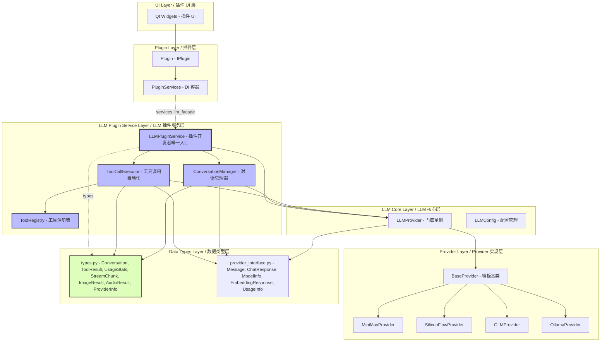
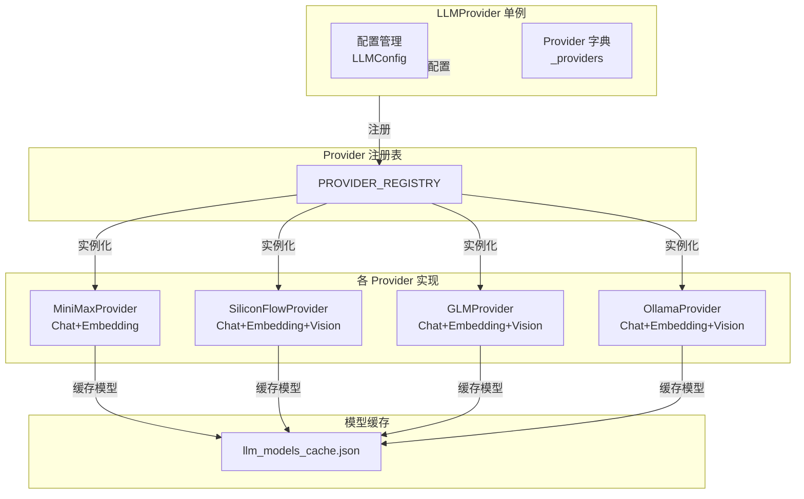
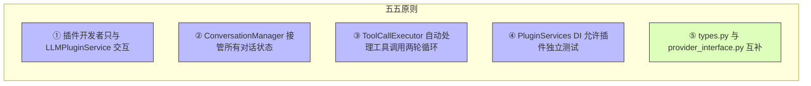
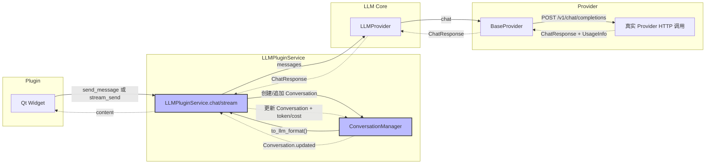
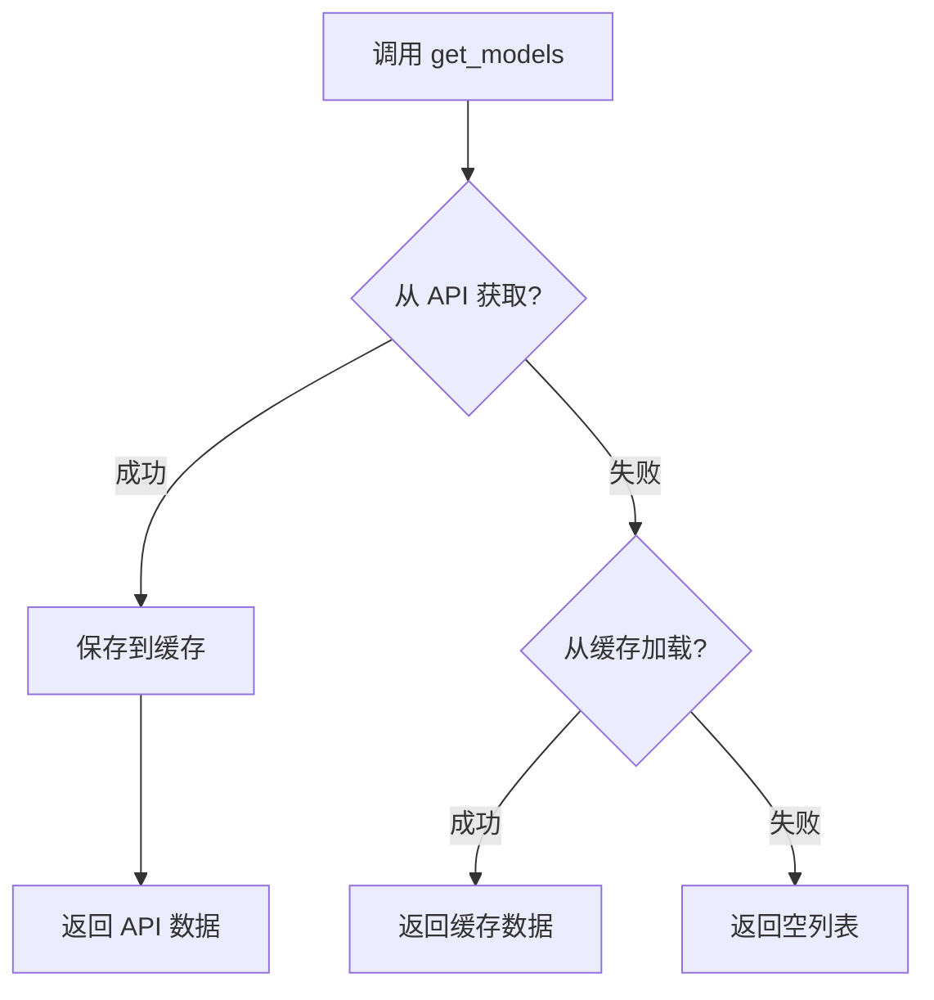
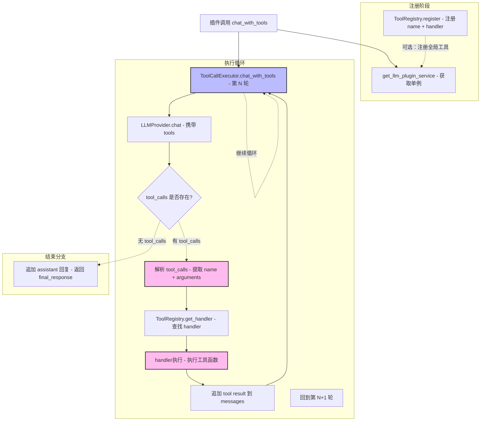

# LLM Provider 数据层

> LLM Provider 的架构设计和核心概念

---

## 1. 概述

`LLM Provider` 是 InstructionX 项目的核心大语言模型组件，负责多提供商管理、API 请求、模型列表获取与缓存、异步并发调用。

**文件位置**: `core/llm/`

**模式**: 单例模式（全局唯一实例）

**支持的 Provider**:
- MiniMax
- SiliconFlow
- GLM (智谱AI)
- Ollama (本地部署)

**插件开发者入口**: 第三方插件开发者请使用 `LLMPluginService`（`core/llm/plugin_service.py`），通过 `get_llm_plugin_service()` 获取单例。`LLMPluginService` 整合了对话管理、工具调用自动化、多模态等完整能力，是插件开发者的唯一入口。

**历史**: 原架构中插件直接访问 `LLMProvider` 单例。为解决无对话历史管理、Tool Use 门槛高、流式输出复杂等问题，重构新增了 LLM Plugin Service Layer。

---

## 2. 核心特性

| 特性 | 说明 |
|------|------|
| **单例模式** | 全局唯一实例，统一管理所有 Provider |
| **注册机制** | 装饰器注册，高扩展性，易于添加新 Provider |
| **同步/异步双 API** | 开发者可选择同步或异步调用方式 |
| **并发支持** | 支持多个任务同时调用多个语言模型 |
| **模型缓存** | API 获取的模型列表自动缓存到本地 JSON |
| **流式输出** | 支持流式响应，按块处理 |
| **多模态支持** | 部分 Provider 支持 Vision 图片理解 |
| **Function Calling** | 支持工具调用，与外部系统集成 |

---

## 3. 架构图

### 3.1 系统分层架构（6 层）



### 3.2 LLMProvider 内部架构（核心层）



---

### 3.3 核心设计原则



| # | 原则 | 说明 |
|---|---|---|
| ① | **单一入口** | 插件开发者只与 `LLMPluginService` 交互，不直接访问 `LLMProvider` |
| ② | **状态封装** | `ConversationManager` 接管所有对话状态，插件无需管理历史 |
| ③ | **工具自动化** | `ToolCallExecutor` 自动处理两轮调用循环，插件只需注册工具 |
| ④ | **可测试性** | `PluginServices` DI 容器允许插件在无 API 环境下完成测试 |
| ⑤ | **类型分离** | `types.py` 存放新增类型，`provider_interface.py` 存放 LLM 层核心类型 |

### 3.4 对话消息流



## 5. Provider 功能矩阵

| Provider | Chat | Streaming | Embedding | Vision | API 协议 |
|----------|------|-----------|-----------|--------|----------|
| MiniMax | ✅ | ✅ | ✅ | ❌ | OpenAI 兼容 |
| SiliconFlow | ✅ | ✅ | ✅ | ✅ | OpenAI 兼容 |
| GLM | ✅ | ✅ | ✅ | ✅ | OpenAI 兼容 |
| Ollama | ✅ | ✅ | ✅ | ✅ | 私有协议 |

> **注意**：MiniMax 官方文档明确说明当前不支持图像和音频类型的输入，因此 `support_vision = False`。

---

## 6. 单例模式与并发

### 6.1 单例模式

```python
from core.llm import get_llm_provider

# 获取单例实例
provider = get_llm_provider()

# 获取所有 Provider
all_providers = provider.get_all_providers()

# 获取启用的 Provider (Chat)
enabled_chat = provider.get_enabled_providers("chat")

# 获取启用的 Provider (Embedding)
enabled_embedding = provider.get_enabled_providers("embedding")
```

### 6.2 并发调用

```python
import asyncio
from core.llm import get_llm_provider

provider = get_llm_provider()

# 同步调用
response = provider.chat(
    messages=[{"role": "user", "content": "你好"}],
    provider="minimax"
)

# 异步调用
async def main():
    response = await provider.async_chat(
        messages=[{"role": "user", "content": "你好"}],
        provider="minimax"
    )

# 异步流式调用
async def stream_example():
    async for chunk in provider.async_stream_chat(
        messages=[{"role": "user", "content": "写一首诗"}],
        provider="siliconflow"
    ):
        print(chunk.content, end="")

# 异步嵌入
async def embed_example():
    results = await provider.async_embed(
        texts=["要嵌入的文本1", "要嵌入的文本2"],
        provider="minimax"
    )

# 并发异步调用
async def concurrent():
    results = await asyncio.gather(
        provider.async_chat(messages=[...], provider="minimax"),
        provider.async_chat(messages=[...], provider="siliconflow"),
        provider.async_chat(messages=[...], provider="glm"),
    )
```

---

## 7. 模型获取与缓存

### 7.1 获取流程



### 7.2 缓存机制

- **缓存位置**: `config/llm_models_cache.json`
- **缓存策略**: 优先从 API 获取，成功则缓存；失败则尝试加载缓存；缓存也没有则返回空列表
- **每次初始化**: 都会尝试从 API 刷新模型列表

```python
# 获取模型列表
provider = get_llm_provider()
minimax = provider.get_provider("minimax")
models = minimax.get_models()

# 模型信息
for model in models:
    print(f"{model.id} - Chat: {model.support_chat}, Embedding: {model.support_embedding}")
```

---

## 8. 对话管理（新增）

LLM 层重构新增了完整的对话管理能力，通过 `LLMPluginService` 和 `ConversationManager` 提供。

### 8.1 核心能力

| 能力 | 说明 |
|---|---|
| **对话 CRUD** | 创建/获取/列出/删除对话，自动管理 conversation_id |
| **自动历史追加** | send_message / stream_send_message 自动将用户消息和 LLM 回复追加到历史 |
| **上下文截断** | 超过 max_context (默认 128000 token) 时自动截断，保留 system + 最近 2/3 消息 |
| **Token 估算** | 中文字符按 1:1 估算，英文按 4:1 估算（4 个字符 ≈ 1 token） |
| **费用计算** | 基于 `DEFAULT_PRICING` 估算每次请求费用 |
| **用量统计** | 按对话和全局维度统计 token、总费用、请求次数 |

### 8.2 使用方式

```python
from core.llm import get_llm_plugin_service

svc = get_llm_plugin_service()

# 创建对话（可选设置 system prompt）
conv_id = svc.create_conversation(
    system_prompt="你是一个代码助手",
    provider="minimax",
)

# 同步发送
reply = svc.send_message(conv_id, "解释这段代码")

# 流式发送（逐 chunk 更新 UI）
def on_chunk(chunk):
    print(chunk.content, end="")
svc.stream_send_message(conv_id, "写一个快排", callback=on_chunk)

# 用量统计
stats = svc.get_usage_stats(conv_id)
print(f"Token: {stats.total_tokens}, 费用: {stats.total_cost}元")
```

### 8.3 与旧 API 的区别

| 方面 | 旧 API (LLMProvider.chat) | 新 API (LLMPluginService) |
|---|---|---|
| 对话历史 | 插件自行管理 List[Message] | 自动管理，自动截断 |
| 上下文窗口 | 插件自行计算 token | 自动估算并截断 |
| 工具调用 | 手动两轮循环 | ToolCallExecutor 自动处理 |
| 流式输出 | 自行实现 QThread | stream_send_message 一行搞定 |
| 费用统计 | 无 | 自动累计 |

## 9. Function Calling

### 8.1 概述

LLM Provider 支持 **Function Calling**（函数调用），允许模型调用外部工具或函数，实现与外部系统的集成。

有两种使用方式：

1. **推荐：新方式（ToolCallExecutor）** — 自动处理两轮循环，插件只需注册工具
2. **旧方式（手动两轮）** — 通过 `LLMProvider.chat()` 手动管理

### 8.2 工具调用自动循环



### 8.3 推荐方式：ToolCallExecutor（自动两轮循环）

```python
from core.llm import get_llm_plugin_service

svc = get_llm_plugin_service()
executor = svc.get_tool_executor()

# 注册工具
def get_weather(city: str) -> str:
    return f"{city} 天气晴朗，25°C"

executor.tools.register(
    name="get_weather",
    description="获取指定城市的天气信息",
    parameters={
        "type": "object",
        "properties": {
            "city": {"type": "string", "description": "城市名称"}
        },
        "required": ["city"]
    },
    handler=get_weather,
)

# 自动完成两轮调用循环
messages = [{"role": "user", "content": "北京今天天气怎么样？"}]
final_msgs, tool_results, final_response = executor.chat_with_tools(
    messages, provider="minimax", max_turns=5
)
print(final_response.content)

# 打印工具调用结果
for tr in tool_results:
    print(f"工具: {tr.tool_name}, 结果: {tr.result}")
```

**流式版本**:
```python
def on_chunk(chunk):
    print(chunk.content, end="")

final_msgs, tool_results, final = executor.chat_with_tools_stream(
    messages, callback=on_chunk, provider="minimax"
)
```

### 9.3 旧方式：手动两轮调用

```python
from core.llm import get_llm_provider

provider = get_llm_provider()

# 定义工具
tools = [
    {
        "type": "function",
        "function": {
            "name": "get_weather",
            "description": "获取指定城市的天气信息",
            "parameters": {
                "type": "object",
                "properties": {
                    "city": {
                        "type": "string",
                        "description": "城市名称"
                    }
                },
                "required": ["city"]
            }
        }
    }
]

# 发送带工具的请求
response = provider.chat(
    messages=[
        {"role": "user", "content": "北京今天天气怎么样？"}
    ],
    provider="minimax",
    tools=tools  # 传递工具定义
)

# 检查是否有工具调用
if response.tool_calls:
    for tool_call in response.tool_calls:
        print(f"调用工具: {tool_call['function']['name']}")
        print(f"参数: {tool_call['function']['arguments']}")
```

### 9.4 处理工具结果（手动方式）

```python
# 1. 执行工具函数
def get_weather(city: str) -> str:
    # 这里调用实际的天气 API
    return f"{city} 天气晴朗，25°C"

# 2. 将工具结果添加回对话
messages = [
    {"role": "user", "content": "北京今天天气怎么样？"}
]

# 第一次调用
response = provider.chat(messages=messages, provider="minimax", tools=tools)

if response.tool_calls:
    # 添加模型响应到对话
    messages.append({"role": "assistant", "content": response.content})
    messages.append({
        "role": "tool",
        "tool_call_id": response.tool_calls[0]['id'],
        "content": get_weather("北京")
    })

    # 第二次调用，获取最终响应
    final_response = provider.chat(messages=messages, provider="minimax")
    print(final_response.content)
```

### 9.5 基类统一支持

`BaseProvider` 提供了统一的 Function Calling 支持：

- `_prepare_chat_payload()`: 自动将 `tools` 参数添加到请求载荷
- `_parse_chat_response()`: 自动解析响应中的 `tool_calls`
- `_parse_stream_response()`: 支持流式响应中的 `tool_calls`

子类只需关注 Provider 特定的请求/响应格式差异。

---

## 10. 配置管理

### 10.1 配置文件

配置文件位置: `config/llm_providers.json`

```json
{
    "providers": {
        "minimax": {
            "name": "MiniMax",
            "provider_type": "minimax",
            "api_key": "your-api-key",
            "base_url": "https://api.minimax.chat/v1",
            "chat_model": "MiniMax-M2.5",
            "embedding_model": "embedding-2",
            "enabled_chat": true,
            "enabled_embedding": true,
            "support_vision": false
        },
        "siliconflow": {
            "name": "SiliconFlow",
            "provider_type": "siliconflow",
            "api_key": "your-api-key",
            "base_url": "https://api.siliconflow.cn/v1",
            "chat_model": "Pro/deepseek-ai/DeepSeek-V3",
            "embedding_model": "BAAI/bge-m3",
            "enabled_chat": true,
            "enabled_embedding": true,
            "support_vision": true
        },
        "glm": {
            "name": "GLM",
            "provider_type": "glm",
            "api_key": "your-api-key",
            "base_url": "https://open.bigmodel.cn/api/paas/v4",
            "chat_model": "glm-4",
            "embedding_model": "embedding-3",
            "enabled_chat": true,
            "enabled_embedding": true,
            "support_vision": true
        },
        "ollama": {
            "name": "Ollama",
            "provider_type": "ollama",
            "api_key": "",
            "base_url": "http://localhost:11434",
            "chat_model": "llama3.1",
            "embedding_model": "nomic-embed-text",
            "enabled_chat": true,
            "enabled_embedding": true,
            "support_vision": true
        }
    }
}
```

### 10.2 UI 配置

通过菜单 **AI > LLM 设置...** (Ctrl+L) 打开两栏式配置对话框：

```
┌─────────────────────────────────────────────────────────────────────────┐
│  AI 设置                                    [×]                         │
├──────────────┬──────────────────────────────────────────────────────────┤
│  AI          │                                                          │
│  ─────────── │                                                          │
│  ▼ MiniMax-1 │  [M]  MiniMax-1              [启用 ✓]                    │
│    SiliconFlow│  ───────────────────────────────────────────────────────│
│    GLM-1     │  API 密钥                                                │
│              │  [••••••••••••••••••••] 👁   点击这里获取密钥              │
│ + 添加供应商 │  ───────────────────────────────────────────────────────│
│              │  API 地址                                                │
│              │  [https://api.minimax.chat/v1         ]                  │
│              │  ───────────────────────────────────────────────────────│
│              │  [检测供应商有效性 ✓]                                      │
│              │  ───────────────────────────────────────────────────────│
│              │  模型列表                                                │
│              │  (●) 使用本地预设列表   ( ) 从 API 获取                  │
│              │  ▼ 聊天模型 Chat (5)                                     │
│              │    ├─ MiniMax-M2.5    [Chat] [Tools]  128K              │
│              │    └─ ...                                                │
│              │  ▼ 嵌入模型 Embedding (2)                                │
│              │    ├─ embedding-2  [Embedding]   32K                    │
│              │    └─ ...                                                │
│              │  ───────────────────────────────────────────────────────│
│              │  当前聊天模型      [MiniMax-M2.5                    ▼]  │
│              │  当前Embedding模型 [embedding-2                      ▼] │
│              ├──────────────────────────────────────────────────────────│
│              │  累计费用: ¥0.0123 | Token 1,234 | 请求 56 次   [取消][保存]│
└──────────────┴──────────────────────────────────────────────────────────┘
```

左侧栏（250px）列出所有 Provider，点击切换；右侧栏显示选中 Provider 的完整配置详情（API 密钥、地址、模型列表、模型选择），底部栏实时显示用量统计。

> **相关文档**: [对话框组件](../../ui/dialogs.md#2-llmsettingsdialog-llm-设置对话框)

---

## 11. 异常处理

### 11.1 异常类型

```python
from core.llm.exceptions import (
    LLMException,
    ConfigurationError,
    AuthenticationError,
    APIError,
    RateLimitError,
    InvalidRequestError,
    ModelNotSupportedError,
    ConnectionError,
    TimeoutError,
    StreamingError
)

try:
    response = provider.chat(messages=[...])
except AuthenticationError:
    print("API Key 无效")
except RateLimitError:
    print("请求频率超限")
except TimeoutError:
    print("请求超时")
except InvalidRequestError:
    print("请求参数无效")
except ModelNotSupportedError:
    print("模型不支持")
except StreamingError:
    print("流式输出错误")
except APIError as e:
    print(f"API 错误: {e}")
except ConnectionError:
    print("连接失败")
```

---

## 12. 扩展新的 Provider

### 12.1 注册机制

```python
from core.llm.providers import PROVIDER_REGISTRY

# 使用装饰器注册
@PROVIDER_REGISTRY.register("custom")
class CustomProvider(BaseProvider):
    provider_type = "custom"
    provider_name = "Custom LLM"

    # 实现必要方法...
```

### 12.2 实现要求

1. 继承 `BaseProvider`
2. 实现 `_prepare_chat_payload()` - 准备请求载荷
3. 实现 `_parse_chat_response()` - 解析响应
4. 实现 `_parse_stream_response()` - 解析流式响应
5. 实现 `_parse_models_response()` - 解析模型列表
6. 实现所有抽象方法

---

## 13. 模块依赖关系图

本次重构涉及的模块变更一览：

```mermaid
graph LR
    subgraph ✨ 新增模块
        TI[types.py<br/>• Conversation<br/>• ToolResult<br/>• UsageStats<br/>• ImageResult<br/>• AudioResult<br/>• StreamChunk<br/>• ProviderInfo]
        CM[conversation_manager.py<br/>• ConversationManager<br/>• 上下文截断<br/>• token 估算<br/>• 费用计算]
        TCE[tool_call_executor.py<br/>• ToolRegistry<br/>• ToolCallExecutor<br/>• 自动两轮循环]
        PS[plugin_service.py<br/>• LLMPluginService<br/>• 对话 + 工具 + 多模态<br/>• 全局单例工厂]
        PR[pricing.py<br/>• DEFAULT_PRICING<br/>• 默认定价表]
    end

    subgraph 📝 修改模块
        PI[provider_interface.py<br/>• ChatResponse + usage 字段<br/>• ModelInfo + price 字段<br/>• UsageInfo 新增]
        BP[base.py<br/>• 解析 usage from API<br/>• UsageInfo 组装]
        IF[i_llm_facade.py<br/>• 补全方法声明<br/>• 新增对话/工具/多模态]
        PL[plugin_services.py<br/>• 文档完善]
        IP[i_plugin.py<br/>• on_plugin_loaded 增加<br/>  **kwargs 参数<br/>• llm_tools 属性]
        PM[manager.py<br/>• 注入 PluginServices<br/>• 创建插件时传入]
    end

    subgraph 📋 示例
        SA[sample_ai_plugin/<br/>• entrance.py<br/>• tools.py]
    end
```

---

## 14. 相关文档

- [LLM Provider API 参考](api-reference.md)
- [LLM Provider 配置](provider-config.md)
- [插件 LLM 集成指南](../../plugins/llm-integration-guide.md)
- [插件开发指南](../plugin-system/plugin-development.md)
- [系统架构概述](../../architecture/overview.md)

---

*本文档由 Claude Code 自动生成*
