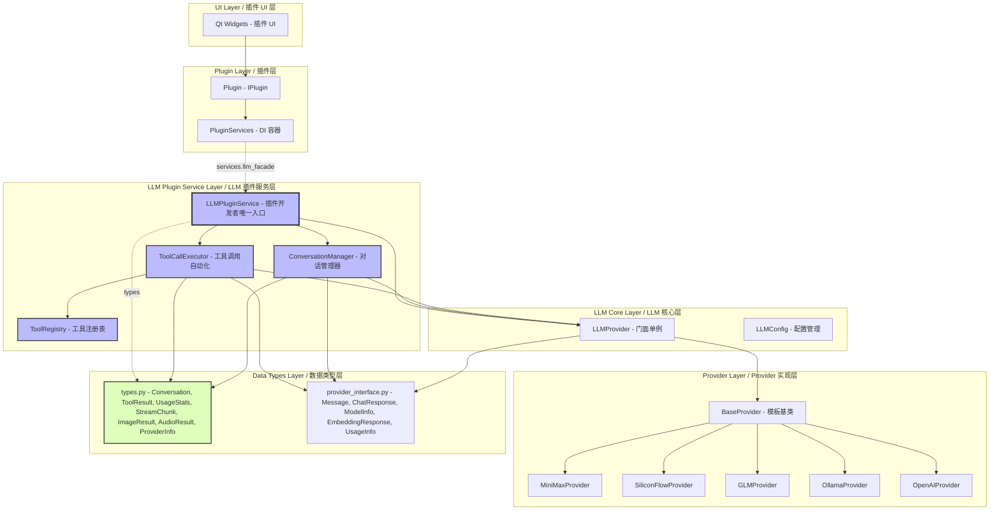
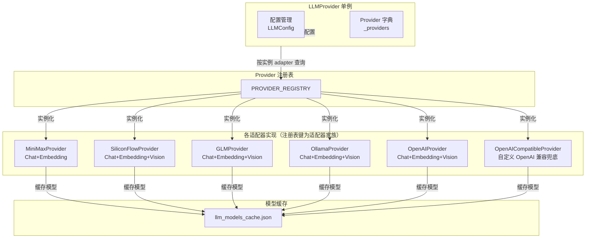
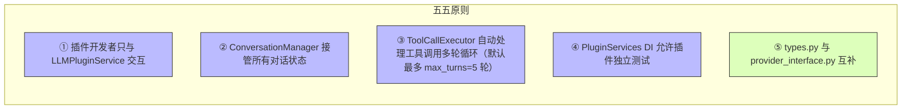
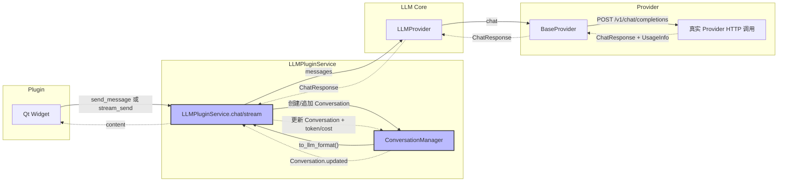
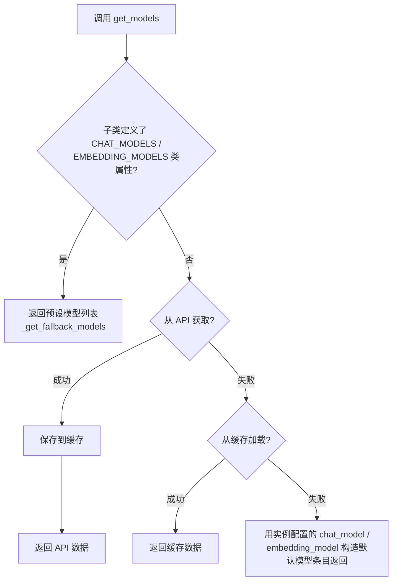
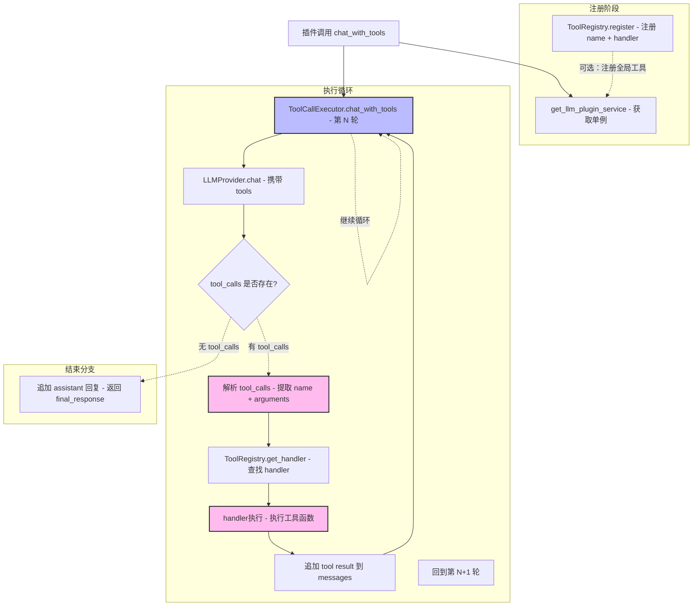
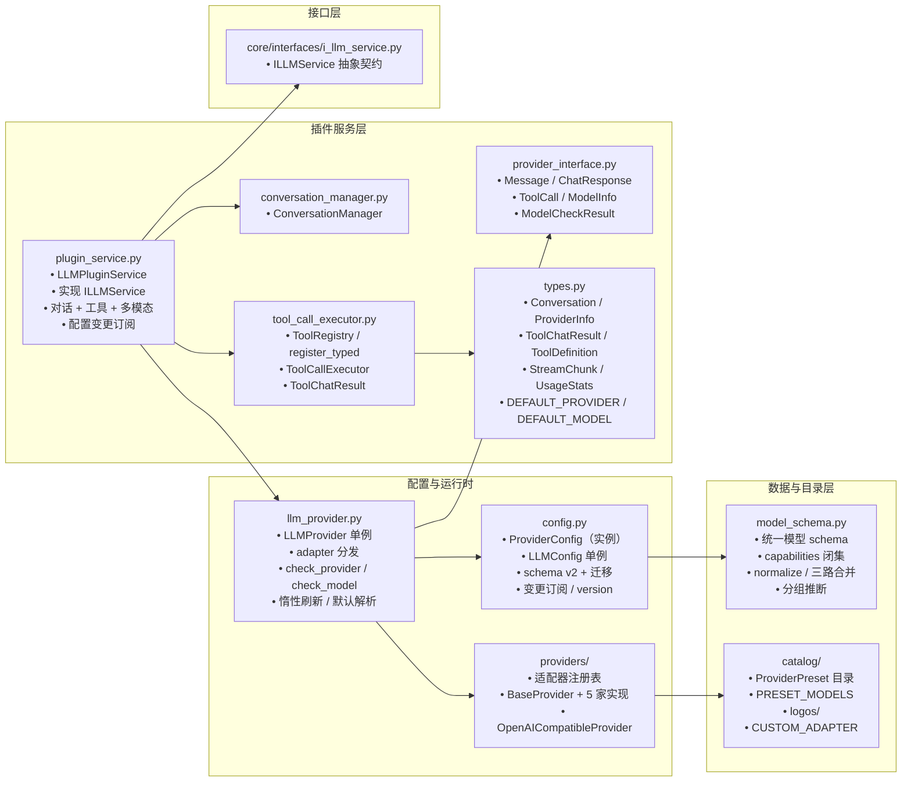

# LLM Provider 数据层

> LLM Provider 的架构设计和核心概念

---

## 1. 概述

`LLM Provider` 是 InstructionX 项目的核心大语言模型组件，负责多提供商管理、API 请求、模型列表获取与缓存、异步并发调用。

**文件位置**: `core/llm/`

**模式**: 单例模式（全局唯一实例）

**内置提供商预设**（`core/llm/catalog/`，共 5 家）:
- MiniMax
- SiliconFlow
- GLM (智谱AI)
- Ollama (本地部署)
- OpenAI

此外支持**自定义 OpenAI 兼容实例**（`openai-compatible` 兜底适配器）：任何 OpenAI 兼容端点（自建网关、vLLM、LocalAI、第三方兼容服务等）均可零代码接入；同一预设可派生多个实例（如两套密钥、两个 Ollama 地址）。

**插件开发者入口**: 第三方插件开发者请使用 `LLMPluginService`（`core/llm/plugin_service.py`），通过 `get_llm_plugin_service()` 获取单例。`LLMPluginService` 整合了对话管理、工具调用自动化、多模态等完整能力，是插件开发者的唯一入口。

> **注意**: `LLMPluginService` 显式继承抽象接口 `ILLMService`（`core/interfaces/i_llm_service.py`），`PluginServices.llm_facade` 的类型标注即为 `ILLMService`。插件面只暴露契约能力（对话 / 工具调用 / 多模态 / `list_providers` / `get_models` 等），不再泄漏底层适配器实例与原始配置。如需底层 LLM 调用（框架内部），可通过 `get_llm_provider()` 获取 `LLMProvider` 单例。

**历史**: 原架构中插件直接访问 `LLMProvider` 单例。为解决无对话历史管理、Tool Use 门槛高、流式输出复杂等问题，重构新增了 LLM Plugin Service Layer。

---

## 2. 核心特性

| 特性 | 说明 |
|------|------|
| **单例模式** | 全局唯一实例，统一管理所有 Provider 实例 |
| **预设目录** | 内置厂商元数据（端点、链接、Logo、预设模型）为声明式目录数据，随程序发布只读 |
| **适配器注册表** | 注册表键为适配器家族（adapter），多预设可共享适配器；`openai-compatible` 兜底适配器支持任意自定义端点 |
| **预设/实例分离** | 配置中的每个 Provider 是实例（经 `preset_id` 关联目录预设），同一预设可派生多实例 |
| **配置热更新** | `LLMConfig` 单例 + 变更订阅 + `version` 计数，消费方惰性刷新，无需手动 `reload_config()` |
| **同步/异步双 API** | 开发者可选择同步或异步调用方式 |
| **并发支持** | 支持多个任务同时调用多个语言模型 |
| **模型缓存** | API 获取的模型列表自动缓存到本地 JSON |
| **流式输出** | 支持流式响应，按块处理 |
| **多模态支持** | 部分 Provider 支持 Vision 图片理解 |
| **Function Calling** | 支持工具调用，与外部系统集成 |

### 2.5.1 旧 7 参 `stream_send_message` 调用的废弃说明

> **⚠️ 公共 API 契约**：`LLMPluginService.stream_send_message` 的**新契约**是带 `conversation_id` 的 8 参版本（详见 `docs/api/full-reference.md` §5），所有新插件与代码路径应使用新契约。

历史版本中 `stream_send_message` 仅有 7 参调用顺序（`content / provider / model / temperature / max_tokens / images / history`）。该旧契约在以下方面与新 8 参 `conversation_id` 公共契约**不兼容**：

1. 混淆参数顺序会导致 LLM 调用失败；
2. 旧契约中的 `self.history` 字段在新 `LLMPluginService` 中已被废弃（历史消息改由 `ConversationManager` 内部管理）。

**新插件开发建议**：直接使用 `LLMPluginService.stream_send_message(conversation_id, content, ...)` 新契约；如需将业务拆分到子模块（`function/services/` 等），可在插件的 `service.py` 中用 `__getattr__` 代理（详见 `docs/core/plugin-system/plugin-development.md §2.2`），但**底层最终应调用新公共 API**，不要重新发明旧 7 参接口。


---

## 3. 架构图

### 3.1 系统分层架构（6 层）



### 3.2 LLMProvider 内部架构（核心层）



---

### 3.3 核心设计原则



## 4. 核心设计原则

| # | 原则 | 说明 |
|---|---|---|
| ① | **单一入口** | 插件开发者只与 `LLMPluginService` 交互，不直接访问 `LLMProvider` |
| ② | **状态封装** | `ConversationManager` 接管所有对话状态，插件无需管理历史 |
| ③ | **工具自动化** | `ToolCallExecutor` 自动处理多轮调用循环（默认最多 `max_turns=5` 轮），插件只需注册工具 |
| ④ | **可测试性** | `PluginServices` DI 容器允许插件在无 API 环境下完成测试 |
| ⑤ | **类型分离** | `types.py` 存放新增类型，`provider_interface.py` 存放 LLM 层核心类型 |

### 4.1 对话消息流



## 5. Provider 功能矩阵

| Provider | Chat | Streaming | Embedding | Vision | API 协议 |
|----------|------|-----------|-----------|--------|----------|
| MiniMax | ✅ | ✅ | ✅ | ❌ | OpenAI 兼容 |
| SiliconFlow | ✅ | ✅ | ✅ | ✅ | OpenAI 兼容 |
| GLM | ✅ | ✅ | ✅ | ✅ | OpenAI 兼容 |
| Ollama | ✅ | ✅ | ✅ | ✅ | 私有协议 |
| OpenAI | ✅ | ✅ | ✅ | ✅ | OpenAI 兼容 |
| 自定义（openai-compatible） | ✅ | ✅ | ✅ | 取决于端点 | OpenAI 兼容 |

> **注意**：MiniMax 官方文档明确说明当前不支持图像和音频类型的输入，因此 `support_vision = False`。

---

## 6. 单例模式与并发

### 6.1 单例模式

```python
from core.llm import get_llm_provider

# 获取单例实例
provider = get_llm_provider()

# 获取所有 Provider
all_providers = provider.get_all_providers()

# 获取启用的 Provider (Chat)
enabled_chat = provider.get_enabled_providers("chat")

# 获取启用的 Provider (Embedding)
enabled_embedding = provider.get_enabled_providers("embedding")
```

### 6.2 并发调用

```python
import asyncio
from core.llm import get_llm_provider

provider = get_llm_provider()

# 同步调用
response = provider.chat(
    messages=[{"role": "user", "content": "你好"}],
    provider="minimax"
)

# 异步调用
async def main():
    response = await provider.async_chat(
        messages=[{"role": "user", "content": "你好"}],
        provider="minimax"
    )

# 异步流式调用
async def stream_example():
    async for chunk in provider.async_stream_chat(
        messages=[{"role": "user", "content": "写一首诗"}],
        provider="siliconflow"
    ):
        print(chunk.content, end="")

# 异步嵌入
async def embed_example():
    results = await provider.async_embed(
        texts=["要嵌入的文本1", "要嵌入的文本2"],
        provider="minimax"
    )

# 并发异步调用
async def concurrent():
    results = await asyncio.gather(
        provider.async_chat(messages=[...], provider="minimax"),
        provider.async_chat(messages=[...], provider="siliconflow"),
        provider.async_chat(messages=[...], provider="glm"),
    )
```

---

## 7. 模型获取与缓存

### 7.1 获取流程



### 7.2 缓存机制

- **缓存位置**: `config/llm_models_cache.json`
- **缓存策略**: 优先从 API 获取，成功则缓存；失败则尝试加载缓存；缓存也没有则进入第三级兜底——用实例配置中的 `chat_model` / `embedding_model` 构造默认模型条目返回（见 `core/llm/providers/base.py` 的 `_get_default_models_from_config()`）
- **缓存 TTL**：`BaseProvider.MODELS_CACHE_TTL = 24 * 3600`（24 小时）；`refresh_models()` 调用 API 前检查当前缓存时间戳，超过 TTL 时 `self._models_cache_stale = True`；TTL 过期但远程刷新失败时**继续沿用旧缓存**（记 INFO 日志），不直接抛错——保证 LLM 设置界面在网络抖动期间仍能展示可用模型；
- **`models_cache_stale` 属性**：暴露当前缓存是否过期，供 `LLMProvider._check_models_staleness()` 等上层调度判断是否需要后台静默刷新；
- **缓存条目格式**：TTL 信封 `{"timestamp": <unix_ts>, "models": [ModelInfo, ...]}`；读取端兼容**纯 list 旧格式**（无 timestamp）——此时视为已过期（`models_cache_stale=True`），强制走 API 刷新或回退默认模型。
- **预设模型列表**: 子类定义了 `CHAT_MODELS` / `EMBEDDING_MODELS` 类属性的 Provider 不走上述流程，直接返回预设模型列表（`get_models()` → `_get_fallback_models()`）
- **每次初始化**: 都会尝试从 API 刷新模型列表

```python
# 获取模型列表
provider = get_llm_provider()
minimax = provider.get_provider("minimax")
models = minimax.get_models()

# 模型信息
for model in models:
    print(f"{model.id} - Chat: {model.support_chat}, Embedding: {model.support_embedding}")
```

---

## 8. 对话管理（新增）

LLM 层重构新增了完整的对话管理能力，通过 `LLMPluginService` 和 `ConversationManager` 提供。

### 8.1 核心能力

| 能力 | 说明 |
|---|---|
| **对话 CRUD** | 创建/获取/列出/删除对话，自动管理 conversation_id |
| **自动历史追加** | send_message / stream_send_message 自动将用户消息和 LLM 回复追加到历史 |
| **费用计算** | 基于 `DEFAULT_PRICING` 估算每次请求费用 |
| **用量统计** | 按对话和全局维度统计 token、总费用、消息条数 |

### 8.2 使用方式

```python
from core.llm import get_llm_plugin_service

svc = get_llm_plugin_service()

# 创建对话（可选设置 system prompt）
conv_id = svc.create_conversation(
    system_prompt="你是一个代码助手",
    provider="minimax",
)

# 同步发送
reply = svc.send_message(conv_id, "解释这段代码")

# 流式发送（逐 chunk 更新 UI）
def on_chunk(chunk):
    print(chunk.content, end="")
svc.stream_send_message(conv_id, "写一个快排", callback=on_chunk)

# 用量统计
stats = svc.get_usage_stats(conv_id)
print(f"Token: {stats.total_tokens}, 费用: {stats.total_cost}元")
```

### 8.3 与旧 API 的区别

| 方面 | 旧 API (LLMProvider.chat) | 新 API (LLMPluginService) |
|---|---|---|
| 对话历史 | 插件自行管理 List[Message] | 自动管理历史消息 |
| 上下文窗口 | 插件自行计算 token | 超出 `max_context` 时自动从最早的用户/助手消息截断 |
| 工具调用 | 手动循环 | ToolCallExecutor 自动处理多轮循环（默认最多 `max_turns=5` 轮） |
| 流式输出 | 自行实现 QThread | stream_send_message 一行搞定 |
| 费用统计 | 无 | 自动累计 |

## 9. Function Calling

### 9.1 概述

LLM Provider 支持 **Function Calling**（函数调用），允许模型调用外部工具或函数，实现与外部系统的集成。

有两种使用方式：

1. **推荐：新方式（ToolCallExecutor）** — 自动处理多轮循环（默认最多 `max_turns=5` 轮），插件只需注册工具
2. **旧方式（手动循环）** — 通过 `LLMProvider.chat()` 手动管理

### 9.2 工具调用自动循环



### 9.3 推荐方式：ToolCallExecutor（最多 max_turns 轮循环）

```python
from core.llm import get_llm_plugin_service

svc = get_llm_plugin_service()
executor = svc.get_tool_executor()

# 注册工具
def get_weather(city: str) -> str:
    return f"{city} 天气晴朗，25°C"

executor.tools.register(
    name="get_weather",
    description="获取指定城市的天气信息",
    parameters={
        "type": "object",
        "properties": {
            "city": {"type": "string", "description": "城市名称"}
        },
        "required": ["city"]
    },
    handler=get_weather,
)

# 自动完成最多 max_turns 轮调用循环，返回 ToolChatResult
messages = [{"role": "user", "content": "北京今天天气怎么样？"}]
result = executor.chat_with_tools(
    messages, provider="minimax", max_turns=5
)
print(result.final_text)            # 最终文本
print(result.final_response.content)  # 最终响应对象（ChatResponse）

# 打印工具调用结果
for tr in result.tool_results:
    print(f"工具: {tr.tool_name}, 结果: {tr.result}")
```

**流式版本**:
```python
def on_chunk(chunk):
    print(chunk.content, end="")

result = executor.chat_with_tools_stream(
    messages, callback=on_chunk, provider="minimax"
)
# result.final_text 为流式聚合全文；final_response 取底层聚合响应
# （last_stream_response），tool_calls 从聚合响应中提取
```

### 9.4 旧方式：手动调用

```python
from core.llm import get_llm_provider

provider = get_llm_provider()

# 定义工具
tools = [
    {
        "type": "function",
        "function": {
            "name": "get_weather",
            "description": "获取指定城市的天气信息",
            "parameters": {
                "type": "object",
                "properties": {
                    "city": {
                        "type": "string",
                        "description": "城市名称"
                    }
                },
                "required": ["city"]
            }
        }
    }
]

# 发送带工具的请求
response = provider.chat(
    messages=[
        {"role": "user", "content": "北京今天天气怎么样？"}
    ],
    provider="minimax",
    tools=tools  # 传递工具定义
)

# 检查是否有工具调用（tool_calls 为类型化的 ToolCall 列表）
if response.tool_calls:
    for tool_call in response.tool_calls:
        print(f"调用工具: {tool_call.name}")
        print(f"参数: {tool_call.arguments}")
```

### 9.5 处理工具结果（手动方式）

```python
# 1. 执行工具函数
def get_weather(city: str) -> str:
    # 这里调用实际的天气 API
    return f"{city} 天气晴朗，25°C"

# 2. 将工具结果添加回对话
messages = [
    {"role": "user", "content": "北京今天天气怎么样？"}
]

# 第一次调用
response = provider.chat(messages=messages, provider="minimax", tools=tools)

if response.tool_calls:
    tool_call = response.tool_calls[0]
    # 添加模型响应到对话（tool_calls 经 ToolCall.to_dict() 序列化）
    messages.append({
        "role": "assistant",
        "content": response.content,
        "tool_calls": [tool_call.to_dict()],
    })
    messages.append({
        "role": "tool",
        "tool_call_id": tool_call.id,
        "content": get_weather("北京")
    })

    # 第二次调用，获取最终响应
    final_response = provider.chat(messages=messages, provider="minimax")
    print(final_response.content)
```

### 9.6 基类统一支持

`BaseProvider` 提供了统一的 Function Calling 支持：

- `_prepare_chat_payload()`: 自动将 `tools` 参数添加到请求载荷
- `_parse_chat_response()`: 自动解析响应中的 `tool_calls`（转为类型化 `ToolCall`）
- `_parse_stream_response()`: 解析流式响应块，透传 `delta.tool_calls` 增量分片（按 index 聚合并拼接发生在 `LLMProvider._merge_stream_tool_calls()`，见 `core/llm/llm_provider.py`）

子类只需关注 Provider 特定的请求/响应格式差异。

> **说明**: 流式工具调用的 `tool_calls` 经底层聚合后通过 `last_stream_response` 暴露，`ToolCallExecutor` 的流式路径（`chat_with_tools_stream()`）从聚合响应中提取并正常执行多轮循环。

---

## 10. 配置管理

### 10.1 配置文件

配置文件位置: `config/llm_providers.json`（**schema v2**，顶层含 `version: 2`）。

配置中的每个 Provider 是一个**实例**：通过 `preset_id` 关联预设目录（`core/llm/catalog/`，`null` 表示完全自定义），通过 `adapter` 指定协议适配器家族键。首次运行不再自动写入内置提供商模板——目录即默认值，配置只存用户显式创建/修改的实例；删除的实例不会在下次启动时复活。顶层无 `version` 键的历史文件按 v1 处理，加载时先备份为 `llm_providers.migrated-<时间戳>.bak` 再自动迁移为 v2。

```json
{
    "version": 2,
    "providers": {
        "minimax": {
            "preset_id": "minimax",
            "name": "MiniMax",
            "adapter": "minimax",
            "api_key": "b64:...",
            "base_url": "",
            "chat_model": "MiniMax-M2.5",
            "embedding_model": "embedding-2",
            "enabled_chat": true,
            "enabled_embedding": true,
            "support_vision": false,
            "order": 0
        },
        "glm-a1b2c3d4": {
            "preset_id": "glm",
            "name": "GLM（第二套密钥）",
            "adapter": "glm",
            "api_key": "b64:...",
            "base_url": "",
            "chat_model": "glm-4",
            "embedding_model": "embedding-3",
            "enabled_chat": true,
            "enabled_embedding": false,
            "support_vision": true,
            "order": 1
        },
        "custom-e5f6a7b8": {
            "preset_id": null,
            "name": "自建 vLLM 网关",
            "adapter": "openai-compatible",
            "api_key": "b64:...",
            "base_url": "https://llm.internal.example.com/v1",
            "chat_model": "qwen2.5-72b",
            "embedding_model": "",
            "enabled_chat": true,
            "enabled_embedding": false,
            "support_vision": true,
            "order": 2,
            "custom_models": []
        }
    }
}
```

- `base_url` 为空串时**运行时不做回退**——`BaseProvider._make_request` 直接拼接 `f"{self.base_url}{endpoint}"`，空 `base_url` 会导致请求失败（请求 URL 退化为相对路径或空）。仅 UI 层（`ui/dialog/llm_settings/provider_detail_panel.py` 的「重置」按钮）在编辑界面展示目录默认地址作为占位/回填建议，运行时不读取该值。`api_key` 落盘经 Base64 编码（仅为编码非加密）。
- `custom_models` 为用户覆写模型条目（统一模型 schema，见 `core/llm/model_schema.py`）。
- 完整字段说明与迁移规则见 [LLM Provider 配置](provider-config.md)。

### 10.2 UI 配置

通过菜单 **AI > LLM 设置...** (Ctrl+L) 打开两栏式配置对话框（`ui/dialog/llm_settings/` 包）：

```
┌─────────────────────────────────────────────────────────────────────────┐
│  LLM 设置                                                                 │
├──────────────┬──────────────────────────────────────────────────────────┤
│  模型服务     │  [图标] MiniMax        [MiniMax 徽章]      [总开关 ○] [⋯] │
│  [搜索...]   │  ───────────────────────────────────────────────────────│
│  ─────────── │  API 配置                                                │
│  ● MiniMax   │    API 密钥  [••••••••••] 👁   [检测]                     │
│  ○ GLM-2     │    状态：✓ 连接正常 · 5 个模型                            │
│  ○ 自建网关   │    API 地址  [https://api.minimax.chat/v1   ] [重置]      │
│  ─────────── │  ───────────────────────────────────────────────────────│
│              │  ───────────────────────────────────────────────────────│
│              │  模型                    [↻ 刷新] [＋ 添加] [管理]          │
│              │  ▼ 对话 (5)                                              │
│              │    MiniMax-M2.5   [工具调用] 128K          [开关] [删除]  │
│              │  ▼ 嵌入 (1)                                              │
│              │    embedding-2    [嵌入] 32K               [开关]         │
│  ─────────── │  ───────────────────────────────────────────────────────│
│ ＋ 添加提供商 │  默认模型                                                │
│              │    聊天模型  [MiniMax-M2.5        ▼]                      │
│              │    嵌入模型  [embedding-2         ▼]                      │
└──────────────┴──────────────────────────────────────────────────────────┘
```

- **左栏**（248px）：搜索框（联动实例名与模型名过滤）+ 实例列表（品牌图标 + 启停开关）+「＋ 添加提供商」（弹出预设选择 / 自定义 OpenAI 兼容的两页创建对话框）。
- **右栏**：头部（品牌图标 / 名称 / 类型徽章 / 总开关 / 更多菜单）+ API 配置 + 模型列表 + 默认模型三个平面分区。
- **自动保存语义**：编辑即时落盘（无「取消/保存」按钮）；删除类操作保留中文确认弹窗。
- 更多菜单提供重命名 / 删除提供商（中文确认弹窗）；模型区标题栏提供健康检查与同步模型入口；对话框主题跟随应用主题（亮/暗），上次选中的实例经 QSettings 记忆。

> **相关文档**: [对话框组件](../../ui/dialogs.md)

---

## 11. 异常处理

### 11.1 异常类型

```python
from core.llm.exceptions import (
    LLMException,
    ConfigurationError,
    AuthenticationError,
    APIError,
    RateLimitError,
    InvalidRequestError,
    ModelNotSupportedError,
    ConnectionError,
    TimeoutError,
    StreamingError
)

try:
    response = provider.chat(messages=[...])
except AuthenticationError:
    print("API Key 无效")
except RateLimitError:
    print("请求频率超限")
except TimeoutError:
    print("请求超时")
except InvalidRequestError:
    print("请求参数无效")
except ModelNotSupportedError:
    print("模型不支持")
except StreamingError:
    print("流式输出错误")
except APIError as e:
    print(f"API 错误: {e}")
except ConnectionError:
    print("连接失败")
```

---

## 12. 扩展新的 Provider

### 12.1 三种扩展路径

| 场景 | 做法 | 是否需要写代码 |
|---|---|---|
| 接入任意 OpenAI 兼容端点（自建网关、vLLM、LocalAI 等） | 在设置对话框中「＋ 添加提供商 → 自定义 OpenAI 兼容服务」，创建 `preset_id=None`、`adapter="openai-compatible"` 的实例 | 否 |
| 新增一家协议兼容现有适配器的厂商 | 在 `core/llm/catalog/provider_presets.py` 的 `PROVIDER_PRESETS` 追加一条目录数据（名称、端点、链接、Logo 文件名等） | 仅目录数据 |
| 新增协议家族 | 新增适配器类（继承 `BaseProvider`）+ 注册到适配器注册表 + 追加目录数据 | 是 |

### 12.2 适配器注册机制

`PROVIDER_REGISTRY` 的键为**适配器家族（adapter）**而非厂商；多个预设可共享同一适配器。

```python
from core.llm.providers import register_adapter
from core.llm.providers.base import BaseProvider

class CustomProvider(BaseProvider):
    provider_type = "custom"     # 适配器家族键
    provider_name = "Custom LLM"
    # 实现必要方法...

register_adapter("custom", CustomProvider)

# 查询
from core.llm.providers import get_adapter_class, get_all_adapters
cls = get_adapter_class("custom")
```

> **说明**：`register_provider` / `get_provider_class` / `get_all_provider_types` 为保留的旧名薄别名，语义同为适配器家族，供尚未迁移的调用点使用；新代码请使用 `register_adapter` / `get_adapter_class` / `get_all_adapters`。

### 12.3 适配器类实现要求

1. 继承 `BaseProvider`
2. 实现 `_prepare_chat_payload()` - 准备请求载荷
3. 实现 `_parse_chat_response()` - 解析响应
4. 实现 `_parse_stream_response()` - 解析流式响应
5. 实现 `_parse_models_response()` - 解析模型列表
6. 实现所有抽象方法

显示元数据（显示名、默认端点、帮助链接、Logo）不写死在适配器类中，而是放入目录数据（`ProviderPreset`）。

---

## 13. 模块结构

`core/llm/` 模块一览：



相关辅助模块：`pricing.py`（DEFAULT_PRICING 定价表）、`secure_keys.py`（API Key 混淆存储）、`usage_record_store.py`（用量记录持久化）、`types_cache.py` / `cache_adapter.py`（缓存信息类型与适配）、`utils/image_utils.py`（图片转 base64 工具）。

---

## 14. 相关文档

**LLM 子系统内部**：
- [LLM Provider API 参考](api-reference.md)（`LLMProvider` / `LLMPluginService` / `ConversationManager` / `ToolCallExecutor` 完整 API 清单）
- [LLM Provider 配置](provider-config.md)（`ProviderConfig` / `LLMConfig` / schema v2 与 v1→v2 迁移）

**面向插件开发者**：
- [插件 LLM 集成指南](../../plugins/llm-integration-guide.md)（通过 `PluginServices.llm_facade` 调用 LLM）
- [插件开发指南](../plugin-system/plugin-development.md)（插件结构与生命周期）
- [IPlugin 接口](../plugin-system/iplugin.md)（插件基类）

**接口与 API 索引**：
- [接口层概述](../interfaces/overview.md)（`ILLMService` 22 个抽象方法）
- [完整 API 参考 §5 LLM Provider API](../../api/full-reference.md#5-llm-provider-api)（含 §5.1-§5.11）

**架构与上下游**：
- [系统架构概述](../../architecture/overview.md)
- [instructionx-architecture.md §3.2 LLM 层](../../architecture/instructionx-architecture.md#32-llm-层-corellm)（`LLMPluginService` / `LLMProvider` / `ConversationManager` / `ToolCallExecutor` 模块依赖图）
- [MCP 协议模块概述](../mcp/overview.md)（`MCPClientManager` 将外部 MCP 工具注入 `ToolRegistry`）
- [DataProvider 概述](../data-provider/overview.md)（用量持久化 `data/llm_usage.json`）
