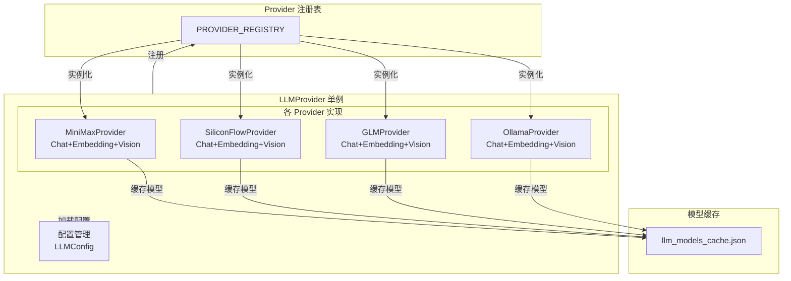
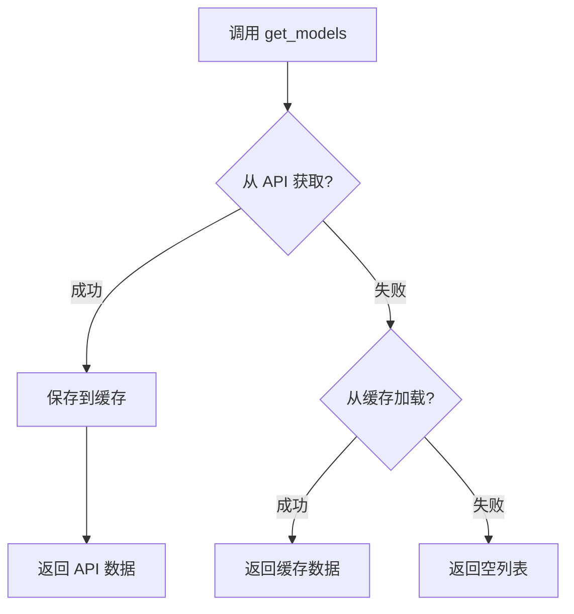

# LLM Provider 数据层

> LLM Provider 的架构设计和核心概念

---

## 1. 概述

`LLM Provider` 是 InstructionX 项目的核心大语言模型组件，负责多提供商管理、API 请求、模型列表获取与缓存、异步并发调用。

**文件位置**: `core/llm/`

**模式**: 单例模式（全局唯一实例）

**支持的 Provider**:
- MiniMax
- SiliconFlow
- GLM (智谱AI)
- Ollama (本地部署)

---

## 2. 核心特性

| 特性 | 说明 |
|------|------|
| **单例模式** | 全局唯一实例，统一管理所有 Provider |
| **注册机制** | 装饰器注册，高扩展性，易于添加新 Provider |
| **同步/异步双 API** | 开发者可选择同步或异步调用方式 |
| **并发支持** | 支持多个任务同时调用多个语言模型 |
| **模型缓存** | API 获取的模型列表自动缓存到本地 JSON |
| **流式输出** | 支持流式响应，按块处理 |
| **多模态支持** | 部分 Provider 支持 Vision 图片理解 |
| **Function Calling** | 支持工具调用，与外部系统集成 |

---

## 3. 架构图



---

## 4. Provider 功能矩阵

| Provider | Chat | Streaming | Embedding | Vision | API 协议 |
|----------|------|-----------|-----------|--------|----------|
| MiniMax | ✅ | ✅ | ✅ | ✅ | OpenAI 兼容 |
| SiliconFlow | ✅ | ✅ | ✅ | ✅ | OpenAI 兼容 |
| GLM | ✅ | ✅ | ✅ | ✅ | OpenAI 兼容 |
| Ollama | ✅ | ✅ | ✅ | ✅ | 私有协议 |

---

## 5. 单例模式与并发

### 5.1 单例模式

```python
from core.llm import get_llm_provider

# 获取单例实例
provider = get_llm_provider()

# 获取所有 Provider
all_providers = provider.get_all_providers()

# 获取启用的 Provider (Chat)
enabled_chat = provider.get_enabled_providers("chat")

# 获取启用的 Provider (Embedding)
enabled_embedding = provider.get_enabled_providers("embedding")
```

### 5.2 并发调用

```python
import asyncio
from core.llm import get_llm_provider

provider = get_llm_provider()

# 同步调用
response = provider.chat(
    messages=[{"role": "user", "content": "你好"}],
    provider="minimax"
)

# 异步调用
async def main():
    response = await provider.async_chat(
        messages=[{"role": "user", "content": "你好"}],
        provider="minimax"
    )

# 并发异步调用
async def concurrent():
    results = await asyncio.gather(
        provider.async_chat(messages=[...], provider="minimax"),
        provider.async_chat(messages=[...], provider="siliconflow"),
        provider.async_chat(messages=[...], provider="glm"),
    )
```

---

## 6. 模型获取与缓存

### 6.1 获取流程



### 6.2 缓存机制

- **缓存位置**: `config/llm_models_cache.json`
- **缓存策略**: 优先从 API 获取，成功则缓存；失败则尝试加载缓存；缓存也没有则返回空列表
- **每次初始化**: 都会尝试从 API 刷新模型列表

```python
# 获取模型列表
provider = get_llm_provider()
minimax = provider.get_provider("minimax")
models = minimax.get_models()

# 模型信息
for model in models:
    print(f"{model.id} - Chat: {model.support_chat}, Embedding: {model.support_embedding}")
```

---

## 7. Function Calling

### 7.1 概述

LLM Provider 支持 **Function Calling**（函数调用），允许模型调用外部工具或函数，实现与外部系统的集成。

### 7.2 使用方法

```python
from core.llm import get_llm_provider

provider = get_llm_provider()

# 定义工具
tools = [
    {
        "type": "function",
        "function": {
            "name": "get_weather",
            "description": "获取指定城市的天气信息",
            "parameters": {
                "type": "object",
                "properties": {
                    "city": {
                        "type": "string",
                        "description": "城市名称"
                    }
                },
                "required": ["city"]
            }
        }
    }
]

# 发送带工具的请求
response = provider.chat(
    messages=[
        {"role": "user", "content": "北京今天天气怎么样？"}
    ],
    provider="minimax",
    tools=tools  # 传递工具定义
)

# 检查是否有工具调用
if response.tool_calls:
    for tool_call in response.tool_calls:
        print(f"调用工具: {tool_call['function']['name']}")
        print(f"参数: {tool_call['function']['arguments']}")
```

### 7.3 处理工具结果

```python
# 1. 执行工具函数
def get_weather(city: str) -> str:
    # 这里调用实际的天气 API
    return f"{city} 天气晴朗，25°C"

# 2. 将工具结果添加回对话
messages = [
    {"role": "user", "content": "北京今天天气怎么样？"}
]

# 第一次调用
response = provider.chat(messages=messages, provider="minimax", tools=tools)

if response.tool_calls:
    # 添加模型响应到对话
    messages.append({"role": "assistant", "content": response.content})
    messages.append({
        "role": "tool",
        "tool_call_id": response.tool_calls[0]['id'],
        "content": get_weather("北京")
    })

    # 第二次调用，获取最终响应
    final_response = provider.chat(messages=messages, provider="minimax")
    print(final_response.content)
```

### 7.4 基类统一支持

`BaseProvider` 提供了统一的 Function Calling 支持：

- `_prepare_chat_payload()`: 自动将 `tools` 参数添加到请求载荷
- `_parse_chat_response()`: 自动解析响应中的 `tool_calls`
- `_parse_stream_response()`: 支持流式响应中的 `tool_calls`

子类只需关注 Provider 特定的请求/响应格式差异。

---

## 8. 配置管理

### 8.1 配置文件

配置文件位置: `config/llm_providers.json`

```json
{
    "providers": {
        "minimax": {
            "provider_type": "minimax",
            "enabled": true,
            "features": ["chat", "embedding"],
            "api_key": "your-api-key",
            "base_url": "https://api.minimax.chat/v1",
            "chat_model": "MiniMax-M2.1",
            "embedding_model": "embedding-2",
            "timeout": 60
        },
        "siliconflow": {
            "provider_type": "siliconflow",
            "enabled": true,
            "features": ["chat", "embedding"],
            "api_key": "your-api-key",
            "base_url": "https://api.siliconflow.cn/v1",
            "chat_model": "Pro/deepseek-ai/DeepSeek-V3",
            "embedding_model": "BAAI/bge-m3"
        },
        "glm": {
            "provider_type": "glm",
            "enabled": true,
            "features": ["chat", "embedding"],
            "api_key": "your-api-key",
            "base_url": "https://open.bigmodel.cn/api/paas/v4",
            "chat_model": "glm-4-flash",
            "embedding_model": "embedding-3"
        },
        "ollama": {
            "provider_type": "ollama",
            "enabled": true,
            "features": ["chat", "embedding"],
            "base_url": "http://localhost:11434",
            "chat_model": "llama3.1",
            "embedding_model": "nomic-embed-text"
        }
    }
}
```

### 8.2 UI 配置

通过菜单 **编辑 > LLM 设置** (Ctrl+L) 打开配置对话框：

```
┌─────────────────────────────────────────────────────────────┐
│  LLM 设置                                    [×]           │
├─────────────────────────────────────────────────────────────┤
│  [Provider 列表 (左)]  │  [配置详情 (右)]                   │
│  ┌─────────────────┐  │  ┌─────────────────────────────┐  │
│  │ + 添加 Provider │  │  │ 基础设置                     │  │
│  │ ─────────────── │  │  │ • API Key: [输入框]          │  │
│  │ ▼ MiniMax      │  │  │ • Base URL: [输入框]         │  │
│  │   SiliconFlow  │  │  │ • 模型: [下拉选择]            │  │
│  │   GLM          │  │  │                             │  │
│  │   Ollama       │  │  │ Chat 设置                    │  │
│  │                 │  │  │ • 启用 Chat: [√]             │  │
│  │                 │  │  │                             │  │
│  │                 │  │  │ Embedding 设置              │  │
│  │                 │  │  │ • 启用 Embedding: [√]       │  │
│  │                 │  │  │                             │  │
│  │                 │  │  │ [测试连接] [保存] [删除]    │  │
│  └─────────────────┘  │  └─────────────────────────────┘  │
└─────────────────────────────────────────────────────────────┘
```

---

## 9. 异常处理

### 9.1 异常类型

```python
from core.llm.exceptions import (
    LLMException,
    ConfigurationError,
    AuthenticationError,
    APIError,
    RateLimitError,
    TimeoutError,
    ConnectionError
)

try:
    response = provider.chat(messages=[...])
except AuthenticationError:
    print("API Key 无效")
except RateLimitError:
    print("请求频率超限")
except TimeoutError:
    print("请求超时")
except APIError as e:
    print(f"API 错误: {e}")
```

---

## 10. 扩展新的 Provider

### 10.1 注册机制

```python
from core.llm.providers import PROVIDER_REGISTRY

# 使用装饰器注册
@PROVIDER_REGISTRY.register("custom")
class CustomProvider(BaseProvider):
    provider_type = "custom"
    provider_name = "Custom LLM"

    # 实现必要方法...
```

### 10.2 实现要求

1. 继承 `BaseProvider`
2. 实现 `_prepare_chat_payload()` - 准备请求载荷
3. 实现 `_parse_chat_response()` - 解析响应
4. 实现 `_parse_stream_response()` - 解析流式响应
5. 实现 `_parse_models_response()` - 解析模型列表
6. 实现所有抽象方法

---

## 11. 相关文档

- [LLM Provider API 参考](api-reference.md)
- [插件开发指南](../plugin-system/plugin-development.md)
- [系统架构概述](../../architecture/overview.md)

---

*本文档由 Claude Code 自动生成*
