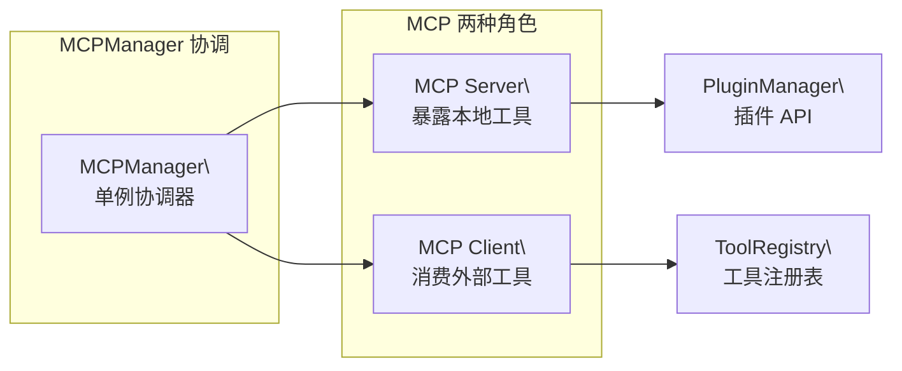
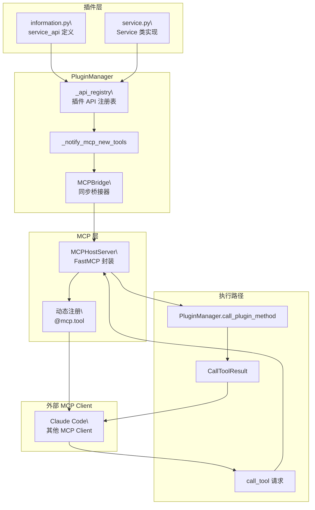
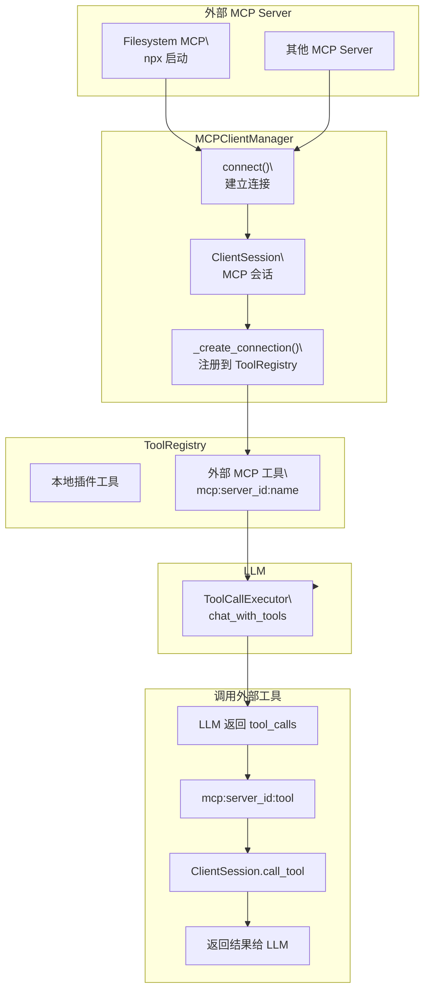
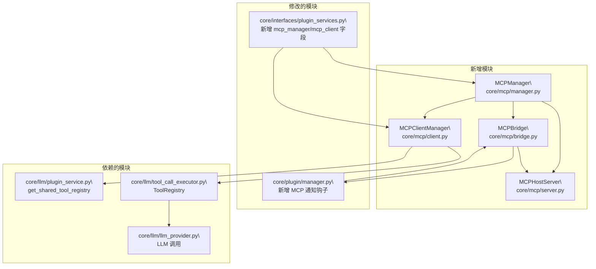
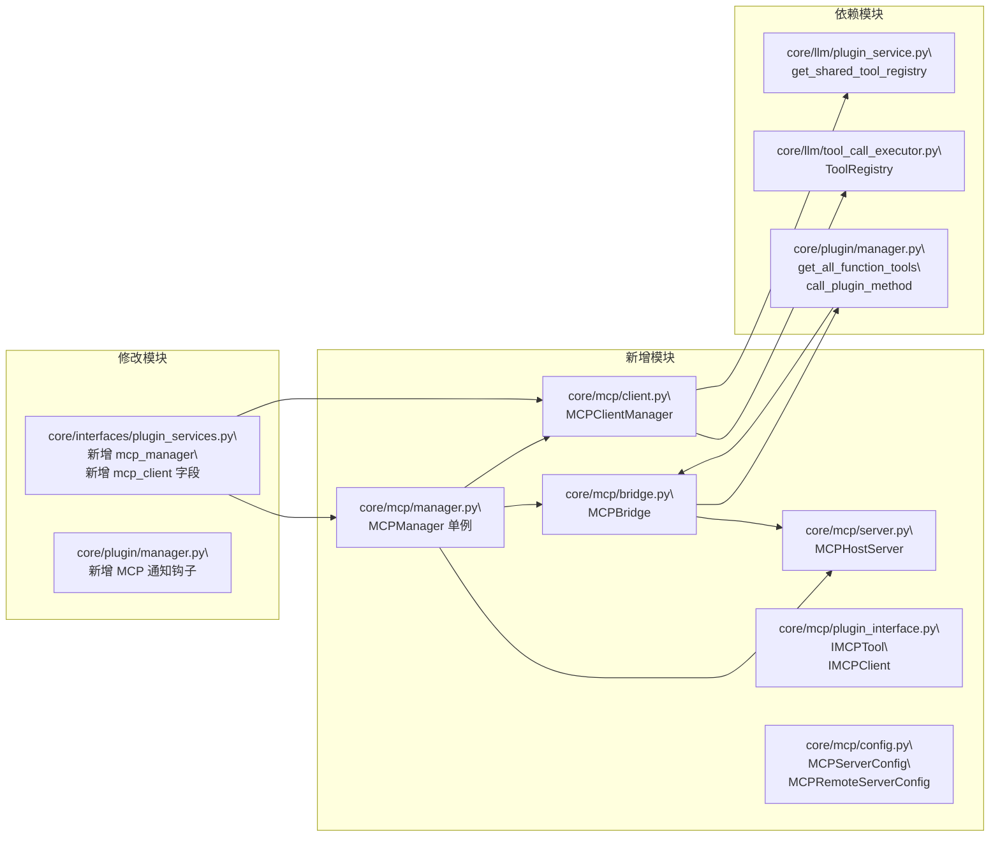

# MCP 协议模块

> MCP (Model Context Protocol) 官方协议支持 — 让 InstructionX 成为 MCP Server 和 MCP Client

---

## 1. 概述

`core/mcp/` 模块为 InstructionX 提供了真正的 **MCP (Model Context Protocol)** 协议支持，通过官方 `mcp` Python SDK 实现双向 MCP 通信能力。

**文件位置**: `core/mcp/`

**模式**: 单例模式（`MCPManager` 全局唯一实例）

**核心依赖**: `mcp>=1.0.0`（官方 MCP Python SDK）

**两种运行模式**:

| 模式 | 方向 | 说明 |
|------|------|------|
| **MCP Server** | InstructionX → 外部 Client | 将插件 API 暴露为 MCP 工具，供 Claude Code 等外部 MCP Client 调用 |
| **MCP Client** | 外部 Server → InstructionX | 连接外部 MCP Server，将它们的工具引入本地 ToolRegistry，供 LLM 使用 |

**插件开发者入口**: 通过 `PluginServices.mcp_manager` 和 `PluginServices.mcp_client` 访问 MCP 能力，或继承 `IMCPTool` 定义 MCP 工具。

---

## 2. 核心设计原则



| # | 原则 | 说明 |
|---|---|---|
| ① | **双重角色** | InstructionX 可同时作为 MCP Server（暴露工具）和 MCP Client（消费外部工具） |
| ② | **零侵入集成** | MCP 工具通过 `PluginManager._api_registry` 自动同步，无需手动注册 |
| ③ | **异步优先** | MCP SDK 全异步，内部通过 `anyio.to_thread` 桥接同步插件代码 |
| ④ | **透明消费** | 外部 MCP 工具注册到 ToolRegistry 后，LLM 可透明调用，插件无感知 |

---

## 3. 模块结构

```
core/mcp/
├── __init__.py               # 公共导出
├── manager.py                # MCPManager 单例（协调器）
├── server.py                # MCPHostServer（FastMCP 封装）
├── client.py                # MCPClientManager（外部 Server 连接管理）
├── bridge.py                # MCPBridge（插件 API ↔ MCP Server 桥接）
├── config.py               # MCPServerConfig / MCPRemoteServerConfig
└── plugin_interface.py     # IMCPTool / IMCPClient 接口
```

| 文件 | 核心类 | 职责 |
|------|--------|------|
| `manager.py` | `MCPManager` | 单例协调器，管理 Server 和 Client 生命周期 |
| `server.py` | `MCPHostServer` | 基于 FastMCP，暴露插件 API 为 MCP 工具 |
| `client.py` | `MCPClientManager` | 管理外部 MCP Server 连接，将工具注入 ToolRegistry |
| `bridge.py` | `MCPBridge` | 监听插件 API 注册变化，同步到 MCP Server |
| `config.py` | `MCPServerConfig` / `MCPRemoteServerConfig` | 配置数据类 |
| `plugin_interface.py` | `IMCPTool` / `IMCPClient` | 插件开发者接口 |

---

## 4. 架构图

### 4.1 MCP Server 模式（对外暴露工具）



### 4.2 MCP Client 模式（消费外部工具）



### 4.3 与现有系统的整合关系



---

## 5. MCP Server 模式

### 5.1 概述

MCP Server 模式将 InstructionX 的**所有插件 API** 自动暴露为 MCP 工具，外部 MCP Client（如 Claude Code）可以通过标准 MCP 协议调用这些工具。

**工具来源**: `PluginManager._api_registry` 中通过 `service_api` 注册的所有插件方法。

**工具命名**: `{plugin_id}.{method_name}`（与 `get_all_function_tools()` 格式一致）。

**传输方式**: 支持 stdio 和 streamable-http 两种方式。

### 5.2 启动 MCP Server

```python
from core.mcp import get_mcp_manager

mcp = get_mcp_manager()

# stdio 方式（默认，Claude Code MCP 配置文件方式）
mcp.start_server(transport="stdio")

# 或 streamable-http 方式（支持网络访问）
mcp.start_server(transport="streamable-http")
```

**stdio 方式**：`mcp.run(transport="stdio")` 直接在当前进程 stdin/stdout 上运行 MCP 协议。适用于 Claude Code MCP Client 连接。

**streamable-http 方式**：`mcp.run(transport="streamable-http")` 在后台线程启动 HTTP 服务器，默认端口 8765。

### 5.3 配置

配置文件: `config/mcp_config.json`（首次访问时自动创建）

```json
{
    "server": {
        "host": "127.0.0.1",
        "port": 8765,
        "transport": "stdio",
        "enabled": true
    },
    "remote_servers": []
}
```

### 5.4 与现有 Function Calling 的关系

| 方面 | 旧有 Function Calling | MCP Server |
|------|---------------------|------------|
| **协议** | OpenAI function_calling schema | 官方 MCP JSON-RPC 协议 |
| **传输** | LLM API 请求体中的 `tools` 字段 | stdio / HTTP 网络协议 |
| **工具定义** | OpenAI 格式 JSON Schema | MCP Tool.inputSchema |
| **工具来源** | PluginManager `_api_registry` | 同一来源，动态同步 |
| **调用方** | LLM 模型（通过 API 请求） | 外部 MCP Client（如 Claude Code） |
| **调用方式** | LLM 返回 `tool_calls`，框架执行 | MCP `tools/call` JSON-RPC 请求 |

**两者并存不冲突**：Function Calling 用于 LLM 调用插件工具，MCP Server 用于外部 MCP Client 调用插件工具。

---

## 6. MCP Client 模式

### 6.1 概述

MCP Client 模式允许 InstructionX 连接到外部 MCP Server，将它们的工具注册到本地 ToolRegistry。LLM 在对话时可以直接调用这些外部工具，整个过程对插件代码透明。

**外部工具命名**: `mcp:{server_id}:{tool_name}`（带命名空间前缀，避免与本地工具冲突）。

**连接方式**: 支持 stdio 和 streamable-http 两种方式。

### 6.2 连接外部 MCP Server

```python
from core.mcp import get_mcp_manager, MCPRemoteServerConfig
from core.llm import get_llm_plugin_service

mcp = get_mcp_manager()

# stdio 方式（启动子进程）
config = MCPRemoteServerConfig(
    server_id="filesystem",
    name="Filesystem",
    transport="stdio",
    command="npx",
    args=["-y", "@modelcontextprotocol/server-filesystem", "/tmp"],
)

# streamable-http 方式（默认传输方式）
config_http = MCPRemoteServerConfig(
    server_id="github",
    name="GitHub",
    # transport 默认为 "streamable-http"
    url="http://localhost:3000/mcp",
)

# 获取 ToolRegistry 并连接
# 注意：tool_registry 只在首次连接时需要传入
# 后续调用 mcp.connect() 时可省略（使用已缓存的 client manager）
tool_registry = get_llm_plugin_service().get_shared_tool_registry()
mcp.connect(config, tool_registry=tool_registry)

# 后续连接可省略 tool_registry
mcp.connect(config_http)
```

**关键区分**：
- `MCPManager.connect(config, tool_registry?)` - 高层 API，`tool_registry` 仅首次需要
- `MCPClientManager.connect(config)` - 低层 API，不接受 `tool_registry`（在 `MCPManager` 内部使用）

### 6.3 断开连接

```python
mcp.disconnect("filesystem")
```

### 6.4 查看已连接 Server 和工具

```python
# 列出已连接的 server_id
servers = mcp.list_connected_servers()
print(servers)  # ['filesystem', 'github']

# 列出指定 Server 上的工具（带命名空间前缀）
tools = mcp.list_remote_tools("filesystem")
print(tools)  # ['mcp:filesystem:read_file', 'mcp:filesystem:write_file', ...]
```

### 6.5 LLM 调用外部 MCP 工具

外部 MCP 工具注册到 ToolRegistry 后，LLM 可通过 `ToolCallExecutor.chat_with_tools()` 正常调用：

```python
svc = get_llm_plugin_service()
executor = svc.get_tool_executor()

messages = [
    {"role": "user", "content": "读取 /tmp/test.txt 的内容"}
]
# LLM 会自动判断是否需要调用 mcp:filesystem:read_file 工具
final_msgs, tool_results, final = executor.chat_with_tools(
    messages, provider="minimax", max_turns=5
)
```

---

## 7. 插件开发者 API

### 7.1 通过 PluginServices 访问

MCP 相关的服务通过 `PluginServices` 注入到插件：

```python
class MyPlugin(IPlugin):
    def __init__(self, services=None):
        super().__init__()
        self._mcp_manager = services.mcp_manager if services else None
        self._mcp_client = services.mcp_client if services else None
```

### 7.2 通过 IMCPTool 定义 MCP 工具

`IMCPTool` 接口已定义，插件开发者可继承它声明 MCP 工具。但当前 `PluginManager` / `MCPBridge` 尚未实现自动扫描和注册 `IMCPTool` 实例，因此继承该接口不会自动将工具暴露到 MCP Server。如需暴露插件 API，请通过 `information.py` 中的 `service_api` 定义。

```python
from core.mcp.plugin_interface import IMCPTool

class WebSearchTool(IMCPTool):
    @property
    def mcp_tool_name(self) -> str:
        return "web_search"

    @property
    def mcp_tool_description(self) -> str:
        return "搜索网页获取信息"

    @property
    def mcp_tool_parameters(self) -> dict:
        return {
            "type": "object",
            "properties": {
                "query": {"type": "string", "description": "搜索关键词"}
            },
            "required": ["query"]
        }

    async def mcp_invoke(self, **kwargs) -> str:
        query = kwargs.get("query")
        return f"搜索结果: {query}"
```

### 7.3 完整插件示例：连接外部 MCP Server

```python
# entrance.py
from PySide6.QtWidgets import QWidget, QVBoxLayout, QPushButton, QLabel
from core.plugin.plugin_interface import IPlugin
from core.mcp import MCPRemoteServerConfig

class MyPlugin(IPlugin):
    @property
    def plugin_name(self) -> str:
        return "MCP\n客户端"

    def _create_widget(self, parent=None, data_provider=None):
        widget = QWidget(parent)
        layout = QVBoxLayout(widget)

        self.status_label = QLabel("未连接")
        layout.addWidget(self.status_label)

        btn = QPushButton("连接 Filesystem MCP")
        btn.clicked.connect(self._connect_server)
        layout.addWidget(btn)

        return widget

    def _connect_server(self):
        if not self._services or not self._services.mcp_manager:
            return

        config = MCPRemoteServerConfig(
            server_id="filesystem",
            name="Filesystem",
            transport="stdio",
            command="npx",
            args=["-y", "@modelcontextprotocol/server-filesystem", "/tmp"],
        )

        registry = self._services.llm_facade.get_shared_tool_registry()
        try:
            # tool_registry 仅首次连接时需要，后续可省略
            self._services.mcp_manager.connect(config, tool_registry=registry)
            self.status_label.setText("已连接")
        except Exception as e:
            self.status_label.setText(f"连接失败: {e}")
```

---

## 8. 配置管理

### 8.1 MCPServerConfig

MCP Server 配置（暴露本地工具给外部 Client）：

```python
from core.mcp import MCPServerConfig

config = MCPServerConfig(
    host="127.0.0.1",
    port=8765,
    transport="stdio",        # "stdio" 或 "streamable-http"
    enabled=True,
)
```

### 8.2 MCPRemoteServerConfig

外部 MCP Server 连接配置（MCP Client 模式）：

**传输方式默认值**：`streamable-http`（与本地 MCP Server 的默认 `stdio` 不同）

```python
from core.mcp import MCPRemoteServerConfig

# stdio 方式
config = MCPRemoteServerConfig(
    server_id="my-server",
    name="My Server",
    transport="stdio",   # 明确指定 stdio
    command="npx",
    args=["-y", "@modelcontextprotocol/server-filesystem", "/tmp"],
    env={"HOME": "/tmp"},
)

# streamable-http 方式（默认传输方式，可省略 transport 字段）
config = MCPRemoteServerConfig(
    server_id="github",
    name="GitHub",
    # transport 默认为 "streamable-http"，可省略
    url="http://localhost:3000/mcp",
    auth_token="Bearer xxx",
)
```

### 8.3 MCPManager 配置 API

```python
mcp = get_mcp_manager()

# 获取当前配置
config = mcp.get_config()

# 更新 Server 配置
mcp.update_server_config(MCPServerConfig(transport="streamable-http", port=8766))

# 添加外部 Server 配置
mcp.add_remote_server(config)

# 移除外部 Server 配置
mcp.remove_remote_server("filesystem")
```

---

## 9. 生命周期管理

### 9.1 应用启动

```python
# main.py
from core.mcp import get_mcp_manager

mcp = get_mcp_manager()

# 可选：自动启动 MCP Server
mcp.start_server(transport="stdio")
```

### 9.2 应用关闭

```python
# main.py shutdown 时
mcp = get_mcp_manager()
mcp.shutdown()  # 停止 Server + 断开所有 Client 连接
```

---

## 10. API 清单

### 10.1 MCPManager

| 方法 | 说明 |
|------|------|
| `get_mcp_manager()` | 获取全局单例 |
| `start_server(transport?)` | 启动 MCP Server（"stdio" 或 "streamable-http"，默认使用配置值） |
| `stop_server()` | 停止 MCP Server |
| `is_server_running()` | 返回 Server 是否运行中 |
| `get_server_url()` | 返回 HTTP Server 地址（仅 HTTP 模式有效） |
| `get_server()` | 返回 MCPHostServer 实例（可能为 None） |
| `get_server_config()` | 返回当前 Server 配置 |
| `update_server_config(config)` | 更新 Server 配置并持久化 |
| `get_client_manager(tool_registry?)` | 获取 MCPClientManager（首次调用需传入 tool_registry） |
| `connect(config, tool_registry?)` | 连接到外部 MCP Server，返回 server_id |
| `disconnect(server_id)` | 断开外部 MCP Server 连接 |
| `list_connected_servers()` | 返回已连接 server_id 列表 |
| `list_remote_tools(server_id)` | 列出指定 Server 的工具名称列表 |
| `get_bridge()` | 返回 MCPBridge 实例（可能为 None，Server 启动前） |
| `sync_plugin_tool(...)` | 通知 MCP 系统有新插件工具注册（由 PluginManager 调用） |
| `remove_plugin_tool(...)` | 通知 MCP 系统有插件工具被注销（由 PluginManager 调用） |
| `add_remote_server(config)` | 添加外部 MCP Server 配置并持久化 |
| `remove_remote_server(server_id)` | 移除外部 MCP Server 配置，返回是否成功 |
| `get_config()` | 返回当前 MCPConfig 对象 |
| `shutdown()` | 关闭所有资源（停止 Server + 断开 Client 连接） |

### 10.2 MCPClientManager

| 方法 | 说明 |
|------|------|
| `connect(config)` | 同步连接到外部 MCP Server |
| `disconnect(server_id)` | 断开连接 |
| `list_connected_servers()` | 列出已连接 server_id |
| `list_tools(server_id)` | 列出指定 Server 的工具（带命名空间） |
| `get_connection(server_id)` | 获取连接信息 |
| `shutdown()` | 关闭所有连接 |

### 10.3 MCPBridge

| 方法 | 说明 |
|------|------|
| `sync_plugin_api_to_mcp_server()` | 将所有已注册插件 API 同步到 MCP Server（Server 启动时调用） |
| `sync_new_plugin_tool(...)` | 同步单个新注册的插件工具到 MCP Server |
| `remove_plugin_tool(plugin_id, method_name)` | 从 MCP Server 注销一个插件工具 |
| `get_synced_tool_count()` | 返回已同步的工具数量 |

### 10.4 MCPHostServer

| 方法 | 说明 |
|------|------|
| `add_tool(name, description, parameters, plugin_id, method_name)` | 动态注册一个 MCP 工具 |
| `remove_tool(name)` | 注销一个 MCP 工具 |
| `run_stdio()` | 启动 stdio 传输的 MCP Server（阻塞当前线程） |
| `run_http()` | 启动 HTTP 传输的 MCP Server（后台线程） |
| `stop()` | 停止 Server |
| `is_running` | Server 运行状态（property） |
| `registered_tools` | 返回所有已注册工具的映射（property） |

### 10.5 IMCPTool

| 属性/方法 | 说明 |
|-----------|------|
| `mcp_tool_name` | 工具名称 |
| `mcp_tool_description` | 工具描述 |
| `mcp_tool_parameters` | JSON Schema 参数定义 |
| `async mcp_invoke(**kwargs)` | 执行工具逻辑（必须为 async） |

### 10.6 IMCPClient

> 注意：接口定义为 async 方法，但 `MCPClientManager` 实现为同步方法（内部通过 `asyncio.run_coroutine_threadsafe` 调用异步 SDK）。

| 方法 | 说明 |
|------|------|
| `async connect(config)` | 连接到外部 MCP Server，返回 server_id（接口为 async，实现为 sync） |
| `async disconnect(server_id)` | 断开与指定 Server 的连接（接口为 async，实现为 sync） |
| `list_connected_servers()` | 列出已连接 server_id |
| `list_tools(server_id)` | 列出指定 Server 的工具 |

---

## 11. 模块依赖关系

### 11.1 新增依赖

```
mcp>=1.0.0
```

MCP SDK 主要依赖：
- `pydantic>=2.11.0,<3.0.0`
- `anyio>=4.5`
- `httpx>=0.27.1`
- `uvicorn>=0.31.1`
- `python-multipart>=0.0.9`

### 11.2 新增/修改的模块



---

## 12. 相关文档

- [LLM Provider 概述](../llm-provider/overview.md)
- [LLM Provider API 参考](../llm-provider/api-reference.md)
- [插件开发指南](../plugin-system/plugin-development.md)
- [插件系统概述](../plugin-system/overview.md)
- [模块依赖关系](../../architecture/module-dependencies.md)
- [系统架构概述](../../architecture/overview.md)
