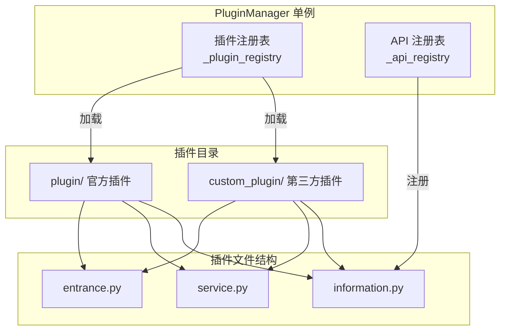
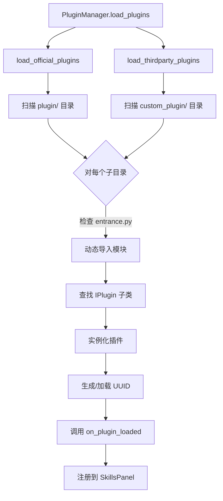
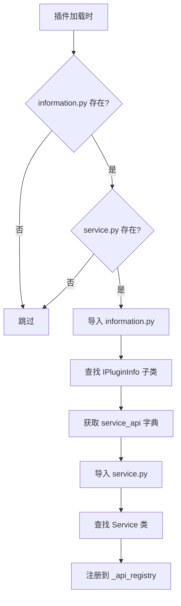
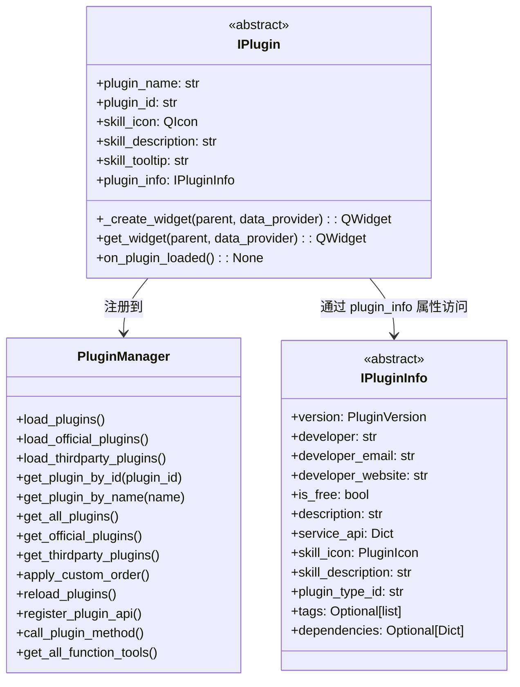
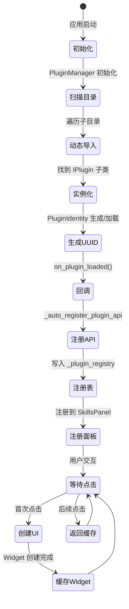

# 插件系统概述

> 插件系统的架构设计、加载机制和核心概念

---

## 1. 插件系统架构



---

## 2. 插件加载机制

### 2.1 加载流程



### 2.2 动态导入实现

```python
def _load_plugin_from_directory(self, plugin_dir: Path) -> Optional[IPlugin]:
    """从目录加载插件"""

    # 1. 查找入口文件
    entrance_file = plugin_dir / "entrance.py"

    # 2. 创建 __init__.py（如果不存在）
    init_file = plugin_dir / "__init__.py"
    if not init_file.exists():
        init_file.write_text("")

    # 3. 动态导入模块
    spec = importlib.util.spec_from_file_location(module_name, entrance_file)
    module = importlib.util.module_from_spec(spec)
    spec.loader.exec_module(module)

    # 4. 查找 IPlugin 子类
    for attr_name in dir(module):
        attr = getattr(module, attr_name)
        if isinstance(attr, type) and issubclass(attr, IPlugin) and attr is not IPlugin:
            plugin_class = attr
            break

    # 5. 实例化插件
    plugin_instance = plugin_class()

    # 6. 生成 UUID
    identity = PluginIdentity(plugin_dir)
    plugin_id = identity.load_or_create_id()
    plugin_instance._plugin_id = plugin_id

    # 7. 调用加载完成回调
    plugin_instance.on_plugin_loaded()

    return plugin_instance
```

---

## 3. 插件目录结构

### 3.1 标准插件结构

```
plugin_name/
├── __init__.py           # Python 包标识（可为空）
├── entrance.py           # 插件入口（必需）
│                          # 继承 IPlugin，实现 UI
├── service.py            # 业务逻辑（可选）
│                          # 定义可被调用的方法
├── information.py        # 插件元数据（可选）
│                          # 继承 IPluginInfo，定义 API
├── icons/                # 图标目录（可选）
│   └── icon.png
└── assets/               # 资源目录（可选）
    └── ...
```

### 3.2 三个核心文件

| 文件 | 必需 | 职责 | 关键内容 |
|------|------|------|---------|
| **entrance.py** | ✅ 是 | UI 入口 | 继承 `IPlugin`，实现 `_create_widget()` |
| **service.py** | ❌ 否 | 业务逻辑 | 定义可被外部调用的方法 |
| **information.py** | ❌ 否 | 元数据 | 继承 `IPluginInfo`，定义 `service_api` |

---

## 4. API 自动注册机制

### 4.1 注册流程



> **前置条件**：`information.py` 和 `service.py` 必须同时存在，缺一不可。只有 `entrance.py` 是必需的。

### 4.2 service_api 定义示例

```python
# information.py
class MyPluginInfo(IPluginInfo):
    @property
    def service_api(self) -> Dict[str, Any]:
        return {
            "method_name": {
                "description": "方法描述",
                "parameters": {
                    "param1": {"type": "str", "required": True},
                    "param2": {"type": "int", "required": False}
                },
                "returns": {"type": "str"}
            }
        }
```

---

## 5. 插件分类

### 5.1 官方插件 vs 第三方插件

| 分类 | 目录 | 加载顺序 | 配置管理 |
|------|------|---------|---------|
| **官方插件** | `plugin/` | 先加载 | `plugin_order.json` |
| **第三方插件** | `custom_plugin/` | 后加载 | `plugin_order.json` |

### 5.2 插件顺序管理

```python
# config/plugin_order.json
{
    "official_plugins": [
        "uuid-1",
        "uuid-2",
        "uuid-3"
    ],
    "thirdparty_plugins": [
        "uuid-a",
        "uuid-b"
    ]
}
```

应用启动时，`PluginManager.apply_custom_order()` 会按照配置顺序排列插件。

---

## 6. 核心类图



---

## 7. 插件生命周期



---

## 8. 相关文档

- [IPlugin 接口](iplugin.md)
- [PluginManager](plugin-manager.md)
- [插件开发指南](plugin-development.md)

---

*本文档由 Claude Code 自动生成*
