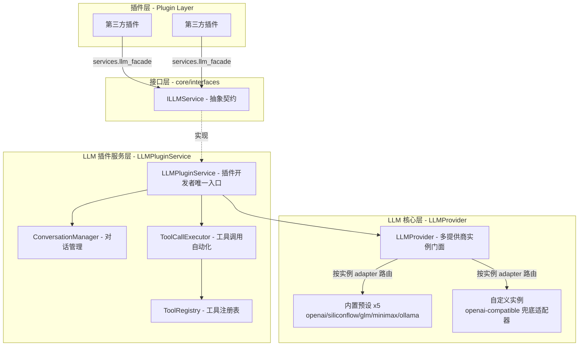
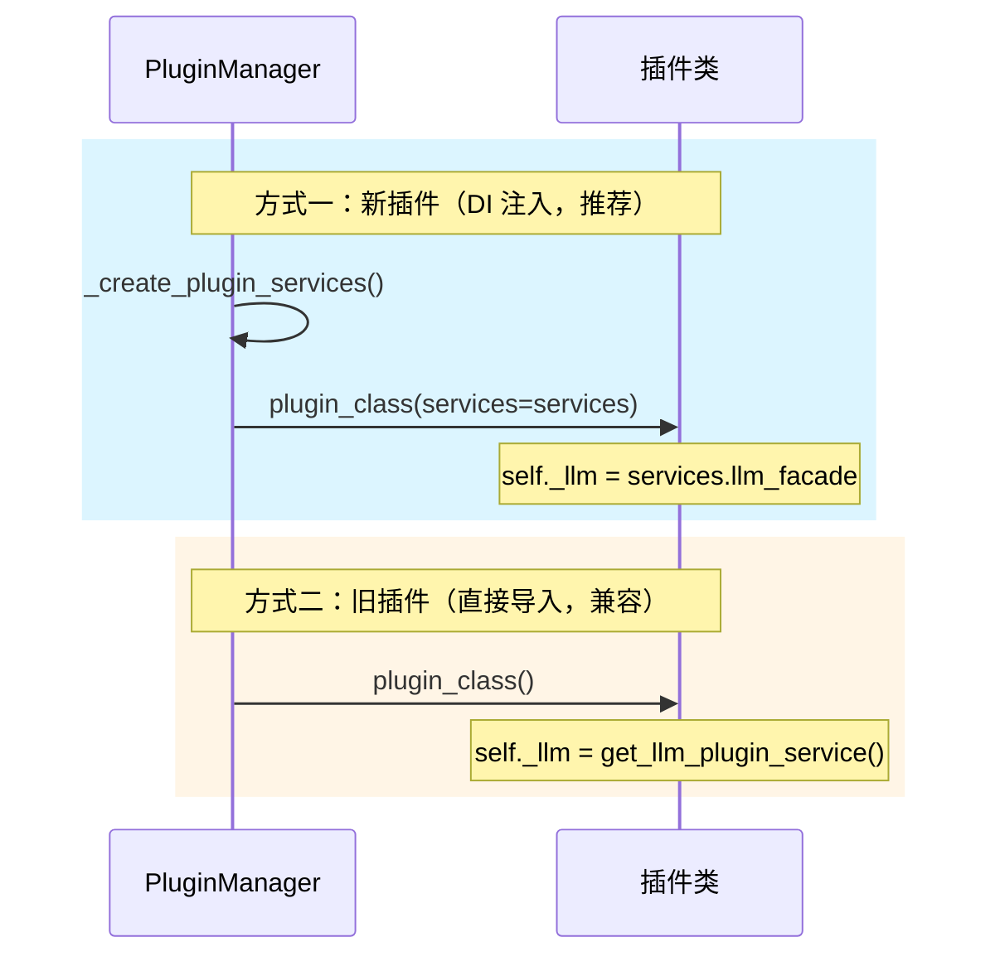
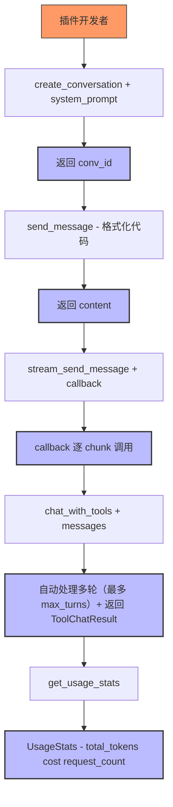
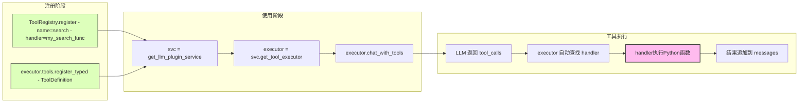

# LLM 集成指南

> 本文档面向第三方插件开发者，介绍如何使用 `LLMPluginService`（`ILLMService` 接口的唯一实现）访问 LLM 能力。
> 完整 API 参考见 [LLM Provider API 参考](../core/llm-provider/api-reference.md)。
> 旧接口（`ILLMFacade`）已删除，破坏性迁移对照见 `temp/llm-api-v2-migration.md`。

---

## 架构概览



### DI 初始化对比



---

## 快速开始

### 方式一：通过依赖注入（推荐）

```python
from core.interfaces import IPlugin, PluginServices
from core.llm import get_llm_plugin_service


class MyPlugin(IPlugin):
    def __init__(self, services: PluginServices | None = None):
        super().__init__()
        self._llm = (services.llm_facade
                     if services
                     else get_llm_plugin_service())
        self._services = services  # 可选，保存服务容器引用

    def on_plugin_loaded(self):
        # plugin_id 已由 PluginManager 设置（通过 self.plugin_id 访问）
        # services 通过 __init__ 注入，同时 PluginManager 也会设置 self._services
        # 可通过 self._services.llm_facade 访问 LLM 服务
        pass
```

> **注意**：即使 `__init__` 不接收 `services` 参数，`PluginManager` 仍会在实例化后通过 `self._services` 注入服务容器。

### 方式二：直接导入单例（兼容旧插件）

```python
from core.llm import get_llm_plugin_service

svc = get_llm_plugin_service()
```

---

## PluginServices 服务容器

`PluginServices` 是框架自动注入的服务容器，包含 6 个核心服务字段：

| 字段 | 类型 | 说明 | 注入失败时 |
|------|------|------|-----------|
| `llm_facade` | `ILLMService` | LLM 服务入口（实际为 `LLMPluginService` 单例） | 不会失败 |
| `data_provider` | `DataProvider` | 数据持久化服务 | `None` |
| `task_manager` | `BackgroundTaskManager` | 后台任务管理 | `None` |
| `logger` | `ILogger` | 日志服务（实际为 `LoggerManager` 单例） | `None` |
| `mcp_manager` | `MCPManager` | MCP Server 管理器 | `None` |
| `mcp_client` | `MCPClientManager` | MCP 外部连接管理器 | `None` |

完整说明见 [插件系统概述](../core/plugin-system/overview.md)。

---

## 实例与默认解析（重要概念）

重构后所有 `provider` 参数的语义为**实例 id**（配置键名），不再是大写厂商类型。框架提供两个命名常量消除 `"default"` 魔法字符串：

```python
from core.llm.types import DEFAULT_PROVIDER, DEFAULT_MODEL
```

- `DEFAULT_PROVIDER`（`"default"`）：默认实例引用，由底层按功能维度（chat/embedding）解析为实际实例 id（带粘性缓存）；
- `DEFAULT_MODEL`（`"default"`）：使用实例配置中的默认模型。

```python
# 列出所有实例（ProviderInfo 列表，按配置 order 排序，不含 api_key）
providers = svc.list_providers()
for p in providers:
    print(f"{p.instance_id} ({p.name}): {p.current_chat_model}")
    print(f"  预设: {p.preset_id}, 适配器: {p.adapter}")
    print(f"  启用: chat={p.enabled_chat}, embedding={p.enabled_embedding}")
    print(f"  健康: {p.is_healthy}, 最近错误: {p.last_error}")
    for m in p.models:  # List[ModelInfo]
        print(f"    - {m.id} (vision={m.support_vision}, tools={m.support_function_calling})")

# 单实例模型列表
models = svc.get_models("glm")                 # 指定实例 id
models = svc.get_models(DEFAULT_PROVIDER)      # 默认实例

# 解析默认实例
instance_id = svc.resolve_provider_id(DEFAULT_PROVIDER)  # 无可用实例抛 ConfigurationError
default_id = svc.get_default_provider_id("chat")         # 无可用实例返回 None（不抛异常）
```

> **ProviderInfo 字段说明**：`instance_id`（实例唯一标识）、`preset_id`（关联预设，自定义实例为 `None`）、`name`（显示名）、`adapter`（适配器家族键）、`base_url`（有效地址）、`enabled_chat` / `enabled_embedding`、`is_healthy` / `last_error`、`current_chat_model` / `current_embedding_model`、`models: List[ModelInfo]`。视觉/工具调用能力从 `models` 中各 `ModelInfo` 读取（旧 `supports_vision` 等聚合字段已删除）。

---

## 对话管理

### 创建对话

```python
conv_id = svc.create_conversation(
    system_prompt="你是一个代码助手",
    provider="siliconflow",       # 可选，实例 id；默认 DEFAULT_PROVIDER
    model="default",              # 可选，默认 DEFAULT_MODEL
    metadata=None,                # 可选，额外元数据字典
)
```

### 发送消息（同步）

```python
content = svc.send_message(conv_id, "解释这段代码")

# 临时覆盖本次调用的模型/实例（不修改会话绑定）
content = svc.send_message(
    conv_id, "用另一个模型再解释一遍",
    model="glm-4-flash", provider="glm",
)
```

### 发送消息（流式）

```python
def callback(chunk):
    print(chunk.content, end="", flush=True)

content = svc.stream_send_message(
    conv_id,
    "写一个快排",
    callback=callback,
)
```

### 获取/删除对话

```python
conv = svc.get_conversation(conv_id)
convs = svc.list_conversations()      # 列出所有对话
svc.delete_conversation(conv_id)      # 删除对话
```

### 获取统计

```python
stats = svc.get_usage_stats(conv_id)  # 指定对话统计
stats = svc.get_usage_stats()         # 全局统计
print(f"累计 Token: {stats.total_tokens}, 费用: {stats.total_cost} 元")
print(f"请求次数: {stats.request_count}")
```

**对话管理完整流程**：



---

## 直接 chat（无状态）

无需创建对话，直接发起一次 chat。`messages` 接受 `Message` 对象或字典（字典经 `Message.from_dict()` 宽松解析，含 `images` / `tool_calls` 等扩展键不会报错）：

```python
resp = svc.chat([
    {"role": "system", "content": "你是一个助手"},
    {"role": "user", "content": "你好"},
], tools=[...])  # 可选，显式传入工具定义（也可通过 executor.tools.register() 预先注册）
print(resp.content)
if resp.usage:
    print(f"Token: {resp.usage.total_tokens}")  # Token 用量信息
if resp.tool_calls:  # 类型化的 ToolCall 列表
    print(resp.tool_calls[0].name, resp.tool_calls[0].arguments)
```

### 发送消息（流式，无状态）

```python
def callback(chunk: str, done: bool):
    print(chunk, end="", flush=True)
    if done:
        print()  # 流结束时换行

content = svc.stream_chat([
    {"role": "user", "content": "写一个快排"},
], callback=callback, provider="minimax")
# 返回值是拼接后的完整文本（str）；聚合响应（含 tool_calls/usage）在 svc.last_stream_response
```

---

## 工具调用

### 工具注册表对比

`LLMPluginService` 提供两个工具注册途径：

| 方法 | 说明 | 使用场景 |
|---|---|---|
| `svc.get_tool_executor().tools` | 插件私有注册表 | 单个插件使用私有工具 |
| `svc.get_shared_tool_registry()` | 全局共享注册表 | 多个插件共享工具，或在模块级别注册 |

### 注册工具

```python
def calculate(expression: str) -> str:
    """执行数学计算"""
    return str(eval(expression))

executor = svc.get_tool_executor()
executor.tools.register(
    name="calculate",
    description="执行数学表达式计算",
    parameters={
        "type": "object",
        "properties": {
            "expression": {"type": "string", "description": "数学表达式"},
        },
        "required": ["expression"],
    },
    handler=calculate,
)

# 或使用类型化的 ToolDefinition 便捷注册（内部转发 register）
from core.llm.types import ToolDefinition

executor.tools.register_typed(ToolDefinition(
    name="calculate",
    description="执行数学表达式计算",
    parameters={
        "type": "object",
        "properties": {
            "expression": {"type": "string", "description": "数学表达式"},
        },
        "required": ["expression"],
    },
    handler=calculate,
))
```

> **注意**：`executor.chat_with_tools()` **无需传入 `tools` 参数**。工具已通过 `register()` 注册，执行器内部自动从注册表中获取工具列表。

### 工具调用（同步）

```python
messages = [{"role": "user", "content": "计算 2+3*4"}]
result = executor.chat_with_tools(
    messages,
    max_turns=3,
)

# result 是 ToolChatResult（字段类型固定）
for r in result.tool_results:  # List[ToolResult]
    print(f"工具 {r.tool_name}: 结果={r.result}, 耗时={r.duration_ms}ms")
    if r.error:
        print(f"  错误: {r.error}")

print(f"最终回复: {result.final_text}")        # 最终文本
print(result.final_response.content)           # 最终响应对象（Optional[ChatResponse]）
# result.messages 为完整对话记录，可直接用于后续请求
```

### 工具调用（流式）

```python
def on_chunk(chunk):
    print(chunk.content, end="", flush=True)

result = executor.chat_with_tools_stream(
    messages,
    callback=on_chunk,
    max_turns=3,
)
# result.final_text 为流式聚合全文；final_response 取底层聚合响应（last_stream_response）
# 流式路径的 tool_calls 从聚合响应中提取，多轮循环正常执行
```

### 使用共享工具注册表

通过 `get_shared_tool_registry()` 获取全局共享注册表，供多个插件共享工具：

```python
registry = svc.get_shared_tool_registry()
registry.register(
    name="search_web",
    description="搜索互联网获取最新信息",
    parameters={...},
    handler=my_search_func,
)
```

**工具注册与使用完整流程**：



---

## 向量嵌入

```python
responses = svc.embed(["你好", "世界"])   # List[EmbeddingResponse]
print(f"向量维度: {len(responses[0].embedding)}")
```

---

## 多模态

### 图片处理

```python
# 将本地图片转为 base64（纯文件工具，位于 utils.image_utils）
from utils.image_utils import load_image_as_base64

b64 = load_image_as_base64("/path/to/image.jpg")

# 发送带图片的消息
svc.send_message(conv_id, "描述这张图片", images=[b64])
```

### 图像生成

```python
result = svc.generate_image(
    prompt="一只可爱的猫",
    provider="siliconflow",
    size="1024x1024",    # 可选，默认 1024x1024
    quality="standard",   # 可选，standard 或 hd
)
print(f"图片URL: {result.url}")
print(f"修订后的提示词: {result.revised_prompt}")
print(f"base64: {result.base64[:20]}...")
```

### 语音合成（TTS）

```python
result = svc.text_to_speech(
    text="你好，世界！",
    provider="siliconflow",
    voice="alloy",  # 可选
)
print(f"音频时长: {result.duration_seconds}秒")
print(f"音频URL: {result.url}")
```

---

## 验证 Provider 配置

```python
ok, msg = svc.validate_provider("siliconflow")
if not ok:
    print(f"配置错误: {msg}")
```

---

## 配置变更联动（无需插件处理）

- `LLMPluginService` 构造时经 `get_llm_config()` 获取 `LLMConfig` 单例并 `subscribe` 变更事件；
  实例增删 / `custom_models` 定价修改后，定价表自动重建并热注入 `ConversationManager`，
  不再是构造期快照。
- 定价读取统一模型 schema 的 `input_price_per_1m` / `output_price_per_1m`（元/百万 tokens）。

---

## 完整示例

参考 [KKPIP-Tech/InstructionX-Plugins](https://github.com/KKPIP-Tech/InstructionX-Plugins) 仓库中的示例插件源码，学习完整实现。

---

## 类型参考

| 类型 | 来源文件 | 说明 |
|---|---|---|
| `Conversation` | `types.py` | 对话数据模型，含 `to_llm_format()`、`add_message()` |
| `ToolResult` | `types.py` | 工具调用结果，含 `error`、`duration_ms` |
| `ToolChatResult` | `types.py` | 工具调用对话的结构化结果（`messages` / `tool_results` / `final_response` / `final_text`） |
| `ToolDefinition` | `types.py` | 类型化的工具定义（`register_typed` 入参） |
| `UsageStats` | `types.py` | Token 累计统计，含 `total_tokens`、`total_cost`、`by_provider` |
| `StreamChunk` | `types.py` | 流式 chunk，含 `done`、`full_response`、`reasoning_content` |
| `ImageResult` | `types.py` | 图片生成结果，含 `url`、`base64`、`revised_prompt` |
| `AudioResult` | `types.py` | TTS 结果，含 `audio_data`、`url`、`duration_seconds` |
| `ProviderInfo` | `types.py` | Provider 实例信息（`instance_id` / `preset_id` / `adapter` / 健康状态 / `models`） |
| `UsageRecord` | `types.py` | 单次请求持久化记录，含 `timestamp`、`duration_ms` |
| `DEFAULT_PROVIDER` / `DEFAULT_MODEL` | `types.py` | `"default"` 命名常量（默认实例 / 默认模型引用） |
| `ToolCall` | `provider_interface.py` | 类型化的工具调用（`id` / `name` / `arguments`） |
| `CacheInfo` | `types_cache.py` | 缓存信息，含 `cache_hit`、`cache_hit_rate` |
| `UsageInfo` | `provider_interface.py` | 单次请求 Token 用量，含 `input_tokens`、`output_tokens`、`total_tokens` |
| `ModelInfo` | `provider_interface.py` | 模型信息，定价字段为 `input_price_per_1m` / `output_price_per_1m`（每百万 tokens） |

---

## 相关文档

- [LLM Provider API 参考](../core/llm-provider/api-reference.md) — LLMPluginService、ConversationManager、ToolCallExecutor 完整 API 清单
- [LLM Provider 概述](../core/llm-provider/overview.md) — Provider 底层实现细节
- [MCP 协议模块概述](../core/mcp/overview.md) — MCP Server 和 MCP Client 完整指南
- [插件开发指南](../core/plugin-system/plugin-development.md)
- [IPlugin 接口](../core/plugin-system/iplugin.md)
- [PluginManager 架构](../core/plugin-system/plugin-manager.md)

---

*本文档由 Claude Code 自动生成*
