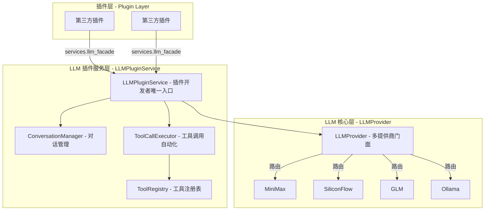
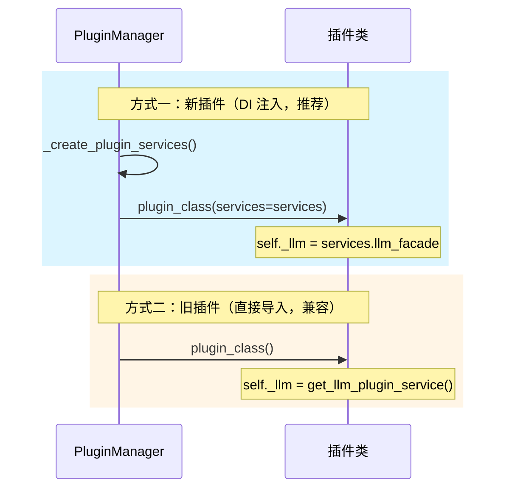
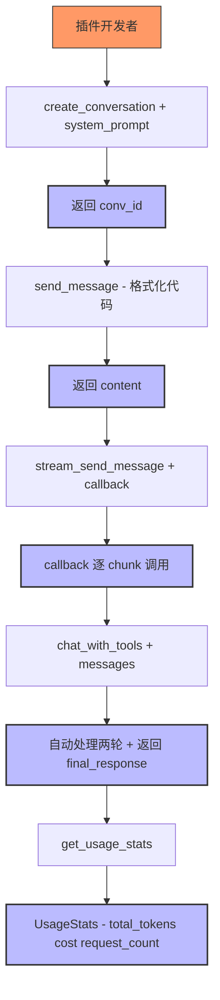
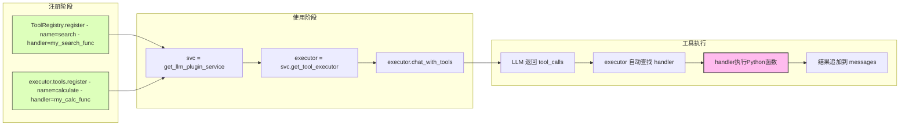

# LLM 集成指南

> 本文档面向第三方插件开发者，介绍如何使用 `LLMPluginService` 访问 LLM 能力。
> 完整 API 参考见 [LLM Provider API 参考](../core/llm-provider/api-reference.md)。

---

## 架构概览



### DI 初始化对比



---

## 快速开始

### 方式一：通过依赖注入（推荐）

```python
from core.interfaces.i_plugin import IPlugin
from core.interfaces.plugin_services import PluginServices
from core.llm import get_llm_plugin_service

class MyPlugin(IPlugin):
    def __init__(self, services: PluginServices | None = None):
        super().__init__()
        self._llm = (services.llm_facade
                     if services
                     else get_llm_plugin_service())
        self._services = services  # 可选，保存服务容器引用

    def on_plugin_loaded(self, plugin_id, **kwargs):
        # services 通过 __init__ 注入，存储在 self._services 中
        # 可通过 self._services.llm_facade 访问 LLM 服务
        pass
```

### 方式二：直接导入单例（兼容旧插件）

```python
from core.llm import get_llm_plugin_service

svc = get_llm_plugin_service()
```

---

## 对话管理

### 创建对话

```python
conv_id = svc.create_conversation(
    system_prompt="你是一个代码助手",
    provider="siliconflow",  # 可选，默认 "default"
    model="Pro/deepseek-ai/DeepSeek-V3",  # 可选
)
```

### 发送消息（同步）

```python
content = svc.send_message(conv_id, "解释这段代码")
```

### 发送消息（流式）

```python
def callback(chunk):
    print(chunk.content, end="", flush=True)

content = svc.stream_send_message(
    conv_id,
    "写一个快排",
    callback=callback,
)
```

### 获取/删除对话

```python
conv = svc.get_conversation(conv_id)
convs = svc.list_conversations()      # 列出所有对话
svc.delete_conversation(conv_id)        # 删除对话
```

### 获取统计

```python
stats = svc.get_usage_stats(conv_id)  # 指定对话统计
stats = svc.get_usage_stats()         # 全局统计
print(f"累计 Token: {stats.total_tokens}, 费用: {stats.total_cost} 元")
print(f"请求次数: {stats.request_count}")
```

**对话管理完整流程**：



---

## 直接 chat（无状态）

无需创建对话，直接发起一次 chat：

```python
resp = svc.chat([
    {"role": "system", "content": "你是一个助手"},
    {"role": "user", "content": "你好"},
])
print(resp.content)
print(f"Token: {resp.usage.total_tokens}")  # Token 用量信息
```

---

## 工具调用

### 工具注册表对比

`LLMPluginService` 提供两个工具注册途径：

| 方法 | 说明 | 使用场景 |
|---|---|---|
| `svc.get_tool_executor().tools` | 插件私有注册表 | 单个插件使用私有工具 |
| `svc.get_shared_tool_registry()` | 全局共享注册表 | 多个插件共享工具，或在模块级别注册 |

### 注册工具

```python
def calculate(expression: str) -> str:
    """执行数学计算"""
    return str(eval(expression))

executor = svc.get_tool_executor()
executor.tools.register(
    name="calculate",
    description="执行数学表达式计算",
    parameters={
        "type": "object",
        "properties": {
            "expression": {"type": "string", "description": "数学表达式"},
        },
        "required": ["expression"],
    },
    handler=calculate,
)
```

> **注意**：`executor.chat_with_tools()` **无需传入 `tools` 参数**。工具已通过 `register()` 注册，执行器内部自动从注册表中获取工具列表。

### 工具调用（同步）

```python
messages = [{"role": "user", "content": "计算 2+3*4"}]
msgs, results, final = executor.chat_with_tools(
    messages,
    max_turns=3,
)

# results 是 ToolResult 列表
for r in results:
    print(f"工具 {r.tool_name}: 结果={r.result}, 耗时={r.duration_ms}ms")
    if r.error:
        print(f"  错误: {r.error}")

print(f"最终回复: {final}")
```

### 工具调用（流式）

```python
def on_chunk(chunk):
    print(chunk.content, end="", flush=True)

msgs, results, final = executor.chat_with_tools_stream(
    messages,
    callback=on_chunk,
    max_turns=3,
)
```

### 使用共享工具注册表

参考 `plugin/sample_ai_plugin/tools.py`：

```python
registry = svc.get_shared_tool_registry()
registry.register(
    name="search_web",
    description="搜索互联网获取最新信息",
    parameters={...},
    handler=my_search_func,
)
```

**工具注册与使用完整流程**：



---

## 向量嵌入

```python
vectors = svc.embed(["你好", "世界"])
print(f"向量维度: {len(vectors[0])}")
```

---

## 多模态

### 图片处理

```python
# 将本地图片转为 base64
b64 = svc.load_image_as_base64("/path/to/image.jpg")

# 发送带图片的消息
svc.send_message(conv_id, "描述这张图片", images=[b64])
```

### 图像生成

```python
result = svc.generate_image(
    prompt="一只可爱的猫",
    provider="siliconflow",
    size="1024x1024",    # 可选，默认 1024x1024
    quality="standard",   # 可选，standard 或 hd
)
print(f"图片URL: {result.url}")
print(f"修订后的提示词: {result.revised_prompt}")
print(f"base64: {result.base64[:20]}...")
```

### 语音合成（TTS）

```python
result = svc.text_to_speech(
    text="你好，世界！",
    provider="siliconflow",
    voice="alloy",  # 可选
)
print(f"音频时长: {result.duration_seconds}秒")
print(f"音频URL: {result.url}")
```

---

## 获取可用 Provider

```python
providers = svc.get_available_providers()
for p in providers:
    print(f"{p.name}: {p.current_chat_model}")
    print(f"  支持视觉: {p.supports_vision}")
    print(f"  支持函数调用: {p.supports_function_calling}")
```

### 验证 Provider 配置

```python
ok, msg = svc.validate_provider("siliconflow")
if not ok:
    print(f"配置错误: {msg}")
```

---

## 完整示例

参考 `plugin/sample_ai_plugin/` 目录下的示例插件源码：
- `entrance.py` — 插件主入口，展示对话、流式、工具调用
- `tools.py` — 共享工具注册示例

---

## 类型参考

| 类型 | 来源文件 | 说明 |
|---|---|---|
| `Conversation` | `types.py` | 对话数据模型，含 `to_llm_format()`、`add_message()` |
| `ToolResult` | `types.py` | 工具调用结果，含 `error`、`duration_ms` |
| `UsageStats` | `types.py` | Token 累计统计，含 `total_tokens`、`total_cost`、`by_provider` |
| `StreamChunk` | `types.py` | 流式 chunk，含 `done`、`full_response`、`reasoning_content` |
| `ImageResult` | `types.py` | 图片生成结果，含 `url`、`base64`、`revised_prompt` |
| `AudioResult` | `types.py` | TTS 结果，含 `audio_data`、`url`、`duration_seconds` |
| `ProviderInfo` | `types.py` | Provider 信息，含各 capability 字段 |
| `UsageInfo` | `provider_interface.py` | 单次请求 Token 用量，含 `input_tokens`、`output_tokens`、`total_tokens` |

---

## 相关文档

- [LLM Provider API 参考](../core/llm-provider/api-reference.md) — LLMPluginService、ConversationManager、ToolCallExecutor 完整 API 清单
- [LLM Provider 概述](../core/llm-provider/overview.md) — Provider 底层实现细节
- [插件开发指南](../core/plugin-system/plugin-development.md)
- [PluginManager 架构](../core/plugin-system/plugin-manager.md)
