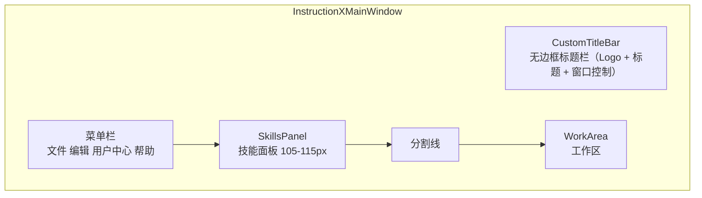
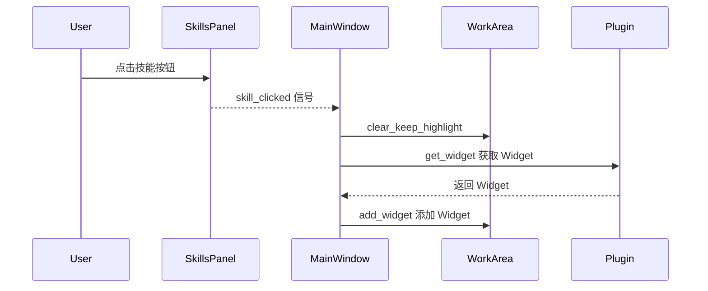
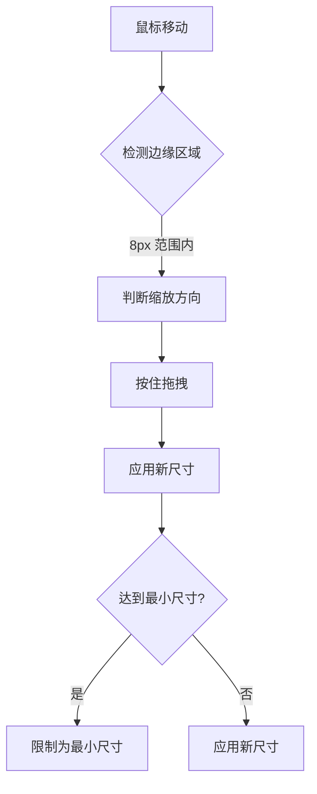

# 主窗口

> InstructionXMainWindow 的结构和功能

---

## 1. 概述

`InstructionXMainWindow` 是应用程序的主窗口类，负责整体界面的布局和组件协调。

**文件位置**: `ui/main_window.py`

**基类**: `QMainWindow` (PySide6)

---

## 2. 窗口结构



---

## 3. 核心组件

### 3.1 菜单栏

```python
def _create_menus(self) -> None:
    # 文件菜单
    menu_file = self.menuBar().addMenu("文件")
    menu_file_load_action = QAction("加载录制文件", self)
    menu_file.addAction(menu_file_load_action)

    # 编辑菜单
    menu_edit = self.menuBar().addMenu("编辑")
    menu_edit_plugin_order_action = QAction("插件排序", self)
    menu_edit.addAction(menu_edit_plugin_order_action)

    # 用户中心菜单
    menu_user = self.menuBar().addMenu("用户中心")

    # 帮助菜单
    menu_help = self.menuBar().addMenu("帮助")
    menu_help_about_action = QAction("关于", self)
    menu_help.addAction(menu_help_about_action)
```

### 3.2 自定义标题栏 (CustomTitleBar)

**文件位置**: `ui/title_bar.py`

主窗口采用无边框（FramelessWindow）设计，通过 `CustomTitleBar` 实现窗口控制功能：

- **Logo 显示**: 从 `ui/logo.png` 加载 24x24 应用 Logo
- **标题文字**: 显示应用名称 "InstructionX - CE"
- **菜单栏集成**: 内嵌 QMenuBar，与样式系统无缝结合
- **窗口控制按钮**: 三个按钮（最小化□、最大化/还原❐、关闭×），每个按钮 40x40
- **拖拽移动**: 按住标题栏拖动可移动窗口；从最大化状态拖动时自动先还原到正常窗口再移动
- **双击操作**: 双击标题栏切换最大化/还原状态

### 3.3 技能面板 (SkillsPanel)

- **位置**: 窗口顶部（标题栏下方）
- **高度**: 最小 105px，最大 115px
- **功能**: 显示所有已加载的插件作为技能按钮
- **通信**: 通过 `skill_clicked` 信号与主窗口通信

### 3.4 工作区 (WorkArea)

- **位置**: 窗口中部（技能面板下方）
- **特性**: 可伸缩，占用剩余空间
- **功能**: 显示当前选中插件的 Widget

---

## 4. 初始化流程

```mermaid
flowchart TD
    A[__init__] --> B[super().__init__]
    B --> C[设置窗口属性<br/>FramelessWindow + 最小尺寸]
    C --> D[设置窗口尺寸]
    D --> E[_create_menus 创建菜单]
    E --> F[_create_custom_title_bar 创建标题栏]
    F --> G[_create_main_layout]

    G --> H[创建中心部件]
    H --> I[初始化 PluginManager]
    I --> J[load_plugins 加载插件]
    J --> K[apply_custom_order 应用顺序]

    K --> L[创建 SkillsPanel]
    L --> M[设置回调]
    M --> N[连接信号]
    N --> O[完成]
```

```python
def __init__(self):
    super().__init__()

    # 设置窗口属性：无边框 + 最小尺寸
    self.setWindowFlags(Qt.WindowType.FramelessWindowHint)
    self.setMinimumSize(800, 600)
    self.resize(1024, 768)

    # 创建菜单
    self._create_menus()

    # 创建自定义标题栏
    self._create_custom_title_bar()

    # 创建主布局
    self._create_main_layout()


def _create_main_layout(self) -> None:
    # 创建中心部件
    central_widget = QWidget()
    self.setCentralWidget(central_widget)

    # 垂直布局
    main_layout = QVBoxLayout(central_widget)
    main_layout.setContentsMargins(5, 5, 5, 5)
    main_layout.setSpacing(5)

    # 初始化插件管理器
    self.plugin_manager = PluginManager()
    self.plugin_manager.load_plugins()
    self.plugin_manager.apply_custom_order()

    # 创建技能面板
    self.skills_panel = SkillsPanel(central_widget)
    self.skills_panel.set_plugin_manager(self.plugin_manager)
    self.skills_panel.load_skills_from_manager()
    self.skills_panel.setMaximumHeight(115)
    self.skills_panel.setMinimumHeight(105)
    main_layout.addWidget(self.skills_panel)

    # 添加分割线
    separator = QFrame()
    separator.setFrameShape(QFrame.Shape.HLine)
    main_layout.addWidget(separator)

    # 创建工作区
    self.work_area = WorkArea(central_widget)
    main_layout.addWidget(self.work_area.get_widget(), stretch=1)

    # 设置回调
    self.work_area.set_clear_highlight_callback(
        self.skills_panel.clear_active_state
    )

    # 连接信号
    self.skills_panel.skill_clicked.connect(self._on_skill_clicked)
```

---

## 5. 信号处理

### 5.1 技能按钮点击



```python
def _on_skill_clicked(self, plugin):
    """
    处理技能按钮点击事件
    在工作区显示插件的 widget
    """
    # 清空工作区（不清除按钮高亮）
    self.work_area.clear_keep_highlight()

    # 获取插件的 widget 并显示在工作区
    plugin_widget = plugin.get_widget(parent=self.work_area.get_widget())

    if plugin_widget:
        self.work_area.add_widget(plugin_widget)
    else:
        # 如果插件 widget 创建失败，显示错误信息
        error_label = QLabel(f"无法加载插件：{plugin.plugin_name}")
        error_label.setAlignment(Qt.AlignmentFlag.AlignCenter)
        self.work_area.add_widget(error_label)
```

### 5.3 窗口边缘缩放

主窗口支持 8 个方向的边缘拖拽缩放：

- **边缘检测**: 窗口边缘 8 像素范围内检测鼠标位置，判断缩放方向（上、下、左、右、左上、左下、右上、右下）
- **拖拽缩放**: 按住鼠标左键拖拽边缘或角落时，实时计算并应用新的窗口几何尺寸
- **最小尺寸限制**: 缩放时限制最小窗口尺寸（800x600），防止界面异常
- **光标提示**: 鼠标悬停在边缘时自动变换光标形状，提示可缩放方向



### 5.4 对话框

#### 关于对话框

通过 **帮助 > 关于** 打开，显示应用 Logo、名称（InstructionX - CE）、版本号（0.1.0）、版权声明和专有软件声明。

```python
def _open_about_dialog(self):
    """打开关于对话框"""
    from ui.dialog.about_dialog import AboutDialog
    dialog = AboutDialog(self)
    dialog.exec()
```

#### LLM 设置对话框

通过 **编辑 > LLM 设置** (Ctrl+L) 打开，提供 Provider 列表管理，支持添加/删除 Provider、配置 API Key/Base URL/模型参数、测试连接、保存配置。

```python
def _open_llm_settings_dialog(self):
    """打开 LLM 设置对话框"""
    from ui.dialog.llm_settings_dialog import LLMSettingsDialog
    dialog = LLMSettingsDialog(self)
    dialog.exec()
```

### 5.5 插件排序

```python
def _open_plugin_order_dialog(self):
    """打开插件排序对话框"""
    dialog = PluginOrderDialog(self.plugin_manager, self)

    if dialog.exec() == QDialog.DialogCode.Accepted:
        # 用户点击了保存，重新加载 skills panel
        self.skills_panel.load_skills_from_manager()
```

---

## 6. 布局属性

| 属性 | 值 |
|------|------|
| 窗口类型 | FramelessWindow（无边框） |
| 最小尺寸 | 800 x 600 |
| 默认尺寸 | 1024 x 768 |
| 边距 | 5px |
| 间距 | 5px |
| 技能面板高度 | 最小 105px，最大 115px |
| 边缘检测范围 | 8px（用于拖拽缩放） |

---

## 7. 相关文档

- [技能面板](skills-panel.md)
- [工作区](work-area.md)
- [系统架构概述](../architecture/overview.md)

---

*本文档由 Claude Code 自动生成*
