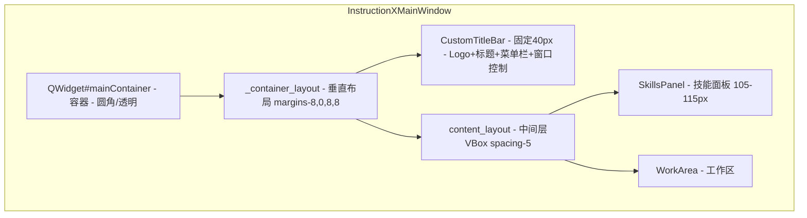
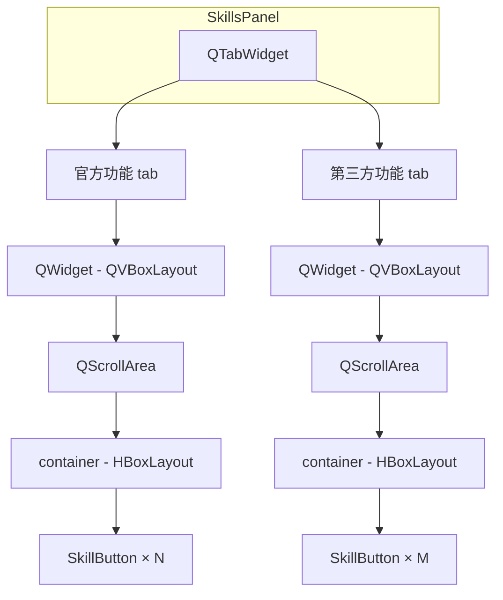
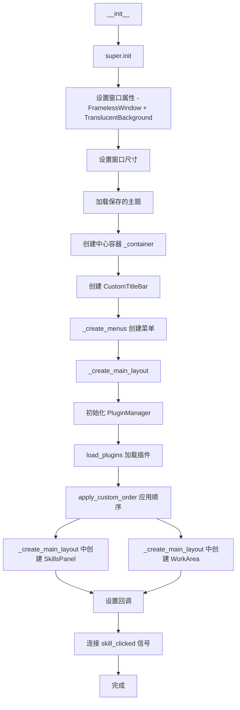
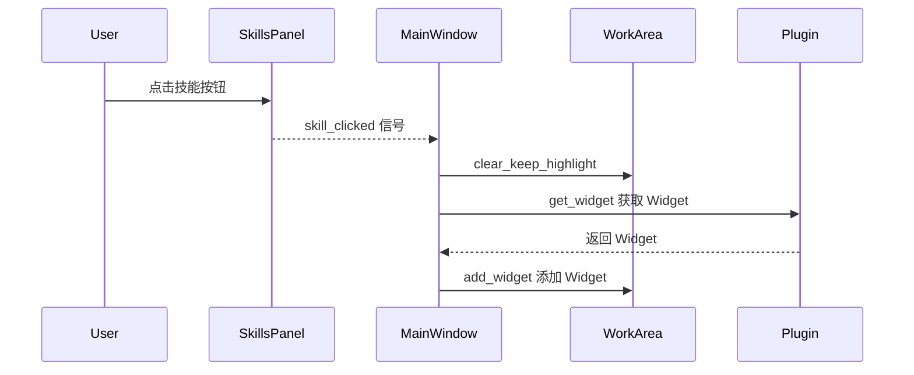
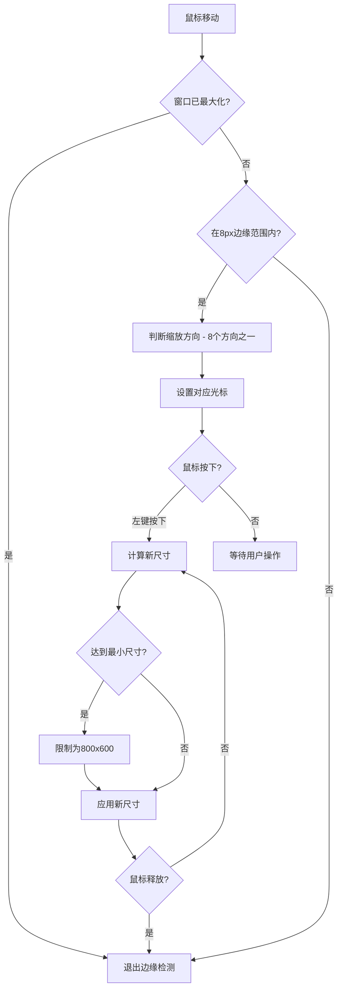

# 主窗口

> InstructionXMainWindow 的结构和功能

---

## 1. 概述

`InstructionXMainWindow` 是应用程序的主窗口类，负责整体界面的布局和组件协调。

**文件位置**: `ui/main_window.py`

**基类**: `QMainWindow` (PySide6)

---

## 2. 窗口结构



> **注意**：菜单栏（编辑、用户中心、AI、帮助）实际嵌入在 `CustomTitleBar` 内部（通过 `set_menu_bar()` 放置在标题和窗口控制按钮之间）。无框架窗口额外设置了 `WA_TranslucentBackground` 属性。

---

## 3. 核心组件

### 3.1 菜单栏

菜单栏包含四个菜单：**编辑**、**用户中心**、**AI**、**帮助**。

```python
def _create_menus(self) -> None:
    # 获取原生菜单栏并移到自定义标题栏
    menu_bar = self.menuBar()
    menu_bar.setNativeMenuBar(False)
    self._title_bar.set_menu_bar(menu_bar)

    # 编辑菜单
    menu_edit = menu_bar.addMenu("编辑")
    menu_edit.addAction(menu_edit_plugin_order_action)  # 插件排序 (Ctrl+P)
    menu_edit.addSeparator()
    menu_edit.addAction(self._menu_theme_action)  # 切换主题

    # 用户中心菜单（预留，目前为空）
    menu_user = menu_bar.addMenu("用户中心")

    # AI 菜单 - 由 _create_ai_menu 创建
    self._create_ai_menu(menu_bar)

    # 帮助菜单
    menu_help = menu_bar.addMenu("帮助")
```

**AI 菜单** (`_create_ai_menu`) 包含以下菜单项：

```python
def _create_ai_menu(self, menu_bar):
    self._ai_menu = menu_bar.addMenu("AI")

    # LLM 设置 (Ctrl+L)
    settings_action = QAction("LLM 设置...", self)
    settings_action.setShortcut("Ctrl+L")
    settings_action.triggered.connect(self._open_llm_settings_dialog)
    self._ai_menu.addAction(settings_action)

    # 模型服务设置
    service_action = QAction("模型服务设置...", self)
    service_action.triggered.connect(self._open_llm_model_service_dialog)
    self._ai_menu.addAction(service_action)

    # 用量查询
    usage_action = QAction("用量查询", self)
    usage_action.triggered.connect(self._open_usage_panel)
    self._ai_menu.addAction(usage_action)

    # Provider 快速切换子菜单 (_quick_provider_menu)
    self._quick_provider_menu = QMenu("切换模型服务", self._ai_menu)
    self._ai_menu.addMenu(self._quick_provider_menu)
    self._quick_provider_actions = {}
    self._rebuild_quick_provider_menu()
```

点击 **LLM 设置...** 调用 `_open_llm_settings_dialog()`，打开 `LLMSettingsDialog`（两栏布局）进行 LLM Provider 配置。

点击 **模型服务设置...** 调用 `_open_llm_model_service_dialog()`，打开 `LLMModelServiceDialog`（三栏布局：左侧分类、中间 Provider 列表、右侧详情），支持新增、编辑、删除 Provider 及设置默认模型。变更默认 Provider 时触发 `default_changed(provider, model)` 信号。

点击 **用量查询** 调用 `_open_usage_panel()`，打开 `UsagePanel` 对话框查看 token 用量和费用统计。

**Provider 快速切换** 由 `_quick_provider_menu`（AI 菜单子菜单）处理，通过 `_rebuild_quick_provider_menu()` 动态构建，自动为每个启用的 Provider 生成菜单项，并显示能力标记：
- 👁 - 支持 Vision
- 🔧 - 支持 Function Calling
- ⚠️ - Provider 不健康

切换 Provider 时触发 `llm_provider_changed(provider_name, model_name)` Signal。

### 3.2 自定义标题栏 (CustomTitleBar)

**文件位置**: `ui/title_bar.py`

主窗口采用无边框（FramelessWindow）设计，通过 `CustomTitleBar` 实现窗口控制功能：

- **Logo 显示**: 从 `ui/logo.png` 加载 24x24 应用 Logo
- **标题文字**: 显示应用名称 "InstructionX - CE"
- **菜单栏集成**: 内嵌 QMenuBar，与样式系统无缝结合
- **固定高度**: 40px（`setFixedHeight(40)`）
- **窗口控制按钮**: 三个按钮（最小化□、最大化/还原❐、关闭×），每个按钮 45x40
- **拖拽移动**: 按住标题栏拖动可移动窗口；从最大化状态拖动时自动先还原到正常窗口再移动
- **双击操作**: 双击标题栏切换最大化/还原状态

### 3.3 主题切换

主窗口支持浅色/深色/跟随系统三种主题模式，通过 **编辑 > 切换主题** 菜单切换。

**主题循环**: 浅色 → 深色 → 跟随系统 → 浅色

```python
# 主题映射
self._theme_map = {'light': 'dark', 'dark': 'auto', 'auto': 'light'}
```

**主题持久化**: 用户选择的主题自动保存到 DataProvider 的 `__app_config__` 插件中，键名为 `theme`。下次启动时自动应用保存的主题。

**实现方法**:
- `_load_saved_theme()`: 启动时从 DataProvider 加载保存的主题
- `_cycle_theme()`: 循环切换主题（light → dark → auto）
- `_save_theme(theme)`: 保存主题到 DataProvider
- `_update_theme_action_text()`: 更新菜单项文字，显示当前主题
- `_update_container_style()`: 重新应用容器圆角样式（切换主题或窗口状态时调用）

**主题应用**:
```python
from utils.style_qss import set_style_qss_theme

# 设置主题
set_style_qss_theme(QApplication.instance(), theme)
```

**菜单显示**:
```
切换主题 (浅色)  # 当前是浅色
切换主题 (深色)  # 当前是深色
切换主题 (跟随系统)  # 当前是跟随系统
```

### 3.4 技能面板 (SkillsPanel)

- **位置**: 窗口顶部（标题栏下方）
- **高度**: 最小 105px，最大 115px
- **结构**: `QTabWidget`，包含两个标签页
  - **官方功能**: 来自 `plugin/` 目录的插件
  - **第三方功能**: 来自 `custom_plugin/` 目录的插件
  - 每个标签页内部为 `QScrollArea` + 横向 `QHBoxLayout` 容器，容纳 `SkillButton`
- **通信**: 通过 `skill_clicked` 信号与主窗口通信



### 3.5 工作区 (WorkArea)

- **位置**: 窗口中部（技能面板下方）
- **特性**: 可伸缩，占用剩余空间
- **功能**: 显示当前选中插件的 Widget
- **初始状态**: 显示占位文本 "点击上方技能按钮，在此处显示插件功能" (`ui/work_area/work_area.py` 第32行)

---

## 4. 初始化流程



```python
def __init__(self):
    super().__init__()

    # 设置窗口属性：无边框 + 透明背景 + 最小尺寸
    self.setWindowFlags(Qt.WindowType.FramelessWindowHint)
    self.setAttribute(Qt.WidgetAttribute.WA_TranslucentBackground)
    self.setMinimumSize(800, 600)
    self.resize(1024, 768)

    # 创建主容器（用于圆角效果）
    self._container = QWidget()
    self._container_layout = QVBoxLayout(self._container)
    self._container_layout.setContentsMargins(8, 0, 8, 8)
    self._container_layout.setSpacing(0)

    # 创建自定义标题栏
    self._title_bar = CustomTitleBar(self)
    self._container_layout.addWidget(self._title_bar)

    # 创建菜单
    self._create_menus()

    # 创建主布局
    self._create_main_layout()


def _create_main_layout(self) -> None:
    # 创建中间内容布局（隔离 skills_panel 和 work_area）
    content_layout = QVBoxLayout()
    content_layout.setContentsMargins(0, 0, 0, 0)
    content_layout.setSpacing(5)
    self._container_layout.addLayout(content_layout)

    # 初始化插件管理器
    self.plugin_manager = PluginManager()
    self.plugin_manager.load_plugins()
    self.plugin_manager.apply_custom_order()

    # 创建技能面板
    self.skills_panel = SkillsPanel(self._container)
    self.skills_panel.set_plugin_manager(self.plugin_manager)
    self.skills_panel.load_skills_from_manager()
    self.skills_panel.setMaximumHeight(115)
    self.skills_panel.setMinimumHeight(105)
    content_layout.addWidget(self.skills_panel)

    # 创建工作区（可伸缩，占用剩余空间）
    self.work_area = WorkArea(self._container)
    content_layout.addWidget(self.work_area.get_widget(), stretch=1)

    # 设置回调
    self.work_area.set_clear_highlight_callback(
        self.skills_panel.clear_active_state
    )

    # 连接信号
    self.skills_panel.skill_clicked.connect(self._on_skill_clicked)
```

---

## 5. 信号处理

### 5.1 技能按钮点击



```python
def _on_skill_clicked(self, plugin):
    """
    处理技能按钮点击事件
    在工作区显示插件的 widget
    """
    # 清空工作区（不清除按钮高亮）
    self.work_area.clear_keep_highlight()

    # 获取插件的 widget 并显示在工作区
    plugin_widget = plugin.get_widget(parent=self.work_area.get_widget())

    if plugin_widget:
        self.work_area.add_widget(plugin_widget)
    else:
        # 如果插件 widget 创建失败，显示错误信息
        error_label = QLabel(f"无法加载插件：{plugin.plugin_name}")
        error_label.setAlignment(Qt.AlignmentFlag.AlignCenter)
        error_label.setProperty("error", "true")
        error_label.style().unpolish(error_label)
        error_label.style().polish(error_label)
        self.work_area.add_widget(error_label)
```

### 5.3 窗口边缘缩放

主窗口支持 8 个方向的边缘拖拽缩放（无边框窗口的标准交互）：

- **边缘检测**: 窗口边缘 8 像素范围内检测鼠标位置，判断缩放方向
- **支持的方向**: 
  - 上、下、左、右（4个边）
  - 左上、左下、右上、右下（4个角）
- **拖拽缩放**: 按住鼠标左键拖拽边缘或角落时，实时计算并应用新的窗口几何尺寸
- **最小尺寸限制**: 缩放时限制最小窗口尺寸（800x600），防止界面异常
- **光标提示**: 鼠标悬停在边缘时自动变换光标形状，提示可缩放方向
- **最大化限制**: 窗口最大化时禁用边缘缩放



**实现方法**:
- `_get_resize_direction(event)`: 检测鼠标位置对应的缩放方向
- `_get_resize_cursor(direction)`: 根据缩放方向获取对应的光标样式
- `_do_resize(event)`: 执行窗口 resize，应用新尺寸
- `mouseMoveEvent(event)`: 处理鼠标移动事件 - 边缘检测和 resize
- `mousePressEvent(event)`: 处理鼠标按下事件 - 开始 resize
- `mouseReleaseEvent(event)`: 处理鼠标释放事件 - 结束 resize

**光标映射**:
```python
cursor_map = {
    'top': Qt.CursorShape.SizeVerCursor,        # 上下箭头
    'bottom': Qt.CursorShape.SizeVerCursor,
    'left': Qt.CursorShape.SizeHorCursor,      # 左右箭头
    'right': Qt.CursorShape.SizeHorCursor,
    'top-left': Qt.CursorShape.SizeFDiagCursor,    # 左上-右下对角线
    'bottom-right': Qt.CursorShape.SizeFDiagCursor,
    'top-right': Qt.CursorShape.SizeBDiagCursor,   # 右上-左下对角线
    'bottom-left': Qt.CursorShape.SizeBDiagCursor,
}
```

### 5.4 对话框

#### 关于对话框

通过 **帮助 > 关于** 打开，显示应用 Logo、名称（InstructionX - CE）、版本号（0.1.0）、版权声明和专有软件声明。

```python
def _open_about_dialog(self):
    """打开关于对话框"""
    from ui.dialog.about_dialog import AboutDialog
    dialog = AboutDialog(self)
    dialog.exec()
```

#### LLM 设置对话框

通过 **AI > LLM 设置...** (Ctrl+L) 打开，提供两栏式配置界面。左侧为 Provider 列表（标题"模型服务"），右侧为选中 Provider 的配置详情（API 密钥、API 地址、模型选择等）。详细说明见 [对话框组件](dialogs.md#2-llmsettingsdialog-llm-设置对话框)。

```python
def _open_llm_settings_dialog(self):
    """打开 LLM 设置对话框"""
    from ui.dialog.llm_settings_dialog import LLMSettingsDialog
    dialog = LLMSettingsDialog(self)

    if dialog.exec() == QDialog.DialogCode.Accepted:
        from core.llm.llm_provider import get_llm_provider
        get_llm_provider().reload_config()
```

### 5.5 插件排序

```python
def _open_plugin_order_dialog(self):
    """打开插件排序对话框"""
    dialog = PluginOrderDialog(self.plugin_manager, self)

    if dialog.exec() == QDialog.DialogCode.Accepted:
        # 用户点击了保存，重新加载 skills panel
        self.skills_panel.load_skills_from_manager()
```

### 5.6 窗口状态变化与容器样式

主窗口通过 `changeEvent` 监听 `WindowStateChange` 事件，同步更新：

- **最大化按钮文字**: 最大化时显示 `❐`，还原时显示 `□`
- **容器圆角**: 最大化时移除圆角（`border-radius: 0px`），还原时恢复 8px 圆角

```python
def changeEvent(self, event):
    """监听窗口状态变化，更新标题栏按钮"""
    if event.type() == event.Type.WindowStateChange:
        if self.isMaximized():
            self._title_bar.set_maximized(True)
            self._container.setStyleSheet("... border-radius: 0px ...")
        else:
            self._title_bar.set_maximized(False)
            self._container.setStyleSheet("... border-radius: 8px ...")
```

`set_style_qss_theme()` 切换主题时也会调用 `_update_container_style()` 重新应用容器样式。

---

## 6. 布局属性

| 属性 | 值 |
|------|------|
| 窗口类型 | FramelessWindowHint + WA_TranslucentBackground（无边框透明背景） |
| 最小尺寸 | 800 x 600 |
| 默认尺寸 | 1024 x 768 |
| 容器边距 | 左右 8px，顶部 0px，底部 8px |
| 标题栏高度 | 40px（固定） |
| 容器圆角 | 8px（非最大化时） |
| 内容布局间距 | 5px（SkillsPanel 与 WorkArea 之间） |
| 技能面板高度 | 最小 105px，最大 115px |
| 边缘检测范围 | 8px（用于拖拽缩放） |

---

## 7. 相关文档

- [技能面板](skills-panel.md)
- [工作区](work-area.md)
- [系统架构概述](../architecture/overview.md)

---

*本文档由 Claude Code 自动生成*
