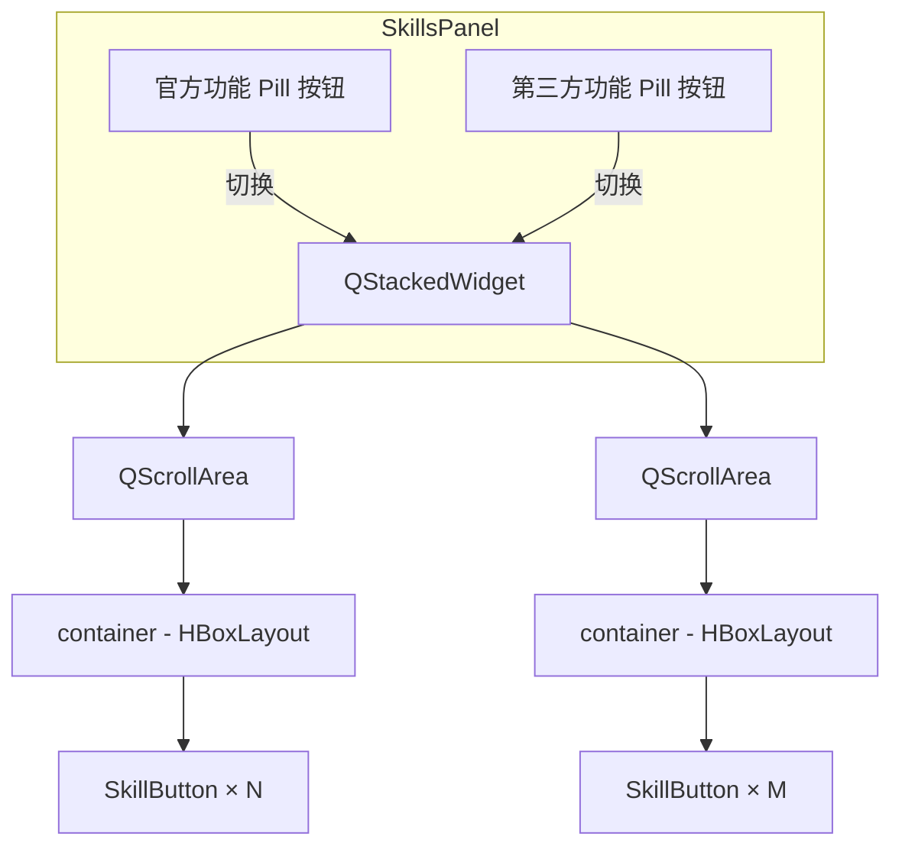
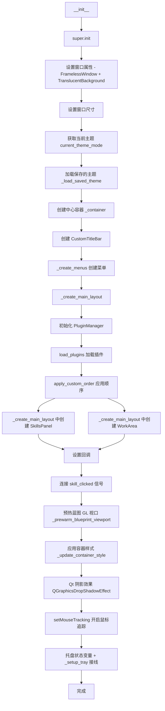
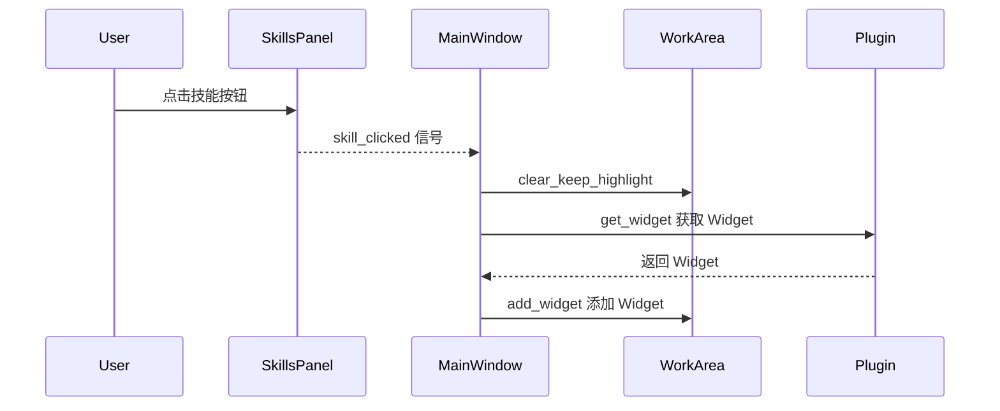
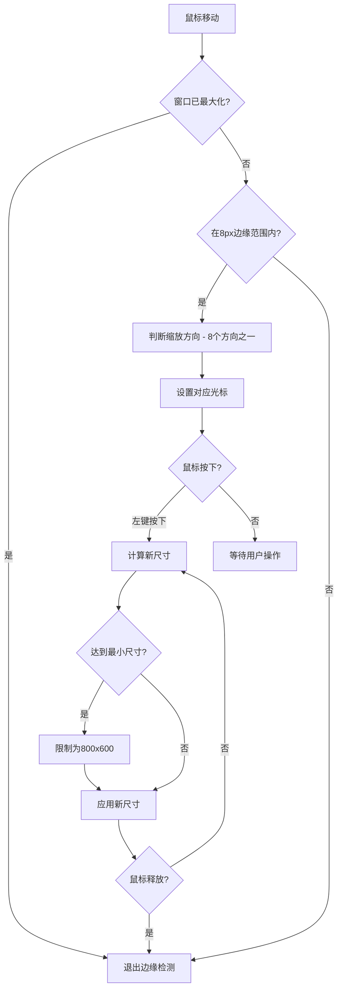

# 主窗口

> InstructionXMainWindow 的结构和功能

---

## 1. 概述

`InstructionXMainWindow` 是应用程序的主窗口类，负责整体界面的布局和组件协调。

**文件位置**: `ui/main_window.py`

**基类**: `QMainWindow` (PySide6)

---

## 2. 窗口结构


> **注意**：菜单栏（编辑、AI、帮助）实际嵌入在 `CustomTitleBar` 内部（通过 `set_menu_bar()` 放置在标题和窗口控制按钮之间）。无框架窗口额外设置了 `WA_TranslucentBackground` 属性。

---

## 3. 核心组件

### 3.1 菜单栏

菜单栏包含三个菜单：**编辑**、**AI**、**帮助**。

```python
def _create_menus(self) -> None:
    # 获取原生菜单栏并移到自定义标题栏
    menu_bar = self.menuBar()
    menu_bar.setNativeMenuBar(False)
    self._title_bar.set_menu_bar(menu_bar)

    # 编辑菜单
    menu_edit = menu_bar.addMenu("编辑")
    menu_edit.addAction(menu_edit_plugin_manage_action)  # 插件管理... (Ctrl+P)
    menu_edit.addAction(menu_edit_font_manage_action)    # 字体管理...
    menu_edit.addAction(self._menu_theme_action)         # 切换主题
    menu_edit.addSeparator()
    menu_edit.addAction(menu_edit_github_install_action) # 从 GitHub 安装插件...

    # AI 菜单 - 由 _create_ai_menu 创建
    self._create_ai_menu(menu_bar)

    # 帮助菜单
    menu_help = menu_bar.addMenu("帮助")
    menu_help.addAction(menu_help_about_action)    # 关于
    menu_help.addAction(menu_help_license_action)  # 开源组件许可
```

**AI 菜单** (`_create_ai_menu`) 包含以下菜单项：

```python
def _create_ai_menu(self, menu_bar):
    self._ai_menu = menu_bar.addMenu("AI")

    # LLM 设置 (Ctrl+L)
    settings_action = QAction("LLM 设置...", self)
    settings_action.setShortcut("Ctrl+L")
    settings_action.triggered.connect(self._open_llm_settings_dialog)
    self._ai_menu.addAction(settings_action)

    # 用量查询
    usage_action = QAction("用量查询", self)
    usage_action.triggered.connect(self._open_usage_panel)
    self._ai_menu.addAction(usage_action)
```

点击 **LLM 设置...** 调用 `_open_llm_settings_dialog()`，打开 `LLMSettingsDialog`（`ui/dialog/llm_settings/` 包，两栏布局、自动保存语义）进行 LLM Provider 实例配置。

点击 **用量查询** 调用 `_open_usage_panel()`，在模态对话框中嵌入 `UsagePanel` 查看 token 用量和费用统计。

### 3.2 自定义标题栏 (CustomTitleBar)

**文件位置**: `ui/title_bar.py`

主窗口采用无边框（FramelessWindow）设计，通过 `CustomTitleBar` 实现窗口控制功能：

- **Logo 显示**: 从 `ui/logo.png` 加载 24x24 应用 Logo
- **标题文字**: 从 `QApplication.applicationName()` 获取，默认显示 "InstructionX"
- **菜单栏集成**: 内嵌 QMenuBar，与样式系统无缝结合
- **固定高度**: 40px（`setFixedHeight(40)`）
- **窗口控制按钮**: 三个按钮（最小化、最大化/还原、关闭），均为 `IconButton`（图标由 QPainter 自绘），每个按钮 45x40；最小化按钮最小化到任务栏，关闭按钮（及 Alt+F4 等全部关闭路径）经主窗口 `closeEvent` 拦截后弹出关闭确认对话框（详见 [系统托盘与关闭行为](system-tray.md)）
- **拖拽移动**: 按住标题栏拖动可移动窗口；从最大化状态拖动时自动先还原到正常窗口再移动
- **双击操作**: 双击标题栏切换最大化/还原状态

### 3.3 主题切换

主窗口支持浅色/深色/跟随系统三种主题模式，通过 **编辑 > 切换主题** 菜单切换。

**主题循环**: 浅色 → 深色 → 跟随系统 → 浅色

```python
# 主题映射
self._theme_map = {'light': 'dark', 'dark': 'auto', 'auto': 'light'}
```

**主题持久化**: 用户选择的主题自动保存到 DataProvider 的 `__app_config__` 插件中，键名为 `theme`。下次启动时自动应用保存的主题。

**实现方法**:
- `_load_saved_theme()`: 启动时从 DataProvider 加载保存的主题
- `_cycle_theme()`: 循环切换主题（light → dark → auto），调用 `apply_uikit_theme()` 并保存
- `_save_theme(theme)`: 保存主题到 DataProvider
- `_update_theme_action_text()`: 更新菜单项文字，显示当前主题
- `_update_container_style()`: 重新应用容器圆角样式（切换主题或窗口状态时调用）

**主题应用**（UIKit 全局主题，详见 [UIKit 主题系统](../utils/uikit-theme.md)）:
```python
from ui.uikit_theme import apply_uikit_theme

# 设置主题
apply_uikit_theme(QApplication.instance(), theme)
```

**菜单显示**:
```
切换主题 (浅色)      # 当前是浅色
切换主题 (深色)      # 当前是深色
切换主题 (跟随系统)   # 当前是跟随系统
```

### 3.4 技能面板 (SkillsPanel)

- **位置**: 窗口顶部（标题栏下方）
- **高度**: 最小 125px，最大 135px
- **结构**: `QStackedWidget` + 自定义 Pill 切换按钮（非 QTabWidget），包含两个标签页
  - **官方功能**: 来自 `plugin/` 目录的插件
  - **第三方功能**: 来自 `custom_plugin/` 目录的插件
  - 每个标签页内部为 `QScrollArea` + 横向 `QHBoxLayout` 容器，容纳 `SkillButton`
- **通信**: 通过 `skill_clicked` 信号与主窗口通信



> **注意**: 标签切换使用自定义 Pill 按钮 + `QStackedWidget` 实现，而非 `QTabWidget`。

### 3.5 工作区 (WorkArea)

- **位置**: 窗口中部（技能面板下方）
- **特性**: 可伸缩，占用剩余空间
- **功能**: 显示当前选中插件的 Widget
- **初始状态**: 显示占位文本 "点击上方技能按钮，在此处显示插件功能" (`ui/work_area/work_area.py` 第33行)

### 3.6 用量查询面板 (UsagePanel)

- **文件位置**: `ui/usage_panel/` 包（`panel.py` 组装与数据编排，`kpi_card.py` KPI 卡片，`trend_chart.py` 趋势面板，`history_table.py` 历史面板，`formatting.py` 格式化工具）
- **打开方式**: 通过 **AI > 用量查询** 菜单，在模态对话框中展示
- **布局**: 整体内容置于 `QScrollArea` 垂直滚动区内；KPI 卡片为固定高度（92px）；趋势面板高度按热力图内容自适应（单元格边长 = 可用宽度 / 周数，上限 28px，范围切换与窗口宽度变化时同步调整）；历史面板高度随当前页行数自适应（行高 27px，保证整页记录完整显示）；窗口缩小时页面整体上下滚动，各区块高度不变
- **功能**: 提供 Token 用量统计、趋势图表和明细查询
- **组件**:
  - 顶部标题行（主标题 + 副标题）
  - KPI 卡片区（总请求数、输入 Token、输出 Token、总 Token、缓存命中率、平均耗时，含「较上周期 ±x.x%」同比）
  - 用量趋势面板（UIKit ChartWidget 日历热力图，GitHub 贡献图风格：行=星期、列=周序；近半年 / 近一年 / 自定义范围；请求数 / 输入 Token / 输出 Token 指标切换；悬停提示显示「日期: 当日值」；无 visualMap 指示条与图例；色带为 UIKit 令牌 primary.subtle→primary，随主题换肤。面板经引擎公开扩展点注册了两个扩展：系列类型 `calendarHeatmap`（hit_test 让 tooltip 行名回退为日期）与组件 `monthLabels`（补画跨年月份标签），均未修改组件库）
  - 使用历史面板（Provider / Model / 对话ID 筛选 + 明细表格 + 分页）
  - 明细表格（10 列：时间、Provider、Model、输入、输出、总Token、缓存命中、缓存Token、耗时、流式；按时间倒序，最新记录在第 1 页）
  - 分页控件（每页 50 条）

---

## 4. 初始化流程



```python
def __init__(self):
    super().__init__()

    # 设置窗口属性：无边框 + 透明背景 + 最小尺寸
    self.setWindowFlags(Qt.WindowType.FramelessWindowHint)
    self.setAttribute(Qt.WidgetAttribute.WA_TranslucentBackground)
    # 窗口尺寸常量为 ui/main_window.py 模块级常量：
    # WINDOW_MIN_WIDTH/HEIGHT = 800/600，WINDOW_DEFAULT_WIDTH/HEIGHT = 1024/768
    self.setMinimumSize(WINDOW_MIN_WIDTH, WINDOW_MIN_HEIGHT)
    self.resize(WINDOW_DEFAULT_WIDTH, WINDOW_DEFAULT_HEIGHT)

    # 获取当前主题（UIKit 主题模式）
    self._current_theme = current_theme_mode()

    # 主题映射
    self._theme_map = {'light': 'dark', 'dark': 'auto', 'auto': 'light'}

    # 加载保存的主题设置
    self._load_saved_theme()

    # 创建主容器（用于圆角效果）
    self._container = QWidget()
    self._container.setObjectName("mainContainer")
    self.setCentralWidget(self._container)

    # 主布局
    self._container_layout = QVBoxLayout(self._container)
    self._container_layout.setContentsMargins(8, 0, 8, 8)
    self._container_layout.setSpacing(0)

    # 创建自定义标题栏
    self._title_bar = CustomTitleBar(self)
    self._container_layout.addWidget(self._title_bar)

    # 创建菜单
    self._create_menus()

    # 创建主布局
    self._create_main_layout()

    # 预热蓝图 GL 视口（须在窗口 show() 之前，见下文说明）
    self._prewarm_blueprint_viewport()

    # 应用容器样式
    self._update_container_style()

    # 创建 Qt 阴影效果（替代 DWM 原生阴影，避免 WM_NCCALCSIZE 坐标错位）
    self._shadow_effect = QGraphicsDropShadowEffect(self)
    self._shadow_effect.setBlurRadius(20)
    self._shadow_effect.setColor(QColor(0, 0, 0, 80))
    self._shadow_effect.setOffset(0, 4)
    self._container.setGraphicsEffect(self._shadow_effect)

    # 边缘 resize 相关变量
    self._resize_margin = 8
    self._resize_dir = None
    self._resize_start = None

    # 开启鼠标追踪，确保 hover 状态下也能及时更新边缘 resize 光标
    self.setMouseTracking(True)

    # 托盘运行状态（closeEvent 编排用）
    self._force_quit = False            # 显式退出路径置位，closeEvent 直接放行
    self._close_dialog_showing = False  # 关闭确认框防重入守卫
    self._active_plugin = None          # 当前激活插件，托盘子菜单标记用

    # 创建系统托盘管理器并接线
    self._setup_tray()


def _create_main_layout(self) -> None:
    # 创建中间内容布局（隔离 skills_panel 和 work_area）
    content_layout = QVBoxLayout()
    content_layout.setContentsMargins(0, 0, 0, 0)
    content_layout.setSpacing(5)
    self._container_layout.addLayout(content_layout)

    # 初始化插件管理器
    self.plugin_manager = PluginManager()
    self.plugin_manager.load_plugins()
    self.plugin_manager.apply_custom_order()

    # 创建技能面板
    self.skills_panel = SkillsPanel(self._container)
    self.skills_panel.set_plugin_manager(self.plugin_manager)
    self.skills_panel.load_skills_from_manager()
    self.skills_panel.setMaximumHeight(135)
    self.skills_panel.setMinimumHeight(125)
    content_layout.addWidget(self.skills_panel)

    # 创建工作区（可伸缩）
    self.work_area = WorkArea(self._container)
    content_layout.addWidget(self.work_area.get_widget(), stretch=1)

    # 设置回调
    self.work_area.set_clear_highlight_callback(
        self.skills_panel.clear_active_state
    )

    # 连接信号
    self.skills_panel.skill_clicked.connect(self._on_skill_clicked)
```

> **蓝图 GL 视口预热**（`_prewarm_blueprint_viewport`）：UIKit 蓝图画布的绘制视口在 GL 可用时基于 `QOpenGLWidget`；若其在顶层窗口**可见之后**才加入窗口树，Qt 会重建顶层原生窗口句柄，表现为整个窗口短暂关闭后重开一次（Qt 固有行为，见 UIKit USAGE.md §8.6）。插件的蓝图画布均在主窗口显示后才创建，因此主窗口在构造阶段预创建一个隐藏画布并长期持有（`self._blueprint_prewarm_canvas`），让顶层原生句柄首次创建时即按「含 GL 子控件」的方式建立，后续插件画布加入时不再触发重建。软件渲染回退环境（无 GL / offscreen）自动跳过；预热失败仅记录 WARNING 日志，不影响启动。

---

## 5. 信号处理

### 5.1 技能按钮点击



```python
def _on_skill_clicked(self, plugin):
    """
    处理技能按钮点击事件
    在工作区显示插件的 widget
    """
    # 记录当前激活插件（托盘「正在运行的插件」子菜单标记用）
    self._active_plugin = plugin

    # 清空工作区（不清除按钮高亮）
    self.work_area.clear_keep_highlight()

    # 获取插件的 widget 并显示在工作区
    plugin_widget = plugin.get_widget(parent=self.work_area.get_widget())

    if plugin_widget:
        self.work_area.add_widget(plugin_widget)
    else:
        # 如果插件 widget 创建失败，显示错误信息，并附带“重试”链接
        # （重试通过链接触发，重新调用本方法）
        error_label = QLabel(
            f"无法加载插件：{plugin.plugin_name}　<a href='retry'>点击重试</a>"
        )
        error_label.setAlignment(Qt.AlignmentFlag.AlignCenter)
        error_label.setProperty("error", "true")
        error_label.style().unpolish(error_label)
        error_label.style().polish(error_label)
        error_label.linkActivated.connect(
            lambda _link, p=plugin: self._on_skill_clicked(p)
        )
        self.work_area.add_widget(error_label)
```

### 5.2 窗口边缘缩放

主窗口支持 8 个方向的边缘拖拽缩放（无边框窗口的标准交互）：

- **边缘检测**: 窗口边缘 8 像素范围内检测鼠标位置，判断缩放方向
- **支持的方向**:
  - 上、下、左、右（4个边）
  - 左上、左下、右上、右下（4个角）
- **拖拽缩放**: 按住鼠标左键拖拽边缘或角落时，实时计算并应用新的窗口几何尺寸
- **最小尺寸限制**: 缩放时限制最小窗口尺寸（800x600），防止界面异常
- **光标提示**: 鼠标悬停在边缘时自动变换光标形状，提示可缩放方向
- **最大化限制**: 窗口最大化时禁用边缘缩放



**实现方法**:
- `_get_resize_direction(event)`: 检测鼠标位置对应的缩放方向
- `_get_resize_cursor(direction)`: 根据缩放方向获取对应的光标样式
- `_do_resize(event)`: 执行窗口 resize，应用新尺寸
- `mouseMoveEvent(event)`: 处理鼠标移动事件 - 边缘检测和 resize
- `mousePressEvent(event)`: 处理鼠标按下事件 - 开始 resize
- `mouseReleaseEvent(event)`: 处理鼠标释放事件 - 结束 resize

**光标映射**:
```python
cursor_map = {
    'top': Qt.CursorShape.SizeVerCursor,        # 上下箭头
    'bottom': Qt.CursorShape.SizeVerCursor,
    'left': Qt.CursorShape.SizeHorCursor,      # 左右箭头
    'right': Qt.CursorShape.SizeHorCursor,
    'top-left': Qt.CursorShape.SizeFDiagCursor,    # 左上-右下对角线
    'bottom-right': Qt.CursorShape.SizeFDiagCursor,
    'top-right': Qt.CursorShape.SizeBDiagCursor,   # 右上-左下对角线
    'bottom-left': Qt.CursorShape.SizeBDiagCursor,
}
```

### 5.3 对话框

#### 关于对话框

通过 **帮助 > 关于** 打开，显示应用 Logo、名称（InstructionX - CE）、版本号（Alpha 1.0.4）、版权声明和专有软件声明。

```python
# 文件顶部导入：from ui.dialog.about_dialog import AboutDialog

def _open_about_dialog(self):
    """打开关于对话框"""
    dialog = AboutDialog(self)
    dialog.exec()
```

#### 开源组件许可对话框

通过 **帮助 > 开源组件许可** 打开，展示项目使用的第三方开源组件（依赖）的许可证详情。

```python
# 文件顶部导入：from ui.dialog.license_dialog import LicenseDialog

def _open_license_dialog(self):
    """打开开源组件许可对话框"""
    dialog = LicenseDialog(self)
    dialog.exec()
```

#### 字体管理对话框

通过 **编辑 > 字体管理...** 打开，提供字体安装/卸载、已安装与系统字体浏览、实时预览与回退提示（底层为 `core/font` 的 `FontManager`，详见 [对话框组件](dialogs.md)）。

```python
# 文件顶部导入：from ui.dialog.font_manager_dialog import FontManagerDialog

def _open_font_manager_dialog(self):
    """打开字体管理对话框（安装/卸载/预览）"""
    dialog = FontManagerDialog(self)
    dialog.exec()
```

#### LLM 设置对话框

通过 **AI > LLM 设置...** (Ctrl+L) 打开，提供两栏式配置界面。左侧为 Provider 实例列表（搜索联动模型、启停开关、「＋ 添加提供商」），右侧为选中实例的配置详情（API 密钥、API 地址（占位符显示目录默认、可重置）、连接检测、模型列表管理、默认模型选择）。编辑即时落盘（自动保存语义，无「取消/保存」按钮），主题跟随应用主题。详细说明见 [对话框组件](dialogs.md)。

```python
# 文件顶部导入：from ui.dialog.llm_settings import LLMSettingsDialog
#             from core.llm.llm_provider import get_llm_provider

def _open_llm_settings_dialog(self):
    """打开 LLM 设置对话框（自动保存语义；reload_config 为幂等保底调用）"""
    dialog = LLMSettingsDialog(self)

    if dialog.exec() == QDialog.DialogCode.Accepted:
        # 幂等保底：确保 LLM Provider 配置为最新
        get_llm_provider().reload_config()
    # 对话框以主窗口为父对象，exec 返回后不会自动销毁；
    # 显式 deleteLater 释放其 C++ 对象树（含配置订阅面板），
    # 避免多次打开累积隐藏对话框与悬挂回调
    dialog.deleteLater()
```

#### 用量查询面板

通过 **AI > 用量查询** 打开，在一个模态对话框中展示 `UsagePanel`。

```python
# 文件顶部导入：from ui.usage_panel import UsagePanel

def _open_usage_panel(self):
    """打开用量查询面板对话框"""
    dialog = QDialog(self)
    dialog.setWindowTitle("用量查询")
    dialog.setMinimumSize(900, 600)
    # 尺寸对齐用量面板 Demo 的设计密度（1100×760）
    dialog.resize(1100, 760)
    layout = QVBoxLayout(dialog)
    layout.setContentsMargins(0, 0, 0, 0)
    usage_panel = UsagePanel(dialog)
    layout.addWidget(usage_panel)
    dialog.exec()
```

### 5.4 插件管理

通过 **编辑 > 插件管理...** (Ctrl+P) 打开 `PluginManagementDialog`（安装/升级/降级/卸载 + 分组与排序，详见 [对话框组件](dialogs.md)）。

```python
def _open_plugin_management_dialog(self):
    """打开插件管理对话框（安装/升级/降级/卸载/分组/排序）"""
    dialog = PluginManagementDialog(self.plugin_manager, self)
    dialog.plugins_changed.connect(self._on_plugins_changed)
    dialog.exec()

def _on_plugins_changed(self):
    """插件集合或分组排序变化后的统一刷新"""
    self.skills_panel.load_skills_from_manager()
    # 清空工作区，避免残留已卸载插件的 Widget
    self.work_area.clear()
```

> **注意**：`PluginOrderDialog`（`ui/dialog/plugin_order_dialog.py`）为遗留代码，无菜单入口、无实际调用方（仅 `ui/dialog/__init__.py` 仍残留 re-export）；其排序功能已被 `PluginManagementDialog` 的「分组与排序」页取代。

### 5.5 GitHub 插件安装

```python
def _open_github_plugin_install_dialog(self):
    """打开从 GitHub 安装插件对话框"""
    dialog = GitHubPluginInstallDialog(self)
    dialog.plugin_installed.connect(self._on_github_plugin_installed)
    dialog.exec()

def _on_github_plugin_installed(self, results):
    """GitHub 插件安装完成后的回调：重新加载插件并刷新技能面板"""
    # 重新扫描插件目录加载新插件（此前只刷新面板导致新插件不可见）
    self.plugin_manager.reload_plugins()
    self.skills_panel.load_skills_from_manager()
    self.work_area.clear()
    # 注意：安装结果提示由 GitHubPluginInstallDialog 统一弹出，
    # 此处不再重复弹窗（避免安装成功时出现双弹窗）。
```

### 5.6 窗口状态变化与容器样式

主窗口通过 `changeEvent` 监听 `WindowStateChange` 事件，同步更新：

- **最大化/还原按钮图标**: 最大化按钮为 `IconButton`（`ui/title_bar.py`），图标由 QPainter 自绘而非文字符号；`set_maximized()` 内部调用 `set_icon_type("restore" / "maximize")` 切换图标
- **容器圆角与阴影**: 最大化/全屏时移除圆角（`border-radius: 0px`）并停用阴影，还原时恢复 8px 圆角并启用阴影；圆角与阴影的启停统一由 `_update_container_style()` 处理
- **主题自适应**: 使用 UIKit 设计令牌 `T()` 获取当前主题颜色动态设置背景色和边框色

```python
def changeEvent(self, event):
    """监听窗口状态变化，更新标题栏按钮和阴影"""
    if event.type() == event.Type.WindowStateChange:
        self._title_bar.set_maximized(self.isMaximized() or self.isFullScreen())
        # 容器圆角/阴影样式统一由 _update_container_style 处理，避免重复代码
        self._update_container_style()
    super().changeEvent(event)
```

---

## 6. 布局属性

| 属性 | 值 |
|------|------|
| 窗口类型 | FramelessWindowHint + WA_TranslucentBackground（无边框透明背景） |
| 最小尺寸 | 800 x 600 |
| 默认尺寸 | 1024 x 768 |
| 容器边距 | 左右 8px，顶部 0px，底部 8px |
| 标题栏高度 | 40px（固定） |
| 容器圆角 | 8px（非最大化时） |
| 内容布局间距 | 5px（SkillsPanel 与 WorkArea 之间） |
| 技能面板高度 | 最小 125px，最大 135px |
| 边缘检测范围 | 8px（用于拖拽缩放） |

---

## 7. 相关文档

- [技能面板](skills-panel.md)
- [工作区](work-area.md)
- [对话框组件](dialogs.md)
- [系统架构概述](../architecture/overview.md)
