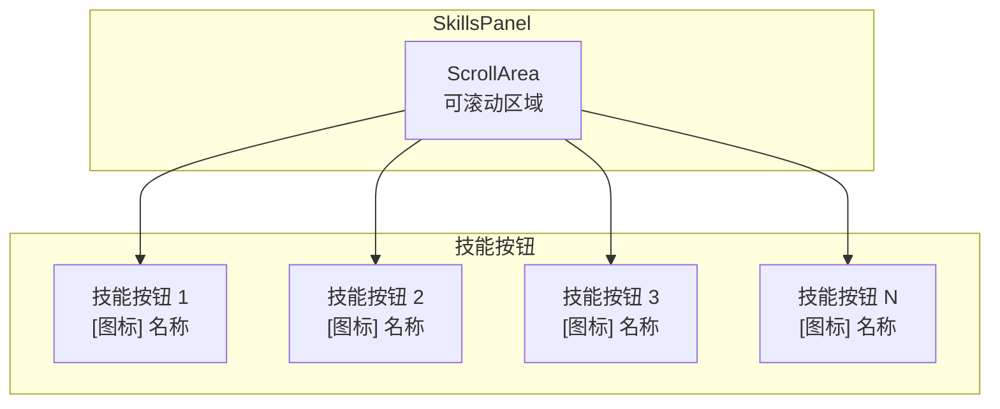

# 技能面板

> SkillsPanel 的结构和功能

---

## 1. 概述

`SkillsPanel` 是应用程序的技能面板组件，灵感来源于 Microsoft Office 的技能面板，提供类似工具栏的插件快捷访问方式。

**文件位置**: `ui/skills_panel/panel.py`

---

## 2. 面板结构



---

## 3. 核心组件

### 3.1 SkillButton

每个技能按钮代表一个插件，包含：
- **图标**: 从插件的 `information.py` 加载
- **名称**: 插件的 `plugin_name` 属性
- **描述**: 插件的 `skill_description` 属性
- **提示**: 鼠标悬停时显示的名称和描述

### 3.2 按钮状态

| 状态 | 说明 |
|------|------|
| 正常 | 默认显示 |
| 悬停 | 鼠标悬停时高亮 |
| 选中/活跃 | 当前正在使用的插件 |
| 禁用 | 不可点击（当前未使用） |

---

## 4. 信号

### skill_clicked

```python
skill_clicked = Signal(object)
```

当用户点击技能按钮时发出。

**参数**:
- `plugin`: 被点击的插件实例 (IPlugin)

---

## 5. 核心方法

### 5.1 设置插件管理器

```python
def set_plugin_manager(self, manager: PluginManager):
    """
    设置插件管理器

    Args:
        manager: PluginManager 实例
    """
    self.plugin_manager = manager
```

### 5.2 加载技能

```python
def load_skills_from_manager(self):
    """
    从 PluginManager 加载技能按钮
    """
    # 清空现有技能
    self.clear_skills()

    # 获取所有插件
    plugins = self.plugin_manager.get_all_plugins()

    # 为每个插件创建技能按钮
    for plugin in plugins:
        self.add_skill(plugin)
```

### 5.3 添加技能

```python
def add_skill(self, plugin: IPlugin):
    """
    添加技能按钮

    Args:
        plugin: 插件实例
    """
    button = SkillButton(plugin)
    button.clicked.connect(lambda: self._on_skill_clicked(plugin))
    self.skills_layout.addWidget(button)
```

### 5.4 清除高亮

```python
def clear_active_state(self):
    """清除所有按钮的活跃状态"""
    for i in range(self.skills_layout.count()):
        widget = self.skills_layout.itemAt(i).widget()
        if isinstance(widget, SkillButton):
            widget.set_active(False)
```

---

## 6. 使用示例

### 6.1 在主窗口中使用

```python
from ui.skills_panel.panel import SkillsPanel
from core.plugin.manager import PluginManager

# 创建技能面板
self.skills_panel = SkillsPanel(central_widget)

# 设置插件管理器
self.plugin_manager = PluginManager()
self.plugin_manager.load_plugins()
self.skills_panel.set_plugin_manager(self.plugin_manager)

# 加载技能
self.skills_panel.load_skills_from_manager()

# 连接信号
self.skills_panel.skill_clicked.connect(self._on_skill_clicked)
```

### 6.2 处理技能点击

```python
def _on_skill_clicked(self, plugin):
    """处理技能按钮点击"""
    # 清除工作区
    self.work_area.clear_keep_highlight()

    # 获取并显示插件 Widget
    plugin_widget = plugin.get_widget(parent=self.work_area.get_widget())
    self.work_area.add_widget(plugin_widget)
```

---

## 7. 技能按钮外观

### 7.1 按钮结构

```
┌────────────────────┐
│                    │
│       [图标]       │  <- 48x48 或根据配置
│                    │
│   插件名称         │  <- 可换行
│                    │
└────────────────────┘
```

### 7.2 悬停提示

鼠标悬停时显示：
```
插件名称
技能描述
```

---

## 8. 相关文档

- [主窗口](main-window.md)
- [工作区](work-area.md)
- [IPlugin 接口](../core/plugin-system/iplugin.md)

---

*本文档由 Claude Code 自动生成*
