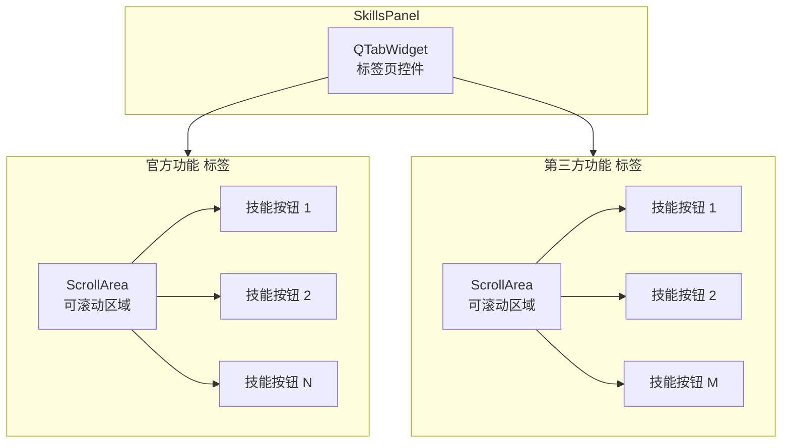

# 技能面板

> SkillsPanel 的结构和功能

---

## 1. 概述

`SkillsPanel` 是应用程序的技能面板组件，提供类似工具栏的插件快捷访问方式。

**文件位置**: `ui/skills_panel/panel.py`

---

## 2. 面板结构



**标签页结构**:
- **官方功能**: 来自 `plugin/` 目录的官方插件
- **第三方功能**: 来自 `custom_plugin/` 目录的第三方插件

---

## 3. 核心组件

### 3.1 SkillButton

每个技能按钮代表一个插件，包含：
- **图标**: 从插件的 `information.py` 加载
- **名称**: 插件的 `plugin_name` 属性
- **描述**: 插件的 `skill_description` 属性
- **提示**: 鼠标悬停时显示的名称和描述

**文本自动处理**:
- 允许插件设计者自行决定换行位置（使用 `\n`）
- 如果文本不含 `\n` 且长度超过 5 个字符，自动在中点处换行（midpoint split）
- 每行最多 5 个字符，超出部分末尾自动添加省略号（...）
- 最多显示 2 行
- 避免按钮因文本过长而破坏布局

### 3.2 按钮状态

| 状态 | 说明 |
|------|------|
| 正常 | 默认显示 |
| 悬停 | 鼠标悬停时高亮（背景变亮、边框显现） |
| 选中/活跃 | 当前正在使用的插件（accent 色边框高亮） |

---

## 4. 信号

### skill_clicked

```python
skill_clicked = Signal(object)
```

当用户点击技能按钮时发出。

**参数**:
- `plugin`: 被点击的插件实例 (IPlugin)

---

## 5. 核心方法

### 5.1 设置插件管理器

```python
def set_plugin_manager(self, plugin_manager):
    """
    设置插件管理器

    Args:
        plugin_manager: PluginManager 实例
    """
    self.plugin_manager = plugin_manager
```

### 5.2 加载技能

```python
def load_skills_from_manager(self):
    """从 PluginManager 加载技能按钮"""
    if self.plugin_manager is None:
        return

    # 清空现有按钮
    self._clear_layout(self.official_layout)
    self._clear_layout(self.thirdparty_layout)

    # 清除激活状态
    self._active_button = None

    # 加载官方技能
    official_plugins = self.plugin_manager.get_official_plugins()
    for plugin in official_plugins:
        self.add_skill_button(plugin, is_official=True)

    # 加载第三方技能
    thirdparty_plugins = self.plugin_manager.get_thirdparty_plugins()
    for plugin in thirdparty_plugins:
        self.add_skill_button(plugin, is_official=False)
```

### 5.3 添加技能

```python
def add_skill_button(self, plugin, is_official: bool):
    """
    添加技能按钮到指定标签页

    Args:
        plugin: 插件实例
        is_official: 是否为官方插件（True = 官方功能标签，False = 第三方功能标签）
    """
    # 获取插件图标和描述
    try:
        icon = getattr(plugin, 'skill_icon', None)
        if icon is None or (isinstance(icon, QIcon) and icon.isNull()):
            style = self.style()
            icon = style.standardIcon(QStyle.StandardPixmap.SP_FileIcon)
        name = plugin.plugin_name
        description = getattr(plugin, 'skill_description', name)
    except Exception:
        return

    # 创建技能按钮
    skill_btn = SkillButton(icon, name, description, self)
    skill_btn.clicked.connect(lambda checked=False, btn=skill_btn, p=plugin: self._on_skill_clicked(btn, p))

    # 添加到相应布局
    if is_official:
        self.official_layout.addWidget(skill_btn)
    else:
        self.thirdparty_layout.addWidget(skill_btn)
```

### 5.4 刷新技能

```python
def refresh_skills(self):
    """刷新技能列表"""
    if self.plugin_manager:
        self.plugin_manager.reload_plugins()
        self.load_skills_from_manager()
```

### 5.5 清除高亮

```python
def clear_active_state(self):
    """
    公共方法：清除所有按钮的激活状态
    用于当工作区被清空时，取消所有按钮的高亮
    """
    self._clear_all_active_states()

def _clear_all_active_states(self):
    """内部方法：清除所有按钮的激活状态"""
    for layout in [self.official_layout, self.thirdparty_layout]:
        for i in range(layout.count()):
            item = layout.itemAt(i)
            if item:
                widget = item.widget()
                if isinstance(widget, SkillButton):
                    widget.set_active(False)
    self._active_button = None
```

---

## 6. 使用示例

### 6.1 在主窗口中使用

```python
from ui.skills_panel.panel import SkillsPanel
from core.plugin.manager import PluginManager

# 创建技能面板（传入容器，而非 central_widget）
self.skills_panel = SkillsPanel(self._container)

# 设置插件管理器
self.plugin_manager = PluginManager()
self.plugin_manager.load_plugins()
self.plugin_manager.apply_custom_order()  # 应用自定义顺序
self.skills_panel.set_plugin_manager(self.plugin_manager)

# 加载技能
self.skills_panel.load_skills_from_manager()

# 连接信号
self.skills_panel.skill_clicked.connect(self._on_skill_clicked)
```

### 6.2 处理技能点击

```python
def _on_skill_clicked(self, plugin):
    """处理技能按钮点击"""
    # 清除工作区（不清除按钮高亮）
    self.work_area.clear_keep_highlight()

    # 获取并显示插件 Widget
    plugin_widget = plugin.get_widget(parent=self.work_area.get_widget())
    if plugin_widget:
        self.work_area.add_widget(plugin_widget)
    else:
        # 如果插件 widget 创建失败，显示错误信息
        error_label = QLabel(f"无法加载插件：{plugin.plugin_name}")
        error_label.setAlignment(Qt.AlignmentFlag.AlignCenter)
        error_label.setProperty("error", "true")
        error_label.style().unpolish(error_label)
        error_label.style().polish(error_label)
        self.work_area.add_widget(error_label)
```

---

## 7. 技能按钮外观

### 7.1 按钮结构

```
┌────────────────────┐
│                    │
│       [图标]       │  <- 28x28（固定）
│                    │
│   插件名称         │  <- 可换行
│                    │
└────────────────────┘
```

### 7.2 悬停提示

鼠标悬停时显示：
```
插件名称
技能描述
```

---

## 8. 深色模式支持

SkillsPanel 完全支持深色模式，通过 StyleQSS 的颜色变量自动适配主题。

### 8.1 颜色变量

SkillsPanel 使用以下颜色变量：

| 颜色变量 | 浅色主题 | 深色主题 | 用途 |
|---------|---------|---------|------|
| `skillPanel` | `#F5F5F5` | `#454545` | 面板背景 |
| `skillPanelTab` | `#E8E8E8` | `#6A6A6A` | Tab 背景 |
| `windowText` | `#000000` | `#FFFFFF` | 文字颜色 |
| `accent` | `#0078D4` | `#0078D4` | 选中边框 |
| `controlFillHover` | `rgba(0,0,0,12)` | `rgba(255,255,255,12)` | 悬停效果 |

### 8.2 色彩层次

SkillsPanel 与工作区保持色彩层次区分：

**浅色模式：**
- SkillsPanel: `#F5F5F5`（浅灰）
- WorkArea: `#FFFFFF`（白色）

**深色模式：**
- SkillsPanel: `#454545`（深灰）
- WorkArea: `#202020`（深灰）

### 8.3 样式文件

SkillsPanel 的样式定义在 `utils/style_qss/styles/custom.qss`：

```css
/* SkillsPanel 容器 */
SkillsPanel {
    background-color: {skillPanel};
    border-bottom: 1px solid {borderLight};
}

/* Tab 样式 */
SkillsPanel QTabBar::tab {
    background: {skillPanelTab};
    color: {windowText};
}
SkillsPanel QTabBar::tab:selected {
    background: {skillPanel};
    border-bottom: 2px solid {accent};
}

/* 技能按钮 */
SkillButton {
    color: {windowText};
}
SkillButton:hover {
    background-color: {controlFillHover};
    border: 1px solid {borderLight};
}
SkillButton:pressed {
    background-color: {controlFillPressed};
    border: 1px solid {border};
}
SkillButton[active="true"] {
    border: 2px solid {accent};
    border-radius: 6px;
    padding: 2px;
    background-color: {controlFillSelected};
    color: {accent};
    text-align: top;
    font-weight: 500;
    font-size: 10px;
}
```

---

## 9. 相关文档

- [主窗口](main-window.md)
- [工作区](work-area.md)
- [IPlugin 接口](../core/plugin-system/iplugin.md)

---

*本文档由 Claude Code 自动生成*
