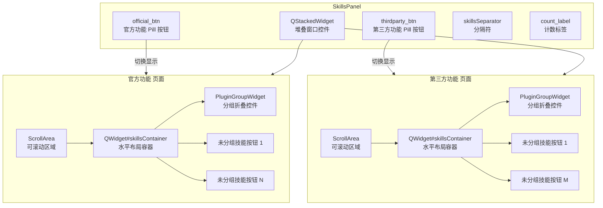

# 技能面板

> SkillsPanel 的结构和功能

---

## 1. 概述

`SkillsPanel` 是应用程序的技能面板组件，提供类似工具栏的插件快捷访问方式。

**文件位置**: `ui/skills_panel/panel.py`

---

## 2. 面板结构



> **注意**: 标签切换使用自定义 Pill 按钮（非 `QTabWidget` 的 `QTabBar`），通过 `QStackedWidget.setCurrentIndex()` 控制显示页面。

**标签页结构**:
- **官方功能**: 来自 `plugin/` 目录的官方插件
- **第三方功能**: 来自 `custom_plugin/` 目录的第三方插件

**插件分组**:
- 每个标签页内，分组折叠控件（`PluginGroupWidget`，文件夹形式收起、点击展开组内插件按钮）与未分组插件的技能按钮按统一顺序混排（见 `load_skills_from_manager()`）
- 头部区域包含 Pill 切换按钮、分隔符（`skillsSeparator`）与计数标签（`count_label`），计数按插件数量统计（分组不作为独立项计数），由 `_switch_tab()` 更新

---

## 3. 核心组件

### 3.1 SkillButton

每个技能按钮代表一个插件，包含：
- **图标**: 通过 `IPlugin.skill_icon` 属性动态加载（从插件的 `information.py` 读取，带文件 mtime 缓存）
- **名称**: `IPlugin.plugin_name` 属性
- **描述**: 通过 `IPlugin.skill_description` 属性动态加载（从 `information.py` 读取，失败时回退为插件名称）
- **提示**: 鼠标悬停时显示的名称和描述（格式为 `plugin_name\nskill_description`）

**文本自动处理**:
- 允许插件设计者自行决定换行位置（使用 `\n`）
- 文本不含 `\n`（单行模式）：长度大于 13 个字符时直接截断为前 13 个字符并追加省略号（`...`），不自动换行
- 文本含 `\n`（双行模式）：按换行符分割，最多取前 2 行；每行超过 8 个字符时截断为前 8 个字符并追加省略号（`...`）
- 最多显示 2 行
- 避免按钮因文本过长而破坏布局

### 3.2 按钮状态

| 状态 | 说明 |
|------|------|
| 正常 | 默认透明背景，无边框，`T("color.text.primary")` 文字颜色 |
| 悬停 | 背景变为 `T("color.primary.subtle")`，无边框 |
| 按下 | 背景变为 `T("color.border")`，无边框 |
| 选中/活跃 | 渐变背景 `qlineargradient`（左侧 4% 为 `T("color.primary")`，其余为 `T("color.primary.subtle")`），无边框，`T("color.primary")` 文字颜色，`font-weight: 500` |

---

## 4. 信号

### skill_clicked

```python
skill_clicked = Signal(object)
```

当用户点击技能按钮时发出。

**参数**:
- `plugin`: 被点击的插件实例 (IPlugin)

---

## 5. 核心方法

### 5.1 设置插件管理器

```python
def set_plugin_manager(self, plugin_manager):
    """
    设置插件管理器

    Args:
        plugin_manager: PluginManager 实例
    """
    self.plugin_manager = plugin_manager
```

### 5.2 加载技能

```python
def load_skills_from_manager(self):
    """从插件管理器加载所有技能（按 get_sorted_plugins 返回的统一顺序混排分组与未分组插件）"""
    if self.plugin_manager is None:
        return

    try:
        # 清空现有按钮
        self._clear_layout(self.official_layout)
        self._clear_layout(self.thirdparty_layout)

        # 清除激活状态（重要：因为旧按钮已被删除）
        self._active_button = None

        # 按 scope 渲染：分组控件 + 未分组插件按钮
        for scope, layout in (("official", self.official_layout),
                              ("thirdparty", self.thirdparty_layout)):
            for item in self.plugin_manager.get_sorted_plugins(scope):
                if item[0] == "group":
                    self._add_group_widget(layout, item[1], item[2])
                else:
                    skill_btn = self._create_skill_button(item[1])
                    if skill_btn is not None:
                        layout.addWidget(skill_btn)

        # 更新当前标签页的计数
        self._switch_tab(self.stacked_widget.currentIndex())

    except Exception as e:
        self._logger.error(get_name(), f'从插件管理器加载技能失败: {e}')
```

> **说明**: 按 scope 遍历 `plugin_manager.get_sorted_plugins(scope)` 的返回项：`"group"` 项渲染为分组折叠控件（`_add_group_widget()` 创建 `PluginGroupWidget`），其余项渲染为未分组插件的技能按钮，两者按统一顺序混排；末尾调用 `_switch_tab()` 刷新计数标签。

### 5.3 添加技能

```python
def add_skill_button(self, plugin, is_official: bool):
    """
    添加一个技能按钮到相应的标签页

    Args:
        plugin: 插件对象
        is_official: 是否为官方插件
    """
    skill_btn = self._create_skill_button(plugin)
    if skill_btn is None:
        return

    # 添加到相应的布局
    if is_official:
        self.official_layout.addWidget(skill_btn)
    else:
        self.thirdparty_layout.addWidget(skill_btn)
```

按钮的创建逻辑已抽取为 `_create_skill_button(plugin)` 工厂方法，供未分组插件按钮与分组控件（`PluginGroupWidget`）共用，保证按钮外观与激活逻辑一致：

```python
def _create_skill_button(self, plugin):
    """创建并连接一个技能按钮（获取插件信息失败时返回 None）"""
    # 获取插件图标和描述
    try:
        icon = getattr(plugin, 'skill_icon', None)
        if icon is None or (isinstance(icon, QIcon) and icon.isNull()):
            # 使用默认图标
            style = self.style()
            icon = style.standardIcon(QStyle.StandardPixmap.SP_FileIcon)

        name = plugin.plugin_name
        description = getattr(plugin, 'skill_description', name)
    except Exception as e:
        self._logger.error(get_name(), f'获取插件信息失败: {e}')
        return None

    # 创建技能按钮并绑定点击事件
    skill_btn = SkillButton(icon, name, description, self)
    skill_btn.clicked.connect(lambda checked=False, btn=skill_btn, p=plugin: self._on_skill_clicked(btn, p))
    return skill_btn
```

> **说明**: `add_skill_button()` 只负责调用工厂并加入布局；`_add_group_widget()` 创建 `PluginGroupWidget` 时，将 `_create_skill_button` 作为 `button_factory` 参数传入（签名为 `callable(plugin) -> Optional[QWidget]`，见 `ui/skills_panel/plugin_group_widget.py`），组内插件按钮由该工厂创建。

### 5.4 刷新技能

```python
def refresh_skills(self):
    """刷新技能列表"""
    if self.plugin_manager:
        self.plugin_manager.reload_plugins()
        self.load_skills_from_manager()
```

### 5.5 清除高亮

```python
def clear_active_state(self):
    """
    公共方法：清除所有按钮的激活状态
    用于当工作区被清空时，取消所有按钮的高亮
    """
    self._clear_all_active_states()

def _clear_all_active_states(self):
    """内部方法：清除所有按钮的激活状态"""
    for layout in [self.official_layout, self.thirdparty_layout]:
        for i in range(layout.count()):
            item = layout.itemAt(i)
            if item:
                widget = item.widget()
                if isinstance(widget, SkillButton):
                    widget.set_active(False)

    self._active_button = None
```

---

## 6. 使用示例

### 6.1 在主窗口中使用

```python
from ui.skills_panel.panel import SkillsPanel
from core.plugin.manager import PluginManager

# 创建技能面板（传入容器，而非 central_widget）
self.skills_panel = SkillsPanel(self._container)

# 设置插件管理器
self.plugin_manager = PluginManager()
self.plugin_manager.load_plugins()
self.plugin_manager.apply_custom_order()  # 应用自定义顺序
self.skills_panel.set_plugin_manager(self.plugin_manager)

# 加载技能
self.skills_panel.load_skills_from_manager()

# 设置清除高亮的回调
self.work_area.set_clear_highlight_callback(
    self.skills_panel.clear_active_state
)

# 连接信号
self.skills_panel.skill_clicked.connect(self._on_skill_clicked)
```

### 6.2 处理技能点击

```python
def _on_skill_clicked(self, plugin):
    """处理技能按钮点击"""
    # 清除工作区（不清除按钮高亮）
    self.work_area.clear_keep_highlight()

    # 获取并显示插件 Widget
    plugin_widget = plugin.get_widget(parent=self.work_area.get_widget())
    if plugin_widget:
        self.work_area.add_widget(plugin_widget)
    else:
        # 如果插件 widget 创建失败，显示错误信息
        error_label = QLabel(f"无法加载插件：{plugin.plugin_name}")
        error_label.setAlignment(Qt.AlignmentFlag.AlignCenter)
        error_label.setProperty("error", "true")
        error_label.style().unpolish(error_label)
        error_label.style().polish(error_label)
        self.work_area.add_widget(error_label)
```

---

## 7. 技能按钮外观

### 7.1 按钮结构

```
┌────────────────────┐
│                    │
│       [图标]       │  <- 28x28（固定）
│                    │
│   插件名称         │  <- 可换行
│                    │
└────────────────────┘
```

### 7.2 悬停提示

鼠标悬停时显示：
```
插件名称
技能描述
```

---

## 8. 深色模式支持

SkillsPanel 完全支持深色模式。面板本身不做 UI 迁移，属于全局主题的「排除区」：样式由 `ui/uikit_theme.py` 的兼容附录（`_compat_skills_panel_qss()`）提供，颜色全部实时取 UIKit 设计令牌 `T()`，随主题切换自动适配（详见 [UIKit 主题系统](../utils/uikit-theme.md)）。

### 8.1 颜色令牌

SkillsPanel 使用的 UIKit 令牌：

| UIKit 令牌 | 用途 |
|-----------|------|
| `color.bg.subtle` | 面板 / 头部 / 滚动区 / 技能按钮容器背景 |
| `color.bg.muted` | Pill 按钮容器背景、Pill 按钮悬停背景 |
| `color.border` | 面板底部分隔线、分隔符颜色、技能按钮按下背景 |
| `color.text.primary` | 技能按钮文字 |
| `color.text.secondary` | Pill 按钮未激活文字、计数标签 |
| `color.text.tertiary` | 滚动条手柄悬停 |
| `color.border.strong` | 滚动条手柄（正常态） |
| `color.primary` | 激活/选中强调色（Pill 激活背景、激活按钮渐变左色与文字） |
| `color.on.primary` | 激活 Pill 按钮文字 |
| `color.primary.hover` | 激活 Pill 按钮悬停背景 |
| `color.primary.subtle` | 技能按钮悬停背景、激活按钮渐变主色 |

### 8.2 色彩层次

SkillsPanel 与工作区保持色彩层次区分：SkillsPanel 取 `color.bg.subtle`（弱化背景），WorkArea 所在工作区窗口底色为 `color.bg.base`（基底背景），亮/暗两套令牌由 UIKit 统一提供。

### 8.3 样式定义

SkillsPanel 和 SkillButton 的样式定义在 `ui/uikit_theme.py` 的排除区兼容附录（`_compat_skills_panel_qss()`，结构沿用旧 custom.qss，颜色取 UIKit 令牌）：

```css
/* SkillsPanel 容器 */
SkillsPanel {
    background-color: {T("color.bg.subtle")};
    border-bottom: 1px solid {T("color.border")};
}

/* SkillsPanel 头部区域 */
SkillsPanel QWidget#skillsPanelHeader {
    background-color: {T("color.bg.subtle")};
}

/* Pill 按钮容器 */
SkillsPanel QWidget#skillsPillContainer {
    background-color: {T("color.bg.muted")};
    border-radius: 12px;
}

/* Pill 按钮（官方功能 / 第三方功能 切换） */
SkillsPanel QPushButton#skillsPillButton {
    background-color: transparent;
    color: {T("color.text.secondary")};
    border: none;
    border-radius: 9px;
    padding: 2px 12px;
    min-height: 18px;
    max-height: 18px;
    font-size: 12px;
    font-weight: 500;
}
SkillsPanel QPushButton#skillsPillButton:hover {
    background-color: {T("color.bg.muted")};
}
SkillsPanel QPushButton#skillsPillButton[active="true"] {
    background-color: {T("color.primary")};
    color: {T("color.on.primary")};
}
SkillsPanel QPushButton#skillsPillButton[active="true"]:hover {
    background-color: {T("color.primary.hover")};
}

/* 分隔线与计数标签 */
SkillsPanel QLabel#skillsSeparator {
    color: {T("color.border")};
    font-size: 12px;
    background: transparent;
}
SkillsPanel QLabel#skillsCountLabel {
    color: {T("color.text.secondary")};
    font-size: 11px;
    background: transparent;
}

/* 滚动区域样式 */
SkillsPanel QScrollArea {
    border: none;
    background: {T("color.bg.subtle")};
}

/* 横向滚动条 */
SkillsPanel QScrollBar:horizontal {
    height: 8px;
    background: transparent;
    margin: 0px;
}
SkillsPanel QScrollBar::handle:horizontal {
    background: {T("color.border.strong")};
    border-radius: 4px;
    min-width: 30px;
}
SkillsPanel QScrollBar::handle:horizontal:hover {
    background: {T("color.text.tertiary")};
}
SkillsPanel QScrollBar::add-line:horizontal,
SkillsPanel QScrollBar::sub-line:horizontal {
    width: 0px;
    background: none;
}
SkillsPanel QScrollBar::add-page:horizontal,
SkillsPanel QScrollBar::sub-page:horizontal {
    background: none;
}

/* 技能按钮容器 */
SkillsPanel QWidget#skillsContainer {
    background-color: {T("color.bg.subtle")};
}

/* 非激活状态的技能按钮 */
SkillButton {
    border: none;
    border-radius: 8px;
    padding: 2px;
    background-color: transparent;
    color: {T("color.text.primary")};
    text-align: top;
    font-size: 10px;
}
SkillButton:hover {
    background-color: {T("color.primary.subtle")};
    border: none;
}
SkillButton:pressed {
    background-color: {T("color.border")};
    border: none;
}

/* 激活状态的技能按钮（通过 setProperty("active", "true") 触发） */
SkillButton[active="true"] {
    background: qlineargradient(x1:0, y1:0, x2:1, y2:0,
        stop:0 {T("color.primary")}, stop:0.04 {T("color.primary")},
        stop:0.04 {T("color.primary.subtle")}, stop:1 {T("color.primary.subtle")});
    border: none;
    border-radius: 8px;
    color: {T("color.primary")};
    text-align: top;
    font-weight: 500;
    font-size: 10px;
    padding: 2px;
}
SkillButton[active="true"]:hover {
    background: qlineargradient(x1:0, y1:0, x2:1, y2:0,
        stop:0 {T("color.primary")}, stop:0.04 {T("color.primary")},
        stop:0.04 {T("color.primary.subtle")}, stop:1 {T("color.primary.subtle")});
    border: none;
    padding: 2px;
}

/* 分组按钮展开态（通过 PluginGroupWidget setProperty("expanded", "true") 触发，见 plugin_group_widget.py） */
SkillButton#skillGroupButton[expanded="true"] {
    background: qlineargradient(x1:1, y1:0, x2:0, y2:0,
        stop:0 {T("color.primary")}, stop:0.04 {T("color.primary")},
        stop:0.04 {T("color.primary.subtle")}, stop:1 {T("color.primary.subtle")});
    border: none;
    border-radius: 8px;
    color: {T("color.primary")};
    text-align: top;
    font-weight: 500;
    font-size: 10px;
    padding: 2px;
}
SkillButton#skillGroupButton[expanded="true"]:hover {
    background: qlineargradient(x1:1, y1:0, x2:0, y2:0,
        stop:0 {T("color.primary")}, stop:0.04 {T("color.primary")},
        stop:0.04 {T("color.primary.subtle")}, stop:1 {T("color.primary.subtle")});
    border: none;
    padding: 2px;
}
```

---

## 9. 相关文档

- [主窗口](main-window.md)
- [工作区](work-area.md)
- [IPlugin 接口](../core/plugin-system/iplugin.md)
