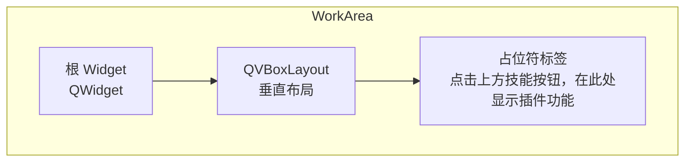
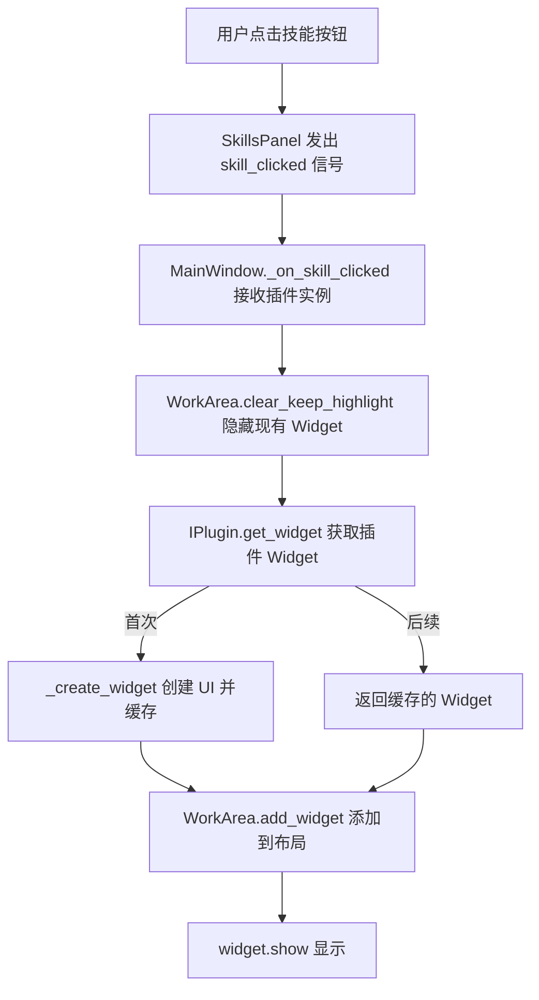

# 工作区

> WorkArea 的结构和功能

---

## 1. 概述

`WorkArea` 是应用程序的工作区组件，负责显示和管理插件的 Widget。

**文件位置**: `ui/work_area/work_area.py`

---

## 2. 工作区结构



> **注意**：WorkArea 使用 `QVBoxLayout` 而非 `QStackedLayout`。它维护一个占位符标签，当用户切换插件时，占位符被替换为插件的 Widget；切换回来时 Widget 被隐藏而非销毁，以保留 UI 状态。

---

## 3. 核心概念

### 3.1 垂直布局

WorkArea 使用 `QVBoxLayout`，通过以下方式管理多个 Widget：

- 使用 `add_widget()` 将 Widget 添加到布局（显示该 Widget）
- 使用 `clear()` 或 `clear_keep_highlight()` 移除 Widget
- `clear()` 移除并销毁（`deleteLater()`）所有 Widget，同时可选触发按钮高亮清除回调；不自动显示占位符
- `clear_keep_highlight()` 仅隐藏（`hide()`）Widget 而不销毁，保留实例以供 IPlugin 缓存复用，切换插件时使用此方法

### 3.2 Widget 管理

- 添加 Widget 到工作区
- 移除 Widget（可选，保留实例）
- 清除所有 Widget

---

## 4. 核心方法

### 4.1 获取根 Widget

```python
def get_widget(self) -> QWidget:
    """
    获取工作区的根 Widget

    Returns:
        QWidget: 工作区的根部件
    """
```

### 4.2 添加 Widget

```python
def add_widget(self, widget: QWidget):
    """
    添加 Widget 到工作区

    注意：此方法不负责清空现有 Widget。清空由 clear_keep_highlight() 单独负责，
    由调用方在 add_widget 之前显式调用。

    Args:
        widget: 要添加的 QWidget
    """
    # 添加新 Widget 并显示
    self.work_layout.addWidget(widget)
    widget.show()
```

### 4.3 清除工作区

```python
def clear(self, clear_highlight: bool = True):
    """
    清除所有 Widget

    Args:
        clear_highlight: 是否同时清除按钮高亮状态，默认为 True。
                       设为 False 时仅清除 Widget，不触发高亮回调。
    """
    # 移除并销毁所有 Widget
    while self.work_layout.count() > 0:
        item = self.work_layout.takeAt(0)
        if item:
            widget = item.widget()
            if widget:
                widget.deleteLater()
        if item:
            del item

    # 如果需要清除高亮，调用回调（使用 hasattr 做防御性检查）
    if clear_highlight and hasattr(self, '_clear_highlight_callback'):
        self._clear_highlight_callback()
```

### 4.4 清除但保持高亮

```python
def clear_keep_highlight(self):
    """
    清除工作区但不清除按钮高亮状态

    内部实现：遍历布局，调用 hide() 隐藏而非 deleteLater() 销毁 Widget，
    保留实例以供 IPlugin 缓存复用。用于切换插件时保留技能按钮的选中状态。
    """
    while self.work_layout.count() > 0:
        item = self.work_layout.takeAt(0)
        if item:
            widget = item.widget()
            if widget:
                widget.hide()  # 隐藏而非销毁
            # 不调用 deleteLater()，保留 widget 实例以便缓存复用
        if item:
            del item
```

### 4.5 设置清除高亮回调

```python
def set_clear_highlight_callback(self, callback: Callable):
    """
    设置清除高亮的回调函数

    Args:
        callback: 回调函数
    """
    self._clear_highlight_callback = callback
```

---

## 5. 内部结构

```python
class WorkArea:
    def __init__(self, parent=None):
        # 创建根 Widget
        self.work_area = QWidget(parent)

        # 创建垂直布局
        self.work_layout = QVBoxLayout(self.work_area)
        self.work_layout.setContentsMargins(0, 0, 0, 0)

        # 占位符标签
        self.work_placeholder = QLabel("点击上方技能按钮，在此处显示插件功能")
        self.work_placeholder.setAlignment(Qt.AlignmentFlag.AlignCenter)
        self.work_placeholder.setProperty("placeholder", "true")
        self.work_placeholder.style().unpolish(self.work_placeholder)
        self.work_placeholder.style().polish(self.work_placeholder)
        self.work_layout.addWidget(self.work_placeholder)

        # 回调函数
        self._clear_highlight_callback = None
```

---

## 6. 使用示例

### 6.1 在主窗口中使用

```python
from ui.work_area.work_area import WorkArea

# 创建工作区
self.work_area = WorkArea(central_widget)
main_layout.addWidget(self.work_area.get_widget(), stretch=1)

# 设置清除高亮回调
self.work_area.set_clear_highlight_callback(
    self.skills_panel.clear_active_state
)
```

### 6.2 显示插件 Widget

```python
def _on_skill_clicked(self, plugin):
    """处理技能按钮点击"""
    # 清除现有内容（保持按钮高亮）
    self.work_area.clear_keep_highlight()

    # 获取插件 Widget
    plugin_widget = plugin.get_widget(parent=self.work_area.get_widget())

    # 添加到工作区
    self.work_area.add_widget(plugin_widget)
```

### 6.3 清除工作区

```python
# 清除所有内容（包括按钮高亮）
self.work_area.clear()

# 清除内容但保持按钮高亮
self.work_area.clear_keep_highlight()
```

---

## 7. 布局属性

| 属性 | 值 |
|------|------|
| 布局类型 | QVBoxLayout |
| 伸缩因子 | 1 (占用剩余空间) |
| 尺寸策略 | Expanding |
| 布局边距 | 0 (无内边距) |

---

## 8. 工作流程



> **说明**：`clear_keep_highlight` 调用 `hide()` 隐藏而非销毁 Widget，保留实例供 IPlugin 缓存复用。`_create_widget` / 缓存返回逻辑属于 `IPlugin.get_widget()` 的内部行为（在 `core/plugin/plugin_interface.py` 中）。

---

## 9. 相关文档

- [主窗口](main-window.md)
- [技能面板](skills-panel.md)
- [IPlugin 接口](../core/plugin-system/iplugin.md)

---

*本文档由 Claude Code 自动生成*
