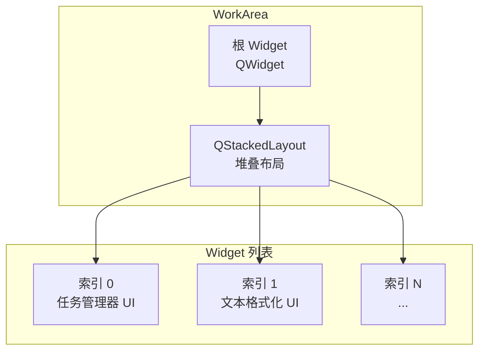
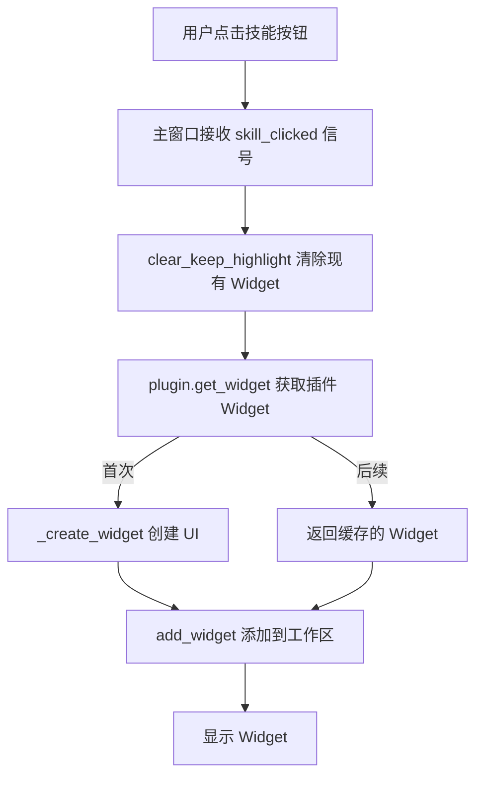

# 工作区

> WorkArea 的结构和功能

---

## 1. 概述

`WorkArea` 是应用程序的工作区组件，负责显示和管理插件的 Widget。

**文件位置**: `ui/work_area/work_area.py`

---

## 2. 工作区结构



---

## 3. 核心概念

### 3.1 堆叠布局

WorkArea 使用 `QStackedLayout`，允许：
- 多个 Widget 叠加在一起
- 每次只显示一个 Widget
- 快速切换显示内容

### 3.2 Widget 管理

- 添加 Widget 到工作区
- 移除 Widget（可选）
- 清除所有 Widget

---

## 4. 核心方法

### 4.1 获取根 Widget

```python
def get_widget(self) -> QWidget:
    """
    获取工作区的根 Widget

    Returns:
        QWidget: 工作区的根部件
    """
```

### 4.2 添加 Widget

```python
def add_widget(self, widget: QWidget):
    """
    添加 Widget 到工作区

    Args:
        widget: 要添加的 QWidget
    """
    # 添加到堆叠布局
    self.stack_layout.addWidget(widget)

    # 切换到新添加的 Widget
    self.stack_layout.setCurrentIndex(self.stack_layout.count() - 1)
```

### 4.3 清除工作区

```python
def clear(self):
    """
    清除所有 Widget
    """
    # 遍历并移除所有 Widget
    while self.stack_layout.count() > 0:
        widget = self.stack_layout.widget(0)
        self.stack_layout.removeWidget(widget)
        widget.deleteLater()
```

### 4.4 清除但保持高亮

```python
def clear_keep_highlight(self):
    """
    清除工作区但不清除按钮高亮状态

    用于切换插件时保留技能按钮的选中状态。
    """
    # 遍历并移除所有 Widget
    while self.stack_layout.count() > 0:
        widget = self.stack_layout.widget(0)
        self.stack_layout.removeWidget(widget)
        widget.deleteLater()
```

### 4.5 设置清除高亮回调

```python
def set_clear_highlight_callback(self, callback: Callable):
    """
    设置清除高亮的回调函数

    Args:
        callback: 回调函数
    """
    self.clear_highlight_callback = callback
```

---

## 5. 内部结构

```python
class WorkArea:
    def __init__(self, parent=None):
        # 创建根 Widget
        self._widget = QWidget(parent)

        # 创建堆叠布局
        self.stack_layout = QStackedLayout(self._widget)

        # 回调函数
        self.clear_highlight_callback = None
```

---

## 6. 使用示例

### 6.1 在主窗口中使用

```python
from ui.work_area.work_area import WorkArea

# 创建工作区
self.work_area = WorkArea(central_widget)
main_layout.addWidget(self.work_area.get_widget(), stretch=1)

# 设置清除高亮回调
self.work_area.set_clear_highlight_callback(
    self.skills_panel.clear_active_state
)
```

### 6.2 显示插件 Widget

```python
def _on_skill_clicked(self, plugin):
    """处理技能按钮点击"""
    # 清除现有内容（保持按钮高亮）
    self.work_area.clear_keep_highlight()

    # 获取插件 Widget
    plugin_widget = plugin.get_widget(parent=self.work_area.get_widget())

    # 添加到工作区
    self.work_area.add_widget(plugin_widget)
```

### 6.3 清除工作区

```python
# 清除所有内容（包括按钮高亮）
self.work_area.clear()

# 清除内容但保持按钮高亮
self.work_area.clear_keep_highlight()
```

---

## 7. 布局属性

| 属性 | 值 |
|------|------|
| 布局类型 | QStackedLayout |
| 伸缩因子 | 1 (占用剩余空间) |
| 尺寸策略 | Expanding |

---

## 8. 工作流程



---

## 9. 相关文档

- [主窗口](main-window.md)
- [技能面板](skills-panel.md)
- [IPlugin 接口](../core/plugin-system/iplugin.md)

---

*本文档由 Claude Code 自动生成*
