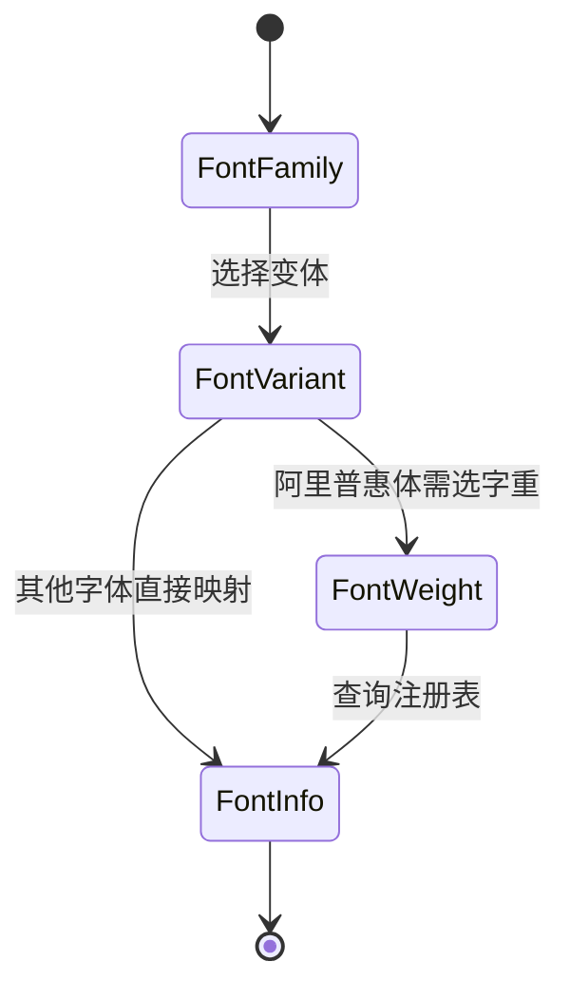
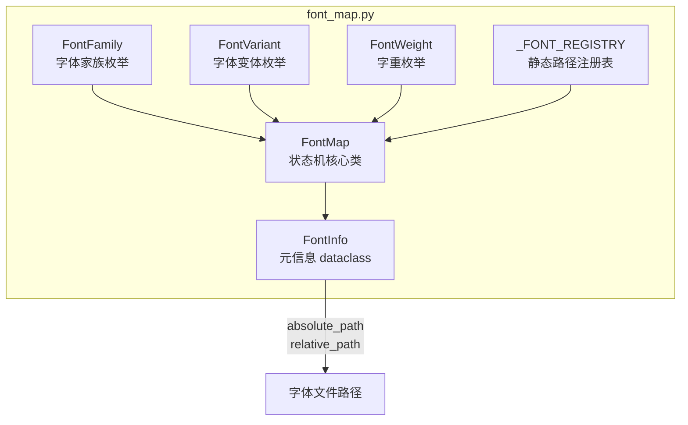

# FontMap 字体映射模块

> FontMap 字体路径状态机映射模块的架构设计和核心概念

---

## 1. 概述

`FontMap` 是 InstructionX 项目的字体路径映射模块，以**枚举状态机**方式管理 `font/` 目录下的所有字体文件路径，避免硬编码字符串路径。

**文件位置**: `utils/font_map.py`

**核心功能**:
- 枚举状态机路径查询（FontFamily × FontVariant × FontWeight）
- 项目根目录自动检测，路径与机器无关
- 字体文件存在性验证
- 支持阿里巴巴普惠体多字重变体家族

**支持字体**: 4 个字体家族，22 个字体文件

| 字体家族 | 变体数 | 文件类型 |
|---------|--------|---------|
| AlimamaFangYuanTiVF（阿里妈妈方圆体） | 1 | .ttf |
| ZenDots | 1 | .otf |
| SmileySans（得意黑） | 1 | .otf |
| AlimamaDongFangDaKai（阿里妈妈东方大楷） | 1 | .otf |
| AlibabaPuHuiTi-3（阿里巴巴普惠体 3.0） | 19 | .otf |

---

## 2. 核心组件

### 2.1 模块结构

```
utils/font_map.py
├── FontFamily    枚举 — 字体家族
├── FontVariant   枚举 — 字体变体（Regular, Italic, Oblique 等）
├── FontWeight    枚举 — 阿里普惠体字重（Thin=35 ~ Black=115）
├── FontInfo      dataclass — 字体元信息
└── FontMap       类 — 状态机核心查询接口
```

### 2.2 FontFamily

字体家族枚举。

```python
from utils.font_map import FontFamily

FontFamily.ALIMAMA_FANGYUANTI_VF   # 阿里妈妈方圆体 VF
FontFamily.ZEN_DOTS                # ZenDots
FontFamily.SMILEY_SANS             # 得意黑
FontFamily.ALIMAMA_DONGFANG_DAKAI  # 阿里妈妈东方大楷
FontFamily.ALIBABA_PUHUITI_3       # 阿里巴巴普惠体 3.0
```

### 2.3 FontVariant

字体变体枚举，涵盖所有支持的变体类型。

```python
from utils.font_map import FontVariant

# 基础字重
FontVariant.THIN          # 细体
FontVariant.LIGHT         # 细体
FontVariant.REGULAR        # 常规
FontVariant.MEDIUM        # 中等
FontVariant.SEMI_BOLD     # 半粗体
FontVariant.BOLD          # 粗体
FontVariant.EXTRA_BOLD    # 特粗体
FontVariant.HEAVY         # 重体
FontVariant.BLACK         # 黑体

# 斜体变体
FontVariant.OBLIQUE       # 斜体（SmileySans）
FontVariant.LIGHT_ITALIC  # 细体意大利体
FontVariant.ITALIC        # 意大利体
FontVariant.MEDIUM_ITALIC # 中等意大利体
FontVariant.BOLD_ITALIC   # 粗体意大利体
FontVariant.HEAVY_ITALIC  # 重体意大利体
```

### 2.4 FontWeight

阿里巴巴普惠体字重数值枚举（对应文件名中的数字后缀）。其他字体家族通过 `FontVariant` 区分字重，不使用此枚举。

```python
from utils.font_map import FontWeight

FontWeight.THIN       # 35
FontWeight.LIGHT     # 45
FontWeight.REGULAR    # 55
FontWeight.MEDIUM     # 65
FontWeight.SEMI_BOLD  # 75
FontWeight.BOLD       # 85
FontWeight.EXTRA_BOLD # 95
FontWeight.HEAVY      # 105
FontWeight.BLACK      # 115
```

### 2.5 FontInfo

字体元信息数据类（`frozen=True`, `slots=True`）。

```python
from utils.font_map import FontInfo

# FontInfo 字段
info.family          # FontFamily 枚举
info.variant         # FontVariant 枚举
info.weight          # int | None（仅阿里普惠体有效）
info.relative_path   # str，相对于项目根目录的路径
info.absolute_path   # str，绝对路径
info.font_family_name # str，字体家族显示名称
info.font_style_name # str，Qt 样式名（Family Style）
```

### 2.6 FontMap

字体路径状态机核心类，提供类方法查询字体路径。

```python
from utils.font_map import FontMap, FontFamily, FontVariant

# 获取字体文件的绝对路径
path = FontMap.get_path(FontFamily.ZEN_DOTS, FontVariant.REGULAR)

# 获取 FontInfo 元信息
info = FontMap.get(FontFamily.SMILEY_SANS, FontVariant.OBLIQUE)

# 获取相对于项目根目录的路径
rel = FontMap.get_relative_path(FontFamily.ALIMAMA_DONGFANG_DAKAI, FontVariant.REGULAR)

# 检查文件是否存在
exists = FontMap.exists(FontFamily.ALIMAMA_FANGYUANTI_VF, FontVariant.THIN)

# 获取所有注册字体
all_fonts = FontMap.all_fonts()
```

---

## 3. 架构图

### 3.1 状态机模型



### 3.2 模块内部结构



---

## 4. API 参考

### 4.1 FontMap.get()

根据字体家族、变体、字重获取 `FontInfo`。

| 参数 | 类型 | 说明 |
|------|------|------|
| `family` | `FontFamily` | 字体家族枚举，必填 |
| `variant` | `FontVariant` | 字体变体枚举，必填 |
| `weight` | `int \| None` | 字重数值，仅阿里普惠体系列需要 |

```python
from utils.font_map import FontMap, FontFamily, FontVariant

info = FontMap.get(FontFamily.SMILEY_SANS, FontVariant.OBLIQUE)
if info:
    print(info.absolute_path)
    print(info.font_style_name)
```

### 4.2 FontMap.get_path()

获取字体文件的绝对路径字符串，是 `get()` 的便捷包装。

```python
path = FontMap.get_path(FontFamily.ZEN_DOTS, FontVariant.REGULAR)
# -> C:\Users\...\InstructionX\font\ZenDots\ZenDots-Regular.otf
```

### 4.3 FontMap.get_relative_path()

获取字体文件相对于项目根目录的路径字符串。

```python
rel = FontMap.get_relative_path(FontFamily.ALIMAMA_FANGYUANTI_VF, FontVariant.THIN)
# -> font/AlimamaFangYuanTiVF/AlimamaFangYuanTiVF-Thin.ttf
```

### 4.4 FontMap.all_fonts()

返回注册表中所有字体的 `FontInfo` 列表。

```python
fonts = FontMap.all_fonts()
print(f"共 {len(fonts)} 个字体注册条目")
```

### 4.5 FontMap.exists()

检查指定的字体文件在文件系统中是否存在。

```python
exists = FontMap.exists(FontFamily.ALIMAMA_FANGYUANTI_VF, FontVariant.THIN)
# -> True
```

### 4.6 FontMap.project_root() / font_dir()

返回目录的 `Path` 对象。

```python
print(FontMap.project_root())  # 项目根目录
print(FontMap.font_dir())     # font/ 目录
```

---

## 5. 注册字体清单

### 5.1 AlimamaFangYuanTiVF（阿里妈妈方圆体 VF）

| Variant | 路径 |
|---------|------|
| THIN | `font/AlimamaFangYuanTiVF/AlimamaFangYuanTiVF-Thin.ttf` |

### 5.2 ZenDots

| Variant | 路径 |
|---------|------|
| REGULAR | `font/ZenDots/ZenDots-Regular.otf` |

### 5.3 SmileySans（得意黑）

| Variant | 路径 |
|---------|------|
| OBLIQUE | `font/SmileySans/SmileySans-Oblique.otf` |

### 5.4 AlimamaDongFangDaKai（阿里妈妈东方大楷）

| Variant | 路径 |
|---------|------|
| REGULAR | `font/AlimamaDongFangDaKai/AlimamaDongFangDaKai-Regular.otf` |

### 5.5 AlibabaPuHuiTi-3（阿里巴巴普惠体 3.0）

#### 9 字重标准集

| Variant | Weight | 路径 |
|---------|--------|------|
| THIN | 35 | `font/AlibabaPuHuiTiv3/AlibabaPuHuiTi-3-35-Thin.otf` |
| LIGHT | 45 | `font/AlibabaPuHuiTiv3/AlibabaPuHuiTi-3-45-Light.otf` |
| REGULAR | 55 | `font/AlibabaPuHuiTiv3/AlibabaPuHuiTi-3-55-Regular.otf` |
| MEDIUM | 65 | `font/AlibabaPuHuiTiv3/AlibabaPuHuiTi-3-65-Medium.otf` |
| SEMI_BOLD | 75 | `font/AlibabaPuHuiTiv3/AlibabaPuHuiTi-3-75-SemiBold.otf` |
| BOLD | 85 | `font/AlibabaPuHuiTiv3/AlibabaPuHuiTi-3-85-Bold.otf` |
| EXTRA_BOLD | 95 | `font/AlibabaPuHuiTiv3/AlibabaPuHuiTi-3-95-ExtraBold.otf` |
| HEAVY | 105 | `font/AlibabaPuHuiTiv3/AlibabaPuHuiTi-3-105-Heavy.otf` |
| BLACK | 115 | `font/AlibabaPuHuiTiv3/AlibabaPuHuiTi-3-115-Black.otf` |

#### L3 字形变体

| Variant | 路径 |
|---------|------|
| REGULAR | `font/AlibabaPuHuiTiv3/AlibabaPuHuiTi-3-55-RegularL3.otf` |

#### AlibabaSans 意大利体系列

| Variant | 路径 |
|---------|------|
| LIGHT_ITALIC | `font/AlibabaPuHuiTiv3/AlibabaSans-LightItalic.otf` |
| ITALIC | `font/AlibabaPuHuiTiv3/AlibabaSans-Italic.otf` |
| MEDIUM_ITALIC | `font/AlibabaPuHuiTiv3/AlibabaSans-MediumItalic.otf` |
| BOLD_ITALIC | `font/AlibabaPuHuiTiv3/AlibabaSans-BoldItalic.otf` |
| HEAVY_ITALIC | `font/AlibabaPuHuiTiv3/AlibabaSans-HeavyItalic.otf` |

#### AlibabaSansJP 日文系列

| Variant | 路径 |
|---------|------|
| REGULAR | `font/AlibabaPuHuiTiv3/AlibabaSansJP-Regular.otf` |
| MEDIUM | `font/AlibabaPuHuiTiv3/AlibabaSansJP-Medium.otf` |
| BOLD | `font/AlibabaPuHuiTiv3/AlibabaSansJP-Bold.otf` |

---

## 6. 使用示例

### 6.1 基础路径查询

```python
from utils.font_map import FontMap, FontFamily, FontVariant, FontWeight

# 查询方圆体
path = FontMap.get_path(FontFamily.ALIMAMA_FANGYUANTI_VF, FontVariant.THIN)
print(path)
# -> .../InstructionX/font/AlimamaFangYuanTiVF/AlimamaFangYuanTiVF-Thin.ttf

# 查询普惠体粗体
path = FontMap.get_path(FontFamily.ALIBABA_PUHUITI_3, FontVariant.BOLD, 85)
print(path)
# -> .../InstructionX/font/AlibabaPuHuiTiv3/AlibabaPuHuiTi-3-85-Bold.otf
```

### 6.2 加载字体到 Qt 应用

```python
from PySide6.QtGui import QFontDatabase
from utils.font_map import FontMap, FontFamily, FontVariant, FontWeight

# 加载得意黑
font_path = FontMap.get_path(FontFamily.SMILEY_SANS, FontVariant.OBLIQUE)
if font_path:
    font_id = QFontDatabase.addApplicationFont(font_path)
    families = QFontDatabase.applicationFontFamilies(font_id)
    print(f"Loaded font families: {families}")
```

### 6.3 批量加载所有字体

```python
from PySide6.QtGui import QFontDatabase
from utils.font_map import FontMap

for info in FontMap.all_fonts():
    if FontMap.exists(info.family, info.variant, info.weight):
        font_id = QFontDatabase.addApplicationFont(info.absolute_path)
        families = QFontDatabase.applicationFontFamilies(font_id)
        print(f"{info.font_family_name} {info.variant.value}: {families}")
```

### 6.4 在 QSS 中使用字体

加载字体后，在 QSS 中通过字体家族名称引用：

```css
/* 在 QSS 中使用已加载的字体 */
QPushButton {
    font-family: "SmileySans-Oblique", "Segoe UI", sans-serif;
}

QLabel {
    font-family: "AlibabaPuHuiTi-3-55-Regular", "Microsoft YaHei", sans-serif;
}
```

---

## 7. 与现有模块的关系

### 7.1 模块导出

`font_map` 目前为独立模块，尚未在 `utils/__init__.py` 中导出。推荐直接导入：

```python
# 方式 1: 直接导入（推荐）
from utils.font_map import FontMap, FontFamily, FontVariant
path = FontMap.get_path(FontFamily.ZEN_DOTS, FontVariant.REGULAR)

# 方式 2: 按需导入
from utils.font_map import FontMap
from utils.font_map import FontFamily, FontVariant
```

### 7.2 潜在集成点

| 模块 | 集成方式 |
|------|---------|
| **StyleQSS** | 通过 FontMap 获取字体路径，替换 QSS 中的系统字体名 |
| **UI Dialog** | 在 `AboutDialog`、`LLMSettingsDialog` 等处替代 `QFont()` 硬编码 |
| **QSS 样式变量** | 与 `style_qss/colors.py` 结合，在 QSS 变量中注入字体路径 |
| **主题系统** | 支持浅色/深色主题使用不同字体家族 |

### 7.3 数据流转

```
FontMap 查询
    │
    ├── FontFamily ──→ FontVariant ──→ _FONT_REGISTRY
    │                                  │
    │                                  └── FontInfo
    │                                       ├── absolute_path → QFontDatabase.addApplicationFont()
    │                                       ├── relative_path → QSS 路径引用
    │                                       └── font_style_name → QFont.setFamily()
    │
    └── 项目根目录自动检测（Path(__file__).resolve().parent.parent）
```

---

## 8. 注意事项

1. **项目根目录自动检测**: 通过 `Path(__file__).resolve().parent.parent` 获取，无论代码部署到何处都能正确解析路径
2. **weight 参数仅对阿里普惠体有效**: 其他字体家族（方圆体、ZenDots、得意黑、东方大楷）传递 `None`
3. **阿里普惠体 Regular 歧义**: `REGULAR` + `weight=55` 对应标准 Regular；`REGULAR` + `weight=None` 对应 L3 变体；`REGULAR` + `weight=0` 对应 AlibabaSansJP
4. **字体加载**: 查询返回路径后需配合 `QFontDatabase.addApplicationFont()` 实际加载字体才能在 Qt 中使用
5. **QSS 字体名**: 加载后字体家族名称以 `QFontDatabase.applicationFontFamilies()` 返回为准
6. **模块导出**: 尚未在 `utils/__init__.py` 中导出，调用方需直接从 `utils.font_map` 导入
7. **文件存在性**: `FontMap.exists()` 基于文件系统检查，新增字体文件后需同步更新注册表

---

## 9. 相关文档

- [StyleQSS 样式系统](./style-qss.md)
- [日志工具](./logging-tools.md)
- [系统架构概述](../architecture/overview.md)

---

*本文档由 Claude Code 自动生成*
