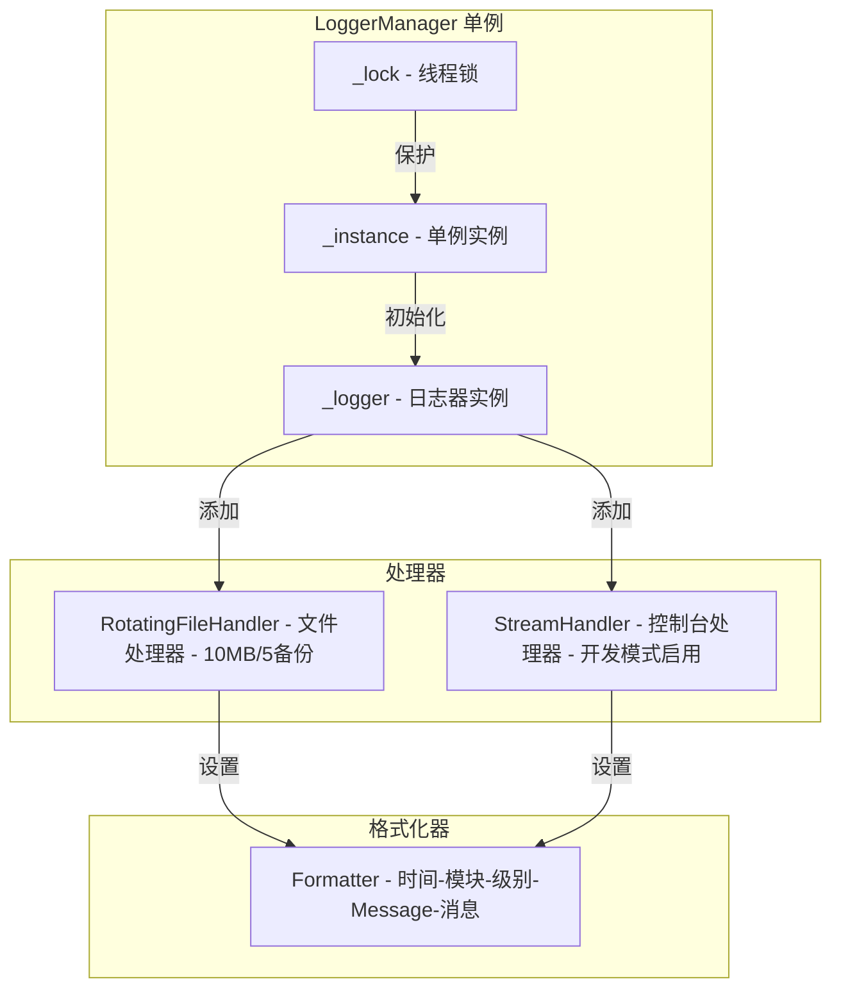

# 日志工具

> Logging Tools 模块的架构设计和核心概念

---

## 1. 概述

`Logging Tools` 是 InstructionX 项目的日志管理工具模块，提供统一的日志记录功能，支持日志文件轮转、线程安全的单例模式。

**文件位置**: `utils/logging_tools.py`

**模式**: 单例模式（线程安全）

**核心功能**:
- 统一日志管理
- 日志文件轮转
- 自动模块名检测
- 开发/生产环境支持

---

## 2. 核心组件

### 2.1 ILogger 接口

**文件位置**: `utils/i_logger.py`

日志记录器的抽象接口，定义了 `info`、`debug`、`warning`、`error`、`critical` 五个抽象方法。`LoggerManager` 继承自 `ILogger`，插件和核心服务可通过此接口进行日志记录，实现依赖注入。

```python
from utils.i_logger import ILogger

class MyService:
    def __init__(self, logger: ILogger):
        self._logger = logger
```

### 2.2 LoggerManager

单例模式的日志管理器类，继承自 `ILogger`，支持按指定格式记录日志到文件。

```python
from utils import LoggerManager

# 获取单例实例
logger = LoggerManager()
```

### 2.3 get_name()

自动获取当前调用位置的模块名称，无论是从类方法、函数还是主模块调用都能正确获取。

```python
from utils import get_name

module_name = get_name()  # 自动返回调用者模块名
```

---

## 3. 日志格式

### 3.1 输出格式

```
[YYYY-MM-DD][HH-MM-SS][模块名称][等级][Message-->][消息内容]
```

### 3.2 日志级别

| 级别 | 方法 | 说明 |
|------|------|------|
| DEBUG | `logger.debug()` | 调试信息 |
| INFO | `logger.info()` | 一般信息 |
| WARNING | `logger.warning()` | 警告信息 |
| ERROR | `logger.error()` | 错误信息 |
| CRITICAL | `logger.critical()` | 严重错误 |

---

## 4. 配置说明

### 4.1 日志目录与文件

| 配置项 | 默认值 | 说明 |
|--------|--------|------|
| 日志目录 | `./logs` | 自动创建 |
| 日志文件 | `application.log` | 主日志文件 |
| 最大文件大小 | 10MB | 单文件最大字节数 |
| 备份数量 | 5 | 保留的轮转文件数 |
| 编码 | utf-8 | 文件编码 |

### 4.2 开发模式

通过环境变量 `DEVELOPMENT_MODE=true` 启用开发模式：

```bash
export DEVELOPMENT_MODE=true
# 或 Windows
set DEVELOPMENT_MODE=true
```

开发模式下，日志会同时输出到控制台。

---

## 5. 使用示例

### 5.1 基础用法

```python
from utils import LoggerManager

# 获取单例实例
logger = LoggerManager()

# 使用不同级别记录日志
logger.debug('UserModule', '用户登录成功')
logger.info('UserModule', '用户登录成功')
logger.warning('CacheModule', '缓存即将过期')
logger.error('DatabaseModule', '数据库连接失败')
logger.critical('SecurityModule', '检测到安全威胁')

# 使用通用 log 方法
logger.log('INFO', 'PaymentModule', '支付处理完成')
```

### 5.2 结合 get_name() 使用

```python
from utils import LoggerManager, get_name

logger = LoggerManager()

# 自动获取模块名称
logger.info(get_name(), '用户登录成功')
logger.error(get_name(), '数据库连接失败')
logger.debug(get_name(), '处理请求开始')
```

### 5.3 在类方法中使用

```python
from utils import LoggerManager, get_name

class UserService:
    def __init__(self):
        self.logger = LoggerManager()

    def login(self, username):
        self.logger.info(get_name(), f'用户 {username} 尝试登录')
        # 业务逻辑...
        self.logger.info(get_name(), f'用户 {username} 登录成功')
```

---

## 6. 架构图



---

## 7. 与现有模块的关系

### 7.1 模块导出

通过 `utils/__init__.py` 导出：

```python
from .logging_tools import LoggerManager, get_name

__all__ = [
    "LoggerManager",
    "get_name"
]
```

### 7.2 集成方式

```python
# 方式 1: 直接导入
from utils import LoggerManager

# 方式 2: 导入具体函数
from utils import get_name
```

### 7.3 潜在集成点

- **BackgroundTaskManager**: 记录任务调度日志
- **LLM Provider**: 记录 API 调用日志
- **Plugin System**: 记录插件加载/卸载日志
- **UI 层**: 记录用户操作日志

---

## 8. 注意事项

1. **单例模式**: `LoggerManager` 采用线程安全的双检查锁单例模式，多次实例化返回同一对象
2. **重复初始化**: 多次调用 `LoggerManager()` 不会重复初始化，已初始化的实例会直接返回
3. **日志轮转**: 当日志文件达到 10MB 时，会自动轮转并保留 5 个备份文件
4. **模块名获取**: `get_name()` 在无法获取模块名时返回 `'unknown'`
5. **开发模式**: 控制台输出仅在 `DEVELOPMENT_MODE=true` 时启用

---

## 9. 相关文档

- [插件开发指南](../core/plugin-system/plugin-development.md)
- [后台任务概述](../core/background-task/overview.md)
- [LLM Provider 概述](../core/llm-provider/overview.md)

---

*本文档由 Claude Code 自动生成*
