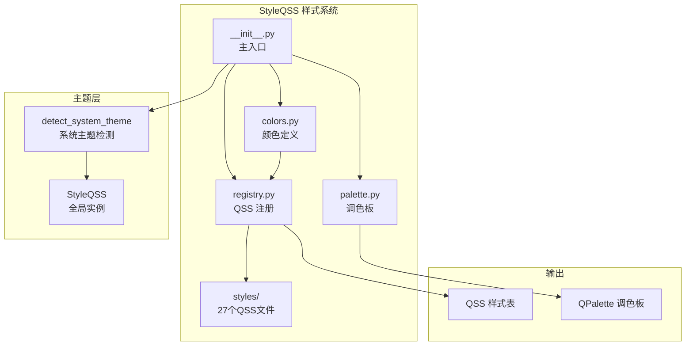
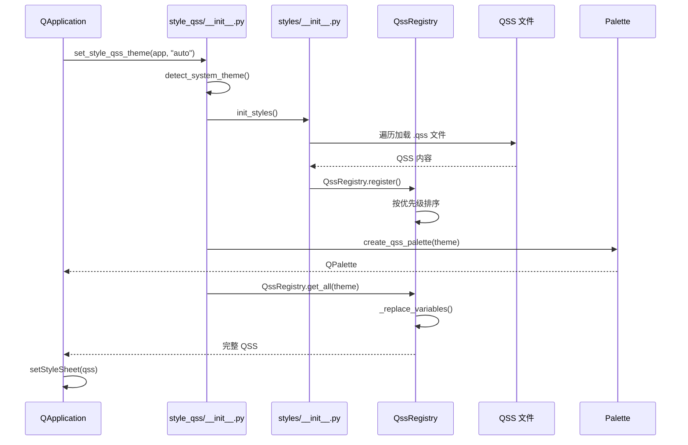

# StyleQSS 样式系统

> StyleQSS 样式模块的架构设计和核心概念

---

## 1. 概述

`StyleQSS 样式系统` 是 InstructionX 项目的 UI 主题模块，为 PySide6 提供现代化的桌面视觉体验。

**文件位置**: `utils/style_qss/`

**核心功能**:
- 浅色/深色主题支持
- 系统主题自动检测
- 模块化 QSS 样式文件
- 运行时变量替换
- 27 个 QSS 样式文件覆盖常用控件

**支持的控件**:
- 基础控件：按钮、输入框、标签
- 选择控件：复选框、单选按钮、下拉框、滑块
- 容器控件：分组框、框架、标签页、工具箱
- 布局控件：分割器、滚动条
- 菜单控件：菜单、工具栏、停靠窗口
- 窗口控件：主窗口、对话框、状态栏

---

## 2. 核心组件

### 2.1 模块结构

```
utils/style_qss/
├── __init__.py          # 主入口，导出主要接口
├── colors.py            # 颜色定义
├── palette.py           # QPalette 调色板创建
├── registry.py          # QSS 注册表，管理样式片段
└── styles/
    ├── __init__.py      # 自动加载所有 QSS 文件
    ├── base.qss         # 基础设置
    ├── button.qss       # 按钮
    ├── input.qss        # 输入控件
    ├── combobox.qss     # 下拉框
    ├── checkbox.qss     # 复选框
    ├── radio.qss        # 单选按钮
    ├── slider.qss       # 滑块
    ├── progress.qss     # 进度条
    ├── label.qss        # 标签
    ├── menu.qss         # 菜单
    ├── toolbar.qss      # 工具栏
    ├── scrollbar.qss    # 滚动条
    ├── tab.qss          # 标签页
    ├── groupbox.qss     # 分组框
    ├── frame.qss        # 框架
    ├── list.qss         # 列表视图
    ├── header.qss       # 表头
    ├── splitter.qss     # 分割器
    ├── dialog.qss       # 对话框
    ├── statusbar.qss    # 状态栏
    ├── tooltip.qss      # 工具提示
    ├── dock.qss         # 停靠窗口
    ├── mainwindow.qss   # 主窗口
    ├── titlebar.qss     # 自定义标题栏
    ├── spinbox.qss      # 数值选择
    └── custom.qss       # 自定义样式（可覆盖）
```

### 2.2 StyleQSSColors

颜色定义类，提供浅色和深色主题的颜色配置。

```python
from utils.style_qss import StyleQSSColors

# 获取浅色主题颜色
light_colors = StyleQSSColors.get_colors('light')

# 获取深色主题颜色
dark_colors = StyleQSSColors.get_colors('dark')

# 获取指定颜色
accent = StyleQSSColors.get_color('accent', 'light')
```

### 2.3 QssRegistry

QSS 注册表，管理所有模块化样式片段，支持变量替换。

```python
from utils.style_qss import QssRegistry

# 获取所有 QSS（已替换变量）
qss = QssRegistry.get_all('light')

# 获取指定样式
button_qss = QssRegistry.get('button')
```

### 2.4 create_qss_palette

创建 QSS 调色板，设置 Qt 原生控件的颜色。

```python
from utils.style_qss import create_qss_palette
from PySide6.QtWidgets import QApplication

app = QApplication([])
palette = create_qss_palette('light')
app.setPalette(palette)
```

---

## 3. 架构图



### 3.1 样式加载流程



---

## 4. 颜色变量

### 4.1 基础颜色

| 变量 | 浅色主题 | 深色主题 | 说明 |
|------|---------|---------|------|
| `window` | `#FFFFFF` | `#202020` | 窗口背景 |
| `windowText` | `#000000` | `#FFFFFF` | 窗口文字 |
| `base` | `#FFFFFF` | `#2C2C2C` | 基础色 |
| `alternateBase` | `#F3F3F3` | `#323232` | 交替基础色 |
| `button` | `#F3F3F3` | `#2C2C2C` | 按钮背景 |
| `buttonText` | `#000000` | `#FFFFFF` | 按钮文字 |
| `toolTipBase` | `#FFFFFF` | `#323232` | 工具提示背景 |
| `toolTipText` | `#000000` | `#FFFFFF` | 工具提示文字 |
| `link` | `#0063B1` | `#99BFFF` | 超链接 |
| `linkVisited` | `#800080` | `#B987B9` | 已访问超链接 |

### 4.2 高亮与强调色

| 变量 | 浅色主题 | 深色主题 | 说明 |
|------|---------|---------|------|
| `highlight` | `#0078D4` | `#0078D4` | 强调色 (Windows Blue) |
| `highlightedText` | `#FFFFFF` | `#FFFFFF` | 高亮文字 |
| `accent` | `#0078D4` | `#0078D4` | 强调色 |
| `accentLight` | `#4CC2FF` | `#4CC2FF` | 浅强调色 |
| `accentDark` | `#005A9E` | `#005A9E` | 深强调色 |

### 4.3 边框颜色

| 变量 | 浅色主题 | 深色主题 | 说明 |
|------|---------|---------|------|
| `border` | `#898989` | `#646464` | 边框色 |
| `borderLight` | `#CCCCCC` | `#3C3C3C` | 浅边框色 |
| `borderDark` | `#898989` | `#646464` | 深边框色 |

### 4.4 文本颜色

| 变量 | 浅色主题 | 深色主题 | 说明 |
|------|---------|---------|------|
| `textPrimary` | `#000000` | `#FFFFFF` | 主要文字 |
| `textSecondary` | `#666666` | `#999999` | 次要文字 |

### 4.5 控件状态填充

| 变量 | 浅色主题 | 深色主题 | 说明 |
|------|---------|---------|------|
| `controlFill` | `rgba(0,0,0,7)` | `rgba(255,255,255,7)` | 默认填充 |
| `controlFillHover` | `rgba(0,0,0,12)` | `rgba(255,255,255,12)` | 悬停填充 |
| `controlFillPressed` | `rgba(0,0,0,18)` | `rgba(255,255,255,18)` | 按下填充 |
| `controlFillDisabled` | `rgba(0,0,0,4)` | `rgba(255,255,255,4)` | 禁用填充 |
| `controlFillSelected` | `rgba(0,120,212,20)` | `rgba(0,120,212,40)` | 选中填充 |
| `textDisabled` | `#6D6D6D` | `#6D6D6D` | 禁用文字 |

### 4.6 技能面板专用色

| 变量 | 浅色主题 | 深色主题 | 说明 |
|------|---------|---------|------|
| `skillPanel` | `#F5F5F5` | `#454545` | SkillsPanel 主背景 |
| `skillPanelTab` | `#E8E8E8` | `#6A6A6A` | SkillsPanel Tab 背景 |

### 4.7 圆角

| 变量 | 值 | 说明 |
|------|-----|------|
| `radius` | `3px` | 默认圆角 |
| `radiusLarge` | `6px` | 大圆角 |
| `radiusSmall` | `2px` | 小圆角 |

---

## 5. API 参考

### 5.1 核心函数

#### set_style_qss_theme(app, theme="auto")

设置 StyleQSS 主题。

| 参数 | 类型 | 说明 |
|------|------|------|
| `app` | QApplication | Qt 应用实例 |
| `theme` | str | `'light'`、`'dark'` 或 `'auto'` |

```python
from PySide6.QtWidgets import QApplication
from utils.style_qss import set_style_qss_theme

app = QApplication([])

# 自动检测系统主题
set_style_qss_theme(app, "auto")

# 强制浅色主题
set_style_qss_theme(app, "light")

# 强制深色主题
set_style_qss_theme(app, "dark")
```

#### detect_system_theme()

检测系统主题。

```python
from utils.style_qss import detect_system_theme

theme = detect_system_theme()  # 返回 'light' 或 'dark'
```

#### set_light_theme(app)

设置浅色主题（兼容旧接口，内部调用 `set_style_qss_theme(app, 'light')`）。

```python
from utils.style_qss import set_light_theme

set_light_theme(app)
```

#### create_qss(theme='light')

创建 QSS 样式表。

```python
from utils.style_qss import create_qss

# 获取浅色 QSS
qss = create_qss('light')

# 应用到应用
app.setStyleSheet(qss)
```

#### create_qss_palette(theme='light')

创建 QSS 调色板。

```python
from utils.style_qss import create_qss_palette

palette = create_qss_palette('dark')
app.setPalette(palette)
```

### 5.2 StyleQSS 类

```python
from utils.style_qss import get_style_qss

style = get_style_qss()
style.set_theme('dark')
print(style.theme())   # 'dark'
print(style.colors())  # 颜色字典
print(style.color('accent'))  # '#0078D4'
```

### 5.3 get_color_dict()

获取指定主题的颜色字典。

```python
from utils.style_qss import get_color_dict

colors = get_color_dict('dark')
print(colors['accent'])  # '#0078D4'
```

### 5.4 QssRegistry 类

```python
from utils.style_qss import QssRegistry

# 获取所有 QSS
qss = QssRegistry.get_all('light')

# 获取单个样式
button_qss = QssRegistry.get('button')

# 清空样式（不常用）
QssRegistry.clear()
```

---

## 6. 使用示例

### 6.1 基础用法

```python
import sys
from PySide6.QtWidgets import QApplication, QPushButton
from utils.style_qss import set_style_qss_theme

app = QApplication(sys.argv)

# 设置 StyleQSS 主题（自动检测系统主题）
set_style_qss_theme(app, "auto")

# 创建测试窗口
button = QPushButton("Hello StyleQSS")
button.show()

sys.exit(app.exec())
```

### 6.2 在主程序中使用

```python
# main.py
from PySide6.QtWidgets import QMainWindow
from utils.style_qss import set_style_qss_theme

class MainWindow(QMainWindow):
    def __init__(self):
        super().__init__()
        self.setWindowTitle("StyleQSS Demo")
        # 窗口内容...

if __name__ == "__main__":
    import sys
    from PySide6.QtWidgets import QApplication

    app = QApplication(sys.argv)

    # 设置 StyleQSS 主题
    set_style_qss_theme(app, "auto")

    window = MainWindow()
    window.show()

    sys.exit(app.exec())
```

### 6.4 动态切换主题

```python
from utils.style_qss import set_style_qss_theme
from PySide6.QtWidgets import QApplication

def switch_to_dark(app: QApplication):
    set_style_qss_theme(app, 'dark')

def switch_to_light(app: QApplication):
    set_style_qss_theme(app, 'light')
```

### 6.5 使用按钮样式类

QSS 支持通过 `class` 属性选择不同风格的按钮：

```python
# 主要按钮（蓝色）
button = QPushButton("Primary")
button.setProperty("class", "primary")

# 危险按钮（红色）
danger_btn = QPushButton("Delete")
danger_btn.setProperty("class", "danger")

# 成功按钮（绿色）
success_btn = QPushButton("Success")
success_btn.setProperty("class", "success")

# 轮廓按钮
outline_btn = QPushButton("Outline")
outline_btn.setProperty("class", "outline")

# 柔和按钮
subtle_btn = QPushButton("Subtle")
subtle_btn.setProperty("class", "subtle")

# 强调保存按钮（蓝色，强调色）
accent_save_btn = QPushButton("Save")
accent_save_btn.setProperty("class", "accentSave")

# 警告按钮（橙色）
warning_btn = QPushButton("Warning")
warning_btn.setProperty("class", "warning")
```

---

## 7. 与现有模块的关系

### 7.1 模块导出

`StyleQSS` 的主入口为 `utils/style_qss/__init__.py`，可直接导入：

```python
# 方式 1: 直接导入（推荐）
from utils.style_qss import set_style_qss_theme
set_style_qss_theme(app, 'dark')

# 方式 2: 通过 utils 包（需要 themes 模块支持）
from utils import set_style_qss_theme
set_style_qss_theme(app, 'auto')
```

### 7.2 集成方式

```python
# 方式 1: 通过 utils 模块（推荐）
from utils import set_style_qss_theme
set_style_qss_theme(app)

# 方式 2: 直接导入 style_qss（推荐）
from utils.style_qss import set_style_qss_theme
set_style_qss_theme(app, 'dark')
```

### 7.3 数据流转

```
系统主题设置
    ↓
utils.themes.set_style_qss_theme()
    ↓
utils.style_qss.set_style_qss_theme()
    ├── detect_system_theme() → 获取系统主题
    ├── create_qss_palette() → 创建 QPalette
    ├── QssRegistry.get_all() → 获取 QSS
    │   └── _replace_variables() → 替换颜色变量
    └── app.setStyleSheet() → 应用样式
```

---

## 8. QSS 语法说明

### 8.1 变量替换

模块使用运行时变量替换，QSS 中使用单大括号 `{}` 引用变量：

```css
QPushButton {
    background-color: {controlFill};
    border: 1px solid {borderLight};
    border-radius: {radius};
}
```

替换后：

```css
QPushButton {
    background-color: rgba(0, 0, 0, 7);
    border: 1px solid #CCCCCC;
    border-radius: 3px;
}
```

### 8.2 控件状态

| 状态选择器 | 说明 |
|-----------|------|
| `:hover` | 鼠标悬停 |
| `:pressed` | 鼠标按下 |
| `:checked` | 选中状态 |
| `:disabled` | 禁用状态 |
| `:focus` | 获得焦点 |
| `:flat` | 扁平按钮 |

### 8.3 自定义样式覆盖

创建 `styles/custom.qss` 文件可覆盖默认样式：

```css
/* styles/custom.qss */
QPushButton {
    background-color: #ff0000;
}
```

该文件在加载顺序中优先级为 20（仅次于 base），可覆盖默认样式。

---

## 9. 注意事项

1. **Fusion 样式**: `set_style_qss_theme` 会将应用样式设置为 `Fusion`，这是样式系统的基础
2. **自动主题检测**: Windows 系统通过注册表 `AppsUseLightTheme` 检测系统主题
3. **QSS 注释**: 模块会自动移除 `/* */` 和 `//` 注释，避免编码问题
4. **变量替换**: 替换使用简单的字符串替换，确保变量名不包含特殊字符
5. **样式优先级**: QSS 文件按固定顺序加载，custom.qss 可用于覆盖默认样式
6. **按钮类属性**: 使用 `setProperty("class", "primary")` 设置按钮变体样式
7. **半透明颜色**: 使用 `rgba()` 函数实现控件状态变化的透明度效果

---

## 10. 相关文档

- [主窗口文档](../ui/main-window.md)
- [技能面板文档](../ui/skills-panel.md)
- [工作区文档](../ui/work-area.md)
- [系统架构概述](../architecture/overview.md)

---

*本文档由 Claude Code 自动生成*
