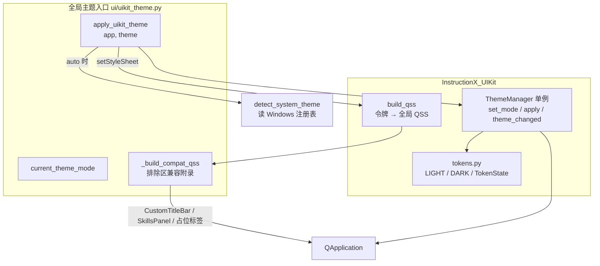
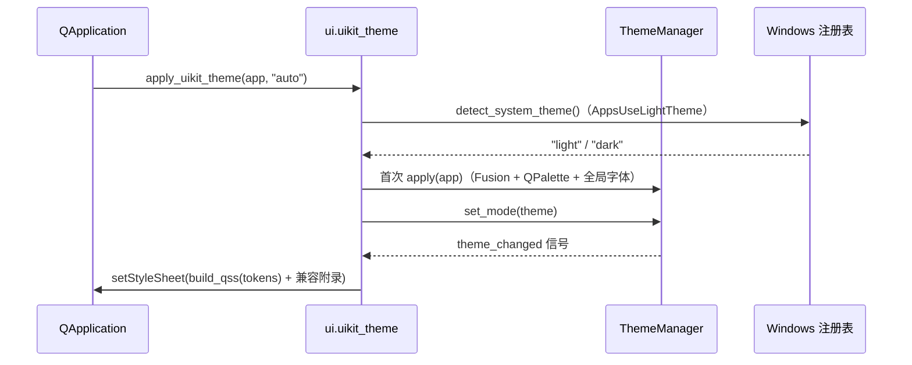

# UIKit 主题系统

> InstructionX_UIKit 组件库与全局主题入口的架构设计和核心概念

---

## 1. 概述

`UIKit 主题系统` 是 InstructionX 项目的 UI 主题模块，基于内置的 **InstructionX_UIKit** PySide6 组件库，为应用提供统一的设计令牌（Design Token）与亮/暗双主题。它取代了已删除的旧 StyleQSS 主题系统（`utils/style_qss/` 整包与 `utils/themes.py`），全局配色已统一为 UIKit 设计，不保留旧色板。

**相关文件**:

| 文件 | 说明 |
|------|------|
| `ui/InstructionX_UIKit/` | PySide6 组件库（独立仓库 KKPIP-Tech/InstructionX_UIKit 的同步副本，版本 alpha-v1.0.0），主项目不修改库内文件 |
| `ui/uikit_bootstrap.py` | sys.path 引导，导入即生效，使 UIKit 以顶层包可导入 |
| `ui/uikit_theme.py` | 全局主题入口：`apply_uikit_theme()` / `current_theme_mode()` + 排除区兼容附录 |

**核心功能**:

- 浅色/深色/跟随系统三种主题模式（auto 读 Windows 注册表）
- 设计令牌 `T()` 实时取色，主题切换全局生效
- 57 个组件、12 布局、动画与原生图表引擎
- 排除区兼容附录：为不做 UI 迁移的区域保留原选择器结构，颜色取 UIKit 令牌
- 全部对话框与 QMessageBox 已迁移到 UIKit Dialog / Message 组件

---

## 2. InstructionX_UIKit 组件库

### 2.1 库结构

```
ui/InstructionX_UIKit/
├── __init__.py          # 包入口：re-export ThemeManager/T/build_qss/set_property/apply_shadow、
│                        #   LIGHT/DARK/TokenState/FONT_FAMILY/MONO_FAMILY/Breakpoint/DURATION/EASING、
│                        #   get_icon/ICON_NAMES；__version__ = "alpha-v1.0.0"
├── tokens.py            # 设计令牌：LIGHT / DARK 两套令牌字典 + TokenState 状态机
├── theme.py             # ThemeManager 单例 + T() + build_qss() 全局 QSS + set_property + apply_shadow
├── icons.py             # 图标（get_icon / ICON_NAMES）
├── components/          # 57 个组件（Button/LineEdit/Dialog/Message/Table/ComboBox/DatePicker 等）
├── layouts/             # 12 个布局（HolyGrail/SidebarLayout/MasterDetail/CardGrid 等）
├── anim/                # 动画（属性动画 / 自绘动画）
├── charts/              # 原生图表引擎（ChartWidget + set_option，ECharts 风格 option）
└── blueprint/           # 蓝图（节点画布）
```

### 2.2 导入约定（uikit_bootstrap）

库内约 20 个模块使用 `from InstructionX_UIKit.xxx import ...` 绝对导入，因此 UIKit 必须以**顶层包**身份导入。`ui/uikit_bootstrap.py` 在被导入时（模块级副作用）把项目根的 `ui/` 目录 **append** 到 `sys.path`（用 append 而非 insert(0)，避免 `ui/` 下其他子包遮蔽同名第三方包），此后 `import InstructionX_UIKit` 与库内绝对导入解析到同一模块对象，保证 ThemeManager 等单例全局唯一。

**硬性约定**：`main.py` 的第一行业务 import 必须是 `import ui.uikit_bootstrap`（早于任何 `InstructionX_UIKit` / `ui.uikit_theme` 导入）。

```python
# main.py
import ui.uikit_bootstrap  # noqa: F401  必须为第一行业务 import

from PySide6.QtWidgets import QApplication
from ui.uikit_theme import apply_uikit_theme
```

### 2.3 业务代码导入方式

```python
# 设计令牌与主题
from InstructionX_UIKit import T, build_qss, set_property, apply_shadow
from InstructionX_UIKit.theme import ThemeManager

# 组件
from InstructionX_UIKit.components import Button, LineEdit, Dialog, Message, Table, ComboBox, DatePicker

# 图表
from InstructionX_UIKit.charts import ChartWidget
```

---

## 3. 全局主题入口（ui/uikit_theme.py）

### 3.1 架构图



### 3.2 主题应用流程



---

## 4. API 参考

### 4.1 apply_uikit_theme(app, theme="auto")

应用 UIKit 全局主题，是应用**唯一**的全局主题应用入口。

| 参数 | 类型 | 说明 |
|------|------|------|
| `app` | QApplication | Qt 应用实例 |
| `theme` | str | `'light'`、`'dark'` 或 `'auto'`（auto 读 Windows 注册表 `AppsUseLightTheme` 解析一次，失败回退 light） |

流程：auto 解析 → `ThemeManager.set_mode`（必要时首次 `apply`）→ 重新设置「build_qss + 兼容附录」完整样式表。theme 非法时抛出 `ValueError`。

```python
from PySide6.QtWidgets import QApplication
from ui.uikit_theme import apply_uikit_theme

app = QApplication([])

# 自动检测系统主题
apply_uikit_theme(app, "auto")

# 强制浅色 / 深色主题
apply_uikit_theme(app, "light")
apply_uikit_theme(app, "dark")
```

### 4.2 current_theme_mode()

返回当前生效的主题模式（`'light'` | `'dark'`），供需要按模式选择资源的代码使用（如 llm_settings 对话框主题）。

```python
from ui.uikit_theme import current_theme_mode

mode = current_theme_mode()  # 'light' 或 'dark'
```

### 4.3 detect_system_theme()

检测 Windows 系统主题（读注册表 `AppsUseLightTheme`），返回 `'dark'` 或 `'light'`；非 Windows 或读取失败时回退 `'light'`。

### 4.4 主题切换与持久化

主窗口菜单「编辑 → 切换主题」按 **light → dark → auto** 循环调用 `apply_uikit_theme`，选择持久化在 DataProvider 的 `__app_config__` 插件、键名 `theme`（语义与旧版不变）：

```python
# ui/main_window.py
self._theme_map = {'light': 'dark', 'dark': 'auto', 'auto': 'light'}

def _cycle_theme(self):
    next_theme = self._theme_map.get(self._current_theme, 'auto')
    self._current_theme = next_theme
    apply_uikit_theme(QApplication.instance(), next_theme)
    self._save_theme(next_theme)
```

---

## 5. 设计令牌 T()

### 5.1 用法

`T(key)` 取当前主题令牌值（颜色为 str，数值为 int，阴影为 dict），内部委托令牌状态机 `TokenState`，未知键抛 `KeyError`：

```python
from InstructionX_UIKit import T

color = T("color.primary")      # 主色
gap = T("space.4")              # 间距 16px
font_size = T("font.md")        # 正文字号 13px
```

**常用颜色令牌**：

| 令牌 | 说明 |
|------|------|
| `color.bg.base` / `color.bg.subtle` / `color.bg.muted` / `color.bg.elevated` | 背景层级（基底 / 弱化 / 沉默 / 抬升面） |
| `color.text.primary` / `color.text.secondary` / `color.text.tertiary` / `color.text.disabled` | 文字层级 |
| `color.primary` / `color.primary.hover` / `color.primary.pressed` / `color.primary.subtle` / `color.on.primary` | 主色及交互态 |
| `color.success` / `color.warning` / `color.danger`（及 `.hover` / `.subtle`） | 语义色 |
| `color.border` / `color.border.strong` | 边框 |
| `color.overlay` | 遮罩 |

**常用数值令牌**：

| 令牌 | 值 | 说明 |
|------|-----|------|
| `font.xs` / `font.sm` / `font.md` / `font.lg` | 11 / 12 / 13 / 14 | 正文字阶 |
| `space.1` ~ `space.16` | 4 ~ 64 | 间距阶梯 |
| `radius.sm` / `radius.md` / `radius.lg` / `radius.pill` | 4 / 6 / 8 / 999 | 圆角 |
| `shadow.sm` / `shadow.md` / `shadow.lg` | dict | 投影规格（配合 `apply_shadow(widget, level)`） |
| `duration.*` / `easing.*` | int / QEasingCurve | 动画时长与缓动 |

### 5.2 ThemeManager

```python
from InstructionX_UIKit.theme import ThemeManager

manager = ThemeManager.instance()
manager.apply(app)          # 应用全局主题（Fusion + QPalette + 全局字体 + build_qss）
manager.set_mode("dark")    # 切换模式，发射 theme_changed(mode)
manager.toggle()            # 亮 / 暗互切
manager.mode                # 当前模式 "light" / "dark"
manager.tokens              # 当前模式的令牌字典
manager.theme_changed.connect(on_theme_changed)  # 主题切换信号
```

### 5.3 build_qss 与辅助函数

```python
from InstructionX_UIKit import build_qss, set_property, apply_shadow
from InstructionX_UIKit.theme import ThemeManager

# 由令牌字典生成全局 QSS（亮/暗双主题完全由 tokens 参数化）
qss = build_qss(ThemeManager.instance().tokens)

# 设置动态属性并刷新样式（unpolish/polish）；
# name="size" 自动映射为 "uiksize"（规避 QWidget 内置 size 属性冲突）
set_property(widget, "variant", "primary")

# 按令牌为控件添加投影（level 为 "sm"/"md"/"lg"）
apply_shadow(widget, "md")
```

---

## 6. 常用组件速查

```python
from InstructionX_UIKit.components import (
    Button, IconButton,          # 按钮（variant: default/primary/dashed/text/link/danger）
    LineEdit, TextArea, ComboBox, DatePicker, SpinBox, Switch, CheckBox, RadioButton,  # 输入
    Dialog, Drawer, Message, Notification, Popconfirm, Popover,  # 反馈
    Table, Tabs, Tree, Pagination, Descriptions,  # 数据展示
    Card, Empty, Alert, ProgressBar, Skeleton, Spinner,  # 容器与状态
)
from InstructionX_UIKit.charts import ChartWidget

# 按钮：variant + size
btn = Button("确定", variant="primary", size="md")

# 阻塞式对话框（exec 阻塞，替代 QMessageBox）
dialog = Dialog(parent, title="确认删除")
dialog.set_text("删除后不可恢复，是否继续？")
accepted = dialog.exec() == Dialog.DialogCode.Accepted

# 非阻塞轻提示（顶部居中，自动消失）
Message.info(parent, "操作完成")
Message.success(parent, "保存成功")
Message.warning(parent, "请先选择一项")

# 图表（ECharts 风格 option，用量趋势图已从 QtCharts 迁移至此）
chart = ChartWidget(parent)
chart.set_option({"xAxis": {...}, "series": [...]})
```

### 6.1 QMessageBox → Dialog / Message 替换规则

QMessageBox 在框架中已全部移除，替换规则：

| 旧用法 | 新用法 |
|--------|--------|
| `QMessageBox.question(...)`（确认） | UIKit `Dialog`（`exec()` 阻塞，按返回值判断） |
| `QMessageBox.information/warning/critical(...)`（结果告知） | UIKit `Dialog`（`ok_text="知道了"`, `show_cancel=False`） |
| 轻量提示（校验失败、操作完成等） | `Message.info/success/warning(parent, text)`（非阻塞） |

llm_settings 包内进一步封装为 `feedback.py`：`confirm` / `notice`（阻塞式 Dialog）与 `info` / `warn` / `success`（非阻塞 Message）。

---

## 7. 排除区兼容附录

### 7.1 机制

`ui/uikit_theme.py` 的 `_build_compat_qss()` 为三个**不做 UI 迁移**的区域保留原有选择器结构、尺寸与字号（如 12px），颜色一律实时取 UIKit 令牌 `T()`：

| 排除区 | 主要选择器 |
|--------|-----------|
| CustomTitleBar（`ui/title_bar.py`） | `CustomTitleBar`、`QLabel#titleText`、`QMenuBar#titleMenuBar`、`#btnMinimize` / `#btnMaximize` / `#btnClose`、`QWidget#windowControls` |
| SkillsPanel / SkillButton（`ui/skills_panel/`） | `SkillsPanel`、`#skillsPillContainer`、`#skillsPillButton[active]`、`#skillsSeparator`、`#skillsCountLabel`、`SkillButton[active]`、`#skillGroupButton[expanded]` |
| WorkArea 占位 / 错误标签 | `QLabel[placeholder="true"]`、`QLabel[error="true"]` |

附录选择器（objectName / 类名 / 动态属性）比 UIKit 的裸类选择器更具体，且拼接在全局 QSS 之后，同优先级下天然胜出。

> 注意：UIKit 的 `ThemeManager.apply()` 会把**不带附录**的 QSS 设置到 QApplication，因此 `apply_uikit_theme()` 在每次主题变更后重新设置一次「build_qss + 附录」的完整样式表，保证附录始终生效。

### 7.2 排除区约定

- `ui/title_bar.py` 与 `ui/skills_panel/plugin_group_widget.py` 仅有取色改动（`T("color.text.primary")` / `T("color.bg.muted")` / `T("color.primary")`），其余代码与结构未动，QSS 样式全部由兼容附录提供；
- 新开发的功能区域**不得**加入排除区，应直接使用 UIKit 组件与令牌；排除区仅服务于上述三个历史区域，随其后续 UI 迁移逐步移除。

---

## 8. llm_settings 对话框主题机制

`ui/dialog/llm_settings/` 包有自主的 token 化 `Theme` dataclass（`theme.py`），但 token 值**不再硬编码**（原 LIGHT/DARK 硬编码色板已删除），而是由 `_theme_from_uikit()` 从 UIKit 令牌 `T()` 实时构建：

- `build_qss(theme)` 从 token 生成对话框作用域 QSS；
- `apply_dialog_theme(dialog)` 为对话框完成 palette + stylesheet + 自绘控件换色的一次性应用，并连接 UIKit `theme_changed` 信号，实现对话框打开期间**实时跟随**全局主题切换；
- 作用域约定：主题只应用于传入的对话框自身（setPalette / setStyleSheet），**绝不触碰 QApplication 全局 palette / stylesheet**；
- 包内新增 `feedback.py`：`confirm` / `notice` / `info` / `warn` / `success`，基于 UIKit Dialog / Message 统一用户反馈（见 6.1）。

---

## 9. 使用示例

### 9.1 应用启动（main.py）

```python
import sys
import ui.uikit_bootstrap  # noqa: F401  必须为第一行业务 import

from PySide6.QtWidgets import QApplication
from ui.uikit_theme import apply_uikit_theme

app = QApplication(sys.argv)
apply_uikit_theme(app, "auto")   # 设置 UIKit 全局主题
```

### 9.2 业务代码取色

```python
from InstructionX_UIKit import T

label.setStyleSheet(f"color: {T('color.text.secondary')}; font-size: 12px;")
```

### 9.3 动态切换主题

```python
from ui.uikit_theme import apply_uikit_theme
from PySide6.QtWidgets import QApplication

def switch_to_dark(app: QApplication):
    apply_uikit_theme(app, 'dark')

def switch_to_light(app: QApplication):
    apply_uikit_theme(app, 'light')
```

---

## 10. 注意事项

1. **导入顺序**：`main.py` 第一行业务 import 必须是 `ui.uikit_bootstrap`，否则库内绝对导入会 ImportError
2. **唯一入口**：全局主题只允许通过 `apply_uikit_theme()` 应用，不要直接调用 `ThemeManager.apply()`（会丢失兼容附录）
3. **不修改库内文件**：`ui/InstructionX_UIKit/` 是独立仓库的同步副本，主项目不做任何修改
4. **Fusion 样式**：`ThemeManager.apply()` 会将应用样式设置为 `Fusion`，这是全局 QSS 的基础
5. **size 属性别名**：Qt 中 `setProperty("size", ...)` 无效，组件尺寸请通过 `set_property(widget, "size", v)` 设置（内部自动映射为 `uiksize`）
6. **依赖**：UI 迁移后新增依赖 `qrcode[pil]>=7.4`（`pyproject.toml` 与 `requirements.txt` 双来源同步），供 UIKit `QRCodeView` 组件使用
7. **排除区只减不增**：兼容附录仅覆盖标题栏 / 技能面板 / 占位标签三个历史区域，新区域一律使用 UIKit 组件

---

## 11. 相关文档

- [主窗口文档](../ui/main-window.md)
- [技能面板文档](../ui/skills-panel.md)
- [工作区文档](../ui/work-area.md)
- [对话框组件](../ui/dialogs.md)
- [系统架构概述](../architecture/overview.md)
