# InstructionX 插件开发指南

## 目录

1. [项目简介](#1-项目简介)
2. [插件系统概述](#2-插件系统概述)
3. [插件目录结构](#3-插件目录结构)
4. [entrance.py 详解](#4-entrancepy-详解)
5. [service.py 详解](#5-servicepy-详解)
6. [information.py 详解](#6-informationpy-详解)
7. [核心服务使用指南](#7-核心服务使用指南)
8. [UI 开发指南](#8-ui-开发指南)
9. [StyleQSS 主题系统](#9-styleqss-主题系统)
10. [跨插件通信](#10-跨插件通信)
11. [MCP 协议集成](#11-mcp-协议集成)
12. [插件发布与安装](#12-插件发布与安装)
13. [调试技巧](#13-调试技巧)
14. [完整示例](#14-完整示例)
15. [最佳实践](#15-最佳实践)
16. [常见问题](#16-常见问题)

---

## 1. 项目简介

### 1.1 什么是 InstructionX

InstructionX 是一个基于 PySide6 的**插件式桌面应用框架**，旨在为用户提供一站式工具集（Tools Cluster）。它支持 LLM 集成、MCP 协议、多会话管理与热插拔插件系统。

**核心技术栈：**
- Python 3.14+
- PySide6 (>=6.10) - Qt GUI 框架
- StyleQSS - 自定义样式系统

### 1.2 核心功能概述

| 功能 | 说明 |
|------|------|
| 插件热插拔 | 支持热加载和热卸载，无需重启应用 |
| GitHub 插件安装 | 内置安装器，支持单插件(IXPlugin.json)和多插件仓库(IXRepo.json) |
| LLM 集成 | 多厂商支持（MiniMax、SiliconFlow、GLM、Ollama） |
| MCP 协议支持 | Server/Client 双向桥接 |
| DataProvider | 数据持久化、双命名空间、发布/订阅 |
| BackgroundTaskManager | 同步/异步/定时/长期任务 |
| StyleQSS | 30+ 控件样式、9+ 按钮变体 |

### 1.3 插件系统的角色

插件系统是 InstructionX 的核心扩展机制，允许用户：
- 自由组合所需的工具插件
- 开发自定义插件满足特殊需求
- 通过 MCP 协议让 AI 调用插件功能

---

## 2. 插件系统概述

### 2.1 系统架构图

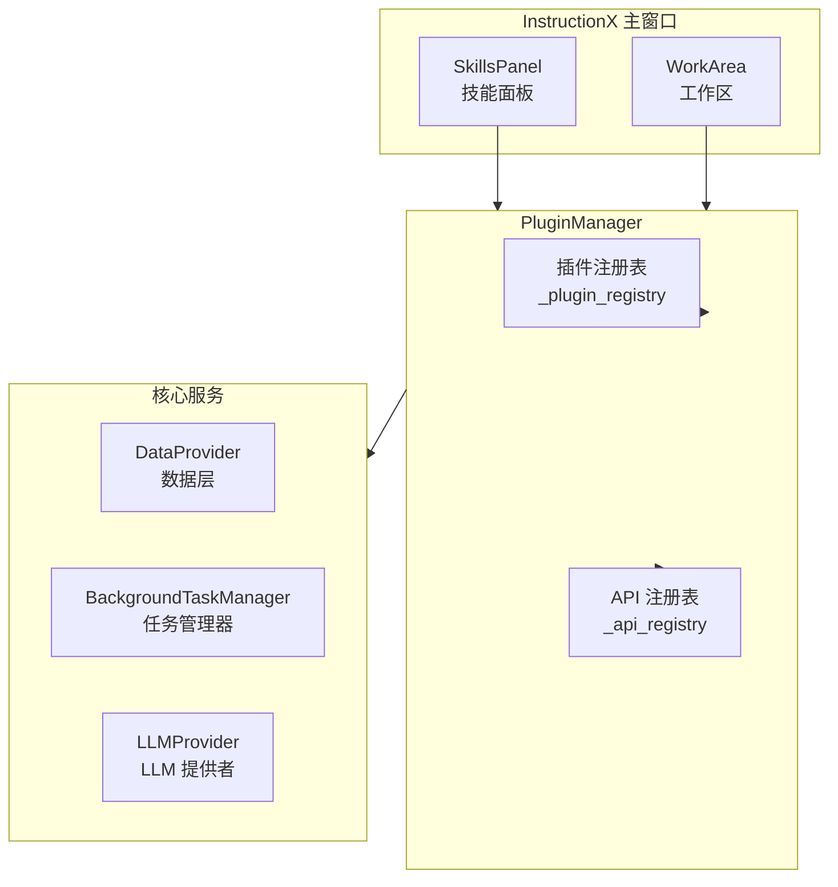

### 2.2 插件生命周期

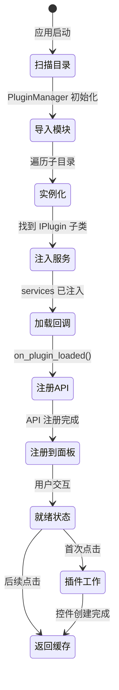

### 2.3 目录结构

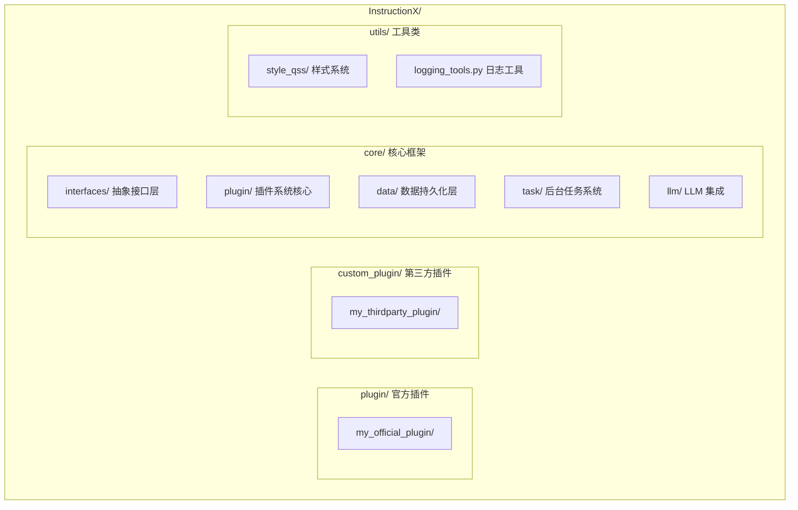

### 2.4 热加载机制

插件系统支持热加载特性：
- **热加载**：修改插件代码后，应用会重新加载插件
- **状态缓存**：切换插件时，UI 状态会被自动缓存
- **原子写入**：使用临时文件 + 重命名确保数据安全

---

## 3. 插件目录结构

### 3.1 文件说明

| 文件 | 必需性 | 说明 |
|------|--------|------|
| `__init__.py` | 必需 | 使目录成为 Python 包，空文件即可 |
| `entrance.py` | 必需 | 插件入口，定义 IPlugin 子类 |
| `service.py` | 可选 | 插件服务逻辑，存放业务代码 |
| `information.py` | 可选 | 插件元信息（版本、图标、API 定义） |
| `assets/` | 可选 | 静态资源目录 |
| `icons/` | 可选 | 图标资源目录（位于 assets 下） |

### 3.2 最小插件结构

```
minimal_plugin/
├── __init__.py          # 空文件
└── entrance.py          # 必须包含 IPlugin 子类
```

### 3.3 完整插件结构

```
complete_plugin/
├── __init__.py
├── entrance.py              # 插件入口类
├── service.py               # 服务逻辑类
├── information.py           # 插件元信息
└── assets/
    └── icons/
        └── plugin_icon.png   # 插件图标
```

### 3.4 各文件职责

| 文件 | 职责 |
|------|------|
| `entrance.py` | 定义插件主类，处理 UI 创建、生命周期回调 |
| `service.py` | 封装业务逻辑，与 entrance.py 分离便于维护 |
| `information.py` | 定义插件元数据、版本、图标、API 描述 |

---

## 4. entrance.py 详解

### 4.1 IPlugin 接口概述

`entrance.py` 是插件的入口文件，必须定义一个继承自 `IPlugin` 的类。

**导入路径（推荐）：**
```python
from core.interfaces.i_plugin import IPlugin
```

**向后兼容导入：**
```python
from core.plugin.plugin_interface import IPlugin
```

### 4.2 完整属性和方法

```python
from core.interfaces.i_plugin import IPlugin
from PySide6.QtWidgets import QWidget
from PySide6.QtGui import QIcon
from typing import Optional, List, Dict, Any

class MyPlugin(IPlugin):
    """我的插件"""

    # ==================== 属性 ====================

    @property
    def plugin_name(self) -> str:
        """插件显示名称（必需）"""
        return "我的插件"

    @property
    def plugin_id(self) -> Optional[str]:
        """插件唯一标识符（自动设置，无需重写）"""
        return self._plugin_id

    @property
    def skill_icon(self) -> Optional[QIcon]:
        """技能面板按钮图标（可选，默认返回系统默认图标）"""
        return None

    @property
    def skill_description(self) -> str:
        """技能面板按钮的简短描述（可选，默认返回 plugin_name）"""
        return self.plugin_name

    @property
    def skill_tooltip(self) -> str:
        """技能按钮的悬浮提示（可选，默认格式："名称\n描述"）"""
        return f"{self.plugin_name}\n{self.skill_description}"

    @property
    def plugin_info(self) -> Optional['IPluginInfo']:
        """插件信息对象（可选，默认从 information.py 加载）"""
        return self._load_plugin_info()

    @property
    def llm_tools(self) -> List[Dict[str, Any]]:
        """插件暴露的 LLM 工具列表（可选，默认返回空列表）"""
        return []

    # ==================== 方法 ====================

    def _create_widget(self, parent=None, data_provider=None) -> QWidget:
        """创建插件界面控件（必需）"""
        pass

    def get_widget(self, parent=None, data_provider=None) -> QWidget:
        """获取插件界面控件（内置缓存机制）"""
        pass

    def on_plugin_loaded(self, plugin_id: Optional[str] = None, **kwargs) -> None:
        """插件加载完成回调（可选）"""
        pass
```

### 4.3 plugin_name 属性

**功能：** 设置插件在技能面板显示的名称

**示例：**
```python
@property
def plugin_name(self) -> str:
    """显示在技能面板的名称"""
    return "文本格式化"
```

**多行名称支持：**
```python
@property
def plugin_name(self) -> str:
    """支持换行的多行名称"""
    return "文本\n格式化"
```

### 4.4 _create_widget 方法

**功能：** 创建插件的 Qt 用户界面控件

**签名：**
```python
def _create_widget(self, parent=None, data_provider=None) -> QWidget:
    """
    创建插件用户界面控件

    Args:
        parent: 父控件，传递工作区的中心控件作为父容器
        data_provider: 数据提供者实例，用于数据读写和插件间通信

    Returns:
        插件的 Qt 用户界面控件
    """
```

**示例：**
```python
from PySide6.QtWidgets import QWidget, QLabel, QVBoxLayout

def _create_widget(self, parent=None, data_provider=None) -> QWidget:
    """创建插件界面"""
    # 创建主控件
    widget = QWidget(parent)

    # 创建布局
    layout = QVBoxLayout(widget)

    # 创建标签
    label = QLabel("Hello from MyPlugin!")
    layout.addWidget(label)

    return widget
```

### 4.5 get_widget 方法（内置缓存）

**功能：** 获取插件界面控件，实现缓存机制避免重复创建

**缓存逻辑：**
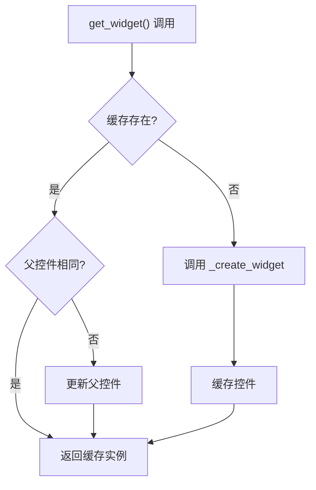

### 4.6 on_plugin_loaded 回调

**功能：** 插件加载完成后的初始化回调

**调用时机：** 在插件被框架加载且 `plugin_id` 已设置后调用

**典型用途：**
- 注册定时任务工厂
- 初始化后台服务
- 订阅其他插件的数据
- 注册 LLM 工具

**示例：**
```python
def on_plugin_loaded(self, plugin_id: Optional[str] = None, **kwargs) -> None:
    """插件加载完成回调"""
    # 通过 self._services 访问注入的服务
    if hasattr(self, '_services'):
        # 注册定时任务工厂
        self._services.task_manager.register_scheduled_task_factory(
            plugin_id=self.plugin_id,
            func=self.my_scheduled_task,
            callback=self.on_task_completed
        )

        # 订阅其他插件的数据
        self._services.data_provider.subscribe(
            subscriber_id=self.plugin_id,
            target_plugin_id="other-plugin-id",
            target_key="data_key",
            callback=self.on_data_changed
        )
```

### 4.7 skill_icon 属性

**功能：** 获取技能面板按钮图标

**返回类型：** `Optional[QIcon]`

**默认行为：** 返回系统默认文件图标

**加载流程：**
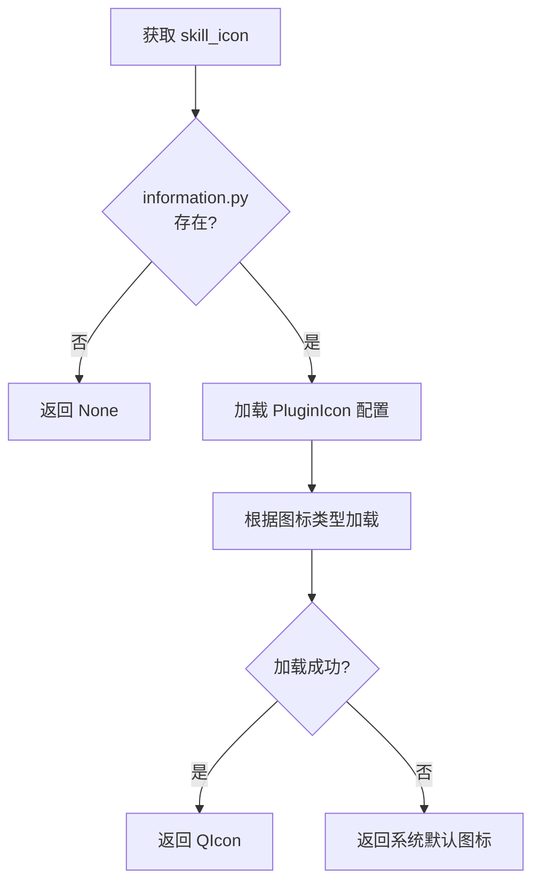

**示例（使用 information.py）：**
```python
# 在 information.py 中定义
from core.plugin.plugin_icon import PluginIcon

class MyPluginInfo(IPluginInfo):
    @property
    def skill_icon(self) -> PluginIcon:
        return PluginIcon.from_file("assets/icons/plugin_icon.png")
```

### 4.8 skill_description 属性

**功能：** 获取技能面板按钮的简短描述文本

**默认实现：** 返回 `plugin_name`

**示例：**
```python
@property
def skill_description(self) -> str:
    """技能面板按钮的简短描述"""
    return "提供文本格式化和转换功能"
```

### 4.9 skill_tooltip 属性

**功能：** 获取技能按钮的悬浮提示文本

**默认格式：** `"{plugin_name}\n{skill_description}"`

**示例：**
```python
@property
def skill_tooltip(self) -> str:
    """自定义悬浮提示"""
    return f"📝 {self.plugin_name}\n{self.skill_description}"
```

### 4.10 llm_tools 属性

**功能：** 声明插件暴露给 LLM 的工具列表

**返回类型：** `List[Dict[str, Any]]`

**格式要求：** 符合 OpenAI function calling 规范

**示例：**
```python
@property
def llm_tools(self) -> List[Dict[str, Any]]:
    """暴露给 LLM 的工具列表"""
    return [
        {
            "type": "function",
            "function": {
                "name": "format_text",
                "description": "格式化文本为指定格式",
                "parameters": {
                    "type": "object",
                    "properties": {
                        "text": {
                            "type": "string",
                            "description": "要格式化的文本"
                        },
                        "format": {
                            "type": "string",
                            "enum": ["upper", "lower", "title"],
                            "description": "格式化类型"
                        }
                    },
                    "required": ["text", "format"]
                }
            }
        }
    ]
```

### 4.11 plugin_info 属性

**功能：** 获取插件信息对象

**返回类型：** `Optional['IPluginInfo']`

**加载机制：**
1. 优先使用 `_plugin_dir` 定位 `information.py`
2. 否则从 `sys.modules` 查找
3. 使用文件 mtime 作为缓存失效依据
4. 文件修改后自动重新加载

### 4.12 依赖注入（services）

**功能：** 通过 `PluginServices` 访问框架提供的核心服务

**注入方式：**
```python
class MyPlugin(IPlugin):
    def __init__(self, services: PluginServices | None = None):
        super().__init__()
        self._services = services  # 保存服务容器引用
```

**可用的服务：**

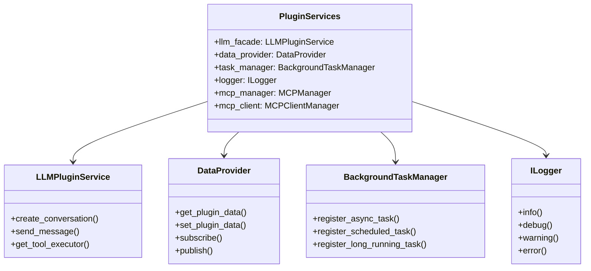

---

## 5. service.py 详解

### 5.1 功能定位

`service.py` 负责封装插件的业务逻辑，与 `entrance.py` 的 UI 职责分离，使代码更易于维护和测试。

### 5.2 最佳实践

**不分离模式（简单插件）：**
```python
# entrance.py
from core.interfaces.i_plugin import IPlugin

class TextFormatterPlugin(IPlugin):
    @property
    def plugin_name(self) -> str:
        return "文本格式化"

    def _create_widget(self, parent=None, data_provider=None):
        # 业务逻辑直接写在 entrance.py
        self.format_text = lambda text, mode: text.upper()
        # ... UI 创建
```

**分离模式（复杂插件，推荐）：**
```python
# service.py
class TextFormatterService:
    """文本格式化服务"""

    def __init__(self, data_provider=None):
        self._data_provider = data_provider

    def format_text(self, text: str, mode: str) -> str:
        """格式化文本"""
        if mode == "upper":
            return text.upper()
        elif mode == "lower":
            return text.lower()
        elif mode == "title":
            return text.title()
        return text

    def save_format_preference(self, plugin_id: str, mode: str):
        """保存用户偏好"""
        if self._data_provider:
            self._data_provider.set_plugin_data(
                plugin_id, "preferred_mode", mode
            )
```

```python
# entrance.py
from core.interfaces.i_plugin import IPlugin
from .service import TextFormatterService

class TextFormatterPlugin(IPlugin):
    def __init__(self, services=None):
        super().__init__()
        self._service = TextFormatterService(
            data_provider=services.data_provider if services else None
        )

    def _create_widget(self, parent=None, data_provider=None):
        # 使用 service 处理业务逻辑
        formatted = self._service.format_text("hello", "upper")
        # ... UI 创建
```

### 5.3 数据访问模式

```python
# service.py
class MyService:
    def __init__(self, data_provider):
        self._dp = data_provider

    def save_data(self, plugin_id: str, key: str, value: any):
        """保存数据到 PRIVATE 命名空间"""
        self._dp.set_plugin_data(plugin_id, key, value)

    def load_data(self, plugin_id: str, key: str, default=None):
        """从 PRIVATE 命名空间加载数据"""
        return self._dp.get_plugin_data(plugin_id, key, default=default)

    def share_data(self, plugin_id: str, key: str, value: any):
        """发布数据到 PUBLIC 命名空间"""
        self._dp.set_plugin_data(
            plugin_id, key, value,
            namespace=DataNamespace.PUBLIC
        )
```

### 5.4 API 方法定义模式

```python
# service.py
class MyService:
    """服务类，定义插件暴露的 API"""

    def my_api_method(self, param1: str, param2: int) -> dict:
        """
        API 方法

        Args:
            param1: 参数1描述
            param2: 参数2描述

        Returns:
            返回值描述
        """
        return {"result": f"{param1}_{param2}"}

    def another_method(self) -> bool:
        """另一个 API 方法"""
        return True
```

---

## 6. information.py 详解

### 6.1 IPluginInfo 接口概述

`information.py` 定义插件的元信息，必须包含一个继承自 `IPluginInfo` 的类。

**导入路径（推荐）：**
```python
from core.interfaces.i_plugin_info import IPluginInfo
```

**向后兼容导入：**
```python
from core.plugin.plugin_info_interface import IPluginInfo
```

### 6.2 必需属性

```python
from core.interfaces.i_plugin_info import IPluginInfo
from core.plugin.plugin_version import PluginVersion, VersionType
from core.plugin.plugin_icon import PluginIcon

class MyPluginInfo(IPluginInfo):
    """插件元信息"""

    @property
    def version(self) -> PluginVersion:
        """插件版本号"""
        return PluginVersion.from_string("release.1.0.0")

    @property
    def developer(self) -> str:
        """开发者名称"""
        return "开发者名称"

    @property
    def developer_email(self) -> str:
        """开发者邮箱"""
        return "developer@example.com"

    @property
    def developer_website(self) -> str:
        """开发者网站"""
        return "https://example.com"

    @property
    def is_free(self) -> bool:
        """是否免费"""
        return True

    @property
    def description(self) -> str:
        """插件详细描述"""
        return "这是一个功能强大的文本格式化插件"

    @property
    def service_api(self) -> Dict[str, Any]:
        """Service API 文档"""
        return {}

    @property
    def skill_icon(self) -> PluginIcon:
        """插件图标"""
        return PluginIcon.from_file("assets/icons/plugin_icon.png")

    @property
    def skill_description(self) -> str:
        """插件简短描述（用于 UI 展示）"""
        return "文本格式化和转换工具"

    @property
    def plugin_type_id(self) -> str:
        """插件类型标识符（小写字母、数字、连字符）"""
        return "text-formatter"
```

### 6.3 可选属性

```python
@property
def dependencies(self) -> Optional[Dict[str, str]]:
    """插件依赖项"""
    return {
        "some_package": ">=1.0.0"
    }

@property
def tags(self) -> Optional[list[str]]:
    """插件标签"""
    return ["文本处理", "格式化", "工具"]
```

### 6.4 PluginVersion 版本号

**版本格式：** `<version_type>.<major>.<minor>.<patch>`

**版本类型：**
| 类型 | 说明 | 优先级 |
|------|------|--------|
| `release` | 正式版 | 5（最高） |
| `pre-release` | 预发布版 | 4 |
| `beta` | 测试版 | 3 |
| `alpha` | 内测版 | 2 |
| `internal` | 内部版 | 1（最低） |

**使用示例：**
```python
from core.plugin.plugin_version import PluginVersion, VersionType

# 方式1：使用 from_string
version = PluginVersion.from_string("release.1.2.3")

# 方式2：直接构造
version = PluginVersion(
    version_type=VersionType.RELEASE,
    major=1,
    minor=2,
    patch=3
)

# 显示版本
print(version.get_display_version())  # "正式版 1.2.3"
```

### 6.5 PluginIcon 图标

**图标类型：**

| 类型 | 说明 | value 示例 |
|------|------|------------|
| `BUILTIN` | 系统内置图标 | `"SP_FileIcon"` |
| `FILE` | 图标文件路径 | `"assets/icons/icon.png"` |
| `RESOURCE` | Qt 资源路径 | `":/icons/icon.png"` |
| `BASE64` | Base64 编码 | `"iVBORw0KG..."` |
| `NONE` | 无图标 | 无需 value |

**使用示例：**
```python
from core.plugin.plugin_icon import PluginIcon, IconType

# 内置系统图标
icon = PluginIcon.builtin("SP_FileIcon")

# 文件图标（相对于插件目录）
icon = PluginIcon.from_file("assets/icons/plugin_icon.png")

# Qt 资源图标
icon = PluginIcon.from_resource(":/icons/icon.png")

# Base64 图标
icon = PluginIcon.from_base64("iVBORw0KG...")

# 无图标（使用默认）
icon = PluginIcon.none()
```

### 6.6 service_api 完整格式

**功能：** 定义插件暴露给 MCP/LLM 的 API 方法

**完整格式示例：**
```python
@property
def service_api(self) -> Dict[str, Any]:
    """Service API 文档"""
    return {
        "format_text": {
            "description": "将文本格式化为指定类型",
            "parameters": {
                "type": "object",
                "properties": {
                    "text": {
                        "type": "string",
                        "description": "要格式化的文本"
                    },
                    "format_type": {
                        "type": "string",
                        "enum": ["upper", "lower", "title", "capitalize"],
                        "description": "格式化类型"
                    },
                    "options": {
                        "type": "object",
                        "description": "可选参数",
                        "properties": {
                            "strip_whitespace": {
                                "type": "boolean",
                                "description": "是否去除首尾空白"
                            }
                        }
                    }
                },
                "required": ["text", "format_type"]
            },
            "returns": {
                "type": "string",
                "description": "格式化后的文本"
            },
            "errors": {
                "INVALID_FORMAT": "不支持的格式化类型",
                "EMPTY_TEXT": "文本不能为空"
            }
        },
        "batch_format": {
            "description": "批量格式化多个文本",
            "parameters": {
                "type": "object",
                "properties": {
                    "texts": {
                        "type": "array",
                        "items": {"type": "string"},
                        "description": "文本列表"
                    },
                    "format_type": {
                        "type": "string",
                        "enum": ["upper", "lower", "title"]
                    }
                },
                "required": ["texts", "format_type"]
            },
            "returns": {
                "type": "array",
                "items": {"type": "string"},
                "description": "格式化后的文本列表"
            }
        }
    }
```

---

## 7. 核心服务使用指南

### 7.1 DataProvider

**功能：** 数据持久化、缓存、插件管理、发布/订阅通信和资源管理

**获取方式：**
```python
# 方式1：通过 services（推荐）
data_provider = self._services.data_provider

# 方式2：直接获取单例
from core.data import DataProvider
data_provider = DataProvider()
```

#### 7.1.1 数据命名空间

| 命名空间 | 说明 | 访问控制 |
|----------|------|----------|
| `PRIVATE` | 仅插件内部使用 | 只有创建数据的插件可访问 |
| `PUBLIC` | 允许其他插件访问 | 所有插件可读取，订阅者可感知变化 |

#### 7.1.2 基本数据操作

```python
from core.interfaces.i_data_provider import DataNamespace

# 保存私有数据（仅插件内部可见）
data_provider.set_plugin_data(
    plugin_id,
    key="user_preference",
    value={"theme": "dark", "language": "zh-CN"},
    namespace=DataNamespace.PRIVATE
)

# 读取私有数据
value = data_provider.get_plugin_data(
    plugin_id,
    key="user_preference",
    namespace=DataNamespace.PRIVATE,
    default={"theme": "light"}  # 默认值
)

# 保存公共数据（其他插件可见）
data_provider.set_plugin_data(
    plugin_id,
    key="shared_status",
    value="processing",
    namespace=DataNamespace.PUBLIC
)

# 读取公共数据
value = data_provider.get_plugin_data(
    plugin_id,
    key="shared_status",
    namespace=DataNamespace.PUBLIC
)

# 获取插件的所有数据
all_data = data_provider.get_all_plugin_data(
    plugin_id,
    namespace=DataNamespace.PRIVATE
)
```

#### 7.1.3 发布/订阅机制

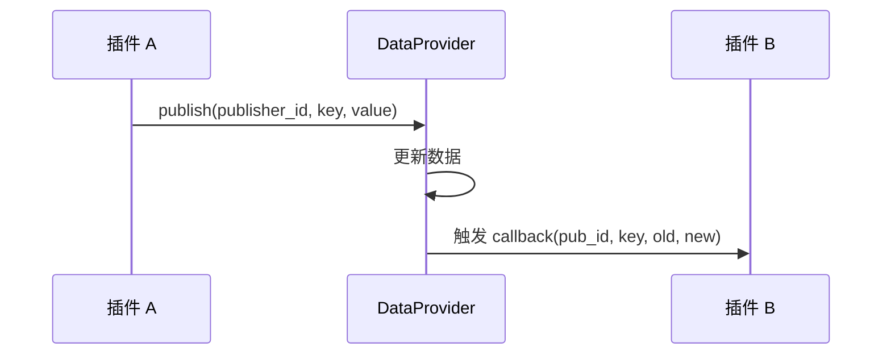

**代码示例：**
```python
def on_status_changed(plugin_id: str, key: str, old_value: Any, new_value: Any):
    """数据变化回调函数"""
    print(f"插件 {plugin_id} 的 {key} 从 {old_value} 变为 {new_value}")

# 订阅其他插件的 PUBLIC 数据
data_provider.subscribe(
    subscriber_id="my-plugin-id",          # 当前插件 ID
    target_plugin_id="target-plugin-id",   # 目标插件 ID
    target_key="shared_status",            # 要订阅的数据键
    callback=on_status_changed              # 回调函数
)

# 取消订阅（指定目标插件）
data_provider.unsubscribe(
    subscriber_id="my-plugin-id",
    target_plugin_id="target-plugin-id"
)

# 取消所有订阅
data_provider.unsubscribe(
    subscriber_id="my-plugin-id",
    target_plugin_id=None  # None 表示取消所有订阅
)

# 发布数据更新
data_provider.publish(
    publisher_id="my-plugin-id",
    key="shared_status",
    value="completed",
    namespace=DataNamespace.PUBLIC
)
```

#### 7.1.4 资源文件管理

```python
# 保存资源文件
relative_path = data_provider.save_asset(
    plugin_id="my-plugin-id",
    filename="thumbnail.png",
    content=b"image binary data"
)
# 返回: "assets/plugins/my-plugin-id/thumbnail.png"

# 获取资源绝对路径
absolute_path = data_provider.get_asset_path(relative_path)

# 加载资源文件
content = data_provider.load_asset(relative_path)

# 获取插件资源目录
assets_dir = data_provider.get_plugin_assets_dir(plugin_id)
```

#### 7.1.5 原子写入机制

DataProvider 使用临时文件 + 原子重命名机制，确保数据写入不会因程序崩溃而损坏：

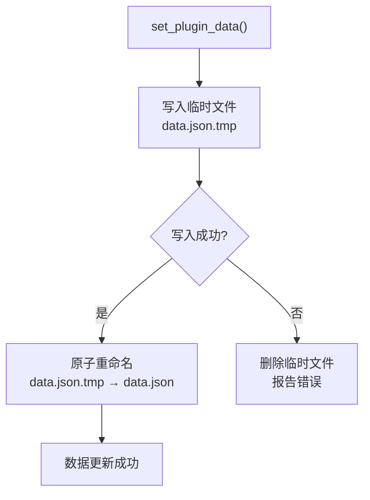

### 7.2 BackgroundTaskManager

**功能：** 管理和调度后台任务，支持同步、异步、定时和长期任务

**获取方式：**
```python
# 方式1：通过 services（推荐）
task_manager = self._services.task_manager

# 方式2：直接获取单例
from core.task import BackgroundTaskManager
task_manager = BackgroundTaskManager()
```

#### 7.2.1 任务类型

| 类型 | 说明 | 使用场景 |
|------|------|----------|
| `SYNC` | 同步任务，在主线程立即执行 | 轻量操作 |
| `ASYNC` | 异步任务，在线程池执行 | 避免阻塞 UI |
| `SCHEDULED` | 定时任务，间隔重复执行 | 定时提醒、数据同步 |
| `LONG_RUNNING` | 长期任务，持续运行 | 监控服务、数据采集 |

#### 7.2.2 异步任务

```python
def my_task(arg1, arg2):
    """异步任务函数"""
    return f"Result: {arg1} + {arg2}"

def task_callback(task_id, status, result, error):
    """任务完成回调"""
    print(f"Task {task_id}: {status}, Result: {result}")

# 注册异步任务
task_id = task_manager.register_async_task(
    plugin_id=self.plugin_id,
    name="my_async_task",
    func=my_task,
    callback=task_callback,
    args=(1, 2),
    kwargs=None
)
```

#### 7.2.3 定时任务

```python
def scheduled_task():
    """定时任务函数"""
    print("定时任务执行")

# 注册定时任务（每 60 秒执行一次）
task_id = task_manager.register_scheduled_task(
    plugin_id=self.plugin_id,
    name="my_scheduled_task",
    func=scheduled_task,
    interval=60,  # 间隔秒数
    callback=task_callback
)
```

#### 7.2.4 定时任务工厂（支持重启恢复）

```python
def create_scheduled_task():
    """定时任务工厂函数"""
    return {
        "func": my_periodic_task,
        "callback": on_task_done
    }

# 在 on_plugin_loaded 中注册工厂
def on_plugin_loaded(self, plugin_id=None, **kwargs):
    task_manager = self._services.task_manager
    task_manager.register_scheduled_task_factory(
        plugin_id=self.plugin_id,
        func=my_periodic_task,
        callback=on_task_done
    )
```

#### 7.2.5 长期任务

```python
def long_running_task():
    """长期任务函数（会持续运行）"""
    while True:
        # 执行任务逻辑
        print("任务运行中...")
        import time
        time.sleep(5)

def stop_callback():
    """停止回调，用于优雅停止"""
    print("任务收到停止信号")

# 注册长期任务
task_id = task_manager.register_long_running_task(
    plugin_id=self.plugin_id,
    name="my_long_running_task",
    func=long_running_task,
    callback=task_callback,
    stop_callback=stop_callback,
    auto_restart=True  # 失败后自动重启
)
```

#### 7.2.6 长期任务工厂

```python
# 在 on_plugin_loaded 中注册工厂
def on_plugin_loaded(self, plugin_id=None, **kwargs):
    task_manager = self._services.task_manager
    task_manager.register_long_running_task_factory(
        plugin_id=self.plugin_id,
        func=self.run_background_job,
        callback=self.on_job_done,
        stop_callback=self.on_job_stop,
        status_callback=self.on_status_update,
        restore_callback=self.on_job_restored
    )
```

#### 7.2.7 任务控制

```python
# 取消任务
task_manager.cancel_task(task_id)

# 停止长期任务
task_manager.stop_long_running_task(task_id, delete_from_storage=True)

# 启用/禁用定时任务
task_manager.enable_scheduled_task(task_id)
task_manager.disable_scheduled_task(task_id)

# 查询任务
task = task_manager.get_task(task_id)
status = task_manager.get_task_status(task_id)
tasks = task_manager.get_tasks_by_plugin(plugin_id)
```

### 7.3 LLM 集成

**功能：** 对话管理、工具调用、多模态支持

**获取方式：**
```python
# 方式1：通过 services（推荐）
llm_service = self._services.llm_facade

# 方式2：直接获取单例
from core.llm import get_llm_plugin_service
llm_service = get_llm_plugin_service()
```

#### 7.3.1 对话管理

```python
# 创建对话
conv_id = llm_service.create_conversation(
    system_prompt="你是一个专业的代码助手",
    provider="siliconflow",
    model="default"
)

# 发送消息（同步）
response = llm_service.send_message(conv_id, "解释什么是闭包")

# 发送消息（流式）
def on_chunk(chunk):
    print(chunk.content, end="", flush=True)

response = llm_service.stream_send_message(
    conv_id,
    "写一个快排算法",
    callback=on_chunk
)

# 获取对话
conversation = llm_service.get_conversation(conv_id)

# 列出所有对话
conversations = llm_service.list_conversations()

# 删除对话
llm_service.delete_conversation(conv_id)
```

#### 7.3.2 直接 chat（无状态）

```python
response = llm_service.chat([
    {"role": "system", "content": "你是一个助手"},
    {"role": "user", "content": "你好"}
])
print(response.content)
```

#### 7.3.3 工具调用

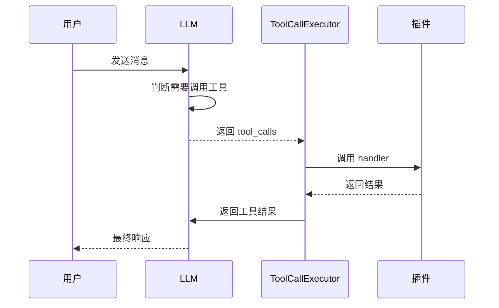

**代码示例：**
```python
# 定义工具处理函数
def calculate(expression: str) -> str:
    """执行数学计算"""
    return str(eval(expression))

# 获取工具执行器并注册工具
executor = llm_service.get_tool_executor()
executor.tools.register(
    name="calculate",
    description="执行数学表达式计算",
    parameters={
        "type": "object",
        "properties": {
            "expression": {
                "type": "string",
                "description": "数学表达式，如 2+3*4"
            }
        },
        "required": ["expression"]
    },
    handler=calculate
)

# 使用工具调用进行对话
messages = [{"role": "user", "content": "计算 (2+3)*4"}]
msgs, results, final = executor.chat_with_tools(
    messages,
    max_turns=5
)

# 处理结果
for r in results:
    print(f"工具: {r.tool_name}, 结果: {r.result}, 耗时: {r.duration_ms}ms")
```

#### 7.3.4 多模态支持

```python
# 图片理解
b64_image = llm_service.load_image_as_base64("/path/to/image.jpg")
llm_service.send_message(conv_id, "描述这张图片", images=[b64_image])

# 图像生成
result = llm_service.generate_image(
    prompt="一只可爱的橘猫",
    provider="siliconflow",
    size="1024x1024",
    quality="standard"
)
print(f"图片URL: {result.url}")

# 语音合成
audio_result = llm_service.text_to_speech(
    text="你好，世界！",
    provider="siliconflow",
    voice="alloy"
)
print(f"音频时长: {audio_result.duration_seconds}秒")
```

### 7.4 Logger 日志

**功能：** 记录日志到文件和控制台

**获取方式：**
```python
# 通过 services
logger = self._services.logger

# 直接获取单例
from utils.logging_tools import LoggerManager, get_name
logger = LoggerManager()
```

**日志级别：**
```python
# 记录不同级别的日志
logger.debug(get_name(), "调试信息")      # DEBUG 级别
logger.info(get_name(), "一般信息")       # INFO 级别
logger.warning(get_name(), "警告信息")    # WARNING 级别
logger.error(get_name(), "错误信息")      # ERROR 级别
logger.critical(get_name(), "严重错误")   # CRITICAL 级别
```

**格式：** `[时间戳][模块名][级别][消息内容]`

---

## 8. UI 开发指南

### 8.1 Qt 控件创建

**推荐导入：**
```python
from PySide6.QtWidgets import (
    QWidget, QLabel, QPushButton, QTextEdit, QLineEdit,
    QComboBox, QCheckBox, QRadioButton, QSlider, QSpinBox,
    QProgressBar, QGroupBox, QFrame, QTabWidget, QScrollArea,
    QVBoxLayout, QHBoxLayout, QGridLayout
)
from PySide6.QtCore import Qt, Signal, Slot
from PySide6.QtGui import QIcon, QFont
```

### 8.2 布局管理

**垂直布局：**
```python
from PySide6.QtWidgets import QWidget, QVBoxLayout, QLabel, QPushButton

widget = QWidget(parent)
layout = QVBoxLayout(widget)

layout.addWidget(QLabel("标题"))
layout.addWidget(QPushButton("按钮"))
layout.addStretch()  # 添加弹性空间
```

**水平布局：**
```python
layout = QHBoxLayout()
layout.addWidget(label1)
layout.addWidget(label2)
layout.addStretch()
```

**网格布局：**
```python
layout = QGridLayout()
layout.addWidget(QLabel("姓名:"), 0, 0)
layout.addWidget(name_input, 0, 1)
layout.addWidget(QLabel("邮箱:"), 1, 0)
layout.addWidget(email_input, 1, 1)
```

**嵌套布局：**
```python
main_layout = QVBoxLayout(widget)

# 上部：水平布局
top_layout = QHBoxLayout()
top_layout.addWidget(left_panel)
top_layout.addWidget(right_panel)
main_layout.addLayout(top_layout)

# 下部：按钮栏
bottom_layout = QHBoxLayout()
bottom_layout.addStretch()
bottom_layout.addWidget(cancel_btn)
bottom_layout.addWidget(ok_btn)
main_layout.addLayout(bottom_layout)
```

### 8.3 信号与槽连接

**基本连接：**
```python
button.clicked.connect(self.on_button_clicked)

def on_button_clicked(self):
    print("按钮被点击")
```

**带参数的连接：**
```python
# 使用 lambda
button.clicked.connect(lambda: self.handle_click("param"))

# 使用 functools.partial
from functools import partial
button.clicked.connect(partial(self.handle_click, "param"))

def handle_click(self, param):
    print(f"处理点击: {param}")
```

**自定义信号：**
```python
from PySide6.QtCore import QObject, Signal

class MyWidget(QWidget):
    # 定义信号
    data_changed = Signal(str, int)  # 参数类型声明

    def __init__(self, parent=None):
        super().__init__(parent)
        self.button.clicked.connect(self.emit_signal)

    def emit_signal(self):
        self.data_changed.emit("test", 42)

    # 连接信号
    widget.data_changed.connect(self.on_data_changed)

    def on_data_changed(self, text, number):
        print(f"收到: {text}, {number}")
```

### 8.4 常用控件示例

**QLabel - 标签：**
```python
label = QLabel("普通文本")
label.setAlignment(Qt.AlignCenter)  # 居中对齐
label.setStyleSheet("color: #333; font-size: 14px;")
```

**QPushButton - 按钮：**
```python
button = QPushButton("点击我")
button.setProperty("class", "primary")  # 使用 StyleQSS 按钮类
button.setEnabled(False)  # 禁用按钮
```

**QLineEdit - 单行输入框：**
```python
line_edit = QLineEdit()
line_edit.setPlaceholderText("请输入...")
line_edit.setMaxLength(100)
text = line_edit.text()
```

**QTextEdit - 多行文本框：**
```python
text_edit = QTextEdit()
text_edit.setPlaceholderText("请输入文本...")
text_edit.setReadOnly(False)
text = text_edit.toPlainText()
```

**QComboBox - 下拉框：**
```python
combo = QComboBox()
combo.addItem("选项1", userData=1)  # 第二个参数是数据
combo.addItem("选项2", userData=2)
combo.addItems(["选项3", "选项4", "选项5"])
index = combo.currentIndex()
data = combo.currentData()
```

**QCheckBox - 复选框：**
```python
checkbox = QCheckBox("同意条款")
checkbox.setChecked(True)
is_checked = checkbox.isChecked()
```

**QSlider - 滑块：**
```python
slider = QSlider(Qt.Horizontal)
slider.setMinimum(0)
slider.setMaximum(100)
slider.setValue(50)
slider.valueChanged.connect(self.on_value_changed)
```

**QSpinBox - 数值选择：**
```python
spinbox = QSpinBox()
spinbox.setMinimum(0)
spinbox.setMaximum(100)
spinbox.setValue(50)
spinbox.setSuffix(" %")  # 后缀
```

### 8.5 完整示例

```python
from PySide6.QtWidgets import (
    QWidget, QVBoxLayout, QHBoxLayout, QLabel,
    QPushButton, QLineEdit, QTextEdit, QComboBox
)
from PySide6.QtCore import Qt

class TextFormatterWidget(QWidget):
    """文本格式化插件界面"""

    def __init__(self, parent=None, data_provider=None):
        super().__init__(parent)
        self._data_provider = data_provider
        self._init_ui()

    def _init_ui(self):
        """初始化界面"""
        # 主布局
        main_layout = QVBoxLayout(self)

        # 输入区域
        input_layout = QHBoxLayout()
        input_layout.addWidget(QLabel("输入文本:"))
        self._input_edit = QLineEdit()
        self._input_edit.setPlaceholderText("请输入要格式化的文本")
        input_layout.addWidget(self._input_edit)
        main_layout.addLayout(input_layout)

        # 格式选择
        format_layout = QHBoxLayout()
        format_layout.addWidget(QLabel("格式化类型:"))
        self._format_combo = QComboBox()
        self._format_combo.addItems(["大写", "小写", "首字母大写"])
        format_layout.addWidget(self._format_combo)
        format_layout.addStretch()
        main_layout.addLayout(format_layout)

        # 输出区域
        main_layout.addWidget(QLabel("输出结果:"))
        self._output_edit = QTextEdit()
        self._output_edit.setReadOnly(True)
        self._output_edit.setMaximumHeight(150)
        main_layout.addWidget(self._output_edit)

        # 按钮区域
        button_layout = QHBoxLayout()
        self._format_btn = QPushButton("格式化")
        self._format_btn.setProperty("class", "primary")
        self._format_btn.clicked.connect(self._on_format)
        self._clear_btn = QPushButton("清空")
        self._clear_btn.clicked.connect(self._on_clear)
        button_layout.addStretch()
        button_layout.addWidget(self._clear_btn)
        button_layout.addWidget(self._format_btn)
        main_layout.addLayout(button_layout)

    def _on_format(self):
        """执行格式化"""
        text = self._input_edit.text()
        if not text:
            return

        format_type = self._format_combo.currentIndex()
        if format_type == 0:  # 大写
            result = text.upper()
        elif format_type == 1:  # 小写
            result = text.lower()
        else:  # 首字母大写
            result = text.title()

        self._output_edit.setPlainText(result)

    def _on_clear(self):
        """清空输入输出"""
        self._input_edit.clear()
        self._output_edit.clear()
```

---

## 9. StyleQSS 主题系统

### 9.1 概述

StyleQSS 是 InstructionX 的 UI 主题模块，为 PySide6 提供现代化的桌面视觉体验。

**核心功能：**
- 浅色/深色主题支持
- 系统主题自动检测
- 模块化 QSS 样式文件
- 运行时变量替换
- 30+ QSS 样式文件

### 9.2 主题切换

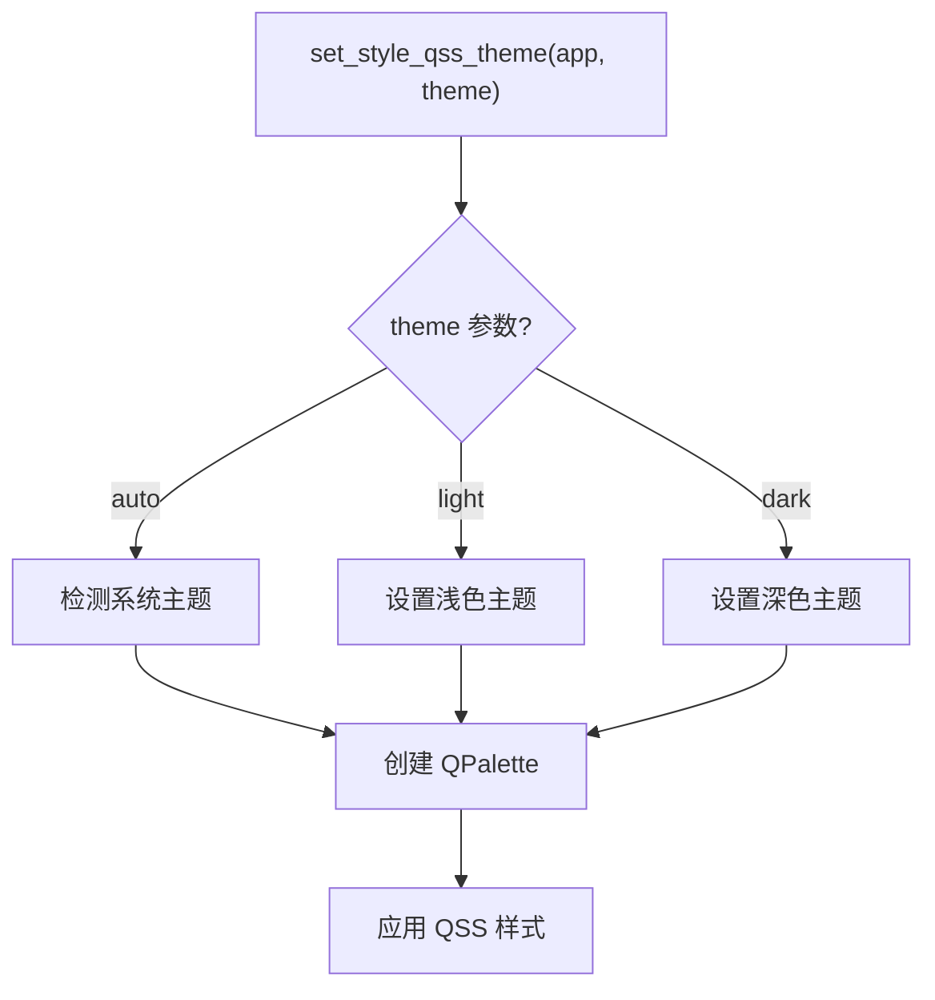

**代码示例：**
```python
from utils.style_qss import set_style_qss_theme

# 自动检测系统主题
set_style_qss_theme(app, "auto")

# 强制浅色主题
set_style_qss_theme(app, "light")

# 强制深色主题
set_style_qss_theme(app, "dark")
```

### 9.3 颜色变量表

| 变量 | 浅色主题 | 深色主题 | 说明 |
|------|---------|---------|------|
| `window` | `#FFFFFF` | `#202020` | 窗口背景 |
| `button` | `#F3F3F3` | `#2C2C2C` | 按钮背景 |
| `highlight` | `#0078D4` | `#0078D4` | 强调色 |
| `accent` | `#0078D4` | `#0078D4` | 强调色 |
| `textPrimary` | `#000000` | `#FFFFFF` | 主要文字 |
| `textSecondary` | `#666666` | `#999999` | 次要文字 |
| `border` | `#898989` | `#646464` | 边框色 |
| `controlFill` | `rgba(0,0,0,7)` | `rgba(255,255,255,7)` | 控件填充 |

### 9.4 按钮样式类

在插件中使用按钮样式类：

```python
# 主要按钮（蓝色）
button = QPushButton("主要操作")
button.setProperty("class", "primary")

# 危险按钮（红色）
button = QPushButton("删除")
button.setProperty("class", "danger")

# 成功按钮（绿色）
button = QPushButton("成功")
button.setProperty("class", "success")

# 轮廓按钮
button = QPushButton("轮廓")
button.setProperty("class", "outline")

# 柔和按钮
button = QPushButton("柔和")
button.setProperty("class", "subtle")

# 强调保存按钮
button = QPushButton("保存")
button.setProperty("class", "accentSave")

# 警告按钮（橙色）
button = QPushButton("警告")
button.setProperty("class", "warning")
```

### 9.5 在插件中使用样式

```python
# entrance.py
from PySide6.QtWidgets import QWidget, QPushButton, QVBoxLayout

class MyPluginWidget(QWidget):
    def __init__(self, parent=None):
        super().__init__(parent)
        self._init_ui()

    def _init_ui(self):
        layout = QVBoxLayout(self)

        # 创建不同样式的按钮
        btn1 = QPushButton("主要按钮")
        btn1.setProperty("class", "primary")

        btn2 = QPushButton("危险按钮")
        btn2.setProperty("class", "danger")

        btn3 = QPushButton("成功按钮")
        btn3.setProperty("class", "success")

        layout.addWidget(btn1)
        layout.addWidget(btn2)
        layout.addWidget(btn3)
```

### 9.6 圆角变量

| 变量 | 值 | 说明 |
|------|-----|------|
| `radius` | `3px` | 默认圆角 |
| `radiusLarge` | `6px` | 大圆角 |
| `radiusSmall` | `2px` | 小圆角 |

---

## 10. 跨插件通信

### 10.1 API 注册与发现

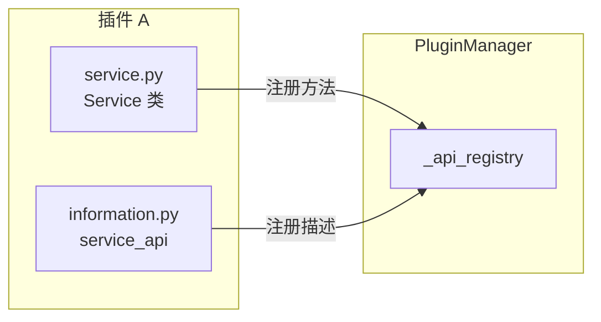

**代码示例：**
```python
# 插件 A 在 service.py 中定义 API
class PluginAService:
    def my_api_method(self, param: str) -> str:
        return f"处理: {param}"

# 插件 A 在 entrance.py 中注册 API
class PluginA(IPlugin):
    def on_plugin_loaded(self, plugin_id=None, **kwargs):
        # 获取管理器
        from core.plugin.manager import get_plugin_manager
        pm = get_plugin_manager()

        # 注册 API
        api = pm.PluginAPI(
            plugin_id=self.plugin_id,
            plugin_name=self.plugin_name,
            plugin_type="plugin-a"
        )
        api.api_methods["my_api_method"] = self._service.my_api_method
        api.api_descriptions["my_api_method"] = {
            "description": "我的 API 方法",
            "parameters": {"param": "字符串参数"}
        }

        pm._api_registry[self.plugin_id] = api
```

### 10.2 调用其他插件 API

```python
# 插件 B 调用插件 A 的 API
class PluginB(IPlugin):
    def call_plugin_a_api(self):
        from core.plugin.manager import get_plugin_manager
        pm = get_plugin_manager()

        # 获取插件 A 的 API
        api = pm._api_registry.get("plugin-a-id")
        if api and "my_api_method" in api.api_methods:
            result = api.api_methods["my_api_method"]("test")
```

### 10.3 通过 PUBLIC 命名空间共享数据

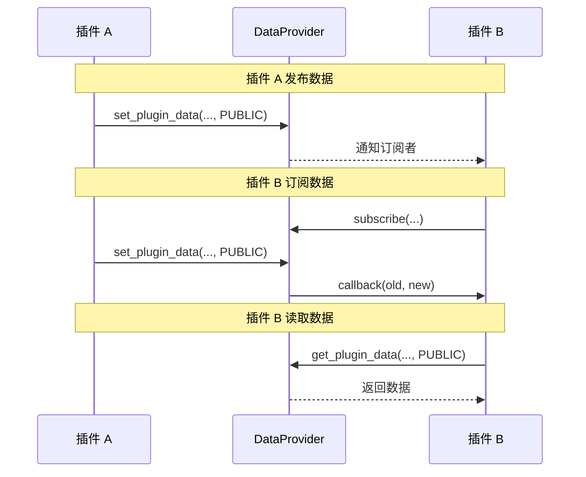

**代码示例：**
```python
# 插件 A 发布数据
data_provider.set_plugin_data(
    plugin_id="plugin-a-id",
    key="shared_data",
    value={"status": "ready", "progress": 50},
    namespace=DataNamespace.PUBLIC
)

# 插件 B 订阅数据变化
def on_shared_data_changed(plugin_id, key, old_value, new_value):
    print(f"插件 A 的共享数据更新: {new_value}")

data_provider.subscribe(
    subscriber_id="plugin-b-id",
    target_plugin_id="plugin-a-id",
    target_key="shared_data",
    callback=on_shared_data_changed
)

# 插件 B 读取数据
data = data_provider.get_plugin_data(
    plugin_id="plugin-a-id",
    key="shared_data",
    namespace=DataNamespace.PUBLIC
)
```

---

## 11. MCP 协议集成

### 11.1 概述

MCP（Model Context Protocol）是 InstructionX 用于将插件功能暴露给 AI 的协议。通过 MCP，AI 可以直接调用插件功能。

### 11.2 插件如何成为 MCP 工具

在 `information.py` 中定义 `service_api`，框架会自动将其转换为 MCP 工具：

```python
# information.py
class MyPluginInfo(IPluginInfo):
    @property
    def service_api(self) -> Dict[str, Any]:
        return {
            "format_text": {
                "description": "格式化文本",
                "parameters": {
                    "type": "object",
                    "properties": {
                        "text": {"type": "string"},
                        "format": {"type": "string", "enum": ["upper", "lower"]}
                    },
                    "required": ["text", "format"]
                },
                "returns": {"type": "string"}
            }
        }
```

### 11.3 工具名称格式

MCP 工具名称格式：`{plugin_type_id}_{method_name}`

例如：`text-formatter_format_text`

### 11.4 MCP Bridge 机制

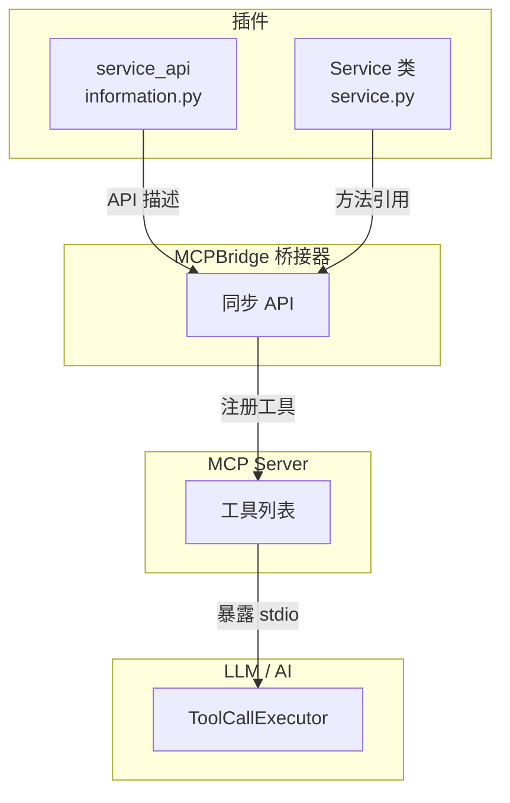

框架自动同步：
1. 插件注册 → API 注册到 MCPBridge
2. MCPBridge → 同步到 MCP Server
3. MCP Server → 暴露为 stdio 工具
4. AI 调用 → ToolCallExecutor 处理

---

## 12. 插件发布与安装

### 12.1 单插件描述文件 (IXPlugin.json)

```json
{
    "id": "text-formatter",
    "name": "文本格式化工具",
    "version": "release.1.0.0",
    "main": "entrance.py",
    "description": "提供文本格式化和转换功能",
    "author": "开发者名称",
    "author_email": "developer@example.com",
    "homepage": "https://github.com/developer/text-formatter",
    "keywords": ["文本", "格式化", "工具"],
    "dependencies": {
        "requests": ">=2.28.0"
    }
}
```

**必需字段：**
- `id`: 插件唯一标识（小写字母、数字、连字符）
- `name`: 插件显示名称
- `version`: 版本号（格式：`<type>.<major>.<minor>.<patch>`）
- `main`: 入口文件名（通常是 `entrance.py`）

### 12.2 多插件仓库描述文件 (IXRepo.json)

```json
{
    "name": "我的插件集合",
    "description": "包含多个实用插件",
    "plugins": [
        {
            "id": "plugin-a",
            "name": "插件 A",
            "path": "plugin-a/"
        },
        {
            "id": "plugin-b",
            "name": "插件 B",
            "path": "plugin-b/"
        }
    ]
}
```

### 12.3 安装目录规则

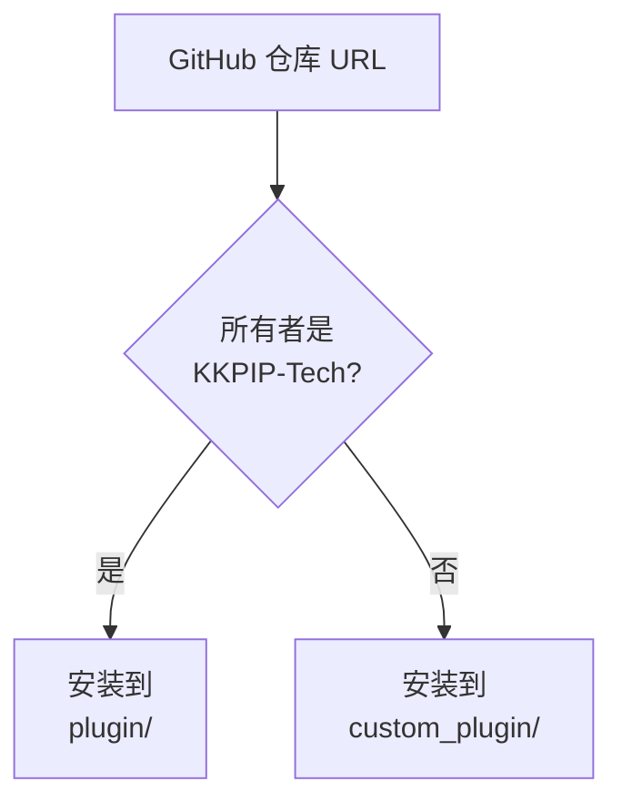

| 组织 | 安装目录 | 说明 |
|------|----------|------|
| KKPIP-Tech | `plugin/` | 官方插件目录 |
| 其他组织/个人 | `custom_plugin/` | 第三方插件目录 |

### 12.4 从 GitHub 安装

```python
# 使用 GitHubPluginInstaller
from core.plugin.github_plugin_installer import GitHubPluginInstaller

installer = GitHubPluginInstaller()

# 检查仓库
result = installer.inspect_repository("https://github.com/developer/my-plugin")
# result.repo_type: "single" | "multi" | "invalid"

# 安装插件
install_results = installer.install_from_url(
    github_url="https://github.com/developer/my-plugin",
    selected_plugins=None  # None 表示安装所有
)
```

---

## 13. 调试技巧

### 13.1 日志调试

```python
# 在插件中使用日志
from utils.logging_tools import LoggerManager, get_name

logger = LoggerManager()

def my_method(self):
    logger.info(get_name(), "方法开始执行")
    try:
        # 业务逻辑
        result = do_something()
        logger.debug(get_name(), f"结果: {result}")
        return result
    except Exception as e:
        logger.error(get_name(), f"错误: {e}")
        raise
```

**日志文件位置：** `logs/application.log`

### 13.2 测试 API 调用

```python
# 在 Python 脚本中测试 DataProvider
from core.data import DataProvider, DataNamespace

provider = DataProvider()
provider.register_plugin("test-plugin", "TestPlugin")

# 测试数据存储
provider.set_plugin_data("test-plugin", "test_key", "test_value")
value = provider.get_plugin_data("test-plugin", "test_key")
print(f"读取到的值: {value}")

# 测试发布/订阅
def callback(pid, key, old, new):
    print(f"变化: {old} -> {new}")

provider.subscribe("test-plugin-2", "test-plugin", "test_key", callback)
provider.set_plugin_data("test-plugin", "test_key", "new_value", DataNamespace.PUBLIC)
```

### 13.3 Widget 调试

```python
def _create_widget(self, parent=None, data_provider=None):
    widget = QWidget(parent)

    # 打印 widget 信息
    print(f"Widget created: {widget}")
    print(f"Widget size: {widget.size()}")
    print(f"Widget children: {widget.children()}")

    return widget
```

### 13.4 常见错误与解决方案

| 错误 | 原因 | 解决方案 |
|------|------|----------|
| `No IPlugin subclass found` | entrance.py 中没有定义 IPlugin 子类 | 确保继承 IPlugin 并实现必需的属性和方法 |
| `No entrance.py found` | 插件目录缺少 entrance.py | 在插件根目录创建 entrance.py |
| `Plugin not found` | 尝试访问未注册的插件 | 先调用 `register_plugin()` |
| `Data file corrupted` | JSON 解析失败 | 检查 data/data.json 格式是否正确 |
| `Icon not found` | 图标文件路径错误 | 检查 assets/icons/ 目录和路径 |

---

## 14. 完整示例

### 14.1 最小插件

```python
# minimal_plugin/entrance.py
from core.interfaces.i_plugin import IPlugin
from PySide6.QtWidgets import QWidget, QLabel, QVBoxLayout

class MinimalPlugin(IPlugin):
    """最小插件示例"""

    @property
    def plugin_name(self) -> str:
        return "最小插件"

    def _create_widget(self, parent=None, data_provider=None) -> QWidget:
        widget = QWidget(parent)
        layout = QVBoxLayout(widget)
        layout.addWidget(QLabel("这是一个最小插件!"))
        return widget
```

### 14.2 文本格式化插件

```python
# text_formatter/entrance.py
from core.interfaces.i_plugin import IPlugin
from core.interfaces.plugin_services import PluginServices
from PySide6.QtWidgets import (
    QWidget, QVBoxLayout, QHBoxLayout, QLabel,
    QLineEdit, QComboBox, QPushButton, QTextEdit
)
from typing import Optional

class TextFormatterPlugin(IPlugin):
    """文本格式化插件"""

    def __init__(self, services: PluginServices | None = None):
        super().__init__()
        self._services = services
        self._current_result = ""

    @property
    def plugin_name(self) -> str:
        return "文本格式化"

    @property
    def skill_description(self) -> str:
        return "文本大小写转换和格式化工具"

    def _create_widget(self, parent=None, data_provider=None) -> QWidget:
        widget = QWidget(parent)
        layout = QVBoxLayout(widget)

        # 输入区域
        input_layout = QHBoxLayout()
        input_layout.addWidget(QLabel("输入:"))
        self._input = QLineEdit()
        self._input.setPlaceholderText("请输入文本")
        input_layout.addWidget(self._input)
        layout.addLayout(input_layout)

        # 格式选择
        format_layout = QHBoxLayout()
        format_layout.addWidget(QLabel("格式:"))
        self._format_combo = QComboBox()
        self._format_combo.addItems(["大写", "小写", "首字母大写", "反转"])
        format_layout.addWidget(self._format_combo)
        format_layout.addStretch()
        layout.addLayout(format_layout)

        # 执行按钮
        self._execute_btn = QPushButton("格式化")
        self._execute_btn.setProperty("class", "primary")
        self._execute_btn.clicked.connect(self._on_format)
        layout.addWidget(self._execute_btn)

        # 输出区域
        layout.addWidget(QLabel("输出:"))
        self._output = QTextEdit()
        self._output.setReadOnly(True)
        self._output.setMaximumHeight(100)
        layout.addWidget(self._output)

        return widget

    def _on_format(self):
        """执行格式化"""
        text = self._input.text()
        if not text:
            self._output.setPlainText("请输入文本")
            return

        format_type = self._format_combo.currentIndex()
        if format_type == 0:
            result = text.upper()
        elif format_type == 1:
            result = text.lower()
        elif format_type == 2:
            result = text.title()
        else:
            result = text[::-1]

        self._current_result = result
        self._output.setPlainText(result)

        # 保存到数据提供者
        if self._services and self.plugin_id:
            self._services.data_provider.set_plugin_data(
                self.plugin_id,
                "last_result",
                result
            )

    def on_plugin_loaded(self, plugin_id: Optional[str] = None, **kwargs):
        """插件加载完成回调"""
        pass
```

### 14.3 带 DataProvider 的插件

```python
# data_plugin/entrance.py
from core.interfaces.i_plugin import IPlugin
from core.interfaces.plugin_services import PluginServices
from core.interfaces.i_data_provider import DataNamespace
from PySide6.QtWidgets import (
    QWidget, QVBoxLayout, QLabel, QPushButton, QTextEdit
)
from typing import Optional

class DataPlugin(IPlugin):
    """演示 DataProvider 的插件"""

    def __init__(self, services: PluginServices | None = None):
        super().__init__()
        self._services = services

    @property
    def plugin_name(self) -> str:
        return "数据管理"

    def _create_widget(self, parent=None, data_provider=None) -> QWidget:
        widget = QWidget(parent)
        layout = QVBoxLayout(widget)

        # 状态显示
        self._status_label = QLabel("状态: 未保存")
        layout.addWidget(self._status_label)

        # 文本输入
        self._text_edit = QTextEdit()
        self._text_edit.setPlaceholderText("在此输入内容...")
        layout.addWidget(self._text_edit)

        # 按钮
        btn_layout = QVBoxLayout()

        save_btn = QPushButton("保存到 PRIVATE")
        save_btn.setProperty("class", "primary")
        save_btn.clicked.connect(self._save_private)
        btn_layout.addWidget(save_btn)

        share_btn = QPushButton("发布到 PUBLIC")
        share_btn.setProperty("class", "success")
        share_btn.clicked.connect(self._share_public)
        btn_layout.addWidget(share_btn)

        load_btn = QPushButton("加载上次数据")
        load_btn.clicked.connect(self._load_data)
        btn_layout.addWidget(load_btn)

        layout.addLayout(btn_layout)

        return widget

    def _save_private(self):
        """保存到 PRIVATE 命名空间"""
        if not self._services or not self.plugin_id:
            return

        text = self._text_edit.toPlainText()
        self._services.data_provider.set_plugin_data(
            self.plugin_id,
            "my_data",
            text,
            namespace=DataNamespace.PRIVATE
        )
        self._status_label.setText("状态: 已保存到 PRIVATE")

    def _share_public(self):
        """发布到 PUBLIC 命名空间"""
        if not self._services or not self.plugin_id:
            return

        text = self._text_edit.toPlainText()
        self._services.data_provider.publish(
            self.plugin_id,
            "shared_data",
            text
        )
        self._status_label.setText("状态: 已发布到 PUBLIC")

    def _load_data(self):
        """加载上次保存的数据"""
        if not self._services or not self.plugin_id:
            return

        text = self._services.data_provider.get_plugin_data(
            self.plugin_id,
            "my_data",
            namespace=DataNamespace.PRIVATE,
            default=""
        )
        self._text_edit.setPlainText(text)
        self._status_label.setText("状态: 已加载")

    def on_plugin_loaded(self, plugin_id: Optional[str] = None, **kwargs):
        """订阅其他插件的数据"""
        if not self._services:
            return

        # 订阅所有插件的 shared_data 变化
        def on_data_changed(pub_id, key, old, new):
            self._status_label.setText(f"收到更新: {key} = {new}")

        # 这里可以订阅特定插件
        # self._services.data_provider.subscribe(
        #     self.plugin_id,
        #     "target-plugin-id",
        #     "shared_data",
        #     on_data_changed
        # )
```

### 14.4 带 BackgroundTaskManager 的插件

```python
# task_plugin/entrance.py
from core.interfaces.i_plugin import IPlugin
from core.interfaces.plugin_services import PluginServices
from PySide6.QtWidgets import (
    QWidget, QVBoxLayout, QLabel, QPushButton, QProgressBar, QTextEdit
)
from typing import Optional

class TaskPlugin(IPlugin):
    """演示 BackgroundTaskManager 的插件"""

    def __init__(self, services: PluginServices | None = None):
        super().__init__()
        self._services = services
        self._task_id = None

    @property
    def plugin_name(self) -> str:
        return "后台任务"

    def _create_widget(self, parent=None, data_provider=None) -> QWidget:
        widget = QWidget(parent)
        layout = QVBoxLayout(widget)

        # 状态显示
        self._status_label = QLabel("状态: 空闲")
        layout.addWidget(self._status_label)

        # 进度条
        self._progress = QProgressBar()
        self._progress.setValue(0)
        layout.addWidget(self._progress)

        # 日志输出
        self._log = QTextEdit()
        self._log.setReadOnly(True)
        self._log.setMaximumHeight(150)
        layout.addWidget(self._log)

        # 按钮
        btn_layout = QVBoxLayout()

        start_btn = QPushButton("启动定时任务")
        start_btn.setProperty("class", "primary")
        start_btn.clicked.connect(self._start_task)
        btn_layout.addWidget(start_btn)

        stop_btn = QPushButton("停止任务")
        stop_btn.setProperty("class", "danger")
        stop_btn.clicked.connect(self._stop_task)
        btn_layout.addWidget(stop_btn)

        layout.addLayout(btn_layout)

        return widget

    def _long_running_operation(self):
        """模拟长时间运行的操作"""
        import time
        for i in range(100):
            time.sleep(0.1)
            # 更新进度
            if self._services and self._task_id:
                self._services.task_manager.update_long_running_task_status(
                    self._task_id,
                    f"进度: {i+1}%"
                )

    def _on_task_callback(self, task_id, status, result, error):
        """任务回调"""
        self._status_label.setText(f"任务完成: {status}")
        self._log.append(f"任务 {task_id} 完成")

    def _start_task(self):
        """启动任务"""
        if not self._services:
            return

        self._task_id = self._services.task_manager.register_long_running_task(
            plugin_id=self.plugin_id,
            name="my_long_task",
            func=self._long_running_operation,
            callback=self._on_task_callback,
            auto_restart=False
        )
        self._status_label.setText(f"任务已启动: {self._task_id}")
        self._log.append(f"启动任务: {self._task_id}")

    def _stop_task(self):
        """停止任务"""
        if not self._services or not self._task_id:
            return

        self._services.task_manager.stop_long_running_task(self._task_id)
        self._status_label.setText("任务已停止")
        self._log.append(f"停止任务: {self._task_id}")

    def on_plugin_loaded(self, plugin_id: Optional[str] = None, **kwargs):
        """注册任务工厂以便重启后恢复"""
        if not self._services:
            return

        # 注册长期任务工厂
        self._services.task_manager.register_long_running_task_factory(
            plugin_id=self.plugin_id,
            func=self._long_running_operation,
            callback=self._on_task_callback,
            auto_restart=False
        )
```

### 14.5 带 LLM 集成的插件

```python
# llm_plugin/entrance.py
from core.interfaces.i_plugin import IPlugin
from core.interfaces.plugin_services import PluginServices
from PySide6.QtWidgets import (
    QWidget, QVBoxLayout, QLabel, QPushButton, QTextEdit, QLineEdit
)
from typing import Optional

class LLMPlugin(IPlugin):
    """演示 LLM 集成的插件"""

    def __init__(self, services: PluginServices | None = None):
        super().__init__()
        self._services = services
        self._conv_id = None

    @property
    def plugin_name(self) -> str:
        return "LLM 对话"

    def _create_widget(self, parent=None, data_provider=None) -> QWidget:
        widget = QWidget(parent)
        layout = QVBoxLayout(widget)

        # 对话 ID
        layout.addWidget(QLabel("会话 ID:"))
        self._conv_label = QLabel("未创建")
        layout.addWidget(self._conv_label)

        # 输入框
        self._input = QLineEdit()
        self._input.setPlaceholderText("输入消息...")
        layout.addWidget(self._input)

        # 发送按钮
        send_btn = QPushButton("发送")
        send_btn.setProperty("class", "primary")
        send_btn.clicked.connect(self._on_send)
        layout.addWidget(send_btn)

        # 新建会话按钮
        new_btn = QPushButton("新建会话")
        new_btn.clicked.connect(self._on_new_conversation)
        layout.addWidget(new_btn)

        # 输出区域
        layout.addWidget(QLabel("AI 响应:"))
        self._output = QTextEdit()
        self._output.setReadOnly(True)
        layout.addWidget(self._output)

        return widget

    def _on_new_conversation(self):
        """创建新会话"""
        if not self._services:
            return

        self._conv_id = self._services.llm_facade.create_conversation(
            system_prompt="你是一个友好的助手，用简洁的语言回答。",
            provider="siliconflow"
        )
        self._conv_label.setText(self._conv_id[:8] + "...")
        self._output.setPlainText("新会话已创建")

    def _on_send(self):
        """发送消息"""
        if not self._services or not self._conv_id:
            self._output.setPlainText("请先创建会话")
            return

        message = self._input.text()
        if not message:
            return

        self._input.clear()
        self._output.setPlainText("AI 正在思考...")

        try:
            response = self._services.llm_facade.send_message(
                self._conv_id,
                message
            )
            self._output.setPlainText(response)
        except Exception as e:
            self._output.setPlainText(f"错误: {e}")

    def on_plugin_loaded(self, plugin_id: Optional[str] = None, **kwargs):
        """插件加载时自动创建会话"""
        if self._services:
            self._conv_id = self._services.llm_facade.create_conversation(
                system_prompt="你是一个友好的助手。",
                provider="siliconflow"
            )
```

---

## 15. 最佳实践

### 15.1 代码组织

**推荐的项目结构：**
```
my_plugin/
├── __init__.py              # 空文件
├── entrance.py              # 插件入口，UI 创建
├── service.py               # 业务逻辑
├── information.py            # 元信息
└── assets/
    ├── icons/               # 图标资源
    └── data/                # 静态数据文件
```

**分离原则：**
- `entrance.py`: UI 创建、生命周期回调
- `service.py`: 业务逻辑、数据处理
- `information.py`: 元数据定义

### 15.2 错误处理

```python
def my_method(self):
    """带完整错误处理的方法"""
    try:
        result = risky_operation()
        return result
    except ValueError as e:
        # 处理可预期的错误
        self._logger.warning(get_name(), f"业务错误: {e}")
        return None
    except Exception as e:
        # 处理未知错误
        self._logger.error(get_name(), f"未知错误: {e}")
        raise  # 重新抛出以便上层处理
    finally:
        # 清理资源
        self._cleanup()
```

### 15.3 性能考虑

1. **避免重复创建控件**：使用 `get_widget()` 的缓存机制
2. **长时间操作使用后台任务：**
```python
# 避免在 UI 线程中执行耗时操作
self._services.task_manager.register_async_task(
    plugin_id=self.plugin_id,
    name="heavy_task",
    func=self._do_heavy_work
)
```
3. **减少不必要的数据订阅：**
```python
# 只订阅需要的数据变化
data_provider.subscribe(
    subscriber_id=self.plugin_id,
    target_plugin_id="specific-plugin",
    target_key="relevant-key",
    callback=self.on_change
)
```

### 15.4 安全注意事项

1. **不要在插件中硬编码敏感信息**
2. **使用框架提供的安全存储机制**
3. **验证用户输入：**
```python
def process_input(self, user_input: str):
    if not user_input:
        raise ValueError("输入不能为空")
    if len(user_input) > 1000:
        raise ValueError("输入过长")
```

### 15.5 插件 ID 和类型 ID

**plugin_id vs plugin_type_id：**
- `plugin_id`: 插件实例的唯一标识（UUID），每个实例不同
- `plugin_type_id`: 插件类型的标识（小写字母、数字、连字符），同类插件共享

```python
@property
def plugin_type_id(self) -> str:
    """插件类型标识符，同类插件应使用相同值"""
    return "text-formatter"  # 所有文本格式化插件都用这个
```

---

## 16. 常见问题

### Q1: 如何创建第一个插件？

1. 在 `custom_plugin/` 目录下创建插件文件夹
2. 创建 `__init__.py` 空文件
3. 创建 `entrance.py`，定义继承自 `IPlugin` 的类
4. 实现 `plugin_name` 属性和 `_create_widget` 方法
5. 重启应用，插件将自动加载

### Q2: 插件不加载怎么排查？

1. 检查 `entrance.py` 是否存在且语法正确
2. 确保类继承自 `IPlugin`
3. 检查日志文件 `logs/application.log`
4. 确认插件目录有 `__init__.py`

### Q3: 如何让 AI 调用我的插件功能？

在 `information.py` 中定义 `service_api`，框架会自动将其暴露为 MCP 工具。

### Q4: 如何实现跨插件通信？

使用 `DataProvider` 的 `PUBLIC` 命名空间和发布/订阅机制。

### Q5: 定时任务在应用重启后会恢复吗？

需要使用**任务工厂**机制：
```python
def on_plugin_loaded(self, plugin_id=None, **kwargs):
    self._services.task_manager.register_scheduled_task_factory(
        plugin_id=self.plugin_id,
        func=self.my_task_func,
        callback=self.on_task_done
    )
```

### Q6: 如何处理插件依赖？

在 `information.py` 中定义：
```python
@property
def dependencies(self) -> Optional[Dict[str, str]]:
    return {"requests": ">=2.28.0"}
```

### Q7: 如何发布插件到 GitHub？

1. 创建 GitHub 仓库
2. 添加 `IXPlugin.json`（单插件）或 `IXRepo.json`（多插件）
3. 在应用中通过 GitHub URL 安装

### Q8: StyleQSS 样式不生效怎么办？

1. 确保使用正确的按钮类属性：`button.setProperty("class", "primary")`
2. 检查主题是否正确设置
3. 按钮需要在设置属性后重新应用样式

### Q9: 如何获取插件的唯一标识？

```python
def on_plugin_loaded(self, plugin_id=None, **kwargs):
    actual_id = self.plugin_id  # 通过属性获取
    # plugin_id 参数也会传入
```

### Q10: 数据持久化失败怎么处理？

```python
try:
    data_provider.set_plugin_data(plugin_id, key, value)
except DataProviderError as e:
    logger.error(get_name(), f"保存失败: {e}")
    # 可以尝试重试或提示用户
```

---

## 附录

### A. 关键文件路径参考

| 文件 | 路径 | 说明 |
|------|------|------|
| IPlugin 接口 | `core/interfaces/i_plugin.py` | 插件主接口 |
| IPluginInfo 接口 | `core/interfaces/i_plugin_info.py` | 元信息接口 |
| PluginServices | `core/interfaces/plugin_services.py` | 服务容器 |
| DataProvider | `core/data/data_provider.py` | 数据层 |
| BackgroundTaskManager | `core/task/background_task.py` | 任务管理 |
| LLMPluginService | `core/llm/plugin_service.py` | LLM 服务 |
| StyleQSS | `utils/style_qss/__init__.py` | 样式系统 |

### B. 导入速查表

```python
# 插件接口
from core.interfaces.i_plugin import IPlugin
from core.interfaces.i_plugin_info import IPluginInfo

# 服务容器
from core.interfaces.plugin_services import PluginServices

# 数据层
from core.interfaces.i_data_provider import DataProvider, DataNamespace

# 任务管理
from core.interfaces.i_task_manager import BackgroundTaskManager, TaskType, TaskStatus

# LLM
from core.llm import get_llm_plugin_service

# 工具
from utils.logging_tools import LoggerManager, get_name
from utils.style_qss import set_style_qss_theme

# 版本和图标
from core.plugin.plugin_version import PluginVersion, VersionType
from core.plugin.plugin_icon import PluginIcon
```

### C. 插件检查清单

#### 必需项（插件能够加载和运行的基础要求）

- [ ] `__init__.py` 文件存在于插件根目录
- [ ] `entrance.py` 文件存在
- [ ] `entrance.py` 中定义了继承自 `IPlugin` 的类
- [ ] `plugin_name` 属性已实现并返回非空字符串
- [ ] `_create_widget` 方法已实现并返回 `QWidget` 实例
- [ ] `_create_widget` 返回的 widget 已设置正确的父控件

#### 推荐项（提升插件质量和用户体验）

- [ ] 插件目录结构完整，包含 `__init__.py`
- [ ] `information.py` 存在并正确定义 `IPluginInfo` 子类
- [ ] `information.py` 中 `version` 属性返回正确的 `PluginVersion`
- [ ] `information.py` 中 `developer` 属性已填写
- [ ] `information.py` 中 `plugin_type_id` 已定义（小写字母、数字、连字符）
- [ ] `information.py` 中 `skill_description` 已定义（显示在技能面板）
- [ ] `information.py` 中 `skill_icon` 已正确定义图标
- [ ] `service.py` 存在且 `Service` 类方法使用类型注解
- [ ] `service.py` 中定义了可被外部调用的 API 方法
- [ ] 如果使用 `services`，在 `__init__` 中正确接收并保存
- [ ] 如果使用 DataProvider，在 `_create_widget` 或 `on_plugin_loaded` 中正确初始化

#### 可选项（高级功能，需要时实现）

- [ ] `on_plugin_loaded` 已实现用于初始化逻辑
- [ ] `on_plugin_loaded` 中注册了定时任务工厂（如果使用定时任务）
- [ ] `on_plugin_loaded` 中注册了长期任务工厂（如果使用长期任务）
- [ ] 使用 `DataProvider` 的 `PUBLIC` 命名空间进行跨插件通信
- [ ] 使用 `subscribe` 订阅其他插件的数据变化
- [ ] 在 `information.py` 中正确定义 `service_api` 用于 MCP/LLM 工具暴露
- [ ] `service_api` 中每个方法的 `parameters` 符合 OpenAI 格式
- [ ] `service_api` 中每个方法的 `required` 数组与参数一致
- [ ] `information.py` 中定义了 `dependencies`（如有 Python 依赖）
- [ ] `information.py` 中定义了 `tags`（用于插件分类）
- [ ] 使用 StyleQSS 按钮类（`primary`、`danger`、`success` 等）
- [ ] 正确处理异常，使用 `try/except` 避免崩溃
- [ ] 使用 Logger 记录关键操作和错误

#### 发布检查项（发布到 GitHub 前必须满足）

- [ ] `IXPlugin.json` 文件存在且格式正确
- [ ] `IXPlugin.json` 中 `id` 为小写字母、数字、连字符
- [ ] `IXPlugin.json` 中 `version` 格式正确（如 `release.1.0.0`）
- [ ] `IXPlugin.json` 中 `main` 指向正确的入口文件
- [ ] 所有资源文件路径正确（图标准确引用）
- [ ] 插件代码无语法错误
- [ ] 已在本地测试加载和基本功能

---

*本指南由 Claude Code 基于 InstructionX 源代码自动生成*
*对应版本：InstructionX CE 1.0*
*最后更新：2026/04/11*
